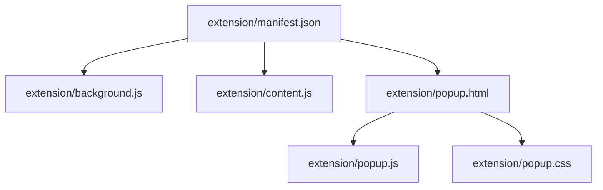
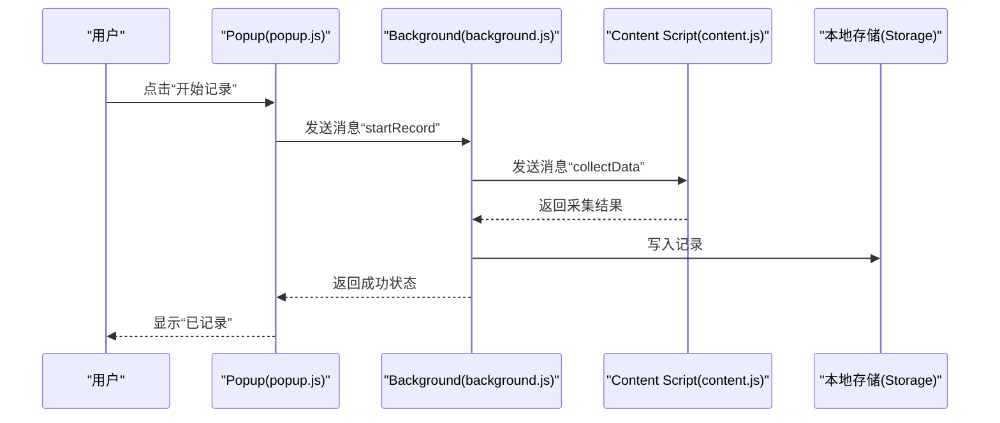
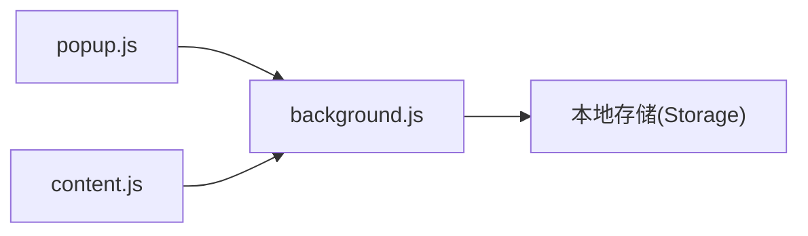

# API参考文档

<cite>
**本文引用的文件**   
- [manifest.json](file://extension/manifest.json)
- [background.js](file://extension/background.js)
- [content.js](file://extension/content.js)
- [popup.html](file://extension/popup.html)
- [popup.js](file://extension/popup.js)
- [popup.css](file://extension/popup.css)
- [README.md](file://extension/README.md)
</cite>

## 目录
1. [简介](#简介)
2. [项目结构](#项目结构)
3. [核心组件](#核心组件)
4. [架构总览](#架构总览)
5. [详细组件分析](#详细组件分析)
6. [依赖关系分析](#依赖关系分析)
7. [性能考虑](#性能考虑)
8. [故障排查指南](#故障排查指南)
9. [结论](#结论)
10. [附录](#附录)

## 简介
本API参考文档面向“工时记录”Chrome扩展的开发者，系统化说明以下能力：
- Manifest配置项与权限声明、版本信息、资源映射
- Background Script暴露的公共接口（消息传递、数据存储、事件处理）
- Content Script与目标网站的交互接口（DOM操作、数据提取）
- Popup界面的JavaScript API（用户交互、状态管理）
每个API均提供参数说明、返回值定义与使用示例路径，帮助快速集成与调试。

## 项目结构
扩展位于 extension 目录下，包含Manifest、Background、Content Script与Popup界面相关文件；scripts 目录为辅助脚本，不在运行时加载。

图表来源
- [manifest.json](file://extension/manifest.json)
- [background.js](file://extension/background.js)
- [content.js](file://extension/content.js)
- [popup.html](file://extension/popup.html)
- [popup.js](file://extension/popup.js)
- [popup.css](file://extension/popup.css)

章节来源
- [manifest.json](file://extension/manifest.json)
- [background.js](file://extension/background.js)
- [content.js](file://extension/content.js)
- [popup.html](file://extension/popup.html)
- [popup.js](file://extension/popup.js)
- [popup.css](file://extension/popup.css)
- [README.md](file://extension/README.md)

## 核心组件
- Manifest配置：声明扩展元信息、权限、后台脚本、内容脚本注入规则、Popup入口等。
- Background Script：作为扩展的常驻进程，负责跨上下文通信、持久化存储、事件监听与业务编排。
- Content Script：注入到目标页面，负责DOM读取与数据提取，并通过消息通道与Background/Popup通信。
- Popup界面：通过HTML/CSS/JS构建UI，接收用户输入并调用Background提供的API完成操作。

章节来源
- [manifest.json](file://extension/manifest.json)
- [background.js](file://extension/background.js)
- [content.js](file://extension/content.js)
- [popup.html](file://extension/popup.html)
- [popup.js](file://extension/popup.js)

## 架构总览
扩展采用标准的Chrome扩展三层架构：Popup触发用户操作，Background协调逻辑与存储，Content Script在目标站点中采集数据。

图表来源
- [popup.js](file://extension/popup.js)
- [background.js](file://extension/background.js)
- [content.js](file://extension/content.js)

## 详细组件分析

### Manifest配置API
- 作用：声明扩展名称、版本、图标、权限、后台脚本、内容脚本注入规则、Popup入口等。
- 关键键位
  - manifest_version：指定清单格式版本
  - name/version/description/icons：扩展基本信息
  - permissions：网络访问、存储、标签页等权限
  - background.service_worker：后台脚本入口
  - content_scripts.matches/inject_at/run_at：注入目标与注入时机
  - action.default_popup：Popup入口页面
- 使用建议
  - 仅申请必要权限，遵循最小权限原则
  - matches 精确匹配目标域名，避免过度注入
  - 如需跨域请求，确保在permissions中声明对应host

章节来源
- [manifest.json](file://extension/manifest.json)

### Background Script公共接口
Background作为中心协调者，对外暴露三类能力：消息路由、数据存储、事件处理。

- 消息传递API
  - 功能：接收来自Popup或Content Script的消息，执行相应逻辑并返回结果
  - 典型消息类型
    - startRecord：启动一次记录流程
    - stopRecord：结束记录流程
    - collectData：向Content Script请求当前页面数据
    - getRecords：获取历史工时记录
    - clearRecords：清空历史记录
  - 参数与返回
    - 入参：{ type, payload }，payload根据type不同而不同
    - 返回：Promise或回调形式返回 { success, data, error }
  - 使用示例路径
    - [popup.js 调用示例](file://extension/popup.js)
    - [content.js 响应示例](file://extension/content.js)

- 数据存储API
  - 功能：对本地存储进行读写，支持批量更新与查询
  - 主要方法
    - set(key, value)：写入单个键值
    - get(key)：读取单个键值
    - getAll()：读取所有键值
    - remove(key)：删除键值
    - batchUpdate(updates)：批量更新
  - 数据结构约定
    - records：数组，元素包含时间戳、任务描述、耗时等字段
  - 使用示例路径
    - [background.js 存储封装](file://extension/background.js)

- 事件处理函数
  - 功能：监听浏览器事件（如标签页切换、安装/更新、通知点击等），驱动业务流程
  - 常见事件
    - onInstalled：首次安装或升级时初始化默认数据
    - onMessage：统一消息分发器
    - 其他可选：onTabUpdated、onNotificationClick等
  - 使用示例路径
    - [background.js 事件注册](file://extension/background.js)

章节来源
- [background.js](file://extension/background.js)

### Content Script与目标网站交互接口
Content Script运行在目标页面上下文中，负责DOM读取与数据提取，并通过消息通道与Background/Popup通信。

- DOM操作方法
  - 选择器定位：基于CSS选择器查找节点集合
  - 文本/属性读取：从节点中提取文本、value、data-* 等属性
  - 状态判断：检测特定类名、可见性、禁用态等
- 数据提取函数
  - extractTableData：从表格区域提取结构化数据
  - extractFormFields：从表单区域提取字段与值
  - extractHeaderInfo：从页面头部或导航区提取标识信息
- 消息协议
  - 发送：向Background发送“collectData”请求
  - 接收：响应Background的“collectData”消息，返回解析后的数据对象
- 安全与兼容性
  - 避免直接修改页面样式或行为，除非确有必要
  - 针对动态渲染页面，需等待节点就绪后再读取
- 使用示例路径
  - [content.js 数据采集实现](file://extension/content.js)

章节来源
- [content.js](file://extension/content.js)

### Popup界面JavaScript API
Popup用于展示控制界面与反馈状态，通过消息与Background交互。

- 用户交互处理
  - 按钮点击：绑定事件，触发“startRecord”“stopRecord”等消息
  - 表单输入：校验输入后提交至Background
- 状态管理
  - 本地缓存：在内存中维护当前会话状态（如是否正在记录）
  - UI同步：根据Background返回结果更新界面提示
- 错误处理
  - 捕获网络/存储异常，向用户展示友好提示
- 使用示例路径
  - [popup.js 交互与状态管理](file://extension/popup.js)
  - [popup.html 结构入口](file://extension/popup.html)
  - [popup.css 样式文件](file://extension/popup.css)

章节来源
- [popup.js](file://extension/popup.js)
- [popup.html](file://extension/popup.html)
- [popup.css](file://extension/popup.css)

## 依赖关系分析
扩展内部模块间依赖清晰：Popup依赖Background的消息API；Content Script依赖DOM与消息API；Background依赖本地存储与消息API。

图表来源
- [popup.js](file://extension/popup.js)
- [background.js](file://extension/background.js)
- [content.js](file://extension/content.js)

章节来源
- [popup.js](file://extension/popup.js)
- [background.js](file://extension/background.js)
- [content.js](file://extension/content.js)

## 性能考虑
- 减少不必要的DOM遍历：在Content Script中使用更精确的选择器，避免全量扫描
- 批量写入：在Background中对多条记录进行批量更新，降低存储IO次数
- 防抖与节流：对高频事件（如滚动、输入）做节流，避免阻塞主线程
- 按需注入：通过matches精准限定注入范围，减少Content Script开销

## 故障排查指南
- 权限问题
  - 现象：无法访问目标站点或存储失败
  - 排查：检查manifest中的permissions与matches是否正确
- 消息未到达
  - 现象：Popup或Content Script发送消息无响应
  - 排查：确认background.js中已注册对应消息处理器，且消息类型一致
- 数据为空或格式异常
  - 现象：采集结果为空或字段缺失
  - 排查：核对content.js中的数据提取逻辑与目标页面结构变化
- 存储冲突
  - 现象：覆盖或丢失数据
  - 排查：检查batchUpdate与get/set的使用顺序，确保幂等与一致性

章节来源
- [background.js](file://extension/background.js)
- [content.js](file://extension/content.js)
- [popup.js](file://extension/popup.js)

## 结论
本扩展以清晰的三层架构实现了工时记录的采集、存储与展示。通过统一的Message协议与标准化的存储结构，Popup与Content Script能够稳定地与Background协作。建议在后续迭代中持续优化选择器稳定性、提升容错与可观测性，并完善单元测试与回归用例。

## 附录
- 相关说明与背景信息可参考扩展自述文件。

章节来源
- [README.md](file://extension/README.md)