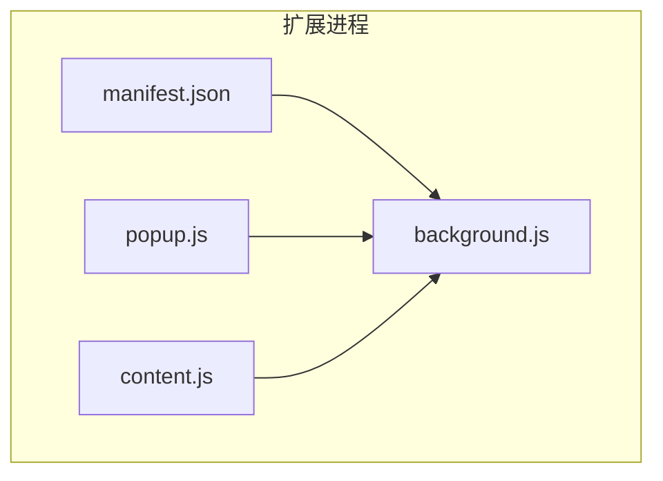
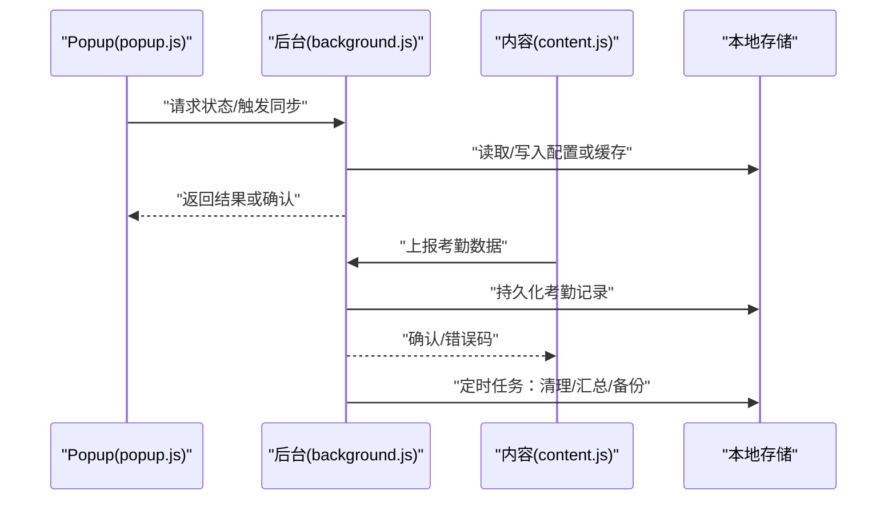
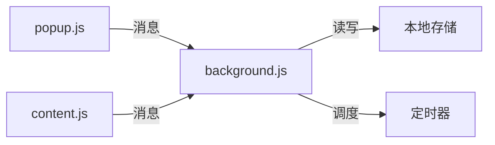

# Background脚本API

<cite>
**本文引用的文件**   
- [background.js](file://extension/background.js)
- [content.js](file://extension/content.js)
- [popup.js](file://extension/popup.js)
- [manifest.json](file://extension/manifest.json)
- [README.md](file://extension/README.md)
</cite>

## 目录
1. [简介](#简介)
2. [项目结构](#项目结构)
3. [核心组件](#核心组件)
4. [架构总览](#架构总览)
5. [详细组件分析](#详细组件分析)
6. [依赖关系分析](#依赖关系分析)
7. [性能考虑](#性能考虑)
8. [故障排查指南](#故障排查指南)
9. [结论](#结论)
10. [附录](#附录)

## 简介
本文件为“工时记录”扩展的Background脚本API参考，聚焦以下能力：
- 消息传递接口：chrome.runtime.sendMessage 与 chrome.runtime.onMessage 的使用方法与参数规范
- 本地存储操作API：数据的增删改查方法与数据结构定义
- 事件监听机制：页面切换、定时器与用户交互事件的响应处理
- 通信协议：与Content Script和Popup之间的消息格式、回调函数与错误处理
- 示例场景：考勤数据捕获、状态管理与数据同步的实现方式（以代码片段路径引用）

## 项目结构
扩展采用分层组织：
- background.js：后台服务，负责持久化、调度、跨上下文通信协调
- content.js：页面注入脚本，采集考勤相关数据并上报
- popup.js：弹出界面逻辑，提供查询、导出与触发同步等交互
- manifest.json：权限与入口声明
- README.md：使用说明与背景信息

图表来源
- [manifest.json](file://extension/manifest.json)
- [background.js](file://extension/background.js)
- [popup.js](file://extension/popup.js)
- [content.js](file://extension/content.js)

章节来源
- [README.md](file://extension/README.md)
- [manifest.json](file://extension/manifest.json)

## 核心组件
- 后台服务（background.js）
  - 职责：维护全局状态、管理本地存储、接收并路由来自Popup与Content的消息、执行定时任务、对外暴露统一API
  - 关键能力：消息分发、存储读写、定时器调度、错误上报与重试
- 内容脚本（content.js）
  - 职责：在目标页面中采集考勤数据，构造标准消息并通过runtime发送
- 弹出界面（popup.js）
  - 职责：展示当前状态、发起同步、查询历史、触发采集任务

章节来源
- [background.js](file://extension/background.js)
- [content.js](file://extension/content.js)
- [popup.js](file://extension/popup.js)

## 架构总览
Background作为中心枢纽，协调Popup与Content之间的通信与数据流转。

图表来源
- [background.js](file://extension/background.js)
- [popup.js](file://extension/popup.js)
- [content.js](file://extension/content.js)

## 详细组件分析

### 消息传递接口（chrome.runtime）
- 发送消息
  - 调用方：Popup、Content
  - 目标：Background
  - 典型动作：获取状态、触发采集、提交数据、执行同步
- 接收消息
  - 监听器：Background
  - 行为：解析消息类型、校验参数、执行业务逻辑、返回结果或错误对象

建议的消息字段约定（供实现参考）：
- type：字符串，标识消息类型
- payload：对象，业务参数
- id：可选，用于关联请求与响应
- timestamp：可选，时间戳

建议的响应格式：
- ok：布尔，是否成功
- data：任意，成功时返回的数据
- error：字符串或对象，失败原因

章节来源
- [background.js](file://extension/background.js)
- [popup.js](file://extension/popup.js)
- [content.js](file://extension/content.js)

### 本地存储操作API
- 能力范围
  - 新增：插入新记录
  - 删除：按条件移除记录
  - 更新：修改已有记录
  - 查询：按条件检索与分页
- 数据结构（建议）
  - 考勤记录：包含时间、站点、类型、备注等字段
  - 配置项：开关、阈值、策略等
  - 状态快照：最近一次同步结果、错误计数等
- 一致性
  - 写操作需保证幂等与事务性（如批量写入失败回滚）
  - 读操作支持索引与缓存以提升性能

章节来源
- [background.js](file://extension/background.js)

### 事件监听机制
- 页面切换事件
  - 由Content在页面可见性变化时上报，Background据此暂停/恢复采集
- 定时器事件
  - Background周期性执行清理、汇总、备份等任务
- 用户交互事件
  - Popup中的按钮点击、表单提交等通过消息驱动Background执行相应流程

章节来源
- [background.js](file://extension/background.js)
- [popup.js](file://extension/popup.js)
- [content.js](file://extension/content.js)

### 与Content Script和Popup的通信协议
- 消息方向
  - Content → Background：上报采集数据、页面状态变更
  - Popup → Background：查询状态、触发同步、导出
  - Background → Popup：推送进度、结果通知
  - Background → Content：下发指令（如强制刷新采集）
- 错误处理
  - 统一错误码与可诊断信息
  - 支持重试与退避策略
  - 对不可恢复错误进行告警与降级

章节来源
- [background.js](file://extension/background.js)
- [popup.js](file://extension/popup.js)
- [content.js](file://extension/content.js)

### 示例场景与代码片段路径
- 考勤数据捕获
  - 说明：Content在页面加载或特定事件后采集数据，封装为标准消息发送给Background；Background落盘并返回确认
  - 代码片段路径
    - [content.js](file://extension/content.js)
    - [background.js](file://extension/background.js)
- 状态管理
  - 说明：Background维护全局状态（如采集开关、上次同步时间），Popup读取并展示
  - 代码片段路径
    - [background.js](file://extension/background.js)
    - [popup.js](file://extension/popup.js)
- 数据同步
  - 说明：Popup触发同步，Background从本地存储聚合数据，执行上传或导出，并将结果写回本地
  - 代码片段路径
    - [popup.js](file://extension/popup.js)
    - [background.js](file://extension/background.js)

## 依赖关系分析
- 内部依赖
  - Popup与Content均依赖Background提供的消息通道
  - Background依赖本地存储与定时器能力
- 外部依赖
  - 浏览器运行时API（runtime、storage、alarms等）
  - 目标页面的DOM或网络请求（由Content侧完成）

图表来源
- [background.js](file://extension/background.js)
- [popup.js](file://extension/popup.js)
- [content.js](file://extension/content.js)

章节来源
- [manifest.json](file://extension/manifest.json)
- [background.js](file://extension/background.js)

## 性能考虑
- 批处理与去重：合并相近时间的采集数据，避免频繁写入
- 懒加载与按需查询：仅加载必要字段，减少内存占用
- 异步与并发控制：限制并行任务数，避免阻塞主线程
- 缓存策略：热点配置与状态短期缓存，降低重复计算

## 故障排查指南
- 常见问题定位
  - 消息未到达：检查权限与端口连通性
  - 数据不一致：核对写入顺序与幂等键
  - 定时任务不生效：确认闹钟注册与唤醒条件
- 日志与调试
  - 在关键分支输出结构化日志
  - 使用统一的错误码便于快速定位
- 恢复策略
  - 失败重试与指数退避
  - 断点续传与增量同步

章节来源
- [background.js](file://extension/background.js)
- [popup.js](file://extension/popup.js)
- [content.js](file://extension/content.js)

## 结论
Background脚本作为扩展的核心编排层，统一了消息路由、数据存储与任务调度。通过明确的消息协议与错误处理机制，Popup与Content可以稳定地与Background协作，实现考勤数据采集、状态管理与数据同步等关键功能。

## 附录
- 术语
  - 消息：跨上下文通信的最小单元
  - 本地存储：扩展持久化数据的能力
  - 定时器：周期性任务的调度机制
- 最佳实践
  - 保持消息体小而精
  - 为所有外部输入做校验
  - 对关键路径增加监控与告警