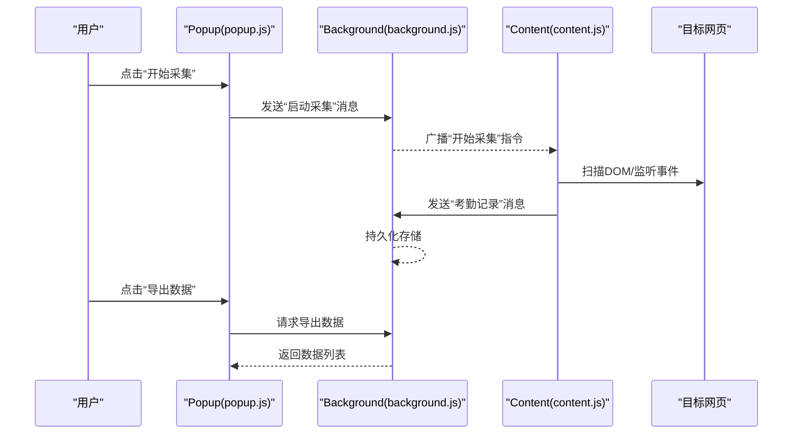
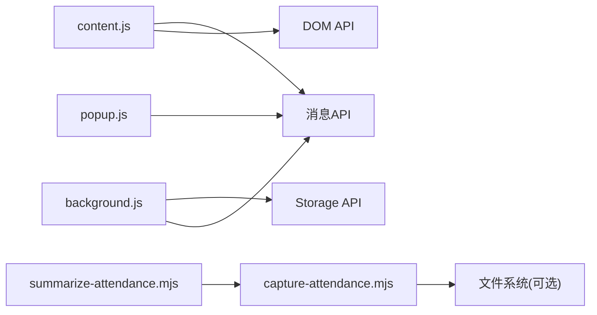

# Content脚本API

<cite>
**本文引用的文件**   
- [content.js](file://extension/content.js)
- [background.js](file://extension/background.js)
- [manifest.json](file://extension/manifest.json)
- [popup.html](file://extension/popup.html)
- [popup.js](file://extension/popup.js)
- [capture-attendance.mjs](file://scripts/capture-attendance.mjs)
- [summarize-attendance.mjs](file://scripts/summarize-attendance.mjs)
</cite>

## 目录
1. [简介](#简介)
2. [项目结构](#项目结构)
3. [核心组件](#核心组件)
4. [架构总览](#架构总览)
5. [详细组件分析](#详细组件分析)
6. [依赖关系分析](#依赖关系分析)
7. [性能考虑](#性能考虑)
8. [故障排查指南](#故障排查指南)
9. [结论](#结论)
10. [附录](#附录)

## 简介
本文件为Content Script的API参考文档，聚焦以下能力：
- DOM操作接口：页面元素选择、属性获取与事件监听。
- 考勤数据提取函数：时间戳解析、状态识别与数据格式化。
- 与Background Script的消息通信机制：发送、接收与错误处理。
- 目标网站适配接口：不同考勤系统的页面结构检测与兼容性处理。
- 每个API的参数说明、返回值类型与实际使用示例，展示如何从目标网站自动捕获考勤信息。

## 项目结构
扩展由Content Script、Background Script、Popup以及辅助脚本组成。Content Script负责在目标网页中执行DOM操作与数据采集；Background Script负责持久化存储与跨页面协调；Popup提供用户界面与交互入口；辅助脚本用于离线数据处理与调试。

```mermaid
graph TB
subgraph "浏览器环境"
Web["目标网页"]
CS["Content Script<br/>content.js"]
BG["Background Script<br/>background.js"]
POP["Popup<br/>popup.html / popup.js"]
end
subgraph "本地脚本"
CAP["capture-attendance.mjs"]
SUM["summarize-attendance.mjs"]
end
Web --> CS
CS < --> BG
POP --> BG
CAP --> Web
SUM --> CAP
```

图表来源
- [content.js](file://extension/content.js)
- [background.js](file://extension/background.js)
- [popup.html](file://extension/popup.html)
- [popup.js](file://extension/popup.js)
- [capture-attendance.mjs](file://scripts/capture-attendance.mjs)
- [summarize-attendance.mjs](file://scripts/summarize-attendance.mjs)

章节来源
- [manifest.json](file://extension/manifest.json)

## 核心组件
- Content Script（content.js）
  - 职责：注入到目标网页，提供DOM操作、事件监听、考勤数据提取以及与Background Script的消息通信。
  - 关键能力：
    - DOM选择器封装与批量查询。
    - 文本/属性读取与规范化。
    - 事件监听（点击、输入、路由变化等）。
    - 考勤数据提取（时间戳解析、状态识别、格式统一）。
    - 消息通道（向Background发送采集结果、请求配置或触发刷新）。
- Background Script（background.js）
  - 职责：维护全局状态、持久化考勤记录、聚合来自多个标签页的数据、响应Popup请求。
  - 关键能力：
    - 消息路由与分发。
    - 数据存储与版本兼容。
    - 错误上报与重试策略。
- Popup（popup.html / popup.js）
  - 职责：提供UI以查看、导出、清理考勤数据，并触发重新采集。
- 辅助脚本（capture-attendance.mjs / summarize-attendance.mjs）
  - 职责：在Node环境下对已采集数据进行二次处理与汇总。

章节来源
- [content.js](file://extension/content.js)
- [background.js](file://extension/background.js)
- [popup.html](file://extension/popup.html)
- [popup.js](file://extension/popup.js)

## 架构总览
Content Script通过浏览器消息API与Background Script双向通信。Popup通过Background管理数据。辅助脚本可独立运行，对已保存数据进行离线分析。



图表来源
- [content.js](file://extension/content.js)
- [background.js](file://extension/background.js)
- [popup.js](file://extension/popup.js)

## 详细组件分析

### Content Script API：DOM操作接口
本节定义Content Script暴露给页面或内部使用的DOM操作能力。为避免侵入性，建议优先使用安全的选择器与只读访问。

- 选择器与元素定位
  - 方法名：selectElement
  - 参数：
    - selector: string，CSS选择器或自定义匹配规则。
    - context: Element|Document，可选，限定搜索上下文。
  - 返回：Element|null
  - 行为：根据选择器定位单个元素；若未找到则返回空。
  - 示例路径：[content.js](file://extension/content.js)

- 批量选择
  - 方法名：selectElements
  - 参数：
    - selector: string
    - context: Element|Document
  - 返回：Element[]
  - 行为：返回所有匹配元素数组。
  - 示例路径：[content.js](file://extension/content.js)

- 属性与文本读取
  - 方法名：getAttributeText
  - 参数：
    - element: Element
    - attrName: string
  - 返回：string|null
  - 行为：读取指定属性值；不存在时返回空。
  - 示例路径：[content.js](file://extension/content.js)

  - 方法名：getTextContent
  - 参数：
    - element: Element
    - trim: boolean，是否去除空白。
  - 返回：string
  - 行为：获取文本内容并进行可选修剪。
  - 示例路径：[content.js](file://extension/content.js)

- 事件监听
  - 方法名：onEvent
  - 参数：
    - target: Element|Document
    - eventType: string，如click、input、change等。
    - handler: Function，回调函数。
    - options: Object，可选，事件选项。
  - 返回：Function，取消监听函数。
  - 行为：注册事件监听，返回取消函数以便移除。
  - 示例路径：[content.js](file://extension/content.js)

- 变更观察
  - 方法名：observeMutations
  - 参数：
    - target: Element
    - callback: Function，变更回调。
    - config: Object，MutationObserver配置。
  - 返回：Object，包含disconnect方法。
  - 行为：观察DOM变更并触发回调。
  - 示例路径：[content.js](file://extension/content.js)

章节来源
- [content.js](file://extension/content.js)

### Content Script API：考勤数据提取函数
本节定义从目标网页中提取考勤记录的函数族，包括时间戳解析、状态识别与数据格式化。

- 主提取入口
  - 方法名：extractAttendanceRecords
  - 参数：
    - pageContext: Document，当前页面文档对象。
    - adapter: Adapter，页面适配器实例（见下一节）。
  - 返回：Promise<Array<Record>>
  - 行为：调用适配器进行页面结构检测与数据抽取，统一格式化为标准记录。
  - 示例路径：[content.js](file://extension/content.js)

- 时间戳解析
  - 方法名：parseTimestamp
  - 参数：
    - raw: string|number，原始时间字符串或数值。
    - formatHint: string，可选，格式提示（如YYYY-MM-DD HH:mm:ss）。
  - 返回：Date|null
  - 行为：尝试多种常见格式解析；失败返回空。
  - 示例路径：[content.js](file://extension/content.js)

- 状态识别
  - 方法名：classifyStatus
  - 参数：
    - text: string，状态相关文本。
    - keywords: Array<string>，可选，自定义关键词映射。
  - 返回：string，标准化状态码（如“打卡成功”、“迟到”、“缺卡”等）。
  - 行为：基于关键词与正则匹配识别状态。
  - 示例路径：[content.js](file://extension/content.js)

- 数据格式化
  - 方法名：formatRecord
  - 参数：
    - raw: Object，原始记录对象。
    - schema: Object，字段映射与转换规则。
  - 返回：Record，标准化后的考勤记录。
  - 行为：将不同系统字段映射为标准结构，确保一致性。
  - 示例路径：[content.js](file://extension/content.js)

- 记录结构（标准）
  - 字段：
    - id: string，唯一标识。
    - userId: string，用户标识。
    - time: Date，打卡时间。
    - status: string，状态码。
    - source: string，来源系统名称。
    - raw: Object，原始数据快照。
  - 示例路径：[content.js](file://extension/content.js)

章节来源
- [content.js](file://extension/content.js)

### Content Script API：与Background Script的消息通信
本节定义Content Script与Background之间的消息协议与错误处理。

- 发送消息
  - 方法名：sendMessage
  - 参数：
    - message: Object，消息体，包含type与payload。
    - timeout: number，可选，超时毫秒数。
  - 返回：Promise<any>
  - 行为：向Background发送消息并等待响应；支持超时与重试。
  - 示例路径：[content.js](file://extension/content.js)

- 常用消息类型
  - type: "start_capture"，触发采集流程。
  - type: "attendance_record"，上报一条考勤记录。
  - type: "get_records"，请求历史数据。
  - type: "clear_records"，清空历史数据。
  - 示例路径：[content.js](file://extension/content.js)

- 错误处理
  - 错误码：
    - "TIMEOUT"：消息超时。
    - "NOT_FOUND"：Background不可用。
    - "INVALID_PAYLOAD"：消息格式不合法。
  - 行为：抛出异常或返回错误对象，供上层重试或降级。
  - 示例路径：[content.js](file://extension/content.js)

章节来源
- [content.js](file://extension/content.js)
- [background.js](file://extension/background.js)

### Content Script API：目标网站适配接口
本节定义适配器模式，用于检测不同考勤系统的页面结构并实现兼容抽取。

- 适配器接口
  - 方法名：detect
  - 参数：
    - document: Document
  - 返回：boolean，是否匹配该站点。
  - 行为：基于特征选择器或URL模式判断站点类型。
  - 示例路径：[content.js](file://extension/content.js)

  - 方法名：extract
  - 参数：
    - document: Document
  - 返回：Array<Object>，原始记录集合。
  - 行为：按站点特定规则抽取数据。
  - 示例路径：[content.js](file://extension/content.js)

- 内置适配器
  - 适配器A：适用于某类企业OA系统（基于表格与固定列头）。
  - 适配器B：适用于移动端H5页面（基于卡片与按钮文本）。
  - 适配器C：适用于第三方SaaS平台（基于JSON-LD或隐藏字段）。
  - 示例路径：[content.js](file://extension/content.js)

- 新增适配器步骤
  - 实现detect与extract。
  - 注册到适配器管理器。
  - 编写单元测试验证选择器与字段映射。
  - 示例路径：[content.js](file://extension/content.js)

章节来源
- [content.js](file://extension/content.js)

### Popup与Background协作
Popup通过Background管理数据与触发采集任务。

- 常用消息
  - type: "export_data"，导出当前数据。
  - type: "refresh"，刷新数据列表。
  - type: "clear_all"，清空所有记录。
- 错误处理
  - 网络或权限错误时显示友好提示。
  - 数据为空时提示无记录。
- 示例路径：
  - [popup.js](file://extension/popup.js)
  - [background.js](file://extension/background.js)

章节来源
- [popup.js](file://extension/popup.js)
- [background.js](file://extension/background.js)

### 辅助脚本：离线数据处理
- capture-attendance.mjs
  - 作用：在Node环境中模拟或回放采集过程，便于调试与回归测试。
  - 输入：已保存的原始数据或页面快照。
  - 输出：标准化记录与统计报告。
  - 示例路径：[capture-attendance.mjs](file://scripts/capture-attendance.mjs)

- summarize-attendance.mjs
  - 作用：对采集到的数据进行汇总分析，生成报表。
  - 输入：标准化记录集合。
  - 输出：汇总结果（如每日打卡次数、迟到率等）。
  - 示例路径：[summarize-attendance.mjs](file://scripts/summarize-attendance.mjs)

章节来源
- [capture-attendance.mjs](file://scripts/capture-attendance.mjs)
- [summarize-attendance.mjs](file://scripts/summarize-attendance.mjs)

## 依赖关系分析
Content Script依赖浏览器消息API与DOM API；Background依赖Storage API；Popup依赖消息API与UI渲染。



图表来源
- [content.js](file://extension/content.js)
- [background.js](file://extension/background.js)
- [popup.js](file://extension/popup.js)
- [capture-attendance.mjs](file://scripts/capture-attendance.mjs)
- [summarize-attendance.mjs](file://scripts/summarize-attendance.mjs)

章节来源
- [manifest.json](file://extension/manifest.json)

## 性能考虑
- 选择器优化：尽量使用具体且稳定的选择器，避免全表扫描。
- 事件节流：对高频事件（如scroll、input）进行节流或防抖。
- 观察者配置：仅监听必要变更，减少回调频率。
- 批量处理：合并多次DOM读取，降低重排重绘。
- 消息批量化：将多条记录打包发送，减少通信开销。
- 缓存策略：对静态页面片段进行缓存，避免重复解析。

## 故障排查指南
- 常见问题
  - 选择器失效：检查页面结构变更，更新适配器中的选择器。
  - 时间解析失败：确认时间格式与区域设置，必要时增加格式提示。
  - 状态识别不准：扩充关键词映射与正则规则。
  - 消息超时：检查Background是否可用，增加重试与退避策略。
  - 权限问题：确认manifest中声明了必要的权限与主机匹配。
- 诊断工具
  - 在Popup中显示错误日志与最近一次采集结果。
  - 在Background中记录消息收发详情与错误堆栈。
  - 使用辅助脚本回放采集过程，定位问题。

章节来源
- [content.js](file://extension/content.js)
- [background.js](file://extension/background.js)
- [popup.js](file://extension/popup.js)

## 结论
本API参考文档系统化地描述了Content Script的DOM操作、考勤数据提取、消息通信与站点适配能力。通过适配器模式与标准化记录结构，扩展能够兼容多种考勤系统，并在Popup与Background的协同下提供稳定可靠的数据采集体验。

## 附录
- 使用示例（路径指引）
  - 在页面加载后初始化适配器并注册事件监听：[content.js](file://extension/content.js)
  - 从DOM中抽取原始记录并转换为标准格式：[content.js](file://extension/content.js)
  - 向Background发送考勤记录并等待确认：[content.js](file://extension/content.js)
  - 在Popup中触发导出与清空操作：[popup.js](file://extension/popup.js)
  - 在Node环境下回放采集与汇总分析：[capture-attendance.mjs](file://scripts/capture-attendance.mjs)、[summarize-attendance.mjs](file://scripts/summarize-attendance.mjs)