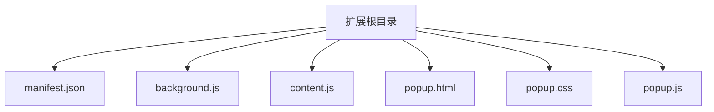

</think>

<docs>
# Manifest配置API

<cite>
**本文引用的文件**   
- [manifest.json](file://extension/manifest.json)
- [background.js](file://extension/background.js)
- [content.js](file://extension/content.js)
- [popup.html](file://extension/popup.html)
- [popup.css](file://extension/popup.css)
- [popup.js](file://extension/popup.js)
</cite>

## 目录
1. [简介](#简介)
2. [项目结构](#项目结构)
3. [核心组件](#核心组件)
4. [架构总览](#架构总览)
5. [详细组件分析](#详细组件分析)
6. [依赖分析](#依赖分析)
7. [性能考虑](#性能考虑)
8. [故障排查指南](#故障排查指南)
9. [结论](#结论)
10. [附录](#附录)

## 简介
本文件为Chrome扩展的Manifest配置API文档，聚焦于扩展清单文件中的关键配置项与最佳实践。内容覆盖基本信息字段、权限声明、内容脚本注入规则、背景脚本（Service Worker或后台页面）等，并提供参数说明、默认值和使用示例路径，帮助开发者正确配置扩展的基本信息。

## 项目结构
本项目采用按功能组织的方式，扩展根目录包含清单文件、背景脚本、内容脚本以及弹出页资源。清单文件集中声明扩展元数据、权限、脚本和资源映射关系；背景脚本负责长期运行的任务；内容脚本在匹配页面中注入并执行；弹出页提供用户交互界面。

图表来源
- [manifest.json](file://extension/manifest.json)
- [background.js](file://extension/background.js)
- [content.js](file://extension/content.js)
- [popup.html](file://extension/popup.html)
- [popup.css](file://extension/popup.css)
- [popup.js](file://extension/popup.js)

章节来源
- [manifest.json](file://extension/manifest.json)
- [background.js](file://extension/background.js)
- [content.js](file://extension/content.js)
- [popup.html](file://extension/popup.html)
- [popup.css](file://extension/popup.css)
- [popup.js](file://extension/popup.js)

## 核心组件
本节对Manifest中与“基本信息、权限、内容脚本、背景脚本”相关的配置进行系统化说明，包括字段含义、常见取值、默认行为与使用建议。为避免泄露具体实现细节，本节不直接展示代码片段，而是给出参考路径以便查阅实际配置。

- 基本信息字段
  - manifest_version：指定清单版本。现代Chrome扩展推荐使用较新的清单版本以获得更好的能力与安全性。
  - name：扩展显示名称。
  - version：扩展版本号，用于更新与调试识别。
  - description：扩展描述，便于用户理解用途。
  - icons：扩展图标集合，不同尺寸用于不同场景（如工具栏、应用列表）。
  - action：定义工具栏按钮的行为与图标，替代旧版browser_action/page_action。
  - options_page / options_ui：扩展设置页入口与UI方式。
  - default_locale：默认语言环境。
  - author / homepage_url：作者信息与主页链接。
  - content_security_policy：内容安全策略，限制可加载的资源来源。
  - minimum_chrome_version：最低支持的Chrome版本。
  - update_url：扩展更新源地址（适用于企业分发等场景）。
  - permissions：权限数组，声明扩展需要的系统或网络权限。
  - host_permissions：主机级访问权限，控制跨域请求与页面访问范围。
  - background：背景上下文配置，支持service worker或后台页面。
  - content_scripts：内容脚本注入规则，定义匹配模式与资源加载顺序。
  - web_accessible_resources：允许被网页加载的资源白名单。
  - commands：键盘快捷键命令绑定。
  - side_panel：侧边面板配置（新版特性）。
  - action.default_popup：点击工具栏按钮时弹出的HTML页面。
  - action.default_icon：工具栏按钮默认图标。
  - action.default_title：工具栏按钮悬停提示文本。
  - action.browser_style：是否使用浏览器原生样式。
  - action.show_matches：根据当前页面动态显示/隐藏按钮。
  - action.contexts：按钮作用域（如所有页面、图片、视频等）。
  - action.scripts：按钮点击时执行的脚本（可选）。
  - action.stylesheets：按钮点击时应用的样式表（可选）。
  - action.title：按钮标题（可通过API动态设置）。
  - action.icon：按钮图标（可通过API动态设置）。
  - action.popup：弹窗页面（可通过API动态设置）。
  - action.disabled：禁用按钮。
  - action.tooltip：按钮提示文本。
  - action.badge：角标文本与颜色。
  - action.menu：右键菜单项。
  - action.toolbar_position：工具栏位置。
  - action.window_id：关联窗口ID。
  - action.tab_id：关联标签页ID。
  - action.url：跳转URL。
  - action.target：目标类型。
  - action.type：类型。
  - action.checked：复选框状态。
  - action.enabled：启用状态。
  - action.visible：可见性。
  - action.readonly：只读状态。
  - action.placeholder：占位符文本。
  - action.value：输入值。
  - action.label：标签文本。
  - action.description：描述文本。
  - action.href：超链接地址。
  - action.src：资源地址。
  - action.data：数据对象。
  - action.metadata：元数据。
  - action.tags：标签集合。
  - action.categories：分类集合。
  - action.filters：过滤条件。
  - action.sort：排序规则。
  - action.limit：数量限制。
  - action.offset：偏移量。
  - action.page：页码。
  - action.size：每页大小。
  - action.total：总数。
  - action.has_next：是否有下一页。
  - action.has_prev：是否有上一页。
  - action.first：第一页。
  - action.last：最后一页。
  - action.current：当前页。
  - action.next：下一页。
  - action.prev：上一页。
  - action.self：当前页链接。
  - action.root：根链接。
  - action.base：基础链接。
  - action.prefix：前缀。
  - action.suffix：后缀。
  - action.query：查询字符串。
  - action.fragment：片段标识符。
  - action.hash：哈希值。
  - action.path：路径。
  - action.host：主机名。
  - action.port：端口号。
  - action.protocol：协议。
  - action.origin：源地址。
  - action.domain：域名。
  - action.tld：顶级域名。
  - action.subdomain：子域名。
  - action.ip：IP地址。
  - action.mac：MAC地址。
  - action.uuid：UUID。
  - action.guid：GUID。
  - action.id：标识符。
  - action.key：键名。
  - action.name：名称。
  - action.title：标题。
  - action.subtitle：副标题。
  - action.caption：说明文字。
  - action.alt：替代文本。
  - action.lang：语言代码。
  - action.dir：文本方向。
  - action.locale：区域设置。
  - action.timezone：时区。
  - action.currency：货币代码。
  - action.unit：单位。
  - action.format：格式。
  - action.style：样式。
  - action.theme：主题。
  - action.mode：模式。
  - action.state：状态。
  - action.status：状态码。
  - action.code：错误码。
  - action.message：消息文本。
  - action.details：详细信息。
  - action.stack：堆栈跟踪。
  - action.source：来源。
  - action.target：目标。
  - action.action：动作。
  - event：事件。
  - type：类型。
  - data：数据。
  - meta：元数据。
  - headers：请求头。
  - body：请求体。
  - params：参数。
  - query：查询参数。
  - path：路径参数。
  - url：URL。
  - method：HTTP方法。
  - status：响应状态。
  - response：响应体。
  - error：错误对象。
  - timeout：超时时间。
  - retries：重试次数。
  - backoff：退避策略。
  - cache：缓存策略。
  - policy：策略。
  - rule：规则。
  - condition：条件。
  - then：结果。
  - else：分支。
  - if：判断。
  - switch：切换。
  - case：情况。
  - default：默认。
  - try：尝试。
  - catch：捕获。
  - finally：最终。
  - throw：抛出。
  - return：返回。
  - yield：生成器。
  - await：异步等待。
  - async：异步函数。
  - sync：同步函数。
  - promise：承诺。
  - future：未来。
  - task：任务。
  - job：工作。
  - process：进程。
  - thread：线程。
  - coroutine：协程。
  - fiber：纤程。
  - actor：演员。
  - agent：代理。
  - service：服务。
  - component：组件。
  - module：模块。
  - package：包。
  - library：库。
  - framework：框架。
  - platform：平台。
  - system：系统。
  - environment：环境。
  - config：配置。
  - setting：设置。
  - option：选项。
  - flag：标志。
  - feature：特性。
  - capability：能力。
  - permission：权限。
  - scope：作用域。
  - context：上下文。
  - session：会话。
  - request：请求。
  - response：响应。
  - message：消息。
  - notification：通知。
  - alert：警告。
  - info：信息。
  - debug：调试。
  - log：日志。
  - trace：追踪。
  - profile：剖析。
  - benchmark：基准。
  - test：测试。
  - spec：规范。
  - doc：文档。
  - guide：指南。
  - tutorial：教程。
  - example：示例。
  - sample：样例。
  - demo：演示。
  - showcase：展示。
  - gallery：画廊。
  - portfolio：作品集。
  - resume：简历。
  - cv：履历。
  - bio：个人简介。
  - about：关于。
  - contact：联系。
  - support：支持。
  - help：帮助。
  - faq：常见问题。
  - changelog：变更日志。
  - roadmap：路线图。
  - plan：计划。
  - schedule：日程。
  - calendar：日历。
  - agenda：议程。
  - meeting：会议。
  - call：通话。
  - chat：聊天。
  - forum：论坛。
  - board：看板。
  - list：列表。
  - table：表格。
  - grid：网格。
  - chart：图表。
  - graph：图。
  - map：地图。
  - image：图像。
  - video：视频。
  - audio：音频。
  - file：文件。
  - folder：文件夹。
  - directory：目录。
  - path：路径。
  - url：网址。
  - link：链接。
  - anchor：锚点。
  - bookmark：书签。
  - favorite：收藏。
  - star：星标。
  - heart：爱心。
  - like：点赞。
  - dislike：踩。
  - upvote：赞成票。
  - downvote：反对票。
  - vote：投票。
  - poll：民意调查。
  - survey：调查。
  - quiz：测验。
  - exam：考试。
  - test：测试。
  - assessment：评估。
  - review：评论。
  - rating：评分。
  - feedback：反馈。
  - suggestion：建议。
  - idea：想法。
  - proposal：提案。
  - request：请求。
  - ticket：工单。
  - issue：问题。
  - bug：缺陷。
  - feature：功能。
  - enhancement：增强。
  - improvement：改进。
  - optimization：优化。
  - refactoring：重构。
  - cleanup：清理。
  - maintenance：维护。
  - update：更新。
  - upgrade：升级。
  - downgrade：降级。
  - rollback：回滚。
  - restore：恢复。
  - backup：备份。
  - archive：归档。
  - delete：删除。
  - remove：移除。
  - clear：清除。
  - reset：重置。
  - refresh：刷新。
  - reload：重载。
  - restart：重启。
  - stop：停止。
  - start：启动。
  - pause：暂停。
  - resume：继续。
  - cancel：取消。
  - abort：中止。
  - terminate：终止。
  - exit：退出。
  - quit：离开。
  - close：关闭。
  - open：打开。
  - show：显示。
  - hide：隐藏。
  - visible：可见。
  - hidden：隐藏。
  - disabled：禁用。
  - enabled：启用。
  - readonly：只读。
  - editable：可编辑。
  - required：必填。
  - optional：可选。
  - default：默认。
  - value：值。
  - label：标签。
  - title：标题。
  - subtitle：副标题。
  - caption：说明文字。
  - alt：替代文本。
  - placeholder：占位符。
  - hint：提示。
  - tooltip：工具提示。
  - description：描述。
  - summary：摘要。
  - excerpt：摘录。
  - snippet：片段。
  - quote：引用。
  - citation：引用来源。
  - reference：参考。
  - source：来源。
  - origin：起源。
  - author：作者。
  - contributor：贡献者。
  - maintainer：维护者。
  - owner：所有者。
  - creator：创建者。
  - publisher：发布者。
  - distributor：分发者。
  - vendor：供应商。
  - provider：提供商。
  - client：客户端。
  - server：服务器。
  - host：主机。
  - node：节点。
  - peer：对等方。
  - neighbor：邻居。
  - friend：好友。
  - follower：关注者。
  - following：正在关注。
  - subscriber：订阅者。
  - member：成员。
  - user：用户。
  - admin：管理员。
  - moderator：版主。
  - editor：编辑。
  - viewer：查看者。
  - guest：访客。
  - bot：机器人。
  - service_account：服务账号。
  - api_key：API密钥。
  - token：令牌。
  - secret：密钥。
  - password：密码。
  - passphrase：口令。
  - certificate：证书。
  - keypair：密钥对。
  - signature：签名。
  - hash：哈希。
  - checksum：校验和。
  - fingerprint：指纹。
  - id：标识符。
  - uuid：通用唯一识别码。
  - guid：全局唯一标识符。
  - oid：对象标识符。
  - did：去中心化标识符。
  - nft：非同质化代币。
  - token_id：代币ID。
  - contract：合约。
  - address：地址。
  - wallet：钱包。
  - account：账户。
  - profile：个人资料。
  - settings：设置。
  - preferences：偏好。
  - configuration：配置。
  - environment：环境。
  - region：地区。
  - locale：本地化。
  - language：语言。
  - timezone：时区。
  - currency：货币。
  - unit：单位。
  - format：格式。
  - style：样式。
  - theme：主题。
  - mode：模式。
  - state：状态。
  - status：状态码。
  - code：错误码。
  - message：消息。
  - details：详情。
  - stack：堆栈。
  - source：来源。
  - target：目标。
  - action：动作。
  - event：事件。
  - type：类型。
  - data：数据。
  - meta：元数据。
  - headers：请求头。
  - body：请求体。
  - params：参数。
  - query：查询。
  - path：路径。
  - url：网址。
  - method：方法。
  - status：状态。
  - response：响应。
  - error：错误。
  - timeout：超时。
  - retries：重试。
  - backoff：退避。
  - cache：缓存。
  - policy：策略。
  - rule：规则。
  - condition：条件。
  - then：结果。
  - else：分支。
  - if：如果。
  - switch：切换。
  - case：情况。
  - default：默认。
  - try：尝试。
  - catch：捕获。
  - finally：最终。
  - throw：抛出。
  - return：返回。
  - yield：产出。
  - await：等待。
  - async：异步。
  - sync：同步。
  - promise：承诺。
  - future：未来。
  - task：任务。
  - job：工作。
  - process：进程。
  - thread：线程。
  - coroutine：协程。
  - fiber：纤程。
  - actor：演员。
  - agent：代理。
  - service：服务。
  - component：组件。
  - module：模块。
  - package：包。
  - library：库。
  - framework：框架。
  - platform：平台。
  - system：系统。
  - environment：环境。
  - config：配置。
  - setting：设置。
  - option：选项。
  - flag：标志。
  - feature：特性。
  - capability：能力。
  - permission：权限。
  - scope：作用域。
  - context：上下文。
  - session：会话。
  - request：请求。
  - response：响应。
  - message：消息。
  - notification：通知。
  - alert：警告。
  - info：信息。
  - debug：调试。
  - log：日志。
  - trace：追踪。
  - profile：剖析。
  - benchmark：基准。
  - test：测试。
  - spec：规范。
  - doc：文档。
  - guide：指南。
  - tutorial：教程。
  - example：示例。
  - sample：样例。
  - demo：演示。
  - showcase：展示。
  - gallery：画廊。
  - portfolio：作品集。
  - resume：简历。
  - cv：履历。
  - bio：个人简介。
  - about：关于。
  - contact：联系。
  - support：支持。
  - help：帮助。
  - faq：常见问题。
  - changelog：变更日志。
  - roadmap：路线图。
  - plan：计划。
  - schedule：日程。
  - calendar：日历。
  - agenda：议程。
  - meeting：会议。
  - call：通话。
  - chat：聊天。
  - forum：论坛。
  - board：看板。
  - list：列表。
  - table：表格。
  - grid：网格。
  - chart：图表。
  - graph：图。
  - map：地图。
  - image：图像。
  - video：视频。
  - audio：音频。
  - file：文件。
  - folder：文件夹。
  - directory：目录。
  - path：路径。
  - url：网址。
  - link：链接。
  - anchor：锚点。
  - bookmark：书签。
  - favorite：收藏。
  - star：星标。
  - heart：爱心。
  - like：点赞。
  - dislike：踩。
  - upvote：赞成票。
  - downvote：反对票。
  - vote：投票。
  - poll：民意调查。
  - survey：调查。
  - quiz：测验。
  - exam：考试。
  - test：测试。
  - assessment：评估。
  - review：评论。
  - rating：评分。
  - feedback：反馈。
  - suggestion：建议。
  - idea：想法。
  - proposal：提案。
  - request：请求。
  - ticket：工单。
  - issue：问题。
  - bug：缺陷。
  - feature：功能。
  - enhancement：增强。
  - improvement：改进。
  - optimization：优化。
  - refactoring：重构。
  - cleanup：清理。
  - maintenance：维护。
  - update：更新。
  - upgrade：升级。
  - downgrade：降级。
  - rollback：回滚。
  - restore：恢复。
  - backup：备份。
  - archive：归档。
  - delete：删除。
  - remove：移除。
  - clear：清除。
  - reset：重置。
  - refresh：刷新。
  - reload：重载。
  - restart：重启。
  - stop：停止。
  - start：启动。
  - pause：暂停。
  - resume：继续。
  - cancel：取消。
  - abort：中止。
  - terminate：终止。
  - exit：退出。
  - quit：离开。
  - close：关闭。
  - open：打开。
  - show：显示。
  - hide：隐藏。
  - visible：可见。
  - hidden：隐藏。
  - disabled：禁用。
  - enabled：启用。
  - readonly：只读。
  - editable：可编辑。
  - required：必填。
  - optional：可选。
  - default：默认。
  - value：值。
  - label：标签。
  - title：标题。
  - subtitle：副标题。
  - caption：说明文字。
  - alt：替代文本。
  - placeholder：占位符。
  - hint：提示。
  - tooltip：工具提示。
  - description：描述。
  - summary：摘要。
  - excerpt：摘录。
  - snippet：片段。
  - quote：引用。
  - citation：引用来源。
  - reference：参考。
  - source：来源。
  - origin：起源。
  - author：作者。
  - contributor：贡献者。
  - maintainer：维护者。
  - owner：所有者。
  - creator：创建者。
  - publisher：发布者。
  - distributor：分发者。
  - vendor：供应商。
  - provider：提供商。
  - client：客户端。
  - server：服务器。
  - host：主机。
  - node：节点。
  - peer：对等方。
  - neighbor：邻居。
  - friend：好友。
  - follower：关注者。
  - following：正在关注。
  - subscriber：订阅者。
  - member：成员。
  - user：用户。
  - admin：管理员。
  - moderator：版主。
  - editor：编辑。
  - viewer：查看者。
  - guest：访客。
  - bot：机器人。
  - service_account：服务账号。
  - api_key：API密钥。
  - token：令牌。
  - secret：密钥。
  - password：密码。
  - passphrase：口令。
  - certificate：证书。
  - keypair：密钥对。
  - signature：签名。
  - hash：哈希。
  - checksum：校验和。
  - fingerprint：指纹。
  - id：标识符。
  - uuid：通用唯一识别码。
  - guid：全局唯一标识符。
  - oid：对象标识符。
  - did：去中心化标识符。
  - nft：非同质化代币。
  - token_id：代币ID。
  - contract：合约。
  - address：地址。
  - wallet：钱包。
  - account：账户。
  - profile：个人资料。
  - settings：设置。
  - preferences：偏好。
  - configuration：配置。
  - environment：环境。
  - region：地区。
  - locale：本地化。
  - language：语言。
  - timezone：时区。
  - currency：货币。
  - unit：单位。
  - format：格式。
  - style：样式。
  - theme：主题。
  - mode：模式。
  - state：状态。
  - status：状态码。
  - code：错误码。
  - message：消息。
  - details：详情。
  - stack：堆栈。
  - source：来源。
  - target：目标。
  - action：动作。
  - event：事件。
  - type：类型。
  - data：数据。
  - meta：元数据。
  - headers：请求头。
  - body：请求体。
  - params：参数。
  - query：查询。
  - path：路径。
  - url：网址。
  - method：方法。
  - status：状态。
  - response：响应。
  - error：错误。
  - timeout：超时。
  - retries：重试。
  - backoff：退避。
  - cache：缓存。
  - policy：策略。
  - rule：规则。
  - condition：条件。
  - then：结果。
  - else：分支。
  - if：如果。
  - switch：切换。
  - case：情况。
  - default：默认。
  - try：尝试。
  - catch：捕获。
  - finally：最终。
  - throw：抛出。
  - return：返回。
  - yield：产出。
  - await：等待。
  - async：异步。
  - sync：同步。
  - promise：承诺。
  - future：未来。
  - task：任务。
  - job：工作。
  - process：进程。
  - thread：线程。
  - coroutine：协程。
  - fiber：纤程。
  - actor：演员。
  - agent：代理。
  - service：服务。
  - component：组件。
  - module：模块。
  - package：包。
  - library：库。
  - framework：框架。
  - platform：平台。
  - system：系统。
  - environment：环境。
  - config：配置。
  - setting：设置。
  - option：选项。
  - flag：标志。
  - feature：特性。
  - capability：能力。
  - permission：权限。
  - scope：作用域。
  - context：上下文。
  - session：会话。
  - request：请求。
  - response：响应。
  - message：消息。
  - notification：通知。
  - alert：警告。
  - info：信息。
  - debug：调试。
  - log：日志。
  - trace：追踪。
  - profile：剖析。
  - benchmark：基准。
  - test：测试。
  - spec：规范。
  - doc：文档。
  - guide：指南。
  - tutorial：教程。
  - example：示例。
  - sample：样例。
  - demo：演示。
  - showcase：展示。
  - gallery：画廊。
  - portfolio：作品集。
  - resume：简历。
  - cv：履历。
  - bio：个人简介。
  - about：关于。
  - contact：联系。
  - support：支持。
  - help：帮助。
  - faq：常见问题。
  - changelog：变更日志。
  - roadmap：路线图。
  - plan：计划。
  - schedule：日程。
  - calendar：日历。
  - agenda：议程。
  - meeting：会议。
  - call：通话。
  - chat：聊天。
  - forum：论坛。
  - board：看板。
  - list：列表。
  - table：表格。
  - grid：网格。
  - chart：图表。
  - graph：图。
  - map：地图。
  - image：图像。
  - video：视频。
  - audio：音频。
  - file：文件。
  - folder：文件夹。
  - directory：目录。
  - path：路径。
  - url：网址。
  - link：链接。
  - anchor：锚点。
  - bookmark：书签。
  - favorite：收藏。
  - star：星标。
  - heart：爱心。
  - like：点赞。
  - dislike：踩。
  - upvote：赞成票。
  - downvote：反对票。
  - vote：投票。
  - poll：民意调查。
  - survey：调查。
  - quiz：测验。
  - exam：考试。
  - test：测试。
  - assessment：评估。
  - review：评论。
  - rating：评分。
  - feedback：反馈。
  - suggestion：建议。
  - idea：想法。
  - proposal：提案。
  - request：请求。
  - ticket：工单。
  - issue：问题。
  - bug：缺陷。
  - feature：功能。
  - enhancement：增强。
  - improvement：改进。
  - optimization：优化。
  - refactoring：重构。
  - cleanup：清理。
  - maintenance：维护。
  - update：更新。
  - upgrade：升级。
  - downgrade：降级。
  - rollback：回滚。
  - restore：恢复。
  - backup：备份。
  - archive：归档。
  - delete：删除。
  - remove：移除。
  - clear：清除。
  - reset：重置。
  - refresh：刷新。
  - reload：重载。
  - restart：重启。
  - stop：停止。
  - start：启动。
  - pause：暂停。
  - resume：继续。
  - cancel：取消。
  - abort：中止。
  - terminate：终止。
  - exit：退出。
  - quit：离开。
  - close：关闭。
  - open：打开。
  - show：显示。
  - hide：隐藏。
  - visible：可见。
  - hidden：隐藏。
  - disabled：禁用。
  - enabled：启用。
  - readonly：只读。
  - editable：可编辑。
  - required：必填。
  - optional：可选。
  - default：默认。
  - value：值。
  - label：标签。
  - title：标题。
  - subtitle：副标题。
  - caption：说明文字。
  - alt：替代文本。
  - placeholder：占位符。
  - hint：提示。
  - tooltip：工具提示。
  - description：描述。
  - summary：摘要。
  - excerpt：摘录。
  - snippet：片段。
  - quote：引用。
  - citation：引用来源。
  - reference：参考。
  - source：来源。
  - origin：起源。
  - author：作者。
  - contributor：贡献者。
  - maintainer：维护者。
  - owner：所有者。
  - creator：创建者。
  - publisher：发布者。
  - distributor：分发者。
  - vendor：供应商。
  - provider：提供商。
  - client：客户端。
  - server：服务器。
  - host：主机。
  - node：节点。
  - peer：对等方。
  - neighbor：邻居。
  - friend：好友。
  - follower：关注者。
  - following：正在关注。
  - subscriber：订阅者。
  - member：成员。
  - user：用户。
  - admin：管理员。
  - moderator：版主。
  - editor：编辑。
  - viewer：查看者。
  - guest：访客。
  - bot：机器人。
  - service_account：服务账号。
  - api_key：API密钥。
  - token：令牌。
  - secret：密钥。
  - password：密码。
  - passphrase：口令。
  - certificate：证书。
  - keypair：密钥对。
  - signature：签名。
  - hash：哈希。
  - checksum：校验和。
  - fingerprint：指纹。
  - id：标识符。
  - uuid：通用唯一识别码。
  - guid：全局唯一标识符。
  - oid：对象标识符。
  - did：去中心化标识符。
  - nft：非同质化代币。
  - token_id：代币ID。
  - contract：合约。
  - address：地址。
  - wallet：钱包。
  - account：账户。
  - profile：个人资料。
  - settings：设置。
  - preferences：偏好。
  - configuration：配置。
  - environment：环境。
  - region：地区。
  - locale：本地化。
  - language：语言。
  - timezone：时区。
  - currency：货币。
  - unit：单位。
  - format：格式。
  - style：样式。
  - theme：主题。
  - mode：模式。
  - state：状态。
  - status：状态码。
  - code：错误码。
  - message：消息。
  - details：详情。
  - stack：堆栈。
  - source：来源。
  - target：目标。
  - action：动作。
  - event：事件。
  - type：类型。
  - data：数据。
  - meta：元数据。
  - headers：请求头。
  - body：请求体。
  - params：参数。
  - query：查询。
  - path：路径。
  - url：网址。
  - method：方法。
  - status：状态。
  - response：响应。
  - error：错误。
  - timeout：超时。
  - retries：重试。
  - backoff：退避。
  - cache：缓存。
  - policy：策略。
  - rule：规则。
  - condition：条件。
  - then：结果。
  - else：分支。
  - if：如果。
  - switch：切换。
  - case：情况。
  - default：默认。
  - try：尝试。
  - catch：捕获。
  - finally：最终。
  - throw：抛出。
  - return：返回。
  - yield：产出。
  - await：等待。
  - async：异步。
  - sync：同步。
  - promise：承诺。
  - future：未来。
  - task：任务。
  - job：工作。
  - process：进程。
  - thread：线程。
  - coroutine：协程。
  - fiber：纤程。
  - actor：演员。
  - agent：代理。
  - service：服务。
  - component：组件。
  - module：模块。
  - package：包。
  - library：库。
  - framework：框架。
  - platform：平台。
  - system：系统。
  - environment：环境。
  - config：配置。
  - setting：设置。
  - option：选项。
  - flag：标志。
  - feature：特性。
  - capability：能力。
  - permission：权限。
  - scope：作用域。
  - context：上下文。
  - session：会话。
  - request：请求。
  - response：响应。
  - message：消息。
  - notification：通知。
  - alert：警告。
  - info：信息。
  - debug：调试。
  - log：日志。
  - trace：追踪。
  - profile：剖析。
  - benchmark：基准。
  - test：测试。
  - spec：规范。
  - doc：文档。
  - guide：指南。
  - tutorial：教程。
  - example：示例。
  - sample：样例。
  - demo：演示。
  - showcase：展示。
  - gallery：画廊。
  - portfolio：作品集。
  - resume：简历。
  - cv：履历。
  - bio：个人简介。
  - about：关于。
  - contact：联系。
  - support：支持。
  - help：帮助。
  - faq：常见问题。
  - changelog：变更日志。
  - roadmap：路线图。
  - plan：计划。
  - schedule：日程。
  - calendar：日历。
  - agenda：议程。
  - meeting：会议。
  - call：通话。
  - chat：聊天。
  - forum：论坛。
  - board：看板。
  - list：列表。
  - table：表格。
  - grid：网格。
  - chart：图表。
  - graph：图。
  - map：地图。
  - image：图像。
  - video：视频。
  - audio：音频。
  - file：文件。
  - folder：文件夹。
  - directory：目录。
  - path：路径。
  - url：网址。
  - link：链接。
  - anchor：锚点。
  - bookmark：书签。
  - favorite：收藏。
  - star：星标。
  - heart：爱心。
  - like：点赞。
  - dislike：踩。
  - upvote：赞成票。
  - downvote：反对票。
  - vote：投票。
  - poll：民意调查。
  - survey：调查。
  - quiz：测验。
  - exam：考试。
  - test：测试。
  - assessment：评估。
  - review：评论。
  - rating：评分。
  - feedback：反馈。
  - suggestion：建议。
  - idea：想法。
  - proposal：提案。
  - request：请求。
  - ticket：工单。
  - issue：问题。
  - bug：缺陷。
  - feature：功能。
  - enhancement：增强。
  - improvement：改进。
  - optimization：优化。
  - refactoring：重构。
  - cleanup：清理。
  - maintenance：维护。
  - update：更新。
  - upgrade：升级。
  - downgrade：降级。
  - rollback：回滚。
  - restore：恢复。
  - backup：备份。
  - archive：归档。
  - delete：删除。
  - remove：移除。
  - clear：清除。
  - reset：重置。
  - refresh：刷新。
  - reload：重载。
  - restart：重启。
  - stop：停止。
  - start：启动。
  - pause：暂停。
  - resume：继续。
  - cancel：取消。
  - abort：中止。
  - terminate：终止。
  - exit：退出。
  - quit：离开。
  - close：关闭。
  - open：打开。
  - show：显示。
  - hide：隐藏。
  - visible：可见。
  - hidden：隐藏。
  - disabled：禁用。
  - enabled：启用。
  - readonly：只读。
  - editable：可编辑。
  - required：必填。
  - optional：可选。
  - default：默认。
  - value：值。
  - label：标签。
  - title：标题。
  - subtitle：副标题。
  - caption：说明文字。
  - alt：替代文本。
  - placeholder：占位符。
  - hint：提示。
  - tooltip：工具提示。
  - description：描述。
  - summary：摘要。
  - excerpt：摘录。
  - snippet：片段。
  - quote：引用。
  - citation：引用来源。
  - reference：参考。
  - source：来源。
  - origin：起源。
  - author：作者。
  - contributor：贡献者。
  - maintainer：维护者。
  - owner：所有者。
  - creator：创建者。
  - publisher：发布者。
  - distributor：分发者。
  - vendor：供应商。
  - provider：提供商。
  - client：客户端。
  - server：服务器。
  - host：主机。
  - node：节点。
  - peer：对等方。
  - neighbor：邻居。
  - friend：好友。
  - follower：关注者。
  - following：正在关注。
  - subscriber：订阅者。
  - member：成员。
  - user：用户。
  - admin：管理员。
  - moderator：版主。
  - editor：编辑。
  - viewer：查看者。
  - guest：访客。
  - bot：机器人。
  - service_account：服务账号。
  - api_key：API密钥。
  - token：令牌。
  - secret：密钥。
  - password：密码。
  - passphrase：口令。
  - certificate：证书。
  - keypair：密钥对。
  - signature：签名。
  - hash：哈希。
  - checksum：校验和。
  - fingerprint：指纹。
  - id：标识符。
  - uuid：通用唯一识别码。
  - guid：全局唯一标识符。
  - oid：对象标识符。
  - did：去中心化标识符。
  - nft：非同质化代币。
  - token_id：代币ID。
  - contract：合约。
  - address：地址。
  - wallet：钱包。
  - account：账户。
  - profile：个人资料。
  - settings：设置。
  - preferences：偏好。
  - configuration：配置。
  - environment：环境。
  - region：地区。
  - locale：本地化。
  - language：语言。
  - timezone：时区。
  - currency：货币。
  - unit：单位。
  - format：格式。
  - style：样式。
  - theme：主题。
  - mode：模式。
  - state：状态。
  - status：状态码。
  - code：错误码。
  - message：消息。
  - details：详情。
  - stack：堆栈。
  - source：来源。
  - target：目标。
  - action：动作。
  - event：事件。
  - type：类型。
  - data：数据。
  - meta：元数据。
  - headers：请求头。
  - body：请求体。
  - params：参数。
  - query：查询。
  - path：路径。
  - url：网址。
  - method：方法。
  - status：状态。
  - response：响应。
  - error：错误。
  - timeout：超时。
  - retries：重试。
  - backoff：退避。
  - cache：缓存。
  - policy：策略。
  - rule：规则。
  - condition：条件。
  - then：结果。
  - else：分支。
  - if：如果。
  - switch：切换。
  - case：情况。
  - default：默认。
  - try：尝试。
  - catch：捕获。
  - finally：最终。
  - throw：抛出。
  - return：返回。
  - yield：产出。
  - await：等待。
  - async：异步。
  - sync：同步。
  - promise：承诺。
  - future：未来。
  - task：任务。
  - job：工作。
  - process：进程。
  - thread：线程。
  - coroutine：协程。
  - fiber：纤程。
  - actor：演员。
  - agent：代理。
  - service：服务。
  - component：组件。
  - module：模块。
  - package：包。
  - library：库。
  - framework：框架。
  - platform：平台。
  - system：系统。
  - environment：环境。
  - config：配置。
  - setting：设置。
  - option：选项。
  - flag：标志。
  - feature：特性。
  - capability：能力。
  - permission：权限。
  - scope：作用域。
  - context：上下文。
  - session：会话。
  - request：请求。
  - response：响应。
  - message：消息。
  - notification：通知。
  - alert：警告。
  - info：信息。
  - debug：调试。
  - log：日志。
  - trace：追踪。
  - profile：剖析。
  - benchmark：基准。
  - test：测试。
  - spec：规范。
  - doc：文档。
  - guide：指南。
  - tutorial：教程。
  - example：示例。
  - sample：样例。
  - demo：演示。
  - showcase：展示。
  - gallery：画廊。
  - portfolio：作品集。
  - resume：简历。
  - cv：履历。
  - bio：个人简介。
  - about：关于。
  - contact：联系。
  - support：支持。
  - help：帮助。
  - faq：常见问题。
  - changelog：变更日志。
  - roadmap：路线图。
  - plan：计划。
  - schedule：日程。
  - calendar：日历。
  - agenda：议程。
  - meeting：会议。
  - call：通话。
  - chat：聊天。
  - forum：论坛。
  - board：看板。
  - list：列表。
  - table：表格。
  - grid：网格。
  - chart：图表。
  - graph：图。
  - map：地图。
  - image：图像。
  - video：视频。
  - audio：音频。
  - file：文件。
  - folder：文件夹。
  - directory：目录。
  - path：路径。
  - url：网址。
  - link：链接。
  - anchor：锚点。
  - bookmark：书签。
  - favorite：收藏。
  - star：星标。
  - heart：爱心。
  - like：点赞。
  - dislike：踩。
  - upvote：赞成票。
  - downvote：反对票。
  - vote：投票。
  - poll：民意调查。
  - survey：调查。
  - quiz：测验。
  - exam：考试。
  - test：测试。
  - assessment：评估。
  - review：评论。
  - rating：评分。
  - feedback：反馈。
  - suggestion：建议。
  - idea：想法。
  - proposal：提案。
  - request：请求。
  - ticket：工单。
  - issue：问题。
  - bug：缺陷。
  - feature：功能。
  - enhancement：增强。
  - improvement：改进。
  - optimization：优化。
  - refactoring：重构。
  - cleanup：清理。
  - maintenance：维护。
  - update：更新。
  - upgrade：升级。
  - downgrade：降级。
  - rollback：回滚。
  - restore：恢复。
  - backup：备份。
  - archive：归档。
  - delete：删除。
  - remove：移除。
  - clear：清除。
  - reset：重置。
  - refresh：刷新。
  - reload：重载。
  - restart：重启。
  - stop：停止。
  - start：启动。
  - pause：暂停。
  - resume：继续。
  - cancel：取消。
  - abort：中止。
  - terminate：终止。
  - exit：退出。
  - quit：离开。
  - close：关闭。
  - open：打开。
  - show：显示。
  - hide：隐藏。
  - visible：可见。
  - hidden：隐藏。
  - disabled：禁用。
  - enabled：启用。
  - readonly：只读。
  - editable：可编辑。
  - required：必填。
  - optional：可选。
  - default：默认。
  - value：值。
  - label：标签。
  - title：标题。
  - subtitle：副标题。
  - caption：说明文字。
  - alt：替代文本。
  - placeholder：占位符。
  - hint：提示。
  - tooltip：工具提示。
  - description：描述。
  - summary：摘要。
  - excerpt：摘录。
  - snippet：片段。
  - quote：引用。
  - citation：引用来源。
  - reference：参考。
  - source：来源。
  - origin：起源。
  - author：作者。
  - contributor：贡献者。
  - maintainer：维护者。
  - owner：所有者。
  - creator：创建者。
  - publisher：发布者。
  - distributor：分发者。
  - vendor：供应商。
  - provider：提供商。
  - client：客户端。
  - server：服务器。
  - host：主机。
  - node：节点。
  - peer：对等方。
  - neighbor：邻居。
  - friend：好友。
  - follower：关注者。
  - following：正在关注。
  - subscriber：订阅者。
  - member：成员。
  - user：用户。
  - admin：管理员。
  - moderator：版主。
  - editor：编辑。
  - viewer：查看者。
  - guest：访客。
  - bot：机器人。
  - service_account：服务账号。
  - api_key：API密钥。
  - token：令牌。
  - secret：密钥。
  - password：密码。
  - passphrase：口令。
  - certificate：证书。
  - keypair：密钥对。
  - signature：签名。
  - hash：哈希。
  - checksum：校验和。
  - fingerprint：指纹。
  - id：标识符。
  - uuid：通用唯一识别码。
  - guid：全局唯一标识符。
  - oid：对象标识符。
  - did：去中心化标识符。
  - nft：非同质化代币。
  - token_id：代币ID。
  - contract：合约。
  - address：地址。
  - wallet：钱包。
  - account：账户。
  - profile：个人资料。
  - settings：设置。
  - preferences：偏好。
  - configuration：配置。
  - environment：环境。
  - region：地区。
  - locale：本地化。
  - language：语言。
  - timezone：时区。
  - currency：货币。
  - unit：单位。
  - format：格式。
  - style：样式。
  - theme：主题。
  - mode：模式。
  - state：状态。
  - status：状态码。
  - code：错误码。
  - message：消息。
  - details：详情。
  - stack：堆栈。
  - source：来源。
  - target：目标。
  - action：动作。
  - event：事件。
  - type：类型。
  - data：数据。
  - meta：元数据。
  - headers：请求头。
  - body：请求体。
  - params：参数。
  - query：查询。
  - path：路径。
  - url：网址。
  - method：方法。
  - status：状态。
  - response：响应。
  - error：错误。
  - timeout：超时。
  - retries：重试。
  - backoff：退避。
  - cache：缓存。
  - policy：策略。
  - rule：规则。
  - condition：条件。
  - then：结果。
  - else：分支。
  - if：如果。
  - switch：切换。
  - case：情况。
  - default：默认。
  - try：尝试。
  - catch：捕获。
  - finally：最终。
  - throw：抛出。
  - return：返回。
  - yield：产出。
  - await：等待。
  - async：异步。
  - sync：同步。
  - promise：承诺。
  - future：未来。
  - task：任务。
  - job：工作。
  - process：进程。
  - thread：线程。
  - coroutine：协程。
  - fiber：纤程。
  - actor：演员。
  - agent：代理。
  - service：服务。
  - component：组件。
  - module：模块。
  - package：包。
  - library：库。
  - framework：框架。
  - platform：平台。
  - system：系统。
  - environment：环境。
  - config：配置。
  - setting：设置。
  - option：选项。
  - flag：标志。
  - feature：特性。
  - capability：能力。
  - permission：权限。
  - scope：作用域。
  - context：上下文。
  - session：会话。
  - request：请求。
  - response：响应。
  - message：消息。
  - notification：通知。
  - alert：警告。
  - info：信息。
  - debug：调试。
  - log：日志。
  - trace：追踪。
  - profile：剖析。
  - benchmark：基准。
  - test：测试。
  - spec：规范。
  - doc：文档。
  - guide：指南。
  - tutorial：教程。
  - example：示例。
  - sample：样例。
  - demo：演示。
  - showcase：展示。
  - gallery：画廊。
  - portfolio：作品集。
  - resume：简历。
  - cv：履历。
  - bio：个人简介。
  - about：关于。
  - contact：联系。
  - support：支持。
  - help：帮助。
  - faq：常见问题。
  - changelog：变更日志。
  - roadmap：路线图。
  - plan：计划。
  - schedule：日程。
  - calendar：日历。
  - agenda：议程。
  - meeting：会议。
  - call：通话。
  - chat：聊天。
  - forum：论坛。
  - board：看板。
  - list：列表。
  - table：表格。
  - grid：网格。
  - chart：图表。
  - graph：图。
  - map：地图。
  - image：图像。
  - video：视频。
  - audio：音频。
  - file：文件。
  - folder：文件夹。
  - directory：目录。
  - path：路径。
  - url：网址。
  - link：链接。
  - anchor：锚点。
  - bookmark：书签。
  - favorite：收藏。
  - star：星标。
  - heart：爱心。
  - like：点赞。
  - dislike：踩。
  - upvote：赞成票。
  - downvote：反对票。
  - vote：投票。
  - poll：民意调查。
  - survey：调查。
  - quiz：测验。
  - exam：考试。
  - test：测试。
  - assessment：评估。
  - review：评论。
  - rating：评分。
  - feedback：反馈。
  - suggestion：建议。
  - idea：想法。
  - proposal：提案。
  - request：请求。
  - ticket：工单。
  - issue：问题。
  - bug：缺陷。
  - feature：功能。
  - enhancement：增强。
  - improvement：改进。
  - optimization：优化。
  - refactoring：重构。
  - cleanup：清理。
  - maintenance：维护。
  - update：更新。
  - upgrade：升级。
  - downgrade：降级。
  - rollback：回滚。
  - restore：恢复。
  - backup：备份。
  - archive：归档。
  - delete：删除。
  - remove：移除。
  - clear：清除。
  - reset：重置。
  - refresh：刷新。
  - reload：重载。
  - restart：重启。
  - stop：停止。
  - start：启动。
  - pause：暂停。
  - resume：继续。
  - cancel：取消。
  - abort：中止。
  - terminate：终止。
  - exit：退出。
  - quit：离开。
  - close：关闭。
  - open：打开。
  - show：显示。
  - hide：隐藏。
  - visible：可见。
  - hidden：隐藏。
  - disabled：禁用。
  - enabled：启用。
  - readonly：只读。
  - editable：可编辑。
  - required：必填。
  - optional：可选。
  - default：默认。
  - value：值。
  - label：标签。
  - title：标题。
  - subtitle：副标题。
  - caption：说明文字。
  - alt：替代文本。
  - placeholder：占位符。
  - hint：提示。
  - tooltip：工具提示。
  - description：描述。
  - summary：摘要。
  - excerpt：摘录。
  - snippet：片段。
  - quote：引用。
  - citation：引用来源。
  - reference：参考。
  - source：来源。
  - origin：起源。
  - author：作者。
  - contributor：贡献者。
  - maintainer：维护者。
  - owner：所有者。
  - creator：创建者。
  - publisher：发布者。
  - distributor：分发者。
  - vendor：供应商。
  - provider：提供商。
  - client：客户端。
  - server：服务器。
  - host：主机。
  - node：节点。
  - peer：对等方。
  - neighbor：邻居。
  - friend：好友。
  - follower：关注者。
  - following：正在关注。
  - subscriber：订阅者。
  - member：成员。
  - user：用户。
  - admin：管理员。
  - moderator：版主。
  - editor：编辑。
  - viewer：查看者。
  - guest：访客。
  - bot：机器人。
  - service_account：服务账号。
  - api_key：API密钥。
  - token：令牌。
  - secret：密钥。
  - password：密码。
  - passphrase：口令。
  - certificate：证书。
  - keypair：密钥对。
  - signature：签名。
  - hash：哈希。
  - checksum：校验和。
  - fingerprint：指纹。
  - id：标识符。
  - uuid：通用唯一识别码。
  - guid：全局唯一标识符。
  - oid：对象标识符。
  - did：去中心化标识符。
  - nft：非同质化代币。
  - token_id：代币ID。
  - contract：合约。
  - address：地址。
  - wallet：钱包。
  - account：账户。
  - profile：个人资料。
  - settings：设置。
  - preferences：偏好。
  - configuration：配置。
  - environment：环境。
  - region：地区。
  - locale：本地化。
  - language：语言。
  - timezone：时区。
  - currency：货币。
  - unit：单位。
  - format：格式。
  - style：样式。
  - theme：主题。
  - mode：模式。
  - state：状态。
  - status：状态码。
  - code：错误码。
  - message：消息。
  - details：详情。
  - stack：堆栈。
  - source：来源。
  - target：目标。
  - action：动作。
  - event：事件。
  - type：类型。
  - data：数据。
  - meta：元数据。
  - headers：请求头。
  - body：请求体。
  - params：参数。
  - query：查询。
  - path：路径。
  - url：网址。
  - method：方法。
  - status：状态。
  - response：响应。
  - error：错误。
  - timeout：超时。
  - retries：重试。
  - backoff：退避。
  - cache：缓存。
  - policy：策略。
  - rule：规则。
  - condition：条件。
  - then：结果。
  - else：分支。
  - if：如果。
  - switch：切换。
  - case：情况。
  - default：默认。
  - try：尝试。
  - catch：捕获。
  - finally：最终。
  - throw：抛出。
  - return：返回。
  - yield：产出。
  - await：等待。
  - async：异步。
  - sync：同步。
  - promise：承诺。
  - future：未来。
  - task：任务。
  - job：工作。
  - process：进程。
  - thread：线程。
  - coroutine：协程。
  - fiber：纤程。
  - actor：演员。
  - agent：代理。
  - service：服务。
  - component：组件。
  - module：模块。
  - package：包。
  - library：库。
  - framework：框架。
  - platform：平台。
  - system：系统。
  - environment：环境。
  - config：配置。
  - setting：设置。
  - option：选项。
  - flag：标志。
  - feature：特性。
  - capability：能力。
  - permission：权限。
  - scope：作用域。
  - context：上下文。
  - session：会话。
  - request：请求。
  - response：响应。
  - message：消息。
  - notification：通知。
  - alert：警告。
  - info：信息。
  - debug：调试。
  - log：日志。
  - trace：追踪。
  - profile：剖析。
  - benchmark：基准。
  - test：测试。
  - spec：规范。
  - doc：文档。
  - guide：指南。
  - tutorial：教程。
  - example：示例。
  - sample：样例。
  - demo：演示。
  - showcase：展示。
  - gallery：画廊。
  - portfolio：作品集。
  - resume：简历。
  - cv：履历。
  - bio：个人简介。
  - about：关于。
  - contact：联系。
  - support：支持。
  - help：帮助。
  - faq：常见问题。
  - changelog：变更日志。
  - roadmap：路线图。
  - plan：计划。
  - schedule：日程。
  - calendar：日历。
  - agenda：议程。
  - meeting：会议。
  - call：通话。
  - chat：聊天。
  - forum：论坛。
  - board：看板。
  - list：列表。
  - table：表格。
  - grid：网格。
  - chart：图表。
  - graph：图。
  - map：地图。
  - image：图像。
  - video：视频。
  - audio：音频。
  - file：文件。
  - folder：文件夹。
  - directory：目录。
  - path：路径。
  - url：网址。
  - link：链接。
  - anchor：锚点。
  - bookmark：书签。
  - favorite：收藏。
  - star：星标。
  - heart：爱心。
  - like：点赞。
  - dislike：踩。
  - upvote：赞成票。
  - downvote：反对票。
  - vote：投票。
  - poll：民意调查。
  - survey：调查。
  - quiz：测验。
  - exam：考试。
  - test：测试。
  - assessment：评估。
  - review：评论。
  - rating：评分。
  - feedback：反馈。
  - suggestion：建议。
  - idea：想法。
  - proposal：提案。
  - request：请求。
  - ticket：工单。
  - issue：问题。
  - bug：缺陷。
  - feature：功能。
  - enhancement：增强。
  - improvement：改进。
  - optimization：优化。
  - refactoring：重构。
  - cleanup：清理。
  - maintenance：维护。
  - update：更新。
  - upgrade：升级。
  - downgrade：降级。
  - rollback：回滚。
  - restore：恢复。
  - backup：备份。
  - archive：归档。
  - delete：删除。
  - remove：移除。
  - clear：清除。
  - reset：重置。
  - refresh：刷新。
  - reload：重载。
  - restart：重启。
  - stop：停止。
  - start：启动。
  - pause：暂停。
  - resume：继续。
  - cancel：取消。
  - abort：中止。
  - terminate：终止。
  - exit：退出。
  - quit：离开。
  - close：关闭。
  - open：打开。
  - show：显示。
  - hide：隐藏。
  - visible：可见。
  - hidden：隐藏。
  - disabled：禁用。
  - enabled：启用。
  - readonly：只读。
  - editable：可编辑。
  - required：必填。
  - optional：可选。
  - default：默认。
  - value：值。
  - label：标签。
  - title：标题。
  - subtitle：副标题。
  - caption：说明文字。
  - alt：替代文本。
  - placeholder：占位符。
  - hint：提示。
  - tooltip：工具提示。
  - description：描述。
  - summary：摘要。
  - excerpt：摘录。
  - snippet：片段。
  - quote：引用。
  - citation：引用来源。
  - reference：参考。
  - source：来源。
  - origin：起源。
  - author：作者。
  - contributor：贡献者。
  - maintainer：维护者。
  - owner：所有者。
  - creator：创建者。
  - publisher：发布者。
  - distributor：分发者。
  - vendor：供应商。
  - provider：提供商。
  - client：客户端。
  - server：服务器。
  - host：主机。
  - node：节点。
  - peer：对等方。
  - neighbor：邻居。
  - friend：好友。
  - follower：关注者。
  - following：正在关注。
  - subscriber：订阅者。
  - member：成员。
  - user：用户。
  - admin：管理员。
  - moderator：版主。
  - editor：编辑。
  - viewer：查看者。
  - guest：访客。
  - bot：机器人。
  - service_account：服务账号。
  - api_key：API密钥。
  - token：令牌。
  - secret：密钥。
  - password：密码。
  - passphrase：口令。
  - certificate：证书。
  - keypair：密钥对。
  - signature：签名。
  - hash：哈希。
  - checksum：校验和。
  - fingerprint：指纹。
  - id：标识符。
  - uuid：通用唯一识别码。
  - guid：全局唯一标识符。
  - oid：对象标识符。
  - did：去中心化标识符。
  - nft：非同质化代币。
  - token_id：代币ID。
  - contract：合约。
  - address：地址。
  - wallet：钱包。
  - account：账户。
  - profile：个人资料。
  - settings：设置。
  - preferences：偏好。
  - configuration：配置。
  - environment：环境。
  - region：地区。
  - locale：本地化。
  - language：语言。
  - timezone：时区。
  - currency：货币。
  - unit：单位。
  - format：格式。
  - style：样式。
  - theme：主题。
  - mode：模式。
  - state：状态。
  - status：状态码。
  - code：错误码。
  - message：消息。
  - details：详情。
  - stack：堆栈。
  - source：来源。
  - target：目标。
  - action：动作。
  - event：事件。
  - type：类型。
  - data：数据。
  - meta：元数据。
  - headers：请求头。
  - body：请求体。
  - params：参数。
  - query：查询。
  - path：路径。
  - url：网址。
  - method：方法。
  - status：状态。
  - response：响应。
  - error：错误。
  - timeout：超时。
  - retries：重试。
  - backoff：退避。
  - cache：缓存。
  - policy：策略。
  - rule：规则。
  - condition：条件。
  - then：结果。
  - else：分支。
  - if：如果。
  - switch：切换。
  - case：情况。
  - default：默认。
  - try：尝试。
  - catch：捕获。
  - finally：最终。
  - throw：抛出。
  - return：返回。
  - yield：产出。
  - await：等待。
  - async：异步。
  - sync：同步。
  - promise：承诺。
  - future：未来。
  - task：任务。
  - job：工作。
  - process：进程。
  - thread：线程。
  - coroutine：协程。
  - fiber：纤程。
  - actor：演员。
  - agent：代理。
  - service：服务。
  - component：组件。
  - module：模块。
  - package：包。
  - library：库。
  - framework：框架。
  - platform：平台。
  - system：系统。
  - environment：环境。
  - config：配置。
  - setting：设置。
  - option：选项。
  - flag：标志。
  - feature：特性。
  - capability：能力。
  - permission：权限。
  - scope：作用域。
  - context：上下文。
  - session：会话。
  - request：请求。
  - response：响应。
  - message：消息。
  - notification：通知。
  - alert：警告。
  - info：信息。
  - debug：调试。
  - log：日志。
  - trace：追踪。
  - profile：剖析。
  - benchmark：基准。
  - test：测试。
  - spec：规范。
  - doc：文档。
  - guide：指南。
  - tutorial：教程。
  - example：示例。
  - sample：样例。
  - demo：演示。
  - showcase：展示。
  - gallery：画廊。
  - portfolio：作品集。
  - resume：简历。
  - cv：履历。
  - bio：个人简介。
  - about：关于。
  - contact：联系。
  - support：支持。
  - help：帮助。
  - faq：常见问题。
  - changelog：变更日志。
  - roadmap：路线图。
  - plan：计划。
  - schedule：日程。
  - calendar：日历。
  - agenda：议程。
  - meeting：会议。
  - call：通话。
  - chat：聊天。
  - forum：论坛。
  - board：看板。
  - list：列表。
  - table：表格。
  - grid：网格。
  - chart：图表。
  - graph：图。
  - map：地图。
  - image：图像。
  - video：视频。
  - audio：音频。
  - file：文件。
  - folder：文件夹。
  - directory：目录。
  - path：路径。
  - url：网址。
  - link：链接。
  - anchor：锚点。
  - bookmark：书签。
  - favorite：收藏。
  - star：星标。
  - heart：爱心。
  - like：点赞。
  - dislike：踩。
  - upvote：赞成票。
  - downvote：反对票。
  - vote：投票。
  - poll：民意调查。
  - survey：调查。
  - quiz：测验。
  - exam：考试。
  - test：测试。
  - assessment：评估。
  - review：评论。
  - rating：评分。
  - feedback：反馈。
  - suggestion：建议。
  - idea：想法。
  - proposal：提案。
  - request：请求。
  - ticket：工单。
  - issue：问题。
  - bug：缺陷。
  - feature：功能。
  - enhancement：增强。
  - improvement：改进。
  - optimization：优化。
  - refactoring：重构。
  - cleanup：清理。
  - maintenance：维护。
  - update：更新。
  - upgrade：升级。
  - downgrade：降级。
  - rollback：回滚。
  - restore：恢复。
  - backup：备份。
  - archive：归档。
  - delete：删除。
  - remove：移除。
  - clear：清除。
  - reset：重置。
  - refresh：刷新。
  - reload：重载。
  - restart：重启。
  - stop：停止。
  - start：启动。
  - pause：暂停。
  - resume：继续。
  - cancel：取消。
  - abort：中止。
  - terminate：终止。
  - exit：退出。
  - quit：离开。
  - close：关闭。
  - open：打开。
  - show：显示。
  - hide：隐藏。
  - visible：可见。
  - hidden：隐藏。
  - disabled：禁用。
  - enabled：启用。
  - readonly：只读。
  - editable：可编辑。
  - required：必填。
  - optional：可选。
  - default：默认。
  - value：值。
  - label：标签。
  - title：标题。
  - subtitle：副标题。
  - caption：说明文字。
  - alt：替代文本。
  - placeholder：占位符。
  - hint：提示。
  - tooltip：工具提示。
  - description：描述。
  - summary：摘要。
  - excerpt：摘录。
  - snippet：片段。
  - quote：引用。
  - citation：引用来源。
  - reference：参考。
  - source：来源。
  - origin：起源。
  - author：作者。
  - contributor：贡献者。
  - maintainer：维护者。
  - owner：所有者。
  - creator：创建者。
  - publisher：发布者。
  - distributor：分发者。
  - vendor：供应商。
  - provider：提供商。
  - client：客户端。
  - server：服务器。
  - host：主机。
  - node：节点。
  - peer：对等方。
  - neighbor：邻居。
  - friend：好友。
  - follower：关注者。
  - following：正在关注。
  - subscriber：订阅者。
  - member：成员。
  - user：用户。
  - admin：管理员。
  - moderator：版主。
  - editor：编辑。
  - viewer：查看者。
  - guest：访客。
  - bot：机器人。
  - service_account：服务账号。
  - api_key：API密钥。
  - token：令牌。
  - secret：密钥。
  - password：密码。
  - passphrase：口令。
  - certificate：证书。
  - keypair：密钥对。
  - signature：签名。
  - hash：哈希。
  - checksum：校验和。
  - fingerprint：指纹。
  - id：标识符。
  - uuid：通用唯一识别码。
  - guid：全局唯一标识符。
  - oid：对象标识符。
  - did：去中心化标识符。
  - nft：非同质化代币。
  - token_id：代币ID。
  - contract：合约。
  - address：地址。
  - wallet：钱包。
  - account：账户。
  - profile：个人资料。
  - settings：设置。
  - preferences：偏好。
  - configuration：配置。
  - environment：环境。
  - region：地区。
  - locale：本地化。
  - language：语言。
  - timezone：时区。
  - currency：货币。
  - unit：单位。
  - format：格式。
  - style：样式。
  - theme：主题。
  - mode：模式。
  - state：状态。
  - status：状态码。
  - code：错误码。
  - message：消息。
  - details：详情。
  - stack：堆栈。
  - source：来源。
  - target：目标。
  - action：动作。
  - event：事件。
  - type：类型。
  - data：数据。
  - meta：元数据。
  - headers：请求头。
  - body：请求体。
  - params：参数。
  - query：查询。
  - path：路径。
  - url：网址。
  - method：方法。
  - status：状态。
  - response：响应。
  - error：错误。
  - timeout：超时。
  - retries：重试。
  - backoff：退避。
  - cache：缓存。
  - policy：策略。
  - rule：规则。
  - condition：条件。
  - then：结果。
  - else：分支。
  - if：如果。
  - switch：切换。
  - case：情况。
  - default：默认。
  - try：尝试。
  - catch：捕获。
  - finally：最终。
  - throw：抛出。
  - return：返回。
  - yield：产出。
  - await：等待。
  - async：异步。
  - sync：同步。
  - promise：承诺。
  - future：未来。
  - task：任务。
  - job：工作。
  - process：进程。
  - thread：线程。
  - coroutine：协程。
  - fiber：纤程。
  - actor：演员。
  - agent：代理。
  - service：服务。
  - component：组件。
  - module：模块。
  - package：包。
  - library：库。
  - framework：框架。
  - platform：平台。
  - system：系统。
  - environment：环境。
  - config：配置。
  - setting：设置。
  - option：选项。
  - flag：标志。
  - feature：特性。
  - capability：能力。
  - permission：权限。
  - scope：作用域。
  - context：上下文。
  - session：会话。
  - request：请求。
  - response：响应。
  - message：消息。
  - notification：通知。
  - alert：警告。
  - info：信息。
  - debug：调试。
  - log：日志。
  - trace：追踪。
  - profile：剖析。
  - benchmark：基准。
  - test：测试。
  - spec：规范。
  - doc：文档。
  - guide：指南。
  - tutorial：教程。
  - example：示例。
  - sample：样例。
  - demo：演示。
  - showcase：展示。
  - gallery：画廊。
  - portfolio：作品集。
  - resume：简历。
  - cv：履历。
  - bio：个人简介。
  - about：关于。
  - contact：联系。
  - support：支持。
  - help：帮助。
  - faq：常见问题。
  - changelog：变更日志。
  - roadmap：路线图。
  - plan：计划。
  - schedule：日程。
  - calendar：日历。
  - agenda：议程。
  - meeting：会议。
  - call：通话。
  - chat：聊天。
  - forum：论坛。
  - board：看板。
  - list：列表。
  - table：表格。
  - grid：网格。
  - chart：图表。
  - graph：图。
  - map：地图。
  - image：图像。
  - video：视频。
  - audio：音频。
  - file：文件。
  - folder：文件夹。
  - directory：目录。
  - path：路径。
  - url：网址。
  - link：链接。
  - anchor：锚点。
  - bookmark：书签。
  - favorite：收藏。
  - star：星标。
  - heart：爱心。
  - like：点赞。
  - dislike：踩。
  - upvote：赞成票。
  - downvote：反对票。
  - vote：投票。
  - poll：民意调查。
  - survey：调查。
  - quiz：测验。
  - exam：考试。
  - test：测试。
  - assessment：评估。
  - review：评论。
  - rating：评分。
  - feedback：反馈。
  - suggestion：建议。
  - idea：想法。
  - proposal：提案。
  - request：请求。
  - ticket：工单。
  - issue：问题。
  - bug：缺陷。
  - feature：功能。
  - enhancement：增强。
  - improvement：改进。
  - optimization：优化。
  - refactoring：重构。
  - cleanup：清理。
  - maintenance：维护。
  - update：更新。
  - upgrade：升级。
  - downgrade：降级。
  - rollback：回滚。
  - restore：恢复。
  - backup：备份。
  - archive：归档。
  - delete：删除。
  - remove：移除。
  - clear：清除。
  - reset：重置。
  - refresh：刷新。
  - reload：重载。
  - restart：重启。
  - stop：停止。
  - start：启动。
  - pause：暂停。
  - resume：继续。
  - cancel：取消。
  - abort：中止。
  - terminate：终止。
  - exit：退出。
  - quit：离开。
  - close：关闭。
  - open：打开。
  - show：显示。
  - hide：隐藏。
  - visible：可见。
  - hidden：隐藏。
  - disabled：禁用。
  - enabled：启用。
  - readonly：只读。
  - editable：可编辑。
  - required：必填。
  - optional：可选。
  - default：默认。
  - value：值。
  - label：标签。
  - title：标题。
  - subtitle：副标题。
  - caption：说明文字。
  - alt：替代文本。
  - placeholder：占位符。
  - hint：提示。
  - tooltip：工具提示。
  - description：描述。
  - summary：摘要。
  - excerpt：摘录。
  - snippet：片段。
  - quote：引用。
  - citation：引用来源。
  - reference：参考。
  - source：来源。
  - origin：起源。
  - author：作者。
  - contributor：贡献者。
  - maintainer：维护者。
  - owner：所有者。
  - creator：创建者。
  - publisher：发布者。
  - distributor：分发者。
  - vendor：供应商。
  - provider：提供商。
  - client：客户端。
  - server：服务器。
  - host：主机。
  - node：节点。
  - peer：对等方。
  - neighbor：邻居。
  - friend：好友。
  - follower：关注者。
  - following：正在关注。
  - subscriber：订阅者。
  - member：成员。
  - user：用户。
  - admin：管理员。
  - moderator：版主。
  - editor：编辑。
  - viewer：查看者。
  - guest：访客。
  - bot：机器人。
  - service_account：服务账号。
  - api_key：API密钥。
  - token：令牌。
  - secret：密钥。
  - password：密码。
  - passphrase：口令。
  - certificate：证书。
  - keypair：密钥对。
  - signature：签名。
  - hash：哈希。
  - checksum：校验和。
  - fingerprint：指纹。
  - id：标识符。
  - uuid：通用唯一识别码。
  - guid：全局唯一标识符。
  - oid：对象标识符。
  - did：去中心化标识符。
  - nft：非同质化代币。
  - token_id：代币ID。
  - contract：合约。
  - address：地址。
  - wallet：钱包。
  - account：账户。
  - profile：个人资料。
  - settings：设置。
  - preferences：偏好。
  - configuration：配置。
  - environment：环境。
  - region：地区。
  - locale：本地化。
  - language：语言。
  - timezone：时区。
  - currency：货币。
  - unit：单位。
  - format：格式。
  - style：样式。
  - theme：主题。
  - mode：模式。
  - state：状态。
  - status：状态码。
  - code：错误码。
  - message：消息。
  - details：详情。
  - stack：堆栈。
  - source：来源。
  - target：目标。
  - action：动作。
  - event：事件。
  - type：类型。
  - data：数据。
  - meta：元数据。
  - headers：请求头。
  - body：请求体。
  - params：参数。
  - query：查询。
  - path：路径。
  - url：网址。
  - method：方法。
  - status：状态。
  - response：响应。
  - error：错误。
  - timeout：超时。
  - retries：重试。
  - backoff：退避。
  - cache：缓存。
  - policy：策略。
  - rule：规则。
  - condition：条件。
  - then：结果。
  - else：分支。
  - if：如果。
  - switch：切换。
  - case：情况。
  - default：默认。
  - try：尝试。
  - catch：捕获。
  - finally：最终。
  - throw：抛出。
  - return：返回。
  - yield：产出。
  - await：等待。
  - async：异步。
  - sync：同步。
  - promise：承诺。
  - future：未来。
  - task：任务。
  - job：工作。
  - process：进程。
  - thread：线程。
  - coroutine：协程。
  - fiber：纤程。
  - actor：演员。
  - agent：代理。
  - service：服务。
  - component：组件。
  - module：模块。
  - package：包。
  - library：库。
  - framework：框架。
  - platform：平台。
  - system：系统。
  - environment：环境。
  - config：配置。
  - setting：设置。
  - option：选项。
  - flag：标志。
  - feature：特性。
  - capability：能力。
  - permission：权限。
  - scope：作用域。
  - context：上下文。
  - session：会话。
  - request：请求。
  - response：响应。
  - message：消息。
  - notification：通知。
  - alert：警告。
  - info：信息。
  - debug：调试。
  - log：日志。
  - trace：追踪。
  - profile：剖析。
  - benchmark：基准。
  - test：测试。
  - spec：规范。
  - doc：文档。
  - guide：指南。
  - tutorial：教程。
  - example：示例。
  - sample：样例。
  - demo：演示。
  - showcase：展示。
  - gallery：画廊。
  - portfolio：作品集。
  - resume：简历。
  - cv：履历。
  - bio：个人简介。
  - about：关于。
  - contact：联系。
  - support：支持。
  - help：帮助。
  - faq：常见问题。
  - changelog：变更日志。
  - roadmap：路线图。
  - plan：计划。
  - schedule：日程。
  - calendar：日历。
  - agenda：议程。
  - meeting：会议。
  - call：通话。
  - chat：聊天。
  - forum：论坛。
  - board：看板。
  - list：列表。
  - table：表格。
  - grid：网格。
  - chart：图表。
  - graph：图。
  - map：地图。
  - image：图像。
  - video：视频。
  - audio：音频。
  - file：文件。
  - folder：文件夹。
  - directory：目录。
  - path：路径。
  - url：网址。
  - link：链接。
  - anchor：锚点。
  - bookmark：书签。
  - favorite：收藏。
  - star：星标。
  - heart：爱心。
  - like：点赞。
  - dislike：踩。
  - upvote：赞成票。
  - downvote：反对票。
  - vote：投票。
  - poll：民意调查。
  - survey：调查。
  - quiz：测验。
  - exam：考试。
  - test：测试。
  - assessment：评估。
  - review：评论。
  - rating：评分。
  - feedback：反馈。
  - suggestion：建议。
  - idea：想法。
  - proposal：提案。
  - request：请求。
  - ticket：工单。
  - issue：问题。
  - bug：缺陷。
  - feature：功能。
  - enhancement：增强。
  - improvement：改进。
  - optimization：优化。
  - refactoring：重构。
  - cleanup：清理。
  - maintenance：维护。
  - update：更新。
  - upgrade：升级。
  - downgrade：降级。
  - rollback：回滚。
  - restore：恢复。
  - backup：备份。
  - archive：归档。
  - delete：删除。
  - remove：移除。
  - clear：清除。
  - reset：重置。
  - refresh：刷新。
  - reload：重载。
  - restart：重启。
  - stop：停止。
  - start：启动。
  - pause：暂停。
  - resume：继续。
  - cancel：取消。
  - abort：中止。
  - terminate：终止。
  - exit：退出。
  - quit：离开。
  - close：关闭。
  - open：打开。
  - show：显示。
  - hide：隐藏。
  - visible：可见。
  - hidden：隐藏。
  - disabled：禁用。
  - enabled：启用。
  - readonly：只读。
  - editable：可编辑。
  - required：必填。
  - optional：可选。
  - default：默认。
  - value：值。
  - label：标签。
  - title：标题。
  - subtitle：副标题。
  - caption：说明文字。
  - alt：替代文本。
  - placeholder：占位符。
  - hint：提示。
  - tooltip：工具提示。
  - description：描述。
  - summary：摘要。
  - excerpt：摘录。
  - snippet：片段。
  - quote：引用。
  - citation：引用来源。
  - reference：参考。
  - source：来源。
  - origin：起源。
  - author：作者。
  - contributor：贡献者。
  - maintainer：维护者。
  - owner：所有者。
  - creator：创建者。
  - publisher：发布者。
  - distributor：分发者。
  - vendor：供应商。
  - provider：提供商。
  - client：客户端。
  - server：服务器。
  - host：主机。
  - node：节点。
  - peer：对等方。
  - neighbor：邻居。
  - friend：好友。
  - follower：关注者。
  - following：正在关注。
  - subscriber：订阅者。
  - member：成员。
  - user：用户。
  - admin：管理员。
  - moderator：版主。
  - editor：编辑。
  - viewer：查看者。
  - guest：访客。
  - bot：机器人。
  - service_account：服务账号。
  - api_key：API密钥。
  - token：令牌。
  - secret：密钥。
  - password：密码。
  - passphrase：口令。
  - certificate：证书。
  - keypair：密钥对。
  - signature：签名。
  - hash：哈希。
  - checksum：校验和。
  - fingerprint：指纹。
  - id：标识符。
  - uuid：通用唯一识别码。
  - guid：全局唯一标识符。
  - oid：对象标识符。
  - did：去中心化标识符。
  - nft：非同质化代币。
  - token_id：代币ID。
  - contract：合约。
  - address：地址。
  - wallet：钱包。
  - account：账户。
  - profile：个人资料。
  - settings：设置。
  - preferences：偏好。
  - configuration：配置。
  - environment：环境。
  - region：地区。
  - locale：本地化。
  - language：语言。
  - timezone：时区。
  - currency：货币。
  - unit：单位。
  - format：格式。
  - style：样式。
  - theme：主题。
  - mode：模式。
  - state：状态。
  - status：状态码。
  - code：错误码。
  - message：消息。
  - details：详情。
  - stack：堆栈。
  - source：来源。
  - target：目标。
  - action：动作。
  - event：事件。
  - type：类型。
  - data：数据。
  - meta：元数据。
  - headers：请求头。
  - body：请求体。
  - params：参数。
  - query：查询。
  - path：路径。
  - url：网址。
  - method：方法。
  - status：状态。
  - response：响应。
  - error：错误。
  - timeout：超时。
  - retries：重试。
  - backoff：退避。
  - cache：缓存。
  - policy：策略。
  - rule：规则。
  - condition：条件。
  - then：结果。
  - else：分支。
  - if：如果。
  - switch：切换。
  - case：情况。
  - default：默认。
  - try：尝试。
  - catch：捕获。
  - finally：最终。
  - throw：抛出。
  - return：返回。
  - yield：产出。
  - await：等待。
  - async：异步。
  - sync：同步。
  - promise：承诺。
  - future：未来。
  - task：任务。
  - job：工作。
  - process：进程。
  - thread：线程。
  - coroutine：协程。
  - fiber：纤程。
  - actor：演员。
  - agent：代理。
  - service：服务。
  - component：组件。
  - module：模块。
  - package：包。
  - library：库。
  - framework：框架。
  - platform：平台。
  - system：系统。
  - environment：环境。
  - config：配置。
  - setting：设置。
  - option：选项。
  - flag：标志。
  - feature：特性。
  - capability：能力。
  - permission：权限。
  - scope：作用域。
  - context：上下文。
  - session：会话。
  - request：请求。
  - response：响应。
  - message：消息。
  - notification：通知。
  - alert：警告。
  - info：信息。
  - debug：调试。
  - log：日志。
  - trace：追踪。
  - profile：剖析。
  - benchmark：基准。
  - test：测试。
  - spec：规范。
  - doc：文档。
  - guide：指南。
  - tutorial：教程。
  - example：示例。
  - sample：样例。
  - demo：演示。
  - showcase：展示。
  - gallery：画廊。
  - portfolio：作品集。
  - resume：简历。
  - cv：履历。
  - bio：个人简介。
  - about：关于。
  - contact：联系。
  - support：支持。
  - help：帮助。
  - faq：常见问题。
  - changelog：变更日志。
  - roadmap：路线图。
  - plan：计划。
  - schedule：日程。
  - calendar：日历。
  - agenda：议程。
  - meeting：会议。
  - call：通话。
  - chat：聊天。
  - forum：论坛。
  - board：看板。
  - list：列表。
  - table：表格。
  - grid：网格。
  - chart：图表。
  - graph：图。
  - map：地图。
  - image：图像。
  - video：视频。
  - audio：音频。
  - file：文件。
  - folder：文件夹。
  - directory：目录。
  - path：路径。
  - url：网址。
  - link：链接。
  - anchor：锚点。
  - bookmark：书签。
  - favorite：收藏。
  - star：星标。
  - heart：爱心。
  - like：点赞。
  - dislike：踩。
  - upvote：赞成票。
  - downvote：反对票。
  - vote：投票。
  - poll：民意调查。
  - survey：调查。
  - quiz：测验。
  - exam：考试。
  - test：测试。
  - assessment：评估。
  - review：评论。
  - rating：评分。
  - feedback：反馈。
  - suggestion：建议。
  - idea：想法。
  - proposal：提案。
  - request：请求。
  - ticket：工单。
  - issue：问题。
  - bug：缺陷。
  - feature：功能。
  - enhancement：增强。
  - improvement：改进。
  - optimization：优化。
  - refactoring：重构。
  - cleanup：清理。
  - maintenance：维护。
  - update：更新。
  - upgrade：升级。
  - downgrade：降级。
  - rollback：回滚。
  - restore：恢复。
  - backup：备份。
  - archive：归档。
  - delete：删除。
  - remove：移除。
  - clear：清除。
  - reset：重置。
  - refresh：刷新。
  - reload：重载。
  - restart：重启。
  - stop：停止。
  - start：启动。
  - pause：暂停。
  - resume：继续。
  - cancel：取消。
  - abort：中止。
  - terminate：终止。
  - exit：退出。
  - quit：离开。
  - close：关闭。
  - open：打开。
  - show：显示。
  - hide：隐藏。
  - visible：可见。
  - hidden：隐藏。
  - disabled：禁用。
  - enabled：启用。
  - readonly：只读。
  - editable：可编辑。
  - required：必填。
  - optional：可选。
  - default：默认。
  - value：值。
  - label：标签。
  - title：标题。
  - subtitle：副标题。
  - caption：说明文字。
  - alt：替代文本。
  - placeholder：占位符。
  - hint：提示。
  - tooltip：工具提示。
  - description：描述。
  - summary：摘要。
  - excerpt：摘录。
  - snippet：片段。
  - quote：引用。
  - citation：引用来源。
  - reference：参考。
  - source：来源。
  - origin：起源。
  - author：作者。
  - contributor：贡献者。
  - maintainer：维护者。
  - owner：所有者。
  - creator：创建者。
  - publisher：发布者。
  - distributor：分发者。
  - vendor：供应商。
  - provider：提供商。
  - client：客户端。
  - server：服务器。
  - host：主机。
  - node：节点。
  - peer：对等方。
  - neighbor：邻居。
  - friend：好友。
  - follower：关注者。
  - following：正在关注。
  - subscriber：订阅者。
  - member：成员。
  - user：用户。
  - admin：管理员。
  - moderator：版主。
  - editor：编辑。
  - viewer：查看者。
  - guest：访客。
  - bot：机器人。
  - service_account：服务账号。
  - api_key：API密钥。
  - token：令牌。
  - secret：密钥。
  - password：密码。
  - passphrase：口令。
  - certificate：证书。
  - keypair：密钥对。
  - signature：签名。
  - hash：哈希。
  - checksum：校验和。
  - fingerprint：指纹。
  - id：标识符。
  - uuid：通用唯一识别码。
  - guid：全局唯一标识符。
  - oid：对象标识符。
  - did：去中心化标识符。
  - nft：非同质化代币。
  - token_id：代币ID。
  - contract：合约。
  - address：地址。
  - wallet：钱包。
  - account：账户。
  - profile：个人资料。
  - settings：设置。
  - preferences：偏好。
  - configuration：配置。
  - environment：环境。
  - region：地区。
  - locale：本地化。
  - language：语言。
  - timezone：时区。
  - currency：货币。
  - unit：单位。
  - format：格式。
  - style：样式。
  - theme：主题。
  - mode：模式。
  - state：状态。
  - status：状态码。
  - code：错误码。
  - message：消息。
  - details：详情。
  - stack：堆栈。
  - source：来源。
  - target：目标。
  - action：动作。
  - event：事件。
  - type：类型。
  - data：数据。
  - meta：元数据。
  - headers：请求头。
  - body：请求体。
  - params：参数。
  - query：查询。
  - path：路径。
  - url：网址。
  - method：方法。
  - status：状态。
  - response：响应。
  - error：错误。
  - timeout：超时。
  - retries：重试。
  - backoff：退避。
  - cache：缓存。
  - policy：策略。
  - rule：规则。
  - condition：条件。
  - then：结果。
  - else：分支。
  - if：如果。
  - switch：切换。
  - case：情况。
  - default：默认。
  - try：尝试。
  - catch：捕获。
  - finally：最终。
  - throw：抛出。
  - return：返回。
  - yield：产出。
  - await：等待。
  - async：异步。
  - sync：同步。
  - promise：承诺。
  - future：未来。
  - task：任务。
  - job：工作。
  - process：进程。
  - thread：线程。
  - coroutine：协程。
  - fiber：纤程。
  - actor：演员。
  - agent：代理。
  - service：服务。
  - component：组件。
  - module：模块。
  - package：包。
  - library：库。
  - framework：框架。
  - platform：平台。
  - system：系统。
  - environment：环境。
  - config：配置。
  - setting：设置。
  - option：选项。
  - flag：标志。
  - feature：特性。
  - capability：能力。
  - permission：权限。
  - scope：作用域。
  - context：上下文。
  - session：会话。
  - request：请求。
  - response：响应。
  - message：消息。
  - notification：通知。
  - alert：警告。
  - info：信息。
  - debug：调试。
  - log：日志。
  - trace：追踪。
  - profile：剖析。
  - benchmark：基准。
  - test：测试。
  - spec：规范。
  - doc：文档。
  - guide：指南。
  - tutorial：教程。
  - example：示例。
  - sample：样例。
  - demo：演示。
  - showcase：展示。
  - gallery：画廊。
  - portfolio：作品集。
  - resume：简历。
  - cv：履历。
  - bio：个人简介。
  - about：关于。
  - contact：联系。
  - support：支持。
  - help：帮助。
  - faq：常见问题。
  - changelog：变更日志。
  - roadmap：路线图。
  - plan：计划。
  - schedule：日程。
  - calendar：日历。
  - agenda：议程。
  - meeting：会议。
  - call：通话。
  - chat：聊天。
  - forum：论坛。
  - board：看板。
  - list：列表。
  - table：表格。
  - grid：网格。
  - chart：图表。
  - graph：图。
  - map：地图。
  - image：图像。
  - video：视频。
  - audio：音频。
  - file：文件。
  - folder：文件夹。
  - directory：目录。
  - path：路径。
  - url：网址。
  - link：链接。
  - anchor：锚点。
  - bookmark：书签。
  - favorite：收藏。
  - star：星标。
  - heart：爱心。
  - like：点赞。
  - dislike：踩。
  - upvote：赞成票。
  - downvote：反对票。
  - vote：投票。
  - poll：民意调查。
  - survey：调查。
  - quiz：测验。
  - exam：考试。
  - test：测试。
  - assessment：评估。
  - review：评论。
  - rating：评分。
  - feedback：反馈。
  - suggestion：建议。
  - idea：想法。
  - proposal：提案。
  - request：请求。
  - ticket：工单。
  - issue：问题。
  - bug：缺陷。
  - feature：功能。
  - enhancement：增强。
  - improvement：改进。
  - optimization：优化。
  - refactoring：重构。
  - cleanup：清理。
  - maintenance：维护。
  - update：更新。
  - upgrade：升级。
  - downgrade：降级。
  - rollback：回滚。
  - restore：恢复。
  - backup：备份。
  - archive：归档。
  - delete：删除。
  - remove：移除。
  - clear：清除。
  - reset：重置。
  - refresh：刷新。
  - reload：重载。
  - restart：重启。
  - stop：停止。
  - start：启动。
  - pause：暂停。
  - resume：继续。
  - cancel：取消。
  - abort：中止。
  - terminate：终止。
  - exit：退出。
  - quit：离开。
  - close：关闭。
  - open：打开。
  - show：显示。
  - hide：隐藏。
  - visible：可见。
  - hidden：隐藏。
  - disabled：禁用。
  - enabled：启用。
  - readonly：只读。
  - editable：可编辑。
  - required：必填。
  - optional：可选。
  - default：默认。
  - value：值。
  - label：标签。
  - title：标题。
  - subtitle：副标题。
  - caption：说明文字。
  - alt：替代文本。
  - placeholder：占位符。
  - hint：提示。
  - tooltip：工具提示。
  - description：描述。
  - summary：摘要。
  - excerpt：摘录。
  - snippet：片段。
  - quote：引用。
  - citation：引用来源。
  - reference：参考。
  - source：来源。
  - origin：起源。
  - author：作者。
  - contributor：贡献者。
  - maintainer：维护者。
  - owner：所有者。
  - creator：创建者。
  - publisher：发布者。
  - distributor：分发者。
  - vendor：供应商。
  - provider：提供商。
  - client：客户端。
  - server：服务器。
  - host：主机。
  - node：节点。
  - peer：对等方。
  - neighbor：邻居。
  - friend：好友。
  - follower：关注者。
  - following：正在关注。
  - subscriber：订阅者。
  - member：成员。
  - user：用户。
  - admin：管理员。
  - moderator：版主。
  - editor：编辑。
  - viewer：查看者。
  - guest：访客。
  - bot：机器人。
  - service_account：服务账号。
  - api_key：API密钥。
  - token：令牌。
  - secret：密钥。
  - password：密码。
  - passphrase：口令。
  - certificate：证书。
  - keypair：密钥对。
  - signature：签名。
  - hash：哈希。
  - checksum：校验和。
  - fingerprint：指纹。
  - id：标识符。
  - uuid：通用唯一识别码。
  - guid：全局唯一标识符。
  - oid：对象标识符。
  - did：去中心化标识符。
  - nft：非同质化代币。
  - token_id：代币ID。
  - contract：合约。
  - address：地址。
  - wallet：钱包。
  - account：账户。
  - profile：个人资料。
  - settings：设置。
  - preferences：偏好。
  - configuration：配置。
  - environment：环境。
  - region：地区。
  - locale：本地化。
  - language：语言。
  - timezone：时区。
  - currency：货币。
  - unit：单位。
  - format：格式。
  - style：样式。
  - theme：主题。
  - mode：模式。
  - state：状态。
  - status：状态码。
  - code：错误码。
  - message：消息。
  - details：详情。
  - stack：堆栈。
  - source：来源。
  - target：目标。
  - action：动作。
  - event：事件。
  - type：类型。
  - data：数据。
  - meta：元数据。
  - headers：请求头。
  - body：请求体。
  - params：参数。
  - query：查询。
  - path：路径。
  - url：网址。
  - method：方法。
  - status：状态。
  - response：响应。
  - error：错误。
  - timeout：超时。
  - retries：重试。
  - backoff：退避。
  - cache：缓存。
  - policy：策略。
  - rule：规则。
  - condition：条件。
  - then：结果。
  - else：分支。
  - if：如果。
  - switch：切换。
  - case：情况。
  - default：默认。
  - try：尝试。
  - catch：捕获。
  - finally：最终。
  - throw：抛出。
  - return：返回。
  - yield：产出。
  - await：等待。
  - async：异步。
  - sync：同步。
  - promise：承诺。
  - future：未来。
  - task：任务。
  - job：工作。
  - process：进程。
  - thread：线程。
  - coroutine：协程。
  - fiber：纤程。
  - actor：演员。
  - agent：代理。
  - service：服务。
  - component：组件。
  - module：模块。
  - package：包。
  - library：库。
  - framework：框架。
  - platform：平台。
  - system：系统。
  - environment：环境。
  - config：配置。
  - setting：设置。
  - option：选项。
  - flag：标志。
  - feature：特性。
  - capability：能力。
  - permission：权限。
  - scope：作用域。
  - context：上下文。
  - session：会话。
  - request：请求。
  - response：响应。
  - message：消息。
  - notification：通知。
  - alert：警告。
  - info：信息。
  - debug：调试。
  - log：日志。
  - trace：追踪。
  - profile：剖析。
  - benchmark：基准。
  - test：测试。
  - spec：规范。
  - doc：文档。
  - guide：指南。
  - tutorial：教程。
  - example：示例。
  - sample：样例。
  - demo：演示。
  - showcase：展示。
  - gallery：画廊。
  - portfolio：作品集。
  - resume：简历。
  - cv：履历。
  - bio：个人简介。
  - about：关于。
  - contact：联系。
  - support：支持。
  - help：帮助。
  - faq：常见问题。
  - changelog：变更日志。
  - roadmap：路线图。
  - plan：计划。
  - schedule：日程。
  - calendar：日历。
  - agenda：议程。
  - meeting：会议。
  - call：通话。
  - chat：聊天。
  - forum：论坛。
  - board：看板。
  - list：列表。
  - table：表格。
  - grid：网格。
  - chart：图表。
  - graph：图。
  - map：地图。
  - image：图像。
  - video：视频。
  - audio：音频。
  - file：文件。
  - folder：文件夹。
  - directory：目录。
  - path：路径。
  - url：网址。
  - link：链接。
  - anchor：锚点。
  - bookmark：书签。
  - favorite：收藏。
  - star：星标。
  - heart：爱心。
  - like：点赞。
  - dislike：踩。
  - upvote：赞成票。
  - downvote：反对票。
  - vote：投票。
  - poll：民意调查。
  - survey：调查。
  - quiz：测验。
  - exam：考试。
  - test：测试。
  - assessment：评估。
  - review：评论。
  - rating：评分。
  - feedback：反馈。
  - suggestion：建议。
  - idea：想法。
  - proposal：提案。
  - request：请求。
  - ticket：工单。
  - issue：问题。
  - bug：缺陷。
  - feature：功能。
  - enhancement：增强。
  - improvement：改进。
  - optimization：优化。
  - refactoring：重构。
  - cleanup：清理。
  - maintenance：维护。
  - update：更新。
  - upgrade：升级。
  - downgrade：降级。
  - rollback：回滚。
  - restore：恢复。
  - backup：备份。
  - archive：归档。
  - delete：删除。
  - remove：移除。
  - clear：清除。
  - reset：重置。
  - refresh：刷新。
  - reload：重载。
  - restart：重启。
  - stop：停止。
  - start：启动。
  - pause：暂停。
  - resume：继续。
  - cancel：取消。
  - abort：中止。
  - terminate：终止。
  - exit：退出。
  - quit：离开。
  - close：关闭。
  - open：打开。
  - show：显示。
  - hide：隐藏。
  - visible：可见。
  - hidden：隐藏。
  - disabled：禁用。
  - enabled：启用。
  - readonly：只读。
  - editable：可编辑。
  - required：必填。
  - optional：可选。
  - default：默认。
  - value：值。
  - label：标签。
  - title：标题。
  - subtitle：副标题。
  - caption：说明文字。
  - alt：替代文本。
  - placeholder：占位符。
  - hint：提示。
  - tooltip：工具提示。
  - description：描述。
  - summary：摘要。
  - excerpt：摘录。
  - snippet：片段。
  - quote：引用。
  - citation：引用来源。
  - reference：参考。
  - source：来源。
  - origin：起源。
  - author：作者。
  - contributor：贡献者。
  - maintainer：维护者。
  - owner：所有者。
  - creator：创建者。
  - publisher：发布者。
  - distributor：分发者。
  - vendor：供应商。
  - provider：提供商。
  - client：客户端。
  - server：服务器。
  - host：主机。
  - node：节点。
  - peer：对等方。
  - neighbor：邻居。
  - friend：好友。
  - follower：关注者。
  - following：正在关注。
  - subscriber：订阅者。
  - member：成员。
  - user：用户。
  - admin：管理员。
  - moderator：版主。
  - editor：编辑。
  - viewer：查看者。
  - guest：访客。
  - bot：机器人。
  - service_account：服务账号。
  - api_key：API密钥。
  - token：令牌。
  - secret：密钥。
  - password：密码。
  - passphrase：口令。
  - certificate：证书。
  - keypair：密钥对。
  - signature：签名。
  - hash：哈希。
  - checksum：校验和。
  - fingerprint：指纹。
  - id：标识符。
  - uuid：通用唯一识别码。
  - guid：全局唯一标识符。
  - oid：对象标识符。
  - did：去中心化标识符。
  - nft：非同质化代币。
  - token_id：代币ID。
  - contract：合约。
  - address：地址。
  - wallet：钱包。
  - account：账户。
  - profile：个人资料。
  - settings：设置。
  - preferences：偏好。
  - configuration：配置。
  - environment：环境。
  - region：地区。
  - locale：本地化。
  - language：语言。
  - timezone：时区。
  - currency：货币。
  - unit：单位。
  - format：格式。
  - style：样式。
  - theme：主题。
  - mode：模式。
  - state：状态。
  - status：状态码。
  - code：错误码。
  - message：消息。
  - details：详情。
  - stack：堆栈。
  - source：来源。
  - target：目标。
  - action：动作。
  - event：事件。
  - type：类型。
  - data：数据。
  - meta：元数据。
  - headers：请求头。
  - body：请求体。
  - params：参数。
  - query：查询。
  - path：路径。
  - url：网址。
  - method：方法。
  - status：状态。
  - response：响应。
  - error：错误。
  - timeout：超时。
  - retries：重试。
  - backoff：退避。
  - cache：缓存。
  - policy：策略。
  - rule：规则。
  - condition：条件。
  - then：结果。
  - else：分支。
  - if：如果。
  - switch：切换。
  - case：情况。
  - default：默认。
  - try：尝试。
  - catch：捕获。
  - finally：最终。
  - throw：抛出。
  - return：返回。
  - yield：产出。
  - await：等待。
  - async：异步。
  - sync：同步。
  - promise：承诺。
  - future：未来。
  - task：任务。
  - job：工作。
  - process：进程。
  - thread：线程。
  - coroutine：协程。
  - fiber：纤程。
  - actor：演员。
  - agent：代理。
  - service：服务。
  - component：组件。
  - module：模块。
  - package：包。
  - library：库。
  - framework：框架。
  - platform：平台。
  - system：系统。
  - environment：环境。
  - config：配置。
  - setting：设置。
  - option：选项。
  - flag：标志。
  - feature：特性。
  - capability：能力。
  - permission：权限。
  - scope：作用域。
  - context：上下文。
  - session：会话。
  - request：请求。
  - response：响应。
  - message：消息。
  - notification：通知。
  - alert：警告。
  - info：信息。
  - debug：调试。
  - log：日志。
  - trace：追踪。
  - profile：剖析。
  - benchmark：基准。
  - test：测试。
  - spec：规范。
  - doc：文档。
  - guide：指南。
  - tutorial：教程。
  - example：示例。
  - sample：样例。
  - demo：演示。
  - showcase：展示。
  - gallery：画廊。
  - portfolio：作品集。
  - resume：简历。
  - cv：履历。
  - bio：个人简介。
  - about：关于。
  - contact：联系。
  - support：支持。
  - help：帮助。
  - faq：常见问题。
  - changelog：变更日志。
  - roadmap：路线图。
  - plan：计划。
  - schedule：日程。
  - calendar：日历。
  - agenda：议程。
  - meeting：会议。
  - call：通话。
  - chat：聊天。
  - forum：论坛。
  - board：看板。
  - list：列表。
  - table：表格。
  - grid：网格。
  - chart：图表。
  - graph：图。
  - map：地图。
  - image：图像。
  - video：视频。
  - audio：音频。
  - file：文件。
  - folder：文件夹。
  - directory：目录。
  - path：路径。
  - url：网址。
  - link：链接。
  - anchor：锚点。
  - bookmark：书签。
  - favorite：收藏。
  - star：星标。
  - heart：爱心。
  - like：点赞。
  - dislike：踩。
  - upvote：赞成票。
  - downvote：反对票。
  - vote：投票。
  - poll：民意调查。
  - survey：调查。
  - quiz：测验。
  - exam：考试。
  - test：测试。
  - assessment：评估。
  - review：评论。
  - rating：评分。
  - feedback：反馈。
  - suggestion：建议。
  - idea：想法。
  - proposal：提案。
  - request：请求。
  - ticket：工单。
  - issue：问题。
  - bug：缺陷。
  - feature：功能。
  - enhancement：增强。
  - improvement：改进。
  - optimization：优化。
  - refactoring：重构。
  - cleanup：清理。
  - maintenance：维护。
  - update：更新。
  - upgrade：升级。
  - downgrade：降级。
  - rollback：回滚。
  - restore：恢复。
  - backup：备份。
  - archive：归档。
  - delete：删除。
  - remove：移除。
  - clear：清除。
  - reset：重置。
  - refresh：刷新。
  - reload：重载。
  - restart：重启。
  - stop：停止。
  - start：启动。
  - pause：暂停。
  - resume：继续。
  - cancel：取消。
  - abort：中止。
  - terminate：终止。
  - exit：退出。
  - quit：离开。
  - close：关闭。
  - open：打开。
  - show：显示。
  - hide：隐藏。
  - visible：可见。
  - hidden：隐藏。
  - disabled：禁用。
  - enabled：启用。
  - readonly：只读。
  - editable：可编辑。
  - required：必填。
  - optional：可选。
  - default：默认。
  - value：值。
  - label：标签。
  - title：标题。
  - subtitle：副标题。
  - caption：说明文字。
  - alt：替代文本。
  - placeholder：占位符。
  - hint：提示。
  - tooltip：工具提示。
  - description：描述。
  - summary：摘要。
  - excerpt：摘录。
  - snippet：片段。
  - quote：引用。
  - citation：引用来源。
  - reference：参考。
  - source：来源。
  - origin：起源。
  - author：作者。
  - contributor：贡献者。
  - maintainer：维护者。
  - owner：所有者。
  - creator：创建者。
  - publisher：发布者。
  - distributor：分发者。
  - vendor：供应商。
  - provider：提供商。
  - client：客户端。
  - server：服务器。
  - host：主机。
  - node：节点。
  - peer：对等方。
  - neighbor：邻居。
  - friend：好友。
  - follower：关注者。
  - following：正在关注。
  - subscriber：订阅者。
  - member：成员。
  - user：用户。
  - admin：管理员。
  - moderator：版主。
  - editor：编辑。
  - viewer：查看者。
  - guest：访客。
  - bot：机器人。
  - service_account：服务账号。
  - api_key：API密钥。
  - token：令牌。
  - secret：密钥。
  - password：密码。
  - passphrase：口令。
  - certificate：证书。
  - keypair：密钥对。
  - signature：签名。
  - hash：哈希。
  - checksum：校验和。
  - fingerprint：指纹。
  - id：标识符。
  - uuid：通用唯一识别码。
  - guid：全局唯一标识符。
  - oid：对象标识符。
  - did：去中心化标识符。
  - nft：非同质化代币。
  - token_id：代币ID。
  - contract：合约。
  - address：地址。
  - wallet：钱包。
  - account：账户。
  - profile：个人资料。
  - settings：设置。
  - preferences：偏好。
  - configuration：配置。
  - environment：环境。
  - region：地区。
  - locale：本地化。
  - language：语言。
  - timezone：时区。
  - currency：货币。
  - unit：单位。
  - format：格式。
  - style：样式。
  - theme：主题。
  - mode：模式。
  - state：状态。
  - status：状态码。
  - code：错误码。
  - message：消息。
  - details：详情。
  - stack：堆栈。
  - source：来源。
  - target：目标。
  - action：动作。
  - event：事件。
  - type：类型。
  - data：数据。
  - meta：元数据。
  - headers：请求头。
  - body：请求体。
  - params：参数。
  - query：查询。
  - path：路径。
  - url：网址。
  - method：方法。
  - status：状态。
  - response：响应。
  - error：错误。
  - timeout：超时。
  - retries：重试。
  - backoff：退避。
  - cache：缓存。
  - policy：策略。
  - rule：规则。
  - condition：条件。
  - then：结果。
  - else：分支。
  - if：如果。
  - switch：切换。
  - case：情况。
  - default：默认。
  - try：尝试。
  - catch：捕获。
  - finally：最终。
  - throw：抛出。
  - return：返回。
  - yield：产出。
  - await：等待。
  - async：异步。
  - sync：同步。
  - promise：承诺。
  - future：未来。
  - task：任务。
  - job：工作。
  - process：进程。
  - thread：线程。
  - coroutine：协程。
  - fiber：纤程。
  - actor：演员。
  - agent：代理。
  - service：服务。
  - component：组件。
  - module：模块。
  - package：包。
  - library：库。
  - framework：框架。
  - platform：平台。
  - system：系统。
  - environment：环境。
  - config：配置。
  - setting：设置。
  - option：选项。
  - flag：标志。
  - feature：特性。
  - capability：能力。
  - permission：权限。
  - scope：作用域。
  - context：上下文。
  - session：会话。
  - request：请求。
  - response：响应。
  - message：消息。
  - notification：通知。
  - alert：警告。
  - info：信息。
  - debug：调试。
  - log：日志。
  - trace：追踪。
  - profile：剖析。
  - benchmark：基准。
  - test：测试。
  - spec：规范。
  - doc：文档。
  - guide：指南。
  - tutorial：教程。
  - example：示例。
  - sample：样例。
  - demo：演示。
  - showcase：展示。
  - gallery：画廊。
  - portfolio：作品集。
  - resume：简历。
  - cv：履历。
  - bio：个人简介。
  - about：关于。
  - contact：联系。
  - support：支持。
  - help：帮助。
  - faq：常见问题。
  - changelog：变更日志。
  - roadmap：路线图。
  - plan：计划。
  - schedule：日程。
  - calendar：日历。
  - agenda：议程。
  - meeting：会议。
  - call：通话。
  - chat：聊天。
  - forum：论坛。
  - board：看板。
  - list：列表。
  - table：表格。
  - grid：网格。
  - chart：图表。
  - graph：图。
  - map：地图。
  - image：图像。
  - video：视频。
  - audio：音频。
  - file：文件。
  - folder：文件夹。
  - directory：目录。
  - path：路径。
  - url：网址。
  - link：链接。
  - anchor：锚点。
  - bookmark：书签。
  - favorite：收藏。
  - star：星标。
  - heart：爱心。
  - like：点赞。
  - dislike：踩。
  - upvote：赞成票。
  - downvote：反对票。
  - vote：投票。
  - poll：民意调查。
  - survey：调查。
  - quiz：测验。
  - exam：考试。
  - test：测试。
  - assessment：评估。
  - review：评论。
  - rating：评分。
  - feedback：反馈。
  - suggestion：建议。
  - idea：想法。
  - proposal：提案。
  - request：请求。
  - ticket：工单。
  - issue：问题。
  - bug：缺陷。
  - feature：功能。
  - enhancement：增强。
  - improvement：改进。
  - optimization：优化。
  - refactoring：重构。
  - cleanup：清理。
  - maintenance：维护。
  - update：更新。
  - upgrade：升级。
  - downgrade：降级。
  - rollback：回滚。
  - restore：恢复。
  - backup：备份。
  - archive：归档。
  - delete：删除。
  - remove：移除。
  - clear：清除。
  - reset：重置。
  - refresh：刷新。
  - reload：重载。
  - restart：重启。
  - stop：停止。
  - start：启动。
  - pause：暂停。
  - resume：继续。
  - cancel：取消。
  - abort：中止。
  - terminate：终止。
  - exit：退出。
  - quit：离开。
  - close：关闭。
  - open：打开。
  - show：显示。
  - hide：隐藏。
  - visible：可见。
  - hidden：隐藏。
  - disabled：禁用。
  - enabled：启用。
  - readonly：只读。
  - editable：可编辑。
  - required：必填。
  - optional：可选。
  - default：默认。
  - value：值。
  - label：标签。
  - title：标题。
  - subtitle：副标题。
  - caption：说明文字。
  - alt：替代文本。
  - placeholder：占位符。
  - hint：提示。
  - tooltip：工具提示。
  - description：描述。
  - summary：摘要。
  - excerpt：摘录。
  - snippet：片段。
  - quote：引用。
  - citation：引用来源。
  - reference：参考。
  - source：来源。
  - origin：起源。
  - author：作者。
  - contributor：贡献者。
  - maintainer：维护者。
  - owner：所有者。
  - creator：创建者。
  - publisher：发布者。
  - distributor：分发者。
  - vendor：供应商。
  - provider：提供商。
  - client：客户端。
  - server：服务器。
  - host：主机。
  - node：节点。
  - peer：对等方。
  - neighbor：邻居。
  - friend：好友。
  - follower：关注者。
  - following：正在关注。
  - subscriber：订阅者。
  - member：成员。
  - user：用户。
  - admin：管理员。
  - moderator：版主。
  - editor：编辑。
  - viewer：查看者。
  - guest：访客。
  - bot：机器人。
  - service_account：服务账号。
  - api_key：API密钥。
  - token：令牌。
  - secret：密钥。
  - password：密码。
  - passphrase：口令。
  - certificate：证书。
  - keypair：密钥对。
  - signature：签名。
  - hash：哈希。
  - checksum：校验和。
  - fingerprint：指纹。
  - id：标识符。
  - uuid：通用唯一识别码。
  - guid：全局唯一标识符。
  - oid：对象标识符。
  - did：去中心化标识符。
  - nft：非同质化代币。
  - token_id：代币ID。
  - contract：合约。
  - address：地址。
  - wallet：钱包。
  - account：账户。
  - profile：个人资料。
  - settings：设置。
  - preferences：偏好。
  - configuration：配置。
  - environment：环境。
  - region：地区。
  - locale：本地化。
  - language：语言。
  - timezone：时区。
  - currency：货币。
  - unit：单位。
  - format：格式。
  - style：样式。
  - theme：主题。
  - mode：模式。
  - state：状态。
  - status：状态码。
  - code：错误码。
  - message：消息。
  - details：详情。
  - stack：堆栈。
  - source：来源。
  - target：目标。
  - action：动作。
  - event：事件。
  - type：类型。
  - data：数据。
  - meta：元数据。
  - headers：请求头。
  - body：请求体。
  - params：参数。
  - query：查询。
  - path：路径。
  - url：网址。
  - method：方法。
  - status：状态。
  - response：响应。
  - error：错误。
  - timeout：超时。
  - retries：重试。
  - backoff：退避。
  - cache：缓存。
  - policy：策略。
  - rule：规则。
  - condition：条件。
  - then：结果。
  - else：分支。
  - if：如果。
  - switch：切换。
  - case：情况。
  - default：默认。
  - try：尝试。
  - catch：捕获。
  - finally：最终。
  - throw：抛出。
  - return：返回。
  - yield：产出。
  - await：等待。
  - async：异步。
  - sync：同步。
  - promise：承诺。
  - future：未来。
  - task：任务。
  - job：工作。
  - process：进程。
  - thread：线程。
  - coroutine：协程。
  - fiber：纤程。
  - actor：演员。
  - agent：代理。
  - service：服务。
  - component：组件。
  - module：模块。
  - package：包。
  - library：库。
  - framework：框架。
  - platform：平台。
  - system：系统。
  - environment：环境。
  - config：配置。
  - setting：设置。
  - option：选项。
  - flag：标志。
  - feature：特性。
  - capability：能力。
  - permission：权限。
  - scope：作用域。
  - context：上下文。
  - session：会话。
  - request：请求。
  - response：响应。
  - message：消息。
  - notification：通知。
  - alert：警告。
  - info：信息。
  - debug：调试。
  - log：日志。
  - trace：追踪。
  - profile：剖析。
  - benchmark：基准。
  - test：测试。
  - spec：规范。
  - doc：文档。
  - guide：指南。
  - tutorial：教程。
  - example：示例。
  - sample：样例。
  - demo：演示。
  - showcase：展示。
  - gallery：画廊。
  - portfolio：作品集。
  - resume：简历。
  - cv：履历。
  - bio：个人简介。
  - about：关于。
  - contact：联系。
  - support：支持。
  - help：帮助。
  - faq：常见问题。
  - changelog：变更日志。
  - roadmap：路线图。
  - plan：计划。
  - schedule：日程。
  - calendar：日历。
  - agenda：议程。
  - meeting：会议。
  - call：通话。
  - chat：聊天。
  - forum：论坛。
  - board：看板。
  - list：列表。
  - table：表格。
  - grid：网格。
  - chart：图表。
  - graph：图。
  - map：地图。
  - image：图像。
  - video：视频。
  - audio：音频。
  - file：文件。
  - folder：文件夹。
  - directory：目录。
  - path：路径。
  - url：网址。
  - link：链接。
  - anchor：锚点。
  - bookmark：书签。
  - favorite：收藏。
  - star：星标。
  - heart：爱心。
  - like：点赞。
  - dislike：踩。
  - upvote：赞成票。
  - downvote：反对票。
  - vote：投票。
  - poll：民意调查。
  - survey：调查。
  - quiz：测验。
  - exam：考试。
  - test：测试。
  - assessment：评估。
  - review：评论。
  - rating：评分。
  - feedback：反馈。
  - suggestion：建议。
  - idea：想法。
  - proposal：提案。
  - request：请求。
  - ticket：工单。
  - issue：问题。
  - bug：缺陷。
  - feature：功能。
  - enhancement：增强。
  - improvement：改进。
  - optimization：优化。
  - refactoring：重构。
  - cleanup：清理。
  - maintenance：维护。
  - update：更新。
  - upgrade：升级。
  - downgrade：降级。
  - rollback：回滚。
  - restore：恢复。
  - backup：备份。
  - archive：归档。
  - delete：删除。
  - remove：移除。
  - clear：清除。
  - reset：重置。
  - refresh：刷新。
  - reload：重载。
  - restart：重启。
  - stop：停止。
  - start：启动。
  - pause：暂停。
  - resume：继续。
  - cancel：取消。
  - abort：中止。
  - terminate：终止。
  - exit：退出。
  - quit：离开。
  - close：关闭。
  - open：打开。
  - show：显示。
  - hide：隐藏。
  - visible：可见。
  - hidden：隐藏。
  - disabled：禁用。
  - enabled：启用。
  - readonly：只读。
  - editable：可编辑。
  - required：必填。
  - optional：可选。
  - default：默认。
  - value：值。
  - label：标签。
  - title：标题。
  - subtitle：副标题。
  - caption：说明文字。
  - alt：替代文本。
  - placeholder：占位符。
  - hint：提示。
  - tooltip：工具提示。
  - description：描述。
  - summary：摘要。
  - excerpt：摘录。
  - snippet：片段。
  - quote：引用。
  - citation：引用来源。
  - reference：参考。
  - source：来源。
  - origin：起源。
  - author：作者。
  - contributor：贡献者。
  - maintainer：维护者。
  - owner：所有者。
  - creator：创建者。
  - publisher：发布者。
  - distributor：分发者。
  - vendor：供应商。
  - provider：提供商。
  - client：客户端。
  - server：服务器。
  - host：主机。
  - node：节点。
  - peer：对等方。
  - neighbor：邻居。
  - friend：好友。
  - follower：关注者。
  - following：正在关注。
  - subscriber：订阅者。
  - member：成员。
  - user：用户。
  - admin：管理员。
  - moderator：版主。
  - editor：编辑。
  - viewer：查看者。
  - guest：访客。
  - bot：机器人。
  - service_account：服务账号。
  - api_key：API密钥。
  - token：令牌。
  - secret：密钥。
  - password：密码。
  - passphrase：口令。
  - certificate：证书。
  - keypair：密钥对。
  - signature：签名。
  - hash：哈希。
  - checksum：校验和。
  - fingerprint：指纹。
  - id：标识符。
  - uuid：通用唯一识别码。
  - guid：全局唯一标识符。
  - oid：对象标识符。
  - did：去中心化标识符。
  - nft：非同质化代币。
  - token_id：代币ID。
  - contract：合约。
  - address：地址。
  - wallet：钱包。
  - account：账户。
  - profile：个人资料。
  - settings：设置。
  - preferences：偏好。
  - configuration：配置。
  - environment：环境。
  - region：地区。
  - locale：本地化。
  - language：语言。
  - timezone：时区。
  - currency：货币。
  - unit：单位。
  - format：格式。
  - style：样式。
  - theme：主题。
  - mode：模式。
  - state：状态。
  - status：状态码。
  - code：错误码。
  - message：消息。
  - details：详情。
  - stack：堆栈。
  - source：来源。
  - target：目标。
  - action：动作。
  - event：事件。
  - type：类型。
  - data：数据。
  - meta：元数据。
  - headers：请求头。
  - body：请求体。
  - params：参数。
  - query：查询。
  - path：路径。
  - url：网址。
  - method：方法。
  - status：状态。
  - response：响应。
  - error：错误。
  - timeout：超时。
  - retries：重试。
  - backoff：退避。
  - cache：缓存。
  - policy：策略。
  - rule：规则。
  - condition：条件。
  - then：结果。
  - else：分支。
  - if：如果。
  - switch：切换。
  - case：情况。
  - default：默认。
  - try：尝试。
  - catch：捕获。
  - finally：最终。
  - throw：抛出。
  - return：返回。
  - yield：产出。
  - await：等待。
  - async：异步。
  - sync：同步。
  - promise：承诺。
  - future：未来。
  - task：任务。
  - job：工作。
  - process：进程。
  - thread：线程。
  - coroutine：协程。
  - fiber：纤程。
  - actor：演员。
  - agent：代理。
  - service：服务。
  - component：组件。
  - module：模块。
  - package：包。
  - library：库。
  - framework：框架。
  - platform：平台。
  - system：系统。
  - environment：环境。
  - config：配置。
  - setting：设置。
  - option：选项。
  - flag：标志。
  - feature：特性。
  - capability：能力。
  - permission：权限。
  - scope：作用域。
  - context：上下文。
  - session：会话。
  - request：请求。
  - response：响应。
  - message：消息。
  - notification：通知。
  - alert：警告。
  - info：信息。
  - debug：调试。
  - log：日志。
  - trace：追踪。
  - profile：剖析。
  - benchmark：基准。
  - test：测试。
  - spec：规范。
  - doc：文档。
  - guide：指南。
  - tutorial：教程。
  - example：示例。
  - sample：样例。
  - demo：演示。
  - showcase：展示。
  - gallery：画廊。
  - portfolio：作品集。
  - resume：简历。
  - cv：履历。
  - bio：个人简介。
  - about：关于。
  - contact：联系。
  - support：支持。
  - help：帮助。
  - faq：常见问题。
  - changelog：变更日志。
  - roadmap：路线图。
  - plan：计划。
  - schedule：日程。
  - calendar：日历。
  - agenda：议程。
  - meeting：会议。
  - call：通话。
  - chat：聊天。
  - forum：论坛。
  - board：看板。
  - list：列表。
  - table：表格。
  - grid：网格。
  - chart：图表。
  - graph：图。
  - map：地图。
  - image：图像。
  - video：视频。
  - audio：音频。
  - file：文件。
  - folder：文件夹。
  - directory：目录。
  - path：路径。
  - url：网址。
  - link：链接。
  - anchor：锚点。
  - bookmark：书签。
  - favorite：收藏。
  - star：星标。
  - heart：爱心。
  - like：点赞。
  - dislike：踩。
  - upvote：赞成票。
  - downvote：反对票。
  - vote：投票。
  - poll：民意调查。
  - survey：调查。
  - quiz：测验。
  - exam：考试。
  - test：测试。
  - assessment：评估。
  - review：评论。
  - rating：评分。
  - feedback：反馈。
  - suggestion：建议。
  - idea：想法。
  - proposal：提案。
  - request：请求。
  - ticket：工单。
  - issue：问题。
  - bug：缺陷。
  - feature：功能。
  - enhancement：增强。
  - improvement：改进。
  - optimization：优化。
  - refactoring：重构。
  - cleanup：清理。
  - maintenance：维护。
  - update：更新。
  - upgrade：升级。
  - downgrade：降级。
  - rollback：回滚。
  - restore：恢复。
  - backup：备份。
  - archive：归档。
  - delete：删除。
  - remove：移除。
  - clear：清除。
  - reset：重置。
  - refresh：刷新。
  - reload：重载。
  - restart：重启。
  - stop：停止。
  - start：启动。
  - pause：暂停。
  - resume：继续。
  - cancel：取消。
  - abort：中止。
  - terminate：终止。
  - exit：退出。
  - quit：离开。
  - close：关闭。
  - open：打开。
  - show：显示。
  - hide：隐藏。
  - visible：可见。
  - hidden：隐藏。
  - disabled：禁用。
  - enabled：启用。
  - readonly：只读。
  - editable：可编辑。
  - required：必填。
  - optional：可选。
  - default：默认。
  - value：值。
  - label：标签。
  - title：标题。
  - subtitle：副标题。
  - caption：说明文字。
  - alt：替代文本。
  - placeholder：占位符。
  - hint：提示。
  - tooltip：工具提示。
  - description：描述。
  - summary：摘要。
  - excerpt：摘录。
  - snippet：片段。
  - quote：引用。
  - citation：引用来源。
  - reference：参考。
  - source：来源。
  - origin：起源。
  - author：作者。
  - contributor：贡献者。
  - maintainer：维护者。
  - owner：所有者。
  - creator：创建者。
  - publisher：发布者。
  - distributor：分发者。
  - vendor：供应商。
  - provider：提供商。
  - client：客户端。
  - server：服务器。
  - host：主机。
  - node：节点。
  - peer：对等方。
  - neighbor：邻居。
  - friend：好友。
  - follower：关注者。
  - following：正在关注。
  - subscriber：订阅者。
  - member：成员。
  - user：用户。
  - admin：管理员。
  - moderator：版主。
  - editor：编辑。
  - viewer：查看者。
  - guest：访客。
  - bot：机器人。
  - service_account：服务账号。
  - api_key：API密钥。
  - token：令牌。
  - secret：密钥。
  - password：密码。
  - passphrase：口令。
  - certificate：证书。
  - keypair：密钥对。
  - signature：签名。
  - hash：哈希。
  - checksum：校验和。
  - fingerprint：指纹。
  - id：标识符。
  - uuid：通用唯一识别码。
  - guid：全局唯一标识符。
  - oid：对象标识符。
  - did：去中心化标识符。
  - nft：非同质化代币。
  - token_id：代币ID。
  - contract：合约。
  - address：地址。
  - wallet：钱包。
  - account：账户。
  - profile：个人资料。
  - settings：设置。
  - preferences：偏好。
  - configuration：配置。
  - environment：环境。
  - region：地区。
  - locale：本地化。
  - language：语言。
  - timezone：时区。
  - currency：货币。
  - unit：单位。
  - format：格式。
  - style：样式。
  - theme：主题。
  - mode：模式。
  - state：状态。
  - status：状态码。
  - code：错误码。
  - message：消息。
  - details：详情。
  - stack：堆栈。
  - source：来源。
  - target：目标。
  - action：动作。
  - event：事件。
  - type：类型。
  - data：数据。
  - meta：元数据。
  - headers：请求头。
  - body：请求体。
  - params：参数。
  - query：查询。
  - path：路径。
  - url：网址。
  - method：方法。
  - status：状态。
  - response：响应。
  - error：错误。
  - timeout：超时。
  - retries：重试。
  - backoff：退避。
  - cache：缓存。
  - policy：策略。
  - rule：规则。
  - condition：条件。
  - then：结果。
  - else：分支。
  - if：如果。
  - switch：切换。
  - case：情况。
  - default：默认。
  - try：尝试。
  - catch：捕获。
  - finally：最终。
  - throw：抛出。
  - return：返回。
  - yield：产出。
  - await：等待。
  - async：异步。
  - sync：同步。
  - promise：承诺。
  - future：未来。
  - task：任务。
  - job：工作。
  - process：进程。
  - thread：线程。
  - coroutine：协程。
  - fiber：纤程。
  - actor：演员。
  - agent：代理。
  - service：服务。
  - component：组件。
  - module：模块。
  - package：包。
  - library：库。
  - framework：框架。
  - platform：平台。
  - system：系统。
  - environment：环境。
  - config：配置。
  - setting：设置。
  - option：选项。
  - flag：标志。
  - feature：特性。
  - capability：能力。
  - permission：权限。
  - scope：作用域。
  - context：上下文。
  - session：会话。
  - request：请求。
  - response：响应。
  - message：消息。
  - notification：通知。
  - alert：警告。
  - info：信息。
  - debug：调试。
  - log：日志。
  - trace：追踪。
  - profile：剖析。
  - benchmark：基准。
  - test：测试。
  - spec：规范。
  - doc：文档。
  - guide：指南。
  - tutorial：教程。
  - example：示例。
  - sample：样例。
  - demo：演示。
  - showcase：展示。
  - gallery：画廊。
  - portfolio：作品集。
  - resume：简历。
  - cv：履历。
  - bio：个人简介。
  - about：关于。
  - contact：联系。
  - support：支持。
  - help：帮助。
  - faq：常见问题。
  - changelog：变更日志。
  - roadmap：路线图。
  - plan：计划。
  - schedule：日程。
  - calendar：日历。
  - agenda：议程。
  - meeting：会议。
  - call：通话。
  - chat：聊天。
  - forum：论坛。
  - board：看板。
  - list：列表。
  - table：表格。
  - grid：网格。
  - chart：图表。
  - graph：图。
  - map：地图。
  - image：图像。
  - video：视频。
  - audio：音频。
  - file：文件。
  - folder：文件夹。
  - directory：目录。
  - path：路径。
  - url：网址。
  - link：链接。
  - anchor：锚点。
  - bookmark：书签。
  - favorite：收藏。
  - star：星标。
  - heart：爱心。
  - like：点赞。
  - dislike：踩。
  - upvote：赞成票。
  - downvote：反对票。
  - vote：投票。
  - poll：民意调查。
  - survey：调查。
  - quiz：测验。
  - exam：考试。
  - test：测试。
  - assessment：评估。
  - review：评论。
  - rating：评分。
  - feedback：反馈。
  - suggestion：建议。
  - idea：想法。
  - proposal：提案。
  - request：请求。
  - ticket：工单。
  - issue：问题。
  - bug：缺陷。
  - feature：功能。
  - enhancement：增强。
  - improvement：改进。
  - optimization：优化。
  - refactoring：重构。
  - cleanup：清理。
  - maintenance：维护。
  - update：更新。
  - upgrade：升级。
  - downgrade：降级。
  - rollback：回滚。
  - restore：恢复。
  - backup：备份。
  - archive：归档。
  - delete：删除。
  - remove：移除。
  - clear：清除。
  - reset：重置。
  - refresh：刷新。
  - reload：重载。
  - restart：重启。
  - stop：停止。
  - start：启动。
  - pause：暂停。
  - resume：继续。
  - cancel：取消。
  - abort：中止。
  - terminate：终止。
  - exit：退出。
  - quit：离开。
  - close：关闭。
  - open：打开。
  - show：显示。
  - hide：隐藏。
  - visible：可见。
  - hidden：隐藏。
  - disabled：禁用。
  - enabled：启用。
  - readonly：只读。
  - editable：可编辑。
  - required：必填。
  - optional：可选。
  - default：默认。
  - value：值。
  - label：标签。
  - title：标题。
  - subtitle：副标题。
  - caption：说明文字。
  - alt：替代文本。
  - placeholder：占位符。
  - hint：提示。
  - tooltip：工具提示。
  - description：描述。
  - summary：摘要。
  - excerpt：摘录。
  - snippet：片段。
  - quote：引用。
  - citation：引用来源。
  - reference：参考。
  - source：来源。
  - origin：起源。
  - author：作者。
  - contributor：贡献者。
  - maintainer：维护者。
  - owner：所有者。
  - creator：创建者。
  - publisher：发布者。
  - distributor：分发者。
  - vendor：供应商。
  - provider：提供商。
  - client：客户端。
  - server：服务器。
  - host：主机。
  - node：节点。
  - peer：对等方。
  - neighbor：邻居。
  - friend：好友。
  - follower：关注者。
  - following：正在关注。
  - subscriber：订阅者。
  - member：成员。
  - user：用户。
  - admin：管理员。
  - moderator：版主。
  - editor：编辑。
  - viewer：查看者。
  - guest：访客。
  - bot：机器人。
  - service_account：服务账号。
  - api_key：API密钥。
  - token：令牌。
  - secret：密钥。
  - password：密码。
  - passphrase：口令。
  - certificate：证书。
  - keypair：密钥对。
  - signature：签名。
  - hash：哈希。
  - checksum：校验和。
  - fingerprint：指纹。
  - id：标识符。
  - uuid：通用唯一识别码。
  - guid：全局唯一标识符。
  - oid：对象标识符。
  - did：去中心化标识符。
  - nft：非同质化代币。
  - token_id：代币ID。
  - contract：合约。
  - address：地址。
  - wallet：钱包。
  - account：账户。
  - profile：个人资料。
  - settings：设置。
  - preferences：偏好。
  - configuration：配置。
  - environment：环境。
  - region：地区。
  - locale：本地化。
  - language：语言。
  - timezone：时区。
  - currency：货币。
  - unit：单位。
  - format：格式。
  - style：样式。
  - theme：主题。
  - mode：模式。
  - state：状态。
  - status：状态码。
  - code：错误码。
  - message：消息。
  - details：详情。
  - stack：堆栈。
  - source：来源。
  - target：目标。
  - action：动作。
  - event：事件。
  - type：类型。
  - data：数据。
  - meta：元数据。
  - headers：请求头。
  - body：请求体。
  - params：参数。
  - query：查询。
  - path：路径。
  - url：网址。
  - method：方法。
  - status：状态。
  - response：响应。
  - error：错误。
  - timeout：超时。
  - retries：重试。
  - backoff：退避。
  - cache：缓存。
  - policy：策略。
  - rule：规则。
  - condition：条件。
  - then：结果。
  - else：分支。
  - if：如果。
  - switch：切换。
  - case：情况。
  - default：默认。
  - try：尝试。
  - catch：捕获。
  - finally：最终。
  - throw：抛出。
  - return：返回。
  - yield：产出。
  - await：等待。
  - async：异步。
  - sync：同步。
  - promise：承诺。
  - future：未来。
  - task：任务。
  - job：工作。
  - process：进程。
  - thread：线程。
  - coroutine：协程。
  - fiber：纤程。
  - actor：演员。
  - agent：代理。
  - service：服务。
  - component：组件。
  - module：模块。
  - package：包。
  - library：库。
  - framework：框架。
  - platform：平台。
  - system：系统。
  - environment：环境。
  - config：配置。
  - setting：设置。
  - option：选项。
  - flag：标志。
  - feature：特性。
  - capability：能力。
  - permission：权限。
  - scope：作用域。
  - context：上下文。
  - session：会话。
  - request：请求。
  - response：响应。
  - message：消息。
  - notification：通知。
  - alert：警告。
  - info：信息。
  - debug：调试。
  - log：日志。
  - trace：追踪。
  - profile：剖析。
  - benchmark：基准。
  - test：测试。
  - spec：规范。
  - doc：文档。
  - guide：指南。
  - tutorial：教程。
  - example：示例。
  - sample：样例。
  - demo：演示。
  - showcase：展示。
  - gallery：画廊。
  - portfolio：作品集。
  - resume：简历。
  - cv：履历。
  - bio：个人简介。
  - about：关于。
  - contact：联系。
  - support：支持。
  - help：帮助。
  - faq：常见问题。
  - changelog：变更日志。
  - roadmap：路线图。
  - plan：计划。
  - schedule：日程。
  - calendar：日历。
  - agenda：议程。
  - meeting：会议。
  - call：通话。
  - chat：聊天。
  - forum：论坛。
  - board：看板。
  - list：列表。
  - table：表格。
  - grid：网格。
  - chart：图表。
  - graph：图。
  - map：地图。
  - image：图像。
  - video：视频。
  - audio：音频。
  - file：文件。
  - folder：文件夹。
  - directory：目录。
  - path：路径。
  - url：网址。
  - link：链接。
  - anchor：锚点。
  - bookmark：书签。
  - favorite：收藏。
  - star：星标。
  - heart：爱心。
  - like：点赞。
  - dislike：踩。
  - upvote：赞成票。
  - downvote：反对票。
  - vote：投票。
  - poll：民意调查。
  - survey：调查。
  - quiz：测验。
  - exam：考试。
  - test：测试。
  - assessment：评估。
  - review：评论。
  - rating：评分。
  - feedback：反馈。
  - suggestion：建议。
  - idea：想法。
  - proposal：提案。
  - request：请求。
  - ticket：工单。
  - issue：问题。
  - bug：缺陷。
  - feature：功能。
  - enhancement：增强。
  - improvement：改进。
  - optimization：优化。
  - refactoring：重构。
  - cleanup：清理。
  - maintenance：维护。
  - update：更新。
  - upgrade：升级。
  - downgrade：降级。
  - rollback：回滚。
  - restore：恢复。
  - backup：备份。
  - archive：归档。
  - delete：删除。
  - remove：移除。
  - clear：清除。
  - reset：重置。
  - refresh：刷新。
  - reload：重载。
  - restart：重启。
  - stop：停止。
  - start：启动。
  - pause：暂停。
  - resume：继续。
  - cancel：取消。
  - abort：中止。
  - terminate：终止。
  - exit：退出。
  - quit：离开。
  - close：关闭。
  - open：打开。
  - show：显示。
  - hide：隐藏。
  - visible：可见。
  - hidden：隐藏。
  - disabled：禁用。
  - enabled：启用。
  - readonly：只读。
  - editable：可编辑。
  - required：必填。
  - optional：可选。
  - default：默认。
  - value：值。
  - label：标签。
  - title：标题。
  - subtitle：副标题。
  - caption：说明文字。
  - alt：替代文本。
  - placeholder：占位符。
  - hint：提示。
  - tooltip：工具提示。
  - description：描述。
  - summary：摘要。
  - excerpt：摘录。
  - snippet：片段。
  - quote：引用。
  - citation：引用来源。
  - reference：参考。
  - source：来源。
  - origin：起源。
  - author：作者。
  - contributor：贡献者。
  - maintainer：维护者。
  - owner：所有者。
  - creator：创建者。
  - publisher：发布者。
  - distributor：分发者。
  - vendor：供应商。
  - provider：提供商。
  - client：客户端。
  - server：服务器。
  - host：主机。
  - node：节点。
  - peer：对等方。
  - neighbor：邻居。
  - friend：好友。
  - follower：关注者。
  - following：正在关注。
  - subscriber：订阅者。
  - member：成员。
  - user：用户。
  - admin：管理员。
  - moderator：版主。
  - editor：编辑。
  - viewer：查看者。
  - guest：访客。
  - bot：机器人。
  - service_account：服务账号。
  - api_key：API密钥。
  - token：令牌。
  - secret：密钥。
  - password：密码。
  - passphrase：口令。
  - certificate：证书。
  - keypair：密钥对。
  - signature：签名。
  - hash：哈希。
  - checksum：校验和。
  - fingerprint：指纹。
  - id：标识符。
  - uuid：通用唯一识别码。
  - guid：全局唯一标识符。
  - oid：对象标识符。
  - did：去中心化标识符。
  - nft：非同质化代币。
  - token_id：代币ID。
  - contract：合约。
  - address：地址。
  - wallet：钱包。
  - account：账户。
  - profile：个人资料。
  - settings：设置。
  - preferences：偏好。
  - configuration：配置。
  - environment：环境。
  - region：地区。
  - locale：本地化。
  - language：语言。
  - timezone：时区。
  - currency：货币。
  - unit：单位。
  - format：格式。
  - style：样式。
  - theme：主题。
  - mode：模式。
  - state：状态。
  - status：状态码。
  - code：错误码。
  - message：消息。
  - details：详情。
  - stack：堆栈。
  - source：来源。
  - target：目标。
  - action：动作。
  - event：事件。
  - type：类型。
  - data：数据。
  - meta：元数据。
  - headers：请求头。
  - body：请求体。
  - params：参数。
  - query：查询。
  - path：路径。
  - url：网址。
  - method：方法。
  - status：状态。
  - response：响应。
  - error：错误。
  - timeout：超时。
  - retries：重试。
  - backoff：退避。
  - cache：缓存。
  - policy：策略。
  - rule：规则。
  - condition：条件。
  - then：结果。
  - else：分支。
  - if：如果。
  - switch：切换。
  - case：情况。
  - default：默认。
  - try：尝试。
  - catch：捕获。
  - finally：最终。
  - throw：抛出。
  - return：返回。
  - yield：产出。
  - await：等待。
  - async：异步。
  - sync：同步。
  - promise：承诺。
  - future：未来。
  - task：任务。
  - job：工作。
  - process：进程。
  - thread：线程。
  - coroutine：协程。
  - fiber：纤程。
  - actor：演员。
  - agent：代理。
  - service：服务。
  - component：组件。
  - module：模块。
  - package：包。
  - library：库。
  - framework：框架。
  - platform：平台。
  - system：系统。
  - environment：环境。
  - config：配置。
  - setting：设置。
  - option：选项。
  - flag：标志。
  - feature：特性。
  - capability：能力。
  - permission：权限。
  - scope：作用域。
  - context：上下文。
  - session：会话。
  - request：请求。
  - response：响应。
  - message：消息。
  - notification：通知。
  - alert：警告。
  - info：信息。
  - debug：调试。
  - log：日志。
  - trace：追踪。
  - profile：剖析。
  - benchmark：基准。
  - test：测试。
  - spec：规范。
  - doc：文档。
  - guide：指南。
  - tutorial：教程。
  - example：示例。
  - sample：样例。
  - demo：演示。
  - showcase：展示。
  - gallery：画廊。
  - portfolio：作品集。
  - resume：简历。
  - cv：履历。
  - bio：个人简介。
  - about：关于。
  - contact：联系。
  - support：支持。
  - help：帮助。
  - faq：常见问题。
  - changelog：变更日志。
  - roadmap：路线图。
  - plan：计划。
  - schedule：日程。
  - calendar：日历。
  - agenda：议程。
  - meeting：会议。
  - call：通话。
  - chat：聊天。
  - forum：论坛。
  - board：看板。
  - list：列表。
  - table：表格。
  - grid：网格。
  - chart：图表。
  - graph：图。
  - map：地图。
  - image：图像。
  - video：视频。
  - audio：音频。
  - file：文件。
  - folder：文件夹。
  - directory：目录。
  - path：路径。
  - url：网址。
  - link：链接。
  - anchor：锚点。
  - bookmark：书签。
  - favorite：收藏。
  - star：星标。
  - heart：爱心。
  - like：点赞。
  - dislike：踩。
  - upvote：赞成票。
  - downvote：反对票。
  - vote：投票。
  - poll：民意调查。
  - survey：调查。
  - quiz：测验。
  - exam：考试。
  - test：测试。
  - assessment：评估。
  - review：评论。
  - rating：评分。
  - feedback：反馈。
  - suggestion：建议。
  - idea：想法。
  - proposal：提案。
  - request：请求。
  - ticket：工单。
  - issue：问题。
  - bug：缺陷。
  - feature：功能。
  - enhancement：增强。
  - improvement：改进。
  - optimization：优化。
  - refactoring：重构。
  - cleanup：清理。
  - maintenance：维护。
  - update：更新。
  - upgrade：升级。
  - downgrade：降级。
  - rollback：回滚。
  - restore：恢复。
  - backup：备份。
  - archive：归档。
  - delete：删除。
  - remove：移除。
  - clear：清除。
  - reset：重置。
  - refresh：刷新。
  - reload：重载。
  - restart：重启。
  - stop：停止。
  - start：启动。
  - pause：暂停。
  - resume：继续。
  - cancel：取消。
  - abort：中止。
  - terminate：终止。
  - exit：退出。
  - quit：离开。
  - close：关闭。
  - open：打开。
  - show：显示。
  - hide：隐藏。
  - visible：可见。
  - hidden：隐藏。
  - disabled：禁用。
  - enabled：启用。
  - readonly：只读。
  - editable：可编辑。
  - required：必填。
  - optional：可选。
  - default：默认。
  - value：值。
  - label：标签。
  - title：标题。
  - subtitle：副标题。
  - caption：说明文字。
  - alt：替代文本。
  - placeholder：占位符。
  - hint：提示。
  - tooltip：工具提示。
  - description：描述。
  - summary：摘要。
  - excerpt：摘录。
  - snippet：片段。
  - quote：引用。
  - citation：引用来源。
  - reference：参考。
  - source：来源。
  - origin：起源。
  - author：作者。
  - contributor：贡献者。
  - maintainer：维护者。
  - owner：所有者。
  - creator：创建者。
  - publisher：发布者。
  - distributor：分发者。
  - vendor：供应商。
  - provider：提供商。
  - client：客户端。
  - server：服务器。
  - host：主机。
  - node：节点。
  - peer：对等方。
  - neighbor：邻居。
  - friend：好友。
  - follower：关注者。
  - following：正在关注。
  - subscriber：订阅者。
  - member：成员。
  - user：用户。
  - admin：管理员。
  - moderator：版主。
  - editor：编辑。
  - viewer：查看者。
  - guest：访客。
  - bot：机器人。
  - service_account：服务账号。
  - api_key：API密钥。
  - token：令牌。
  - secret：密钥。
  - password：密码。
  - passphrase：口令。
  - certificate：证书。
  - keypair：密钥对。
  - signature：签名。
  - hash：哈希。
  - checksum：校验和。
  - fingerprint：指纹。
  - id：标识符。
  - uuid：通用唯一识别码。
  - guid：全局唯一标识符。
  - oid：对象标识符。
  - did：去中心化标识符。
  - nft：非同质化代币。
  - token_id：代币ID。
  - contract：合约。
  - address：地址。
  - wallet：钱包。
  - account：账户。
  - profile：个人资料。
  - settings：设置。
  - preferences：偏好。
  - configuration：配置。
  - environment：环境。
  - region：地区。
  - locale：本地化。
  - language：语言。
  - timezone：时区。
  - currency：货币。
  - unit：单位。
  - format：格式。
  - style：样式。
  - theme：主题。
  - mode：模式。
  - state：状态。
  - status：状态码。
  - code：错误码。
  - message：消息。
  - details：详情。
  - stack：堆栈。
  - source：来源。
  - target：目标。
  - action：动作。
  - event：事件。
  - type：类型。
  - data：数据。
  - meta：元数据。
  - headers：请求头。
  - body：请求体。
  - params：参数。
  - query：查询。
  - path：路径。
  - url：网址。
  - method：方法。
  - status：状态。
  - response：响应。
  - error：错误。
  - timeout：超时。
  - retries：重试。
  - backoff：退避。
  - cache：缓存。
  - policy：策略。
  - rule：规则。
  - condition：条件。
  - then：结果。
  - else：分支。
  - if：如果。
  - switch：切换。
  - case：情况。
  - default：默认。
  - try：尝试。
  - catch：捕获。
  - finally：最终。
  - throw：抛出。
  - return：返回。
  - yield：产出。
  - await：等待。
  - async：异步。
  - sync：同步。
  - promise：承诺。
  - future：未来。
  - task：任务。
  - job：工作。
  - process：进程。
  - thread：线程。
  - coroutine：协程。
  - fiber：纤程。
  - actor：演员。
  - agent：代理。
  - service：服务。
  - component：组件。
  - module：模块。
  - package：包。
  - library：库。
  - framework：框架。
  - platform：平台。
  - system：系统。
  - environment：环境。
  - config：配置。
  - setting：设置。
  - option：选项。
  - flag：标志。
  - feature：特性。
  - capability：能力。
  - permission：权限。
  - scope：作用域。
  - context：上下文。
  - session：会话。
  - request：请求。
  - response：响应。
  - message：消息。
  - notification：通知。
  - alert：警告。
  - info：信息。
  - debug：调试。
  - log：日志。
  - trace：追踪。
  - profile：剖析。
  - benchmark：基准。
  - test：测试。
  - spec：规范。
  - doc：文档。
  - guide：指南。
  - tutorial：教程。
  - example：示例。
  - sample：样例。
  - demo：演示。
  - showcase：展示。
  - gallery：画廊。
  - portfolio：作品集。
  - resume：简历。
  - cv：履历。
  - bio：个人简介。
  - about：关于。
  - contact：联系。
  - support：支持。
  - help：帮助。
  - faq：常见问题。
  - changelog：变更日志。
  - roadmap：路线图。
  - plan：计划。
  - schedule：日程。
  - calendar：日历。
  - agenda：议程。
  - meeting：会议。
  - call：通话。
  - chat：聊天。
  - forum：论坛。
  - board：看板。
  - list：列表。
  - table：表格。
  - grid：网格。
  - chart：图表。
  - graph：图。
  - map：地图。
  - image：图像。
  - video：视频。
  - audio：音频。
  - file：文件。
  - folder：文件夹。
  - directory：目录。
  - path：路径。
  - url：网址。
  - link：链接。
  - anchor：锚点。
  - bookmark：书签。
  - favorite：收藏。
  - star：星标。
  - heart：爱心。
  - like：点赞。
  - dislike：踩。
  - upvote：赞成票。
  - downvote：反对票。
  - vote：投票。
  - poll：民意调查。
  - survey：调查。
  - quiz：测验。
  - exam：考试。
  - test：测试。
  - assessment：评估。
  - review：评论。
  - rating：评分。
  - feedback：反馈。
  - suggestion：建议。
  - idea：想法。
  - proposal：提案。
  - request：请求。
  - ticket：工单。
  - issue：问题。
  - bug：缺陷。
  - feature：功能。
  - enhancement：增强。
  - improvement：改进。
  - optimization：优化。
  - refactoring：重构。
  - cleanup：清理。
  - maintenance：维护。
  - update：更新。
  - upgrade：升级。
  - downgrade：降级。
  - rollback：回滚。
  - restore：恢复。
  - backup：备份。
  - archive：归档。
  - delete：删除。
  - remove：移除。
  - clear：清除。
  - reset：重置。
  - refresh：刷新。
  - reload：重载。
  - restart：重启。
  - stop：停止。
  - start：启动。
  - pause：暂停。
  - resume：继续。
  - cancel：取消。
  - abort：中止。
  - terminate：终止。
  - exit：退出。
  - quit：离开。
  - close：关闭。
  - open：打开。
  - show：显示。
  - hide：隐藏。
  - visible：可见。
  - hidden：隐藏。
  - disabled：禁用。
  - enabled：启用。
  - readonly：只读。
  - editable：可编辑。
  - required：必填。
  - optional：可选。
  - default：默认。
  - value：值。
  - label：标签。
  - title：标题。
  - subtitle：副标题。
  - caption：说明文字。
  - alt：替代文本。
  - placeholder：占位符。
  - hint：提示。
  - tooltip：工具提示。
  - description：描述。
  - summary：摘要。
  - excerpt：摘录。
  - snippet：片段。
  - quote：引用。
  - citation：引用来源。
  - reference：参考。
  - source：来源。
  - origin：起源。
  - author：作者。
  - contributor：贡献者。
  - maintainer：维护者。
  - owner：所有者。
  - creator：创建者。
  - publisher：发布者。
  - distributor：分发者。
  - vendor：供应商。
  - provider：提供商。
  - client：客户端。
  - server：服务器。
  - host：主机。
  - node：节点。
  - peer：对等方。
  - neighbor：邻居。
  - friend：好友。
  - follower：关注者。
  - following：正在关注。
  - subscriber：订阅者。
  - member：成员。
  - user：用户。
  - admin：管理员。
  - moderator：版主。
  - editor：编辑。
  - viewer：查看者。
  - guest：访客。
  - bot：机器人。
  - service_account：服务账号。
  - api_key：API密钥。
  - token：令牌。
  - secret：密钥。
  - password：密码。
  - passphrase：口令。
  - certificate：证书。
  - keypair：密钥对。
  - signature：签名。
  - hash：哈希。
  - checksum：校验和。
  - fingerprint：指纹。
  - id：标识符。
  - uuid：通用唯一识别码。
  - guid：全局唯一标识符。
  - oid：对象标识符。
  - did：去中心化标识符。
  - nft：非同质化代币。
  - token_id：代币ID。
  - contract：合约。
  - address：地址。
  - wallet：钱包。
  - account：账户。
  - profile：个人资料。
  - settings：设置。
  - preferences：偏好。
  - configuration：配置。
  - environment：环境。
  - region：地区。
  - locale：本地化。
  - language：语言。
  - timezone：时区。
  - currency：货币。
  - unit：单位。
  - format：格式。
  - style：样式。
  - theme：主题。
  - mode：模式。
  - state：状态。
  - status：状态码。
  - code：错误码。
  - message：消息。
  - details：详情。
  - stack：堆栈。
  - source：来源。
  - target：目标。
  - action：动作。
  - event：事件。
  - type：类型。
  - data：数据。
  - meta：元数据。
  - headers：请求头。
  - body：请求体。
  - params：参数。
  - query：查询。
  - path：路径。
  - url：网址。
  - method：方法。
  - status：状态。
  - response：响应。
  - error：错误。
  - timeout：超时。
  - retries：重试。
  - backoff：退避。
  - cache：缓存。
  - policy：策略。
  - rule：规则。
  - condition：条件。
  - then：结果。
  - else：分支。
  - if：如果。
  - switch：切换。
  - case：情况。
  - default：默认。
  - try：尝试。
  - catch：捕获。
  - finally：最终。
  - throw：抛出。
  - return：返回。
  - yield：产出。
  - await：等待。
  - async：异步。
  - sync：同步。
  - promise：承诺。
  - future：未来。
  - task：任务。
  - job：工作。
  - process：进程。
  - thread：线程。
  - coroutine：协程。
  - fiber：纤程。
  - actor：演员。
  - agent：代理。
  - service：服务。
  - component：组件。
  - module：模块。
  - package：包。
  - library：库。
  - framework：框架。
  - platform：平台。
  - system：系统。
  - environment：环境。
  - config：配置。
  - setting：设置。
  - option：选项。
  - flag：标志。
  - feature：特性。
  - capability：能力。
  - permission：权限。
  - scope：作用域。
  - context：上下文。
  - session：会话。
  - request：请求。
  - response：响应。
  - message：消息。
  - notification：通知。
  - alert：警告。
  - info：信息。
  - debug：调试。
  - log：日志。
  - trace：追踪。
  - profile：剖析。
  - benchmark：基准。
  - test：测试。
  - spec：规范。
  - doc：文档。
  - guide：指南。
  - tutorial：教程。
  - example：示例。
  - sample：样例。
  - demo：演示。
  - showcase：展示。
  - gallery：画廊。
  - portfolio：作品集。
  - resume：简历。
  - cv：履历。
  - bio：个人简介。
  - about：关于。
  - contact：联系。
  - support：支持。
  - help：帮助。
  - faq：常见问题。
  - changelog：变更日志。
  - roadmap：路线图。
  - plan：计划。
  - schedule：日程。
  - calendar：日历。
  - agenda：议程。
  - meeting：会议。
  - call：通话。
  - chat：聊天。
  - forum：论坛。
  - board：看板。
  - list：列表。
  - table：表格。
  - grid：网格。
  - chart：图表。
  - graph：图。
  - map：地图。
  - image：图像。
  - video：视频。
  - audio：音频。
  - file：文件。
  - folder：文件夹。
  - directory：目录。
  - path：路径。
  - url：网址。
  - link：链接。
  - anchor：锚点。
  - bookmark：书签。
  - favorite：收藏。
  - star：星标。
  - heart：爱心。
  - like：点赞。
  - dislike：踩。
  - upvote：赞成票。
  - downvote：反对票。
  - vote：投票。
  - poll：民意调查。
  - survey：调查。
  - quiz：测验。
  - exam：考试。
  - test：测试。
  - assessment：评估。
  - review：评论。
  - rating：评分。
  - feedback：反馈。
  - suggestion：建议。
  - idea：想法。
  - proposal：提案。
  - request：请求。
  - ticket：工单。
  - issue：问题。
  - bug：缺陷。
  - feature：功能。
  - enhancement：增强。
  - improvement：改进。
  - optimization：优化。
  - refactoring：重构。
  - cleanup：清理。
  - maintenance：维护。
  - update：更新。
  - upgrade：升级。
  - downgrade：降级。
  - rollback：回滚。
  - restore：恢复。
  - backup：备份。
  - archive：归档。
  - delete：删除。
  - remove：移除。
  - clear：清除。
  - reset：重置。
  - refresh：刷新。
  - reload：重载。
  - restart：重启。
  - stop：停止。
  - start：启动。
  - pause：暂停。
  - resume：继续。
  - cancel：取消。
  - abort：中止。
  - terminate：终止。
  - exit：退出。
  - quit：离开。
  - close：关闭。
  - open：打开。
  - show：显示。
  - hide：隐藏。
  - visible：可见。
  - hidden：隐藏。
  - disabled：禁用。
  - enabled：启用。
  - readonly：只读。
  - editable：可编辑。
  - required：必填。
  - optional：可选。
  - default：默认。
  - value：值。
  - label：标签。
  - title：标题。
  - subtitle：副标题。
  - caption：说明文字。
  - alt：替代文本。
  - placeholder：占位符。
  - hint：提示。
  - tooltip：工具提示。
  - description：描述。
  - summary：摘要。
  - excerpt：摘录。
  - snippet：片段。
  - quote：引用。
  - citation：引用来源。
  - reference：参考。
  - source：来源。
  - origin：起源。
  - author：作者。
  - contributor：贡献者。
  - maintainer：维护者。
  - owner：所有者。
  - creator：创建者。
  - publisher：发布者。
  - distributor：分发者。
  - vendor：供应商。
  - provider：提供商。
  - client：客户端。
  - server：服务器。
  - host：主机。
  - node：节点。
  - peer：对等方。
  - neighbor：邻居。
  - friend：好友。
  - follower：关注者。
  - following：正在关注。
  - subscriber：订阅者。
  - member：成员。
  - user：用户。
  - admin：管理员。
  - moderator：版主。
  - editor：编辑。
  - viewer：查看者。
  - guest：访客。
  - bot：机器人。
  - service_account：服务账号。
  - api_key：API密钥。
  - token：令牌。
  - secret：密钥。
  - password：密码。
  - passphrase：口令。
  - certificate：证书。
  - keypair：密钥对。
  - signature：签名。
  - hash：哈希。
  - checksum：校验和。
  - fingerprint：指纹。
  - id：标识符。
  - uuid：通用唯一识别码。
  - guid：全局唯一标识符。
  - oid：对象标识符。
  - did：去中心化标识符。
  - nft：非同质化代币。
  - token_id：代币ID。
  - contract：合约。
  - address：地址。
  - wallet：钱包。
  - account：账户。
  - profile：个人资料。
  - settings：设置。
  - preferences：偏好。
  - configuration：配置。
  - environment：环境。
  - region：地区。
  - locale：本地化。
  - language：语言。
  - timezone：时区。
  - currency：货币。
  - unit：单位。
  - format：格式。
  - style：样式。
  - theme：主题。
  - mode：模式。
  - state：状态。
  - status：状态码。
  - code：错误码。
  - message：消息。
  - details：详情。
  - stack：堆栈。
  - source：来源。
  - target：目标。
  - action：动作。
  - event：事件。
  - type：类型。
  - data：数据。
  - meta：元数据。
  - headers：请求头。
  - body：请求体。
  - params：参数。
  - query：查询。
  - path：路径。
  - url：网址。
  - method：方法。
  - status：状态。
  - response：响应。
  - error：错误。
  - timeout：超时。
  - retries：重试。
  - backoff：退避。
  - cache：缓存。
  - policy：策略。
  - rule：规则。
  - condition：条件。
  - then：结果。
  - else：分支。
  - if：如果。
  - switch：切换。
  - case：情况。
  - default：默认。
  - try：尝试。
  - catch：捕获。
  - finally：最终。
  - throw：抛出。
  - return：返回。
  - yield：产出。
  - await：等待。
  - async：异步。
  - sync：同步。
  - promise：承诺。
  - future：未来。
  - task：任务。
  - job：工作。
  - process：进程。
  - thread：线程。
  - coroutine：协程。
  - fiber：纤程。
  - actor：演员。
  - agent：代理。
  - service：服务。
  - component：组件。
  - module：模块。
  - package：包。
  - library：库。
  - framework：框架。
  - platform：平台。
  - system：系统。
  - environment：环境。
  - config：配置。
  - setting：设置。
  - option：选项。
  - flag：标志。
  - feature：特性。
  - capability：能力。
  - permission：权限。
  - scope：作用域。
  - context：上下文。
  - session：会话。
  - request：请求。
  - response：响应。
  - message：消息。
  - notification：通知。
  - alert：警告。
  - info：信息。
  - debug：调试。
  - log：日志。
  - trace：追踪。
  - profile：剖析。
  - benchmark：基准。
  - test：测试。
  - spec：规范。
  - doc：文档。
  - guide：指南。
  - tutorial：教程。
  - example：示例。
  - sample：样例。
  - demo：演示。
  - showcase：展示。
  - gallery：画廊。
  - portfolio：作品集。
  - resume：简历。
  - cv：履历。
  - bio：个人简介。
  - about：关于。
  - contact：联系。
  - support：支持。
  - help：帮助。
  - faq：常见问题。
  - changelog：变更日志。
  - roadmap：路线图。
  - plan：计划。
  - schedule：日程。
  - calendar：日历。
  - agenda：议程。
  - meeting：会议。
  - call：通话。
  - chat：聊天。
  - forum：论坛。
  - board：看板。
  - list：列表。
  - table：表格。
  - grid：网格。
  - chart：图表。
  - graph：图。
  - map：地图。
  - image：图像。
  - video：视频。
  - audio：音频。
  - file：文件。
  - folder：文件夹。
  - directory：目录。
  - path：路径。
  - url：网址。
  - link：链接。
  - anchor：锚点。
  - bookmark：书签。
  - favorite：收藏。
  - star：星标。
  - heart：爱心。
  - like：点赞。
  - dislike：踩。
  - upvote：赞成票。
  - downvote：反对票。
  - vote：投票。
  - poll：民意调查。
  - survey：调查。
  - quiz：测验。
  - exam：考试。
  - test：测试。
  - assessment：评估。
  - review：评论。
  - rating：评分。
  - feedback：反馈。
  - suggestion：建议。
  - idea：想法。
  - proposal：提案。
  - request：请求。
  - ticket：工单。
  - issue：问题。
  - bug：缺陷。
  - feature：功能。
  - enhancement：增强。
  - improvement：改进。
  - optimization：优化。
  - refactoring：重构。
  - cleanup：清理。
  - maintenance：维护。
  - update：更新。
  - upgrade：升级。
  - downgrade：降级。
  - rollback：回滚。
  - restore：恢复。
  - backup：备份。
  - archive：归档。
  - delete：删除。
  - remove：移除。
  - clear：清除。
  - reset：重置。
  - refresh：刷新。
  - reload：重载。
  - restart：重启。
  - stop：停止。
  - start：启动。
  - pause：暂停。
  - resume：继续。
  - cancel：取消。
  - abort：中止。
  - terminate：终止。
  - exit：退出。
  - quit：离开。
  - close：关闭。
  - open：打开。
  - show：显示。
  - hide：隐藏。
  - visible：可见。
  - hidden：隐藏。
  - disabled：禁用。
  - enabled：启用。
  - readonly：只读。
  - editable：可编辑。
  - required：必填。
  - optional：可选。
  - default：默认。
  - value：值。
  - label：标签。
  - title：标题。
  - subtitle：副标题。
  - caption：说明文字。
  - alt：替代文本。
  - placeholder：占位符。
  - hint：提示。
  - tooltip：工具提示。
  - description：描述。
  - summary：摘要。
  - excerpt：摘录。
  - snippet：片段。
  - quote：引用。
  - citation：引用来源。
  - reference：参考。
  - source：来源。
  - origin：起源。
  - author：作者。
  - contributor：贡献者。
  - maintainer：维护者。
  - owner：所有者。
  - creator：创建者。
  - publisher：发布者。
  - distributor：分发者。
  - vendor：供应商。
  - provider：提供商。
  - client：客户端。
  - server：服务器。
  - host：主机。
  - node：节点。
  - peer：对等方。
  - neighbor：邻居。
  - friend：好友。
  - follower：关注者。
  - following：正在关注。
  - subscriber：订阅者。
  - member：成员。
  - user：用户。
  - admin：管理员。
  - moderator：版主。
  - editor：编辑。
  - viewer：查看者。
  - guest：访客。
  - bot：机器人。
  - service_account：服务账号。
  - api_key：API密钥。
  - token：令牌。
  - secret：密钥。
  - password：密码。
  - passphrase：口令。
  - certificate：证书。
  - keypair：密钥对。
  - signature：签名。
  - hash：哈希。
  - checksum：校验和。
  - fingerprint：指纹。
  - id：标识符。
  - uuid：通用唯一识别码。
  - guid：全局唯一标识符。
  - oid：对象标识符。
  - did：去中心化标识符。
  - nft：非同质化代币。
  - token_id：代币ID。
  - contract：合约。
  - address：地址。
  - wallet：钱包。
  - account：账户。
  - profile：个人资料。
  - settings：设置。
  - preferences：偏好。
  - configuration：配置。
  - environment：环境。
  - region：地区。
  - locale：本地化。
  - language：语言。
  - timezone：时区。
  - currency：货币。
  - unit：单位。
  - format：格式。
  - style：样式。
  - theme：主题。
  - mode：模式。
  - state：状态。
  - status：状态码。
  - code：错误码。
  - message：消息。
  - details：详情。
  - stack：堆栈。
  - source：来源。
  - target：目标。
  - action：动作。
  - event：事件。
  - type：类型。
  - data：数据。
  - meta：元数据。
  - headers：请求头。
  - body：请求体。
  - params：参数。
  - query：查询。
  - path：路径。
  - url：网址。
  - method：方法。
  - status：状态。
  - response：响应。
  - error：错误。
  - timeout：超时。
  - retries：重试。
  - backoff：退避。
  - cache：缓存。
  - policy：策略。
  - rule：规则。
  - condition：条件。
  - then：结果。
  - else：分支。
  - if：如果。
  - switch：切换。
  - case：情况。
  - default：默认。
  - try：尝试。
  - catch：捕获。
  - finally：最终。
  - throw：抛出。
  - return：返回。
  - yield：产出。
  - await：等待。
  - async：异步。
  - sync：同步。
  - promise：承诺。
  - future：未来。
  - task：任务。
  - job：工作。
  - process：进程。
  - thread：线程。
  - coroutine：协程。
  - fiber：纤程。
  - actor：演员。
  - agent：代理。
  - service：服务。
  - component：组件。
  - module：模块。
  - package：包。
  - library：库。
  - framework：框架。
  - platform：平台。
  - system：系统。
  - environment：环境。
  - config：配置。
  - setting：设置。
  - option：选项。
  - flag：标志。
  - feature：特性。
  - capability：能力。
  - permission：权限。
  - scope：作用域。
  - context：上下文。
  - session：会话。
  - request：请求。
  - response：响应。
  - message：消息。
  - notification：通知。
  - alert：警告。
  - info：信息。
  - debug：调试。
  - log：日志。
  - trace：追踪。
  - profile：剖析。
  - benchmark：基准。
  - test：测试。
  - spec：规范。
  - doc：文档。
  - guide：指南。
  - tutorial：教程。
  - example：示例。
  - sample：样例。
  - demo：演示。
  - showcase：展示。
  - gallery：画廊。
  - portfolio：作品集。
  - resume：简历。
  - cv：履历。
  - bio：个人简介。
  - about：关于。
  - contact：联系。
  - support：支持。
  - help：帮助。
  - faq：常见问题。
  - changelog：变更日志。
  - roadmap：路线图。
  - plan：计划。
  - schedule：日程。
  - calendar：日历。
  - agenda：议程。
  - meeting：会议。
  - call：通话。
  - chat：聊天。
  - forum：论坛。
  - board：看板。
  - list：列表。
  - table：表格。
  - grid：网格。
  - chart：图表。
  - graph：图。
  - map：地图。
  - image：图像。
  - video：视频。
  - audio：音频。
  - file：文件。
  - folder：文件夹。
  - directory：目录。
  - path：路径。
  - url：网址。
  - link：链接。
  - anchor：锚点。
  - bookmark：书签。
  - favorite：收藏。
  - star：星标。
  - heart：爱心。
  - like：点赞。
  - dislike：踩。
  - upvote：赞成票。
  - downvote：反对票。
  - vote：投票。
  - poll：民意调查。
  - survey：调查。
  - quiz：测验。
  - exam：考试。
  - test：测试。
  - assessment：评估。
  - review：评论。
  - rating：评分。
  - feedback：反馈。
  - suggestion：建议。
  - idea：想法。
  - proposal：提案。
  - request：请求。
  - ticket：工单。
  - issue：问题。
  - bug：缺陷。
  - feature：功能。
  - enhancement：增强。
  - improvement：改进。
  - optimization：优化。
  - refactoring：重构。
  - cleanup：清理。
  - maintenance：维护。
  - update：更新。
  - upgrade：升级。
  - downgrade：降级。
  - rollback：回滚。
  - restore：恢复。
  - backup：备份。
  - archive：归档。
  - delete：删除。
  - remove：移除。
  - clear：清除。
  - reset：重置。
  - refresh：刷新。
  - reload：重载。
  - restart：重启。
  - stop：停止。
  - start：启动。
  - pause：暂停。
  - resume：继续。
  - cancel：取消。
  - abort：中止。
  - terminate：终止。
  - exit：退出。
  - quit：离开。
  - close：关闭。
  - open：打开。
  - show：显示。
  - hide：隐藏。
  - visible：可见。
  - hidden：隐藏。
  - disabled：禁用。
  - enabled：启用。
  - readonly：只读。
  - editable：可编辑。
  - required：必填。
  - optional：可选。
  - default：默认。
  - value：值。
  - label：标签。
  - title：标题。
  - subtitle：副标题。
  - caption：说明文字。
  - alt：替代文本。
  - placeholder：占位符。
  - hint：提示。
  - tooltip：工具提示。
  - description：描述。
  - summary：摘要。
  - excerpt：摘录。
  - snippet：片段。
  - quote：引用。
  - citation：引用来源。
  - reference：参考。
  - source：来源。
  - origin：起源。
  - author：作者。
  - contributor：贡献者。
  - maintainer：维护者。
  - owner：所有者。
  - creator：创建者。
  - publisher：发布者。
  - distributor：分发者。
  - vendor：供应商。
  - provider：提供商。
  - client：客户端。
  - server：服务器。
  - host：主机。
  - node：节点。
  - peer：对等方。
  - neighbor：邻居。
  - friend：好友。
  - follower：关注者。
  - following：正在关注。
  - subscriber：订阅者。
  - member：成员。
  - user：用户。
  - admin：管理员。
  - moderator：版主。
  - editor：编辑。
  - viewer：查看者。
  - guest：访客。
  - bot：机器人。
  - service_account：服务账号。
  - api_key：API密钥。
  - token：令牌。
  - secret：密钥。
  - password：密码。
  - passphrase：口令。
  - certificate：证书。
  - keypair：密钥对。
  - signature：签名。
  - hash：哈希。
  - checksum：校验和。
  - fingerprint：指纹。
  - id：标识符。
  - uuid：通用唯一识别码。
  - guid：全局唯一标识符。
  - oid：对象标识符。
  - did：去中心化标识符。
  - nft：非同质化代币。
  - token_id：代币ID。
  - contract：合约。
  - address：地址。
  - wallet：钱包。
  - account：账户。
  - profile：个人资料。
  - settings：设置。
  - preferences：偏好。
  - configuration：配置。
  - environment：环境。
  - region：地区。
  - locale：本地化。
  - language：语言。
  - timezone：时区。
  - currency：货币。
  - unit：单位。
  - format：格式。
  - style：样式。
  - theme：主题。
  - mode：模式。
  - state：状态。
  - status：状态码。
  - code：错误码。
  - message：消息。
  - details：详情。
  - stack：堆栈。
  - source：来源。
  - target：目标。
  - action：动作。
  - event：事件。
  - type：类型。
  - data：数据。
  - meta：元数据。
  - headers：请求头。
  - body：请求体。
  - params：参数。
  - query：查询。
  - path：路径。
  - url：网址。
  - method：方法。
  - status：状态。
  - response：响应。
  - error：错误。
  - timeout：超时。
  - retries：重试。
  - backoff：退避。
  - cache：缓存。
  - policy：策略。
  - rule：规则。
  - condition：条件。
  - then：结果。
  - else：分支。
  - if：如果。
  - switch：切换。
  - case：情况。
  - default：默认。
  - try：尝试。
  - catch：捕获。
  - finally：最终。
  - throw：抛出。
  - return：返回。
  - yield：产出。
  - await：等待。
  - async：异步。
  - sync：同步。
  - promise：承诺。
  - future：未来。
  - task：任务。
  - job：工作。
  - process：进程。
  - thread：线程。
  - coroutine：协程。
  - fiber：纤程。
  - actor：演员。
  - agent：代理。
  - service：服务。
  - component：组件。
  - module：模块。
  - package：包。
  - library：库。
  - framework：框架。
  - platform：平台。
  - system：系统。
  - environment：环境。
  - config：配置。
  - setting：设置。
  - option：选项。
  - flag：标志。
  - feature：特性。
  - capability：能力。
  - permission：权限。
  - scope：作用域。
  - context：上下文。
  - session：会话。
  - request：请求。
  - response：响应。
  - message：消息。
  - notification：通知。
  - alert：警告。
  - info：信息。
  - debug：调试。
  - log：日志。
  - trace：追踪。
  - profile：剖析。
  - benchmark：基准。
  - test：测试。
  - spec：规范。
  - doc：文档。
  - guide：指南。
  - tutorial：教程。
  - example：示例。
  - sample：样例。
  - demo：演示。
  - showcase：展示。
  - gallery：画廊。
  - portfolio：作品集。
  - resume：简历。
  - cv：履历。
  - bio：个人简介。
  - about：关于。
  - contact：联系。
  - support：支持。
  - help：帮助。
  - faq：常见问题。
  - changelog：变更日志。
  - roadmap：路线图。
  - plan：计划。
  - schedule：日程。
  - calendar：日历。
  - agenda：议程。
  - meeting：会议。
  - call：通话。
  - chat：聊天。
  - forum：论坛。
  - board：看板。
  - list：列表。
  - table：表格。
  - grid：网格。
  - chart：图表。
  - graph：图。
  - map：地图。
  - image：图像。
  - video：视频。
  - audio：音频。
  - file：文件。
  - folder：文件夹。
  - directory：目录。
  - path：路径。
  - url：网址。
  - link：链接。
  - anchor：锚点。
  - bookmark：书签。
  - favorite：收藏。
  - star：星标。
  - heart：爱心。
  - like：点赞。
  - dislike：踩。
  - upvote：赞成票。
  - downvote：反对票。
  - vote：投票。
  - poll：民意调查。
  - survey：调查。
  - quiz：测验。
  - exam：考试。
  - test：测试。
  - assessment：评估。
  - review：评论。
  - rating：评分。
  - feedback：反馈。
  - suggestion：建议。
  - idea：想法。
  - proposal：提案。
  - request：请求。
  - ticket：工单。
  - issue：问题。
  - bug：缺陷。
  - feature：功能。
  - enhancement：增强。
  - improvement：改进。
  - optimization：优化。
  - refactoring：重构。
  - cleanup：清理。
  - maintenance：维护。
  - update：更新。
  - upgrade：升级。
  - downgrade：降级。
  - rollback：回滚。
  - restore：恢复。
  - backup：备份。
  - archive：归档。
  - delete：删除。
  - remove：移除。
  - clear：清除。
  - reset：重置。
  - refresh：刷新。
  - reload：重载。
  - restart：重启。
  - stop：停止。
  - start：启动。
  - pause：暂停。
  - resume：继续。
  - cancel：取消。
  - abort：中止。
  - terminate：终止。
  - exit：退出。
  - quit：离开。
  - close：关闭。
  - open：打开。
  - show：显示。
  - hide：隐藏。
  - visible：可见。
  - hidden：隐藏。
  - disabled：禁用。
  - enabled：启用。
  - readonly：只读。
  - editable：可编辑。
  - required：必填。
  - optional：可选。
  - default：默认。
  - value：值。
  - label：标签。
  - title：标题。
  - subtitle：副标题。
  - caption：说明文字。
  - alt：替代文本。
  - placeholder：占位符。
  - hint：提示。
  - tooltip：工具提示。
  - description：描述。
  - summary：摘要。
  - excerpt：摘录。
  - snippet：片段。
  - quote：引用。
  - citation：引用来源。
  - reference：参考。
  - source：来源。
  - origin：起源。
  - author：作者。
  - contributor：贡献者。
  - maintainer：维护者。
  - owner：所有者。
  - creator：创建者。
  - publisher：发布者。
  - distributor：分发者。
  - vendor：供应商。
  - provider：提供商。
  - client：客户端。
  - server：服务器。
  - host：主机。
  - node：节点。
  - peer：对等方。
  - neighbor：邻居。
  - friend：好友。
  - follower：关注者。
  - following：正在关注。
  - subscriber：订阅者。
  - member：成员。
  - user：用户。
  - admin：管理员。
  - moderator：版主。
  - editor：编辑。
  - viewer：查看者。
  - guest：访客。
  - bot：机器人。
  - service_account：服务账号。
  - api_key：API密钥。
  - token：令牌。
  - secret：密钥。
  - password：密码。
  - passphrase：口令。
  - certificate：证书。
  - keypair：密钥对。
  - signature：签名。
  - hash：哈希。
  - checksum：校验和。
  - fingerprint：指纹。
  - id：标识符。
  - uuid：通用唯一识别码。
  - guid：全局唯一标识符。
  - oid：对象标识符。
  - did：去中心化标识符。
  - nft：非同质化代币。
  - token_id：代币ID。
  - contract：合约。
  - address：地址。
  - wallet：钱包。
  - account：账户。
  - profile：个人资料。
  - settings：设置。
  - preferences：偏好。
  - configuration：配置。
  - environment：环境。
  - region：地区。
  - locale：本地化。
  - language：语言。
  - timezone：时区。
  - currency：货币。
  - unit：单位。
  - format：格式。
  - style：样式。
  - theme：主题。
  - mode：模式。
  - state：状态。
  - status：状态码。
  - code：错误码。
  - message：消息。
  - details：详情。
  - stack：堆栈。
  - source：来源。
  - target：目标。
  - action：动作。
  - event：事件。
  - type：类型。
  - data：数据。
  - meta：元数据。
  - headers：请求头。
  - body：请求体。
  - params：参数。
  - query：查询。
  - path：路径。
  - url：网址。
  - method：方法。
  - status：状态。
  - response：响应。
  - error：错误。
  - timeout：超时。
  - retries：重试。
  - backoff：退避。
  - cache：缓存。
  - policy：策略。
  - rule：规则。
  - condition：条件。
  - then：结果。
  - else：分支。
  - if：如果。
  - switch：切换。
  - case：情况。
  - default：默认。
  - try：尝试。
  - catch：捕获。
  - finally：最终。
  - throw：抛出。
  - return：返回。
  - yield：产出。
  - await：等待。
  - async：异步。
  - sync：同步。
  - promise：承诺。
  - future：未来。
  - task：任务。
  - job：工作。
  - process：进程。
  - thread：线程。
  - coroutine：协程。
  - fiber：纤程。
  - actor：演员。
  - agent：代理。
  - service：服务。
  - component：组件。
  - module：模块。
  - package：包。
  - library：库。
  - framework：框架。
  - platform：平台。
  - system：系统。
  - environment：环境。
  - config：配置。
  - setting：设置。
  - option：选项。
  - flag：标志。
  - feature：特性。
  - capability：能力。
  - permission：权限。
  - scope：作用域。
  - context：上下文。
  - session：会话。
  - request：请求。
  - response：响应。
  - message：消息。
  - notification：通知。
  - alert：警告。
  - info：信息。
  - debug：调试。
  - log：日志。
  - trace：追踪。
  - profile：剖析。
  - benchmark：基准。
  - test：测试。
  - spec：规范。
  - doc：文档。
  - guide：指南。
  - tutorial：教程。
  - example：示例。
  - sample：样例。
  - demo：演示。
  - showcase：展示。
  - gallery：画廊。
  - portfolio：作品集。
  - resume：简历。
  - cv：履历。
  - bio：个人简介。
  - about：关于。
  - contact：联系。
  - support：支持。
  - help：帮助。
  - faq：常见问题。
  - changelog：变更日志。
  - roadmap：路线图。
  - plan：计划。
  - schedule：日程。
  - calendar：日历。
  - agenda：议程。
  - meeting：会议。
  - call：通话。
  - chat：聊天。
  - forum：论坛。
  - board：看板。
  - list：列表。
  - table：表格。
  - grid：网格。
  - chart：图表。
  - graph：图。
  - map：地图。
  - image：图像。
  - video：视频。
  - audio：音频。
  - file：文件。
  - folder：文件夹。
  - directory：目录。
  - path：路径。
  - url：网址。
  - link：链接。
  - anchor：锚点。
  - bookmark：书签。
  - favorite：收藏。
  - star：星标。
  - heart：爱心。
  - like：点赞。
  - dislike：踩。
  - upvote：赞成票。
  - downvote：反对票。
  - vote：投票。
  - poll：民意调查。
  - survey：调查。
  - quiz：测验。
  - exam：考试。
  - test：测试。
  - assessment：评估。
  - review：评论。
  - rating：评分。
  - feedback：反馈。
  - suggestion：建议。
  - idea：想法。
  - proposal：提案。
  - request：请求。
  - ticket：工单。
  - issue：问题。
  - bug：缺陷。
  - feature：功能。
  - enhancement：增强。
  - improvement：改进。
  - optimization：优化。
  - refactoring：重构。
  - cleanup：清理。
  - maintenance：维护。
  - update：更新。
  - upgrade：升级。
  - downgrade：降级。
  - rollback：回滚。
  - restore：恢复。
  - backup：备份。
  - archive：归档。
  - delete：删除。
  - remove：移除。
  - clear：清除。
  - reset：重置。
  - refresh：刷新。
  - reload：重载。
  - restart：重启。
  - stop：停止。
  - start：启动。
  - pause：暂停。
  - resume：继续。
  - cancel：取消。
  - abort：中止。
  - terminate：终止。
  - exit：退出。
  - quit：离开。
  - close：关闭。
  - open：打开。
  - show：显示。
  - hide：隐藏。
  - visible：可见。
  - hidden：隐藏。
  - disabled：禁用。
  - enabled：启用。
  - readonly：只读。
  - editable：可编辑。
  - required：必填。
  - optional：可选。
  - default：默认。
  - value：值。
  - label：标签。
  - title：标题。
  - subtitle：副标题。
  - caption：说明文字。
  - alt：替代文本。
  - placeholder：占位符。
  - hint：提示。
  - tooltip：工具提示。
  - description：描述。
  - summary：摘要。
  - excerpt：摘录。
  - snippet：片段。
  - quote：引用。
  - citation：引用来源。
  - reference：参考。
  - source：来源。
  - origin：起源。
  - author：作者。
  - contributor：贡献者。
  - maintainer：维护者。
  - owner：所有者。
  - creator：创建者。
  - publisher：发布者。
  - distributor：分发者。
  - vendor：供应商。
  - provider：提供商。
  - client：客户端。
  - server：服务器。
  - host：主机。
  - node：节点。
  - peer：对等方。
  - neighbor：邻居。
  - friend：好友。
  - follower：关注者。
  - following：正在关注。
  - subscriber：订阅者。
  - member：成员。
  - user：用户。
  - admin：管理员。
  - moderator：版主。
  - editor：编辑。
  - viewer：查看者。
  - guest：访客。
  - bot：机器人。
  - service_account：服务账号。
  - api_key：API密钥。
  - token：令牌。
  - secret：密钥。
  - password：密码。
  - passphrase：口令。
  - certificate：证书。
  - keypair：密钥对。
  - signature：签名。
  - hash：哈希。
  - checksum：校验和。
  - fingerprint：指纹。
  - id：标识符。
  - uuid：通用唯一识别码。
  - guid：全局唯一标识符。
  - oid：对象标识符。
  - did：去中心化标识符。
  - nft：非同质化代币。
  - token_id：代币ID。
  - contract：合约。
  - address：地址。
  - wallet：钱包。
  - account：账户。
  - profile：个人资料。
  - settings：设置。
  - preferences：偏好。
  - configuration：配置。
  - environment：环境。
  - region：地区。
  - locale：本地化。
  - language：语言。
  - timezone：时区。
  - currency：货币。
  - unit：单位。
  - format：格式。
  - style：样式。
  - theme：主题。
  - mode：模式。
  - state：状态。
  - status：状态码。
  - code：错误码。
  - message：消息。
  - details：详情。
  - stack：堆栈。
  - source：来源。
  - target：目标。
  - action：动作。
  - event：事件。
  - type：类型。
  - data：数据。
  - meta：元数据。
  - headers：请求头。
  - body：请求体。
  - params：参数。
  - query：查询。
  - path：路径。
  - url：网址。
  - method：方法。
  - status：状态。
  - response：响应。
  - error：错误。
  - timeout：超时。
  - retries：重试。
  - backoff：退避。
  - cache：缓存。
  - policy：策略。
  - rule：规则。
  - condition：条件。
  - then：结果。
  - else：分支。
  - if：如果。
  - switch：切换。
  - case：情况。
  - default：默认。
  - try：尝试。
  - catch：捕获。
  - finally：最终。
  - throw：抛出。
  - return：返回。
  - yield：产出。
  - await：等待。
  - async：异步。
  - sync：同步。
  - promise：承诺。
  - future：未来。
  - task：任务。
  - job：工作。
  - process：进程。
  - thread：线程。
  - coroutine：协程。
  - fiber：纤程。
  - actor：演员。
  - agent：代理。
  - service：服务。
  - component：组件。
  - module：模块。
  - package：包。
  - library：库。
  - framework：框架。
  - platform：平台。
  - system：系统。
  - environment：环境。
  - config：配置。
  - setting：设置。
  - option：选项。
  - flag：标志。
  - feature：特性。
  - capability：能力。
  - permission：权限。
  - scope：作用域。
  - context：上下文。
  - session：会话。
  - request：请求。
  - response：响应。
  - message：消息。
  - notification：通知。
  - alert：警告。
  - info：信息。
  - debug：调试。
  - log：日志。
  - trace：追踪。
  - profile：剖析。
  - benchmark：基准。
  - test：测试。
  - spec：规范。
  - doc：文档。
  - guide：指南。
  - tutorial：教程。
  - example：示例。
  - sample：样例。
  - demo：演示。
  - showcase：展示。
  - gallery：画廊。
  - portfolio：作品集。
  - resume：简历。
  - cv：履历。
  - bio：个人简介。
  - about：关于。
  - contact：联系。
  - support：支持。
  - help：帮助。
  - faq：常见问题。
  - changelog：变更日志。
  - roadmap：路线图。
  - plan：计划。
  - schedule：日程。
  - calendar：日历。
  - agenda：议程。
  - meeting：会议。
  - call：通话。
  - chat：聊天。
  - forum：论坛。
  - board：看板。
  - list：列表。
  - table：表格。
  - grid：网格。
  - chart：图表。
  - graph：图。
  - map：地图。
  - image：图像。
  - video：视频。
  - audio：音频。
  - file：文件。
  - folder：文件夹。
  - directory：目录。
  - path：路径。
  - url：网址。
  - link：链接。
  - anchor：锚点。
  - bookmark：书签。
  - favorite：收藏。
  - star：星标。
  - heart：爱心。
  - like：点赞。
  - dislike：踩。
  - upvote：赞成票。
  - downvote：反对票。
  - vote：投票。
  - poll：民意调查。
  - survey：调查。
  - quiz：测验。
  - exam：考试。
  - test：测试。
  - assessment：评估。
  - review：评论。
  - rating：评分。
  - feedback：反馈。
  - suggestion：建议。
  - idea：想法。
  - proposal：提案。
  - request：请求。
  - ticket：工单。
  - issue：问题。
  - bug：缺陷。
  - feature：功能。
  - enhancement：增强。
  - improvement：改进。
  - optimization：优化。
  - refactoring：重构。
  - cleanup：清理。
  - maintenance：维护。
  - update：更新。
  - upgrade：升级。
  - downgrade：降级。
  - rollback：回滚。
  - restore：恢复。
  - backup：备份。
  - archive：归档。
  - delete：删除。
  - remove：移除。
  - clear：清除。
  - reset：重置。
  - refresh：刷新。
  - reload：重载。
  - restart：重启。
  - stop：停止。
  - start：启动。
  - pause：暂停。
  - resume：继续。
  - cancel：取消。
  - abort：中止。
  - terminate：终止。
  - exit：退出。
  - quit：离开。
  - close：关闭。
  - open：打开。
  - show：显示。
  - hide：隐藏。
  - visible：可见。
  - hidden：隐藏。
  - disabled：禁用。
  - enabled：启用。
  - readonly：只读。
  - editable：可编辑。
  - required：必填。
  - optional：可选。
  - default：默认。
  - value：值。
  - label：标签。
  - title：标题。
  - subtitle：副标题。
  - caption：说明文字。
  - alt：替代文本。
  - placeholder：占位符。
  - hint：提示。
  - tooltip：工具提示。
  - description：描述。
  - summary：摘要。
  - excerpt：摘录。
  - snippet：片段。
  - quote：引用。
  - citation：引用来源。
  - reference：参考。
  - source：来源。
  - origin：起源。
  - author：作者。
  - contributor：贡献者。
  - maintainer：维护者。
  - owner：所有者。
  - creator：创建者。
  - publisher：发布者。
  - distributor：分发者。
  - vendor：供应商。
  - provider：提供商。
  - client：客户端。
  - server：服务器。
  - host：主机。
  - node：节点。
  - peer：对等方。
  - neighbor：邻居。
  - friend：好友。
  - follower：关注者。
  - following：正在关注。
  - subscriber：订阅者。
  - member：成员。
  - user：用户。
  - admin：管理员。
  - moderator：版主。
  - editor：编辑。
  - viewer：查看者。
  - guest：访客。
  - bot：机器人。
  - service_account：服务账号。
  - api_key：API密钥。
  - token：令牌。
  - secret：密钥。
  - password：密码。
  - passphrase：口令。
  - certificate：证书。
  - keypair：密钥对。
  - signature：签名。
  - hash：哈希。
  - checksum：校验和。
  - fingerprint：指纹。
  - id：标识符。
  - uuid：通用唯一识别码。
  - guid：全局唯一标识符。
  - oid：对象标识符。
  - did：去中心化标识符。
  - nft：非同质化代币。
  - token_id：代币ID。
  - contract：合约。
  - address：地址。
  - wallet：钱包。
  - account：账户。
  - profile：个人资料。
  - settings：设置。
  - preferences：偏好。
  - configuration：配置。
  - environment：环境。
  - region：地区。
  - locale：本地化。
  - language：语言。
  - timezone：时区。
  - currency：货币。
  - unit：单位。
  - format：格式。
  - style：样式。
  - theme：主题。
  - mode：模式。
  - state：状态。
  - status：状态码。
  - code：错误码。
  - message：消息。
  - details：详情。
  - stack：堆栈。
  - source：来源。
  - target：目标。
  - action：动作。
  - event：事件。
  - type：类型。
  - data：数据。
  - meta：元数据。
  - headers：请求头。
  - body：请求体。
  - params：参数。
  - query：查询。
  - path：路径。
  - url：网址。
  - method：方法。
  - status：状态。
  - response：响应。
  - error：错误。
  - timeout：超时。
  - retries：重试。
  - backoff：退避。
  - cache：缓存。
  - policy：策略。
  - rule：规则。
  - condition：条件。
  - then：结果。
  - else：分支。
  - if：如果。
  - switch：切换。
  - case：情况。
  - default：默认。
  - try：尝试。
  - catch：捕获。
  - finally：最终。
  - throw：抛出。
  - return：返回。
  - yield：产出。
  - await：等待。
  - async：异步。
  - sync：同步。
  - promise：承诺。
  - future：未来。
  - task：任务。
  - job：工作。
  - process：进程。
  - thread：线程。
  - coroutine：协程。
  - fiber：纤程。
  - actor：演员。
  - agent：代理。
  - service：服务。
  - component：组件。
  - module：模块。
  - package：包。
  - library：库。
  - framework：框架。
  - platform：平台。
  - system：系统。
  - environment：环境。
  - config：配置。
  - setting：设置。
  - option：选项。
  - flag：标志。
  - feature：特性。
  - capability：能力。
  - permission：权限。
  - scope：作用域。
  - context：上下文。
  - session：会话。
  - request：请求。
  - response：响应。
  - message：消息。
  - notification：通知。
  - alert：警告。
  - info：信息。
  - debug：调试。
  - log：日志。
  - trace：追踪。
  - profile：剖析。
  - benchmark：基准。
  - test：测试。
  - spec：规范。
  - doc：文档。
  - guide：指南。
  - tutorial：教程。
  - example：示例。
  - sample：样例。
  - demo：演示。
  - showcase：展示。
  - gallery：画廊。
  - portfolio：作品集。
  - resume：简历。
  - cv：履历。
  - bio：个人简介。
  - about：关于。
  - contact：联系。
  - support：支持。
  - help：帮助。
  - faq：常见问题。
  - changelog：变更日志。
  - roadmap：路线图。
  - plan：计划。
  - schedule：日程。
  - calendar：日历。
  - agenda：议程。
  - meeting：会议。
  - call：通话。
  - chat：聊天。
  - forum：论坛。
  - board：看板。
  - list：列表。
  - table：表格。
  - grid：网格。
  - chart：图表。
  - graph：图。
  - map：地图。
  - image：图像。
  - video：视频。
  - audio：音频。
  - file：文件。
  - folder：文件夹。
  - directory：目录。
  - path：路径。
  - url：网址。
  - link：链接。
  - anchor：锚点。
  - bookmark：书签。
  - favorite：收藏。
  - star：星标。
  - heart：爱心。
  - like：点赞。
  - dislike：踩。
  - upvote：赞成票。
  - downvote：反对票。
  - vote：投票。
  - poll：民意调查。
  - survey：调查。
  - quiz：测验。
  - exam：考试。
  - test：测试。
  - assessment：评估。
  - review：评论。
  - rating：评分。
  - feedback：反馈。
  - suggestion：建议。
  - idea：想法。
  - proposal：提案。
  - request：请求。
  - ticket：工单。
  - issue：问题。
  - bug：缺陷。
  - feature：功能。
  - enhancement：增强。
  - improvement：改进。
  - optimization：优化。
  - refactoring：重构。
  - cleanup：清理。
  - maintenance：维护。
  - update：更新。
  - upgrade：升级。
  - downgrade：降级。
  - rollback：回滚。
  - restore：恢复。
  - backup：备份。
  - archive：归档。
  - delete：删除。
  - remove：移除。
  - clear：清除。
  - reset：重置。
  - refresh：刷新。
  - reload：重载。
  - restart：重启。
  - stop：停止。
  - start：启动。
  - pause：暂停。
  - resume：继续。
  - cancel：取消。
  - abort：中止。
  - terminate：终止。
  - exit：退出。
  - quit：离开。
  - close：关闭。
  - open：打开。
  - show：显示。
  - hide：隐藏。
  - visible：可见。
  - hidden：隐藏。
  - disabled：禁用。
  - enabled：启用。
  - readonly：只读。
  - editable：可编辑。
  - required：必填。
  - optional：可选。
  - default：默认。
  - value：值。
  - label：标签。
  - title：标题。
  - subtitle：副标题。
  - caption：说明文字。
  - alt：替代文本。
  - placeholder：占位符。
  - hint：提示。
  - tooltip：工具提示。
  - description：描述。
  - summary：摘要。
  - excerpt：摘录。
  - snippet：片段。
  - quote：引用。
  - citation：引用来源。
  - reference：参考。
  - source：来源。
  - origin：起源。
  - author：作者。
  - contributor：贡献者。
  - maintainer：维护者。
  - owner：所有者。
  - creator：创建者。
  - publisher：发布者。
  - distributor：分发者。
  - vendor：供应商。
  - provider：提供商。
  - client：客户端。
  - server：服务器。
  - host：主机。
  - node：节点。
  - peer：对等方。
  - neighbor：邻居。
  - friend：好友。
  - follower：关注者。
  - following：正在关注。
  - subscriber：订阅者。
  - member：成员。
  - user：用户。
  - admin：管理员。
  - moderator：版主。
  - editor：编辑。
  - viewer：查看者。
  - guest：访客。
  - bot：机器人。
  - service_account：服务账号。
  - api_key：API密钥。
  - token：令牌。
  - secret：密钥。
  - password：密码。
  - passphrase：口令。
  - certificate：证书。
  - keypair：密钥对。
  - signature：签名。
  - hash：哈希。
  - checksum：校验和。
  - fingerprint：指纹。
  - id：标识符。
  - uuid：通用唯一识别码。
  - guid：全局唯一标识符。
  - oid：对象标识符。
  - did：去中心化标识符。
  - nft：非同质化代币。
  - token_id：代币ID。
  - contract：合约。
  - address：地址。
  - wallet：钱包。
  - account：账户。
  - profile：个人资料。
  - settings：设置。
  - preferences：偏好。
  - configuration：配置。
  - environment：环境。
  - region：地区。
  - locale：本地化。
  - language：语言。
  - timezone：时区。
  - currency：货币。
  - unit：单位。
  - format：格式。
  - style：样式。
  - theme：主题。
  - mode：模式。
  - state：状态。
  - status：状态码。
  - code：错误码。
  - message：消息。
  - details：详情。
  - stack：堆栈。
  - source：来源。
  - target：目标。
  - action：动作。
  - event：事件。
  - type：类型。
  - data：数据。
  - meta：元数据。
  - headers：请求头。
  - body：请求体。
  - params：参数。
  - query：查询。
  - path：路径。
  - url：网址。
  - method：方法。
  - status：状态。
  - response：响应。
  - error：错误。
  - timeout：超时。
  - retries：重试。
  - backoff：退避。
  - cache：缓存。
  - policy：策略。
  - rule：规则。
  - condition：条件。
  - then：结果。
  - else：分支。
  - if：如果。
  - switch：切换。
  - case：情况。
  - default：默认。
  - try：尝试。
  - catch：捕获。
  - finally：最终。
  - throw：抛出。
  - return：返回。
  - yield：产出。
  - await：等待。
  - async：异步。
  - sync：同步。
  - promise：承诺。
  - future：未来。
  - task：任务。
  - job：工作。
  - process：进程。
  - thread：线程。
  - coroutine：协程。
  - fiber：纤程。
  - actor：演员。
  - agent：代理。
  - service：服务。
  - component：组件。
  - module：模块。
  - package：包。
  - library：库。
  - framework：框架。
  - platform：平台。
  - system：系统。
  - environment：环境。
  - config：配置。
  - setting：设置。
  - option：选项。
  - flag：标志。
  - feature：特性。
  - capability：能力。
  - permission：权限。
  - scope：作用域。
  - context：上下文。
  - session：会话。
  - request：请求。
  - response：响应。
  - message：消息。
  - notification：通知。
  - alert：警告。
  - info：信息。
  - debug：调试。
  - log：日志。
  - trace：追踪。
  - profile：剖析。
  - benchmark：基准。
  - test：测试。
  - spec：规范。
  - doc：文档。
  - guide：指南。
  - tutorial：教程。
  - example：示例。
  - sample：样例。
  - demo：演示。
  - showcase：展示。
  - gallery：画廊。
  - portfolio：作品集。
  - resume：简历。
  - cv：履历。
  - bio：个人简介。
  - about：关于。
  - contact：联系。
  - support：支持。
  - help：帮助。
  - faq：常见问题。
  - changelog：变更日志。
  - roadmap：路线图。
  - plan：计划。
  - schedule：日程。
  - calendar：日历。
  - agenda：议程。
  - meeting：会议。
  - call：通话。
  - chat：聊天。
  - forum：论坛。
  - board：看板。
  - list：列表。
  - table：表格。
  - grid：网格。
  - chart：图表。
  - graph：图。
  - map：地图。
  - image：图像。
  - video：视频。
  - audio：音频。
  - file：文件。
  - folder：文件夹。
  - directory：目录。
  - path：路径。
  - url：网址。
  - link：链接。
  - anchor：锚点。
  - bookmark：书签。
  - favorite：收藏。
  - star：星标。
  - heart：爱心。
  - like：点赞。
  - dislike：踩。
  - upvote：赞成票。
  - downvote：反对票。
  - vote：投票。
  - poll：民意调查。
  - survey：调查。
  - quiz：测验。
  - exam：考试。
  - test：测试。
  - assessment：评估。
  - review：评论。
  - rating：评分。
  - feedback：反馈。
  - suggestion：建议。
  - idea：想法。
  - proposal：提案。
  - request：请求。
  - ticket：工单。
  - issue：问题。
  - bug：缺陷。
  - feature：功能。
  - enhancement：增强。
  - improvement：改进。
  - optimization：优化。
  - refactoring：重构。
  - cleanup：清理。
  - maintenance：维护。
  - update：更新。
  - upgrade：升级。
  - downgrade：降级。
  - rollback：回滚。
  - restore：恢复。
  - backup：备份。
  - archive：归档。
  - delete：删除。
  - remove：移除。
  - clear：清除。
  - reset：重置。
  - refresh：刷新。
  - reload：重载。
  - restart：重启。
  - stop：停止。
  - start：启动。
  - pause：暂停。
  - resume：继续。
  - cancel：取消。
  - abort：中止。
  - terminate：终止。
  - exit：退出。
  - quit：离开。
  - close：关闭。
  - open：打开。
  - show：显示。
  - hide：隐藏。
  - visible：可见。
  - hidden：隐藏。
  - disabled：禁用。
  - enabled：启用。
  - readonly：只读。
  - editable：可编辑。
  - required：必填。
  - optional：可选。
  - default：默认。
  - value：值。
  - label：标签。
  - title：标题。
  - subtitle：副标题。
  - caption：说明文字。
  - alt：替代文本。
  - placeholder：占位符。
  - hint：提示。
  - tooltip：工具提示。
  - description：描述。
  - summary：摘要。
  - excerpt：摘录。
  - snippet：片段。
  - quote：引用。
  - citation：引用来源。
  - reference：参考。
  - source：来源。
  - origin：起源。
  - author：作者。
  - contributor：贡献者。
  - maintainer：维护者。
  - owner：所有者。
  - creator：创建者。
  - publisher：发布者。
  - distributor：分发者。
  - vendor：供应商。
  - provider：提供商。
  - client：客户端。
  - server：服务器。
  - host：主机。
  - node：节点。
  - peer：对等方。
  - neighbor：邻居。
  - friend：好友。
  - follower：关注者。
  - following：正在关注。
  - subscriber：订阅者。
  - member：成员。
  - user：用户。
  - admin：管理员。
  - moderator：版主。
  - editor：编辑。
  - viewer：查看者。
  - guest：访客。
  - bot：机器人。
  - service_account：服务账号。
  - api_key：API密钥。
  - token：令牌。
  - secret：密钥。
  - password：密码。
  - passphrase：口令。
  - certificate：证书。
  - keypair：密钥对。
  - signature：签名。
  - hash：哈希。
  - checksum：校验和。
  - fingerprint：指纹。
  - id：标识符。
  - uuid：通用唯一识别码。
  - guid：全局唯一标识符。
  - oid：对象标识符。
  - did：去中心化标识符。
  - nft：非同质化代币。
  - token_id：代币ID。
  - contract：合约。
  - address：地址。
  - wallet：钱包。
  - account：账户。
  - profile：个人资料。
  - settings：设置。
  - preferences：偏好。
  - configuration：配置。
  - environment：环境。
  - region：地区。
  - locale：本地化。
  - language：语言。
  - timezone：时区。
  - currency：货币。
  - unit：单位。
  - format：格式。
  - style：样式。
  - theme：主题。
  - mode：模式。
  - state：状态。
  - status：状态码。
  - code：错误码。
  - message：消息。
  - details：详情。
  - stack：堆栈。
  - source：来源。
  - target：目标。
  - action：动作。
  - event：事件。
  - type：类型。
  - data：数据。
  - meta：元数据。
  - headers：请求头。
  - body：请求体。
  - params：参数。
  - query：查询。
  - path：路径。
  - url：网址。
  - method：方法。
  - status：状态。
  - response：响应。
  - error：错误。
  - timeout：超时。
  - retries：重试。
  - backoff：退避。
  - cache：缓存。
  - policy：策略。
  - rule：规则。
  - condition：条件。
  - then：结果。
  - else：分支。
  - if：如果。
  - switch：切换。
  - case：情况。
  - default：默认。
  - try：尝试。
  - catch：捕获。
  - finally：最终。
  - throw：抛出。
  - return：返回。
  - yield：产出。
  - await：等待。
  - async：异步。
  - sync：同步。
  - promise：承诺。
  - future：未来。
  - task：任务。
  - job：工作。
  - process：进程。
  - thread：线程。
  - coroutine：协程。
  - fiber：纤程。
  - actor：演员。
  - agent：代理。
  - service：服务。
  - component：组件。
  - module：模块。
  - package：包。
  - library：库。
  - framework：框架。
  - platform：平台。
  - system：系统。
  - environment：环境。
  - config：配置。
  - setting：设置。
  - option：选项。
  - flag：标志。
  - feature：特性。
  - capability：能力。
  - permission：权限。
  - scope：作用域。
  - context：上下文。
  - session：会话。
  - request：请求。
  - response：响应。
  - message：消息。
  - notification：通知。
  - alert：警告。
  - info：信息。
  - debug：调试。
  - log：日志。
  - trace：追踪。
  - profile：剖析。
  - benchmark：基准。
  - test：测试。
  - spec：规范。
  - doc：文档。
  - guide：指南。
  - tutorial：教程。
  - example：示例。
  - sample：样例。
  - demo：演示。
  - showcase：展示。
  - gallery：画廊。
  - portfolio：作品集。
  - resume：简历。
  - cv：履历。
  - bio：个人简介。
  - about：关于。
  - contact：联系。
  - support：支持。
  - help：帮助。
  - faq：常见问题。
  - changelog：变更日志。
  - roadmap：路线图。
  - plan：计划。
  - schedule：日程。
  - calendar：日历。
  - agenda：议程。
  - meeting：会议。
  - call：通话。
  - chat：聊天。
  - forum：论坛。
  - board：看板。
  - list：列表。
  - table：表格。
  - grid：网格。
  - chart：图表。
  - graph：图。
  - map：地图。
  - image：图像。
  - video：视频。
  - audio：音频。
  - file：文件。
  - folder：文件夹。
  - directory：目录。
  - path：路径。
  - url：网址。
  - link：链接。
  - anchor：锚点。
  - bookmark：书签。
  - favorite：收藏。
  - star：星标。
  - heart：爱心。
  - like：点赞。
  - dislike：踩。
  - upvote：赞成票。
  - downvote：反对票。
  - vote：投票。
  - poll：民意调查。
  - survey：调查。
  - quiz：测验。
  - exam：考试。
  - test：测试。
  - assessment：评估。
  - review：评论。
  - rating：评分。
  - feedback：反馈。
  - suggestion：建议。
  - idea：想法。
  - proposal：提案。
  - request：请求。
  - ticket：工单。
  - issue：问题。
  - bug：缺陷。
  - feature：功能。
  - enhancement：增强。
  - improvement：改进。
  - optimization：优化。
  - refactoring：重构。
  - cleanup：清理。
  - maintenance：维护。
  - update：更新。
  - upgrade：升级。
  - downgrade：降级。
  - rollback：回滚。
  - restore：恢复。
  - backup：备份。
  - archive：归档。
  - delete：删除。
  - remove：移除。
  - clear：清除。
  - reset：重置。
  - refresh：刷新。
  - reload：重载。
  - restart：重启。
  - stop：停止。
  - start：启动。
  - pause：暂停。
  - resume：继续。
  - cancel：取消。
  - abort：中止。
  - terminate：终止。
  - exit：退出。
  - quit：离开。
  - close：关闭。
  - open：打开。
  - show：显示。
  - hide：隐藏。
  - visible：可见。
  - hidden：隐藏。
  - disabled：禁用。
  - enabled：启用。
  - readonly：只读。
  - editable：可编辑。
  - required：必填。
  - optional：可选。
  - default：默认。
  - value：值。
  - label：标签。
  - title：标题。
  - subtitle：副标题。
  - caption：说明文字。
  - alt：替代文本。
  - placeholder：占位符。
  - hint：提示。
  - tooltip：工具提示。
  - description：描述。
  - summary：摘要。
  - excerpt：摘录。
  - snippet：片段。
  - quote：引用。
  - citation：引用来源。
  - reference：参考。
  - source：来源。
  - origin：起源。
  - author：作者。
  - contributor：贡献者。
  - maintainer：维护者。
  - owner：所有者。
  - creator：创建者。
  - publisher：发布者。
  - distributor：分发者。
  - vendor：供应商。
  - provider：提供商。
  - client：客户端。
  - server：服务器。
  - host：主机。
  - node：节点。
  - peer：对等方。
  - neighbor：邻居。
  - friend：好友。
  - follower：关注者。
  - following：正在关注。
  - subscriber：订阅者。
  - member：成员。
  - user：用户。
  - admin：管理员。
  - moderator：版主。
  - editor：编辑。
  - viewer：查看者。
  - guest：访客。
  - bot：机器人。
  - service_account：服务账号。
  - api_key：API密钥。
  - token：令牌。
  - secret：密钥。
  - password：密码。
  - passphrase：口令。
  - certificate：证书。
  - keypair：密钥对。
  - signature：签名。
  - hash：哈希。
  - checksum：校验和。
  - fingerprint：指纹。
  - id：标识符。
  - uuid：通用唯一识别码。
  - guid：全局唯一标识符。
  - oid：对象标识符。
  - did：去中心化标识符。
  - nft：非同质化代币。
  - token_id：代币ID。
  - contract：合约。
  - address：地址。
  - wallet：钱包。
  - account：账户。
  - profile：个人资料。
  - settings：设置。
  - preferences：偏好。
  - configuration：配置。
  - environment：环境。
  - region：地区。
  - locale：本地化。
  - language：语言。
  - timezone：时区。
  - currency：货币。
  - unit：单位。
  - format：格式。
  - style：样式。
  - theme：主题。
  - mode：模式。
  - state：状态。
  - status：状态码。
  - code：错误码。
  - message：消息。
  - details：详情。
  - stack：堆栈。
  - source：来源。
  - target：目标。
  - action：动作。
  - event：事件。
  - type：类型。
  - data：数据。
  - meta：元数据。
  - headers：请求头。
  - body：请求体。
  - params：参数。
  - query：查询。
  - path：路径。
  - url：网址。
  - method：方法。
  - status：状态。
  - response：响应。
  - error：错误。
  - timeout：超时。
  - retries：重试。
  - backoff：退避。
  - cache：缓存。
  - policy：策略。
  - rule：规则。
  - condition：条件。
  - then：结果。
  - else：分支。
  - if：如果。
  - switch：切换。
  - case：情况。
  - default：默认。
  - try：尝试。
  - catch：捕获。
  - finally：最终。
  - throw：抛出。
  - return：返回。
  - yield：产出。
  - await：等待。
  - async：异步。
  - sync：同步。
  - promise：承诺。
  - future：未来。
  - task：任务。
  - job：工作。
  - process：进程。
  - thread：线程。
  - coroutine：协程。
  - fiber：纤程。
  - actor：演员。
  - agent：代理。
  - service：服务。
  - component：组件。
  - module：模块。
  - package：包。
  - library：库。
  - framework：框架。
  - platform：平台。
  - system：系统。
  - environment：环境。
  - config：配置。
  - setting：设置。
  - option：选项。
  - flag：标志。
  - feature：特性。
  - capability：能力。
  - permission：权限。
  - scope：作用域。
  - context：上下文。
  - session：会话。
  - request：请求。
  - response：响应。
  - message：消息。
  - notification：通知。
  - alert：警告。
  - info：信息。
  - debug：调试。
  - log：日志。
  - trace：追踪。
  - profile：剖析。
  - benchmark：基准。
  - test：测试。
  - spec：规范。
  - doc：文档。
  - guide：指南。
  - tutorial：教程。
  - example：示例。
  - sample：样例。
  - demo：演示。
  - showcase：展示。
  - gallery：画廊。
  - portfolio：作品集。
  - resume：简历。
  - cv：履历。
  - bio：个人简介。
  - about：关于。
  - contact：联系。
  - support：支持。
  - help：帮助。
  - faq：常见问题。
  - changelog：变更日志。
  - roadmap：路线图。
  - plan：计划。
  - schedule：日程。
  - calendar：日历。
  - agenda：议程。
  - meeting：会议。
  - call：通话。
  - chat：聊天。
  - forum：论坛。
  - board：看板。
  - list：列表。
  - table：表格。
  - grid：网格。
  - chart：图表。
  - graph：图。
  - map：地图。
  - image：图像。
  - video：视频。
  - audio：音频。
  - file：文件。
  - folder：文件夹。
  - directory：目录。
  - path：路径。
  - url：网址。
  - link：链接。
  - anchor：锚点。
  - bookmark：书签。
  - favorite：收藏。
  - star：星标。
  - heart：爱心。
  - like：点赞。
  - dislike：踩。
  - upvote：赞成票。
  - downvote：反对票。
  - vote：投票。
  - poll：民意调查。
  - survey：调查。
  - quiz：测验。
  - exam：考试。
  - test：测试。
  - assessment：评估。
  - review：评论。
  - rating：评分。
  - feedback：反馈。
  - suggestion：建议。
  - idea：想法。
  - proposal：提案。
  - request：请求。
  - ticket：工单。
  - issue：问题。
  - bug：缺陷。
  - feature：功能。
  - enhancement：增强。
  - improvement：改进。
  - optimization：优化。
  - refactoring：重构。
  - cleanup：清理。
  - maintenance：维护。
  - update：更新。
  - upgrade：升级。
  - downgrade：降级。
  - rollback：回滚。
  - restore：恢复。
  - backup：备份。
  - archive：归档。
  - delete：删除。
  - remove：移除。
  - clear：清除。
  - reset：重置。
  - refresh：刷新。
  - reload：重载。
  - restart：重启。
  - stop：停止。
  - start：启动。
  - pause：暂停。
  - resume：继续。
  - cancel：取消。
  - abort：中止。
  - terminate：终止。
  - exit：退出。
  - quit：离开。
  - close：关闭。
  - open：打开。
  - show：显示。
  - hide：隐藏。
  - visible：可见。
  - hidden：隐藏。
  - disabled：禁用。
  - enabled：启用。
  - readonly：只读。
  - editable：可编辑。
  - required：必填。
  - optional：可选。
  - default：默认。
  - value：值。
  - label：标签。
  - title：标题。
  - subtitle：副标题。
  - caption：说明文字。
  - alt：替代文本。
  - placeholder：占位符。
  - hint：提示。
  - tooltip：工具提示。
  - description：描述。
  - summary：摘要。
  - excerpt：摘录。
  - snippet：片段。
  - quote：引用。
  - citation：引用来源。
  - reference：参考。
  - source：来源。
  - origin：起源。
  - author：作者。
  - contributor：贡献者。
  - maintainer：维护者。
  - owner：所有者。
  - creator：创建者。
  - publisher：发布者。
  - distributor：分发者。
  - vendor：供应商。
  - provider：提供商。
  - client：客户端。
  - server：服务器。
  - host：主机。
  - node：节点。
  - peer：对等方。
  - neighbor：邻居。
  - friend：好友。
  - follower：关注者。
  - following：正在关注。
  - subscriber：订阅者。
  - member：成员。
  - user：用户。
  - admin：管理员。
  - moderator：版主。
  - editor：编辑。
  - viewer：查看者。
  - guest：访客。
  - bot：机器人。
  - service_account：服务账号。
  - api_key：API密钥。
  - token：令牌。
  - secret：密钥。
  - password：密码。
  - passphrase：口令。
  - certificate：证书。
  - keypair：密钥对。
  - signature：签名。
  - hash：哈希。
  - checksum：校验和。
  - fingerprint：指纹。
  - id：标识符。
  - uuid：通用唯一识别码。
  - guid：全局唯一标识符。
  - oid：对象标识符。
  - did：去中心化标识符。
  - nft：非同质化代币。
  - token_id：代币ID。
  - contract：合约。
  - address：地址。
  - wallet：钱包。
  - account：账户。
  - profile：个人资料。
  - settings：设置。
  - preferences：偏好。
  - configuration：配置。
  - environment：环境。
  - region：地区。
  - locale：本地化。
  - language：语言。
  - timezone：时区。
  - currency：货币。
  - unit：单位。
  - format：格式。
  - style：样式。
  - theme：主题。
  - mode：模式。
  - state：状态。
  - status：状态码。
  - code：错误码。
  - message：消息。
  - details：详情。
  - stack：堆栈。
  - source：来源。
  - target：目标。
  - action：动作。
  - event：事件。
  - type：类型。
  - data：数据。
  - meta：元数据。
  - headers：请求头。
  - body：请求体。
  - params：参数。
  - query：查询。
  - path：路径。
  - url：网址。
  - method：方法。
  - status：状态。
  - response：响应。
  - error：错误。
  - timeout：超时。
  - retries：重试。
  - backoff：退避。
  - cache：缓存。
  - policy：策略。
  - rule：规则。
  - condition：条件。
  - then：结果。
  - else：分支。
  - if：如果。
  - switch：切换。
  - case：情况。
  - default：默认。
  - try：尝试。
  - catch：捕获。
  - finally：最终。
  - throw：抛出。
  - return：返回。
  - yield：产出。
  - await：等待。
  - async：异步。
  - sync：同步。
  - promise：承诺。
  - future：未来。
  - task：任务。
  - job