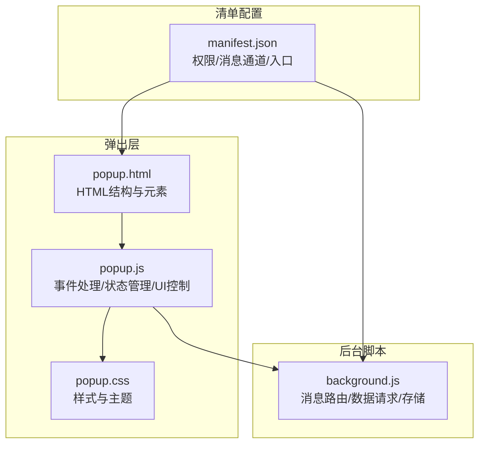
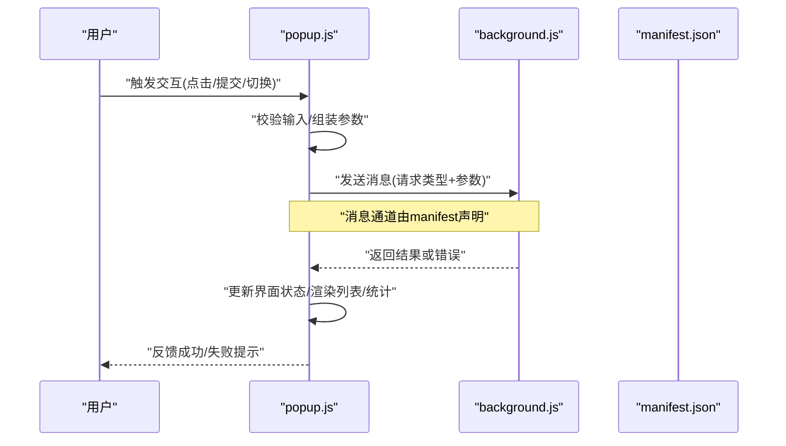
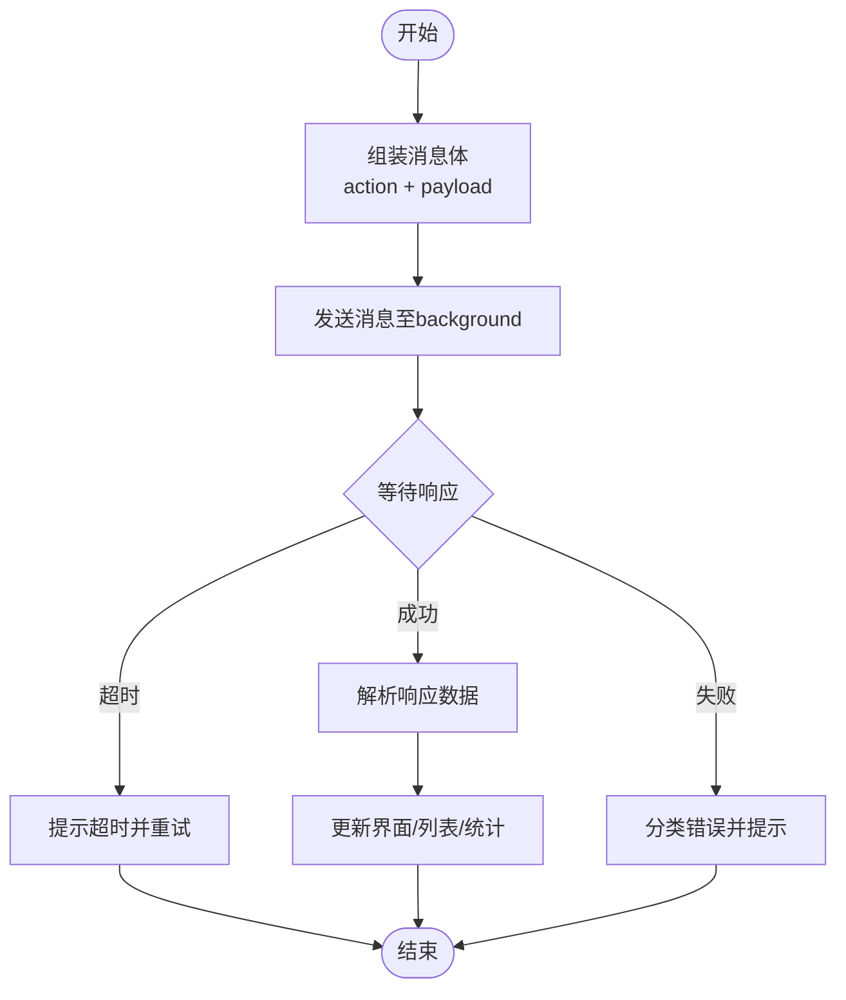
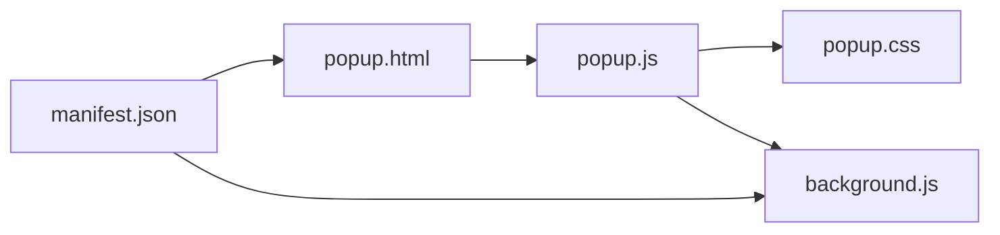

# Popup界面API

<cite>
**本文引用的文件**   
- [popup.html](file://extension/popup.html)
- [popup.js](file://extension/popup.js)
- [popup.css](file://extension/popup.css)
- [background.js](file://extension/background.js)
- [manifest.json](file://extension/manifest.json)
</cite>

## 目录
1. [简介](#简介)
2. [项目结构](#项目结构)
3. [核心组件](#核心组件)
4. [架构总览](#架构总览)
5. [详细组件分析](#详细组件分析)
6. [依赖关系分析](#依赖关系分析)
7. [性能考虑](#性能考虑)
8. [故障排查指南](#故障排查指南)
9. [结论](#结论)
10. [附录](#附录)

## 简介
本文件为Popup界面的JavaScript API参考文档，聚焦于用户交互处理、界面状态管理、与Background Script的通信接口以及UI组件自定义方法。目标是为实现“考勤记录”操作界面提供清晰、可操作的API说明与示例路径，帮助开发者快速构建友好、稳定的前端交互体验。

## 项目结构
本项目采用浏览器扩展的典型分层：
- 弹出层（Popup）：负责用户交互、DOM渲染、事件绑定与本地状态管理
- 后台脚本（Background）：负责数据请求、持久化存储、跨页面通信
- 清单配置（Manifest）：声明权限、注册消息通道、定义资源入口

图表来源
- [popup.html:1-200](file://extension/popup.html#L1-L200)
- [popup.js:1-300](file://extension/popup.js#L1-L300)
- [popup.css:1-200](file://extension/popup.css#L1-L200)
- [background.js:1-300](file://extension/background.js#L1-L300)
- [manifest.json:1-200](file://extension/manifest.json#L1-L200)

章节来源
- [popup.html:1-200](file://extension/popup.html#L1-L200)
- [popup.js:1-300](file://extension/popup.js#L1-L300)
- [popup.css:1-200](file://extension/popup.css#L1-L200)
- [background.js:1-300](file://extension/background.js#L1-L300)
- [manifest.json:1-200](file://extension/manifest.json#L1-L200)

## 核心组件
本节概述Popup侧的核心职责与对外暴露的API分组：
- 用户交互处理API：按钮点击、表单提交、开关切换等事件绑定与回调
- 界面状态管理API：考勤状态显示更新、历史记录数据绑定、统计信息计算展示
- 与Background通信API：数据请求、结果接收、错误提示的统一封装
- UI组件自定义方法：模态框控制、表格渲染、图表显示的调用方式

章节来源
- [popup.js:1-300](file://extension/popup.js#L1-L300)
- [popup.html:1-200](file://extension/popup.html#L1-L200)
- [popup.css:1-200](file://extension/popup.css#L1-L200)

## 架构总览
Popup通过消息机制与Background进行通信，完成数据获取、提交与同步；同时维护本地视图状态并驱动DOM更新。

图表来源
- [popup.js:1-300](file://extension/popup.js#L1-L300)
- [background.js:1-300](file://extension/background.js#L1-L300)
- [manifest.json:1-200](file://extension/manifest.json#L1-L200)

## 详细组件分析

### 用户交互处理API
- 按钮点击
  - 作用：触发查询、新增、删除、导出等操作
  - 典型流程：绑定click事件 -> 读取表单值 -> 校验 -> 调用通信API -> 更新UI
  - 示例路径：[popup.js:1-300](file://extension/popup.js#L1-L300)
- 表单提交
  - 作用：统一收集字段、阻止默认提交、进入异步流程
  - 典型流程：监听submit -> preventDefault -> 序列化表单 -> 校验 -> 调用通信API -> 刷新列表/统计
  - 示例路径：[popup.js:1-300](file://extension/popup.js#L1-L300)
- 状态切换
  - 作用：如“是否打卡”、“是否加班”等开关项
  - 典型流程：监听change -> 更新本地状态 -> 联动其他控件 -> 可选自动保存
  - 示例路径：[popup.js:1-300](file://extension/popup.js#L1-L300)

章节来源
- [popup.js:1-300](file://extension/popup.js#L1-L300)
- [popup.html:1-200](file://extension/popup.html#L1-L200)

### 界面状态管理API
- 考勤状态显示更新
  - 能力：根据当前时间/规则计算并展示“已打卡/未打卡/异常”等状态
  - 更新时机：页面初始化、定时轮询、收到后台通知后
  - 示例路径：[popup.js:1-300](file://extension/popup.js#L1-L300)
- 历史记录数据绑定
  - 能力：将后端返回的历史记录映射到表格行，支持分页/筛选
  - 更新时机：查询成功后、新增/删除后
  - 示例路径：[popup.js:1-300](file://extension/popup.js#L1-L300)
- 统计信息计算展示
  - 能力：汇总时长、次数、异常数等指标，并在顶部卡片中展示
  - 更新时机：数据变更时重新计算
  - 示例路径：[popup.js:1-300](file://extension/popup.js#L1-L300)

章节来源
- [popup.js:1-300](file://extension/popup.js#L1-L300)

### 与Background Script的通信接口
- 数据请求
  - 方法：通过消息通道向background发起请求，携带动作名与参数
  - 建议：统一封装sendRequest(action, payload)以复用
  - 示例路径：[popup.js:1-300](file://extension/popup.js#L1-L300), [background.js:1-300](file://extension/background.js#L1-L300)
- 结果接收
  - 方法：监听响应消息，区分成功/失败分支，更新UI
  - 建议：使用Promise封装，便于async/await调用
  - 示例路径：[popup.js:1-300](file://extension/popup.js#L1-L300), [background.js:1-300](file://extension/background.js#L1-L300)
- 错误提示
  - 方法：网络异常、业务错误、权限不足等分类提示
  - 建议：统一errorToMessage(error)转换为用户可读文案
  - 示例路径：[popup.js:1-300](file://extension/popup.js#L1-L300), [background.js:1-300](file://extension/background.js#L1-L300)

图表来源
- [popup.js:1-300](file://extension/popup.js#L1-L300)
- [background.js:1-300](file://extension/background.js#L1-L300)

章节来源
- [popup.js:1-300](file://extension/popup.js#L1-L300)
- [background.js:1-300](file://extension/background.js#L1-L300)

### UI组件自定义方法
- 模态框控制
  - 能力：打开/关闭、遮罩、ESC关闭、焦点管理
  - 调用方式：openModal(id)、closeModal(id)
  - 示例路径：[popup.js:1-300](file://extension/popup.js#L1-L300), [popup.css:1-200](file://extension/popup.css#L1-L200)
- 表格渲染
  - 能力：列定义、排序、分页、空态占位、加载骨架
  - 调用方式：renderTable(containerId, columns, data)
  - 示例路径：[popup.js:1-300](file://extension/popup.js#L1-L300)
- 图表显示
  - 能力：折线/柱状/饼图切换、数据聚合、响应式缩放
  - 调用方式：renderChart(containerId, type, dataset)
  - 示例路径：[popup.js:1-300](file://extension/popup.js#L1-L300)

章节来源
- [popup.js:1-300](file://extension/popup.js#L1-L300)
- [popup.css:1-200](file://extension/popup.css#L1-L200)

## 依赖关系分析
- 模块内聚
  - popup.js集中处理交互、状态与渲染，保持高内聚
  - background.js专注数据与外部系统交互，职责清晰
- 外部依赖
  - manifest.json声明消息通道与权限，是前后端通信契约
- 潜在耦合点
  - 消息协议（action名称、payload结构）需严格一致
  - DOM节点ID与选择器在HTML与JS间需保持一致

图表来源
- [popup.html:1-200](file://extension/popup.html#L1-L200)
- [popup.js:1-300](file://extension/popup.js#L1-L300)
- [popup.css:1-200](file://extension/popup.css#L1-L200)
- [background.js:1-300](file://extension/background.js#L1-L300)
- [manifest.json:1-200](file://extension/manifest.json#L1-L200)

章节来源
- [popup.html:1-200](file://extension/popup.html#L1-L200)
- [popup.js:1-300](file://extension/popup.js#L1-L300)
- [popup.css:1-200](file://extension/popup.css#L1-L200)
- [background.js:1-300](file://extension/background.js#L1-L300)
- [manifest.json:1-200](file://extension/manifest.json#L1-L200)

## 性能考虑
- 批量更新：合并多次DOM写入，减少重排重绘
- 防抖节流：对搜索、滚动、窗口resize等高频事件做节流
- 懒加载：长列表分页加载，按需渲染可视区域
- 缓存策略：对不频繁变化的统计数据做短期缓存
- 消息去重：相同action在短时间内避免重复发送

## 故障排查指南
- 常见问题
  - 消息未送达：检查manifest中消息通道声明与端口名一致性
  - 权限不足：确认manifest所需权限已开启
  - 数据不同步：核对payload字段与后台期望结构
  - 渲染错乱：检查DOM节点ID与CSS类名是否冲突
- 定位步骤
  - 在popup控制台打印消息发送与响应日志
  - 在background控制台打印接收与处理日志
  - 逐步缩小范围：先验证静态数据渲染，再引入异步请求

章节来源
- [popup.js:1-300](file://extension/popup.js#L1-L300)
- [background.js:1-300](file://extension/background.js#L1-L300)
- [manifest.json:1-200](file://extension/manifest.json#L1-L200)

## 结论
通过将交互、状态、渲染与通信解耦，并围绕统一的API组织代码，Popup界面能够稳定地支撑考勤记录的日常操作。建议在后续迭代中完善错误码规范、埋点与监控，进一步提升用户体验与可维护性。

## 附录
- 示例路径索引
  - 用户交互处理：[popup.js:1-300](file://extension/popup.js#L1-L300)
  - 界面状态管理：[popup.js:1-300](file://extension/popup.js#L1-L300)
  - 通信接口封装：[popup.js:1-300](file://extension/popup.js#L1-L300), [background.js:1-300](file://extension/background.js#L1-L300)
  - UI组件方法：[popup.js:1-300](file://extension/popup.js#L1-L300), [popup.css:1-200](file://extension/popup.css#L1-L200)
  - 清单与入口：[manifest.json:1-200](file://extension/manifest.json#L1-L200), [popup.html:1-200](file://extension/popup.html#L1-L200)