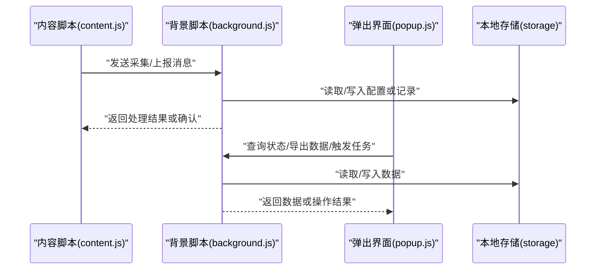

# Background脚本模块

<cite>
**本文引用的文件**   
- [background.js](file://extension/background.js)
- [content.js](file://extension/content.js)
- [popup.html](file://extension/popup.html)
- [popup.js](file://extension/popup.js)
- [manifest.json](file://extension/manifest.json)
</cite>

## 目录
1. [简介](#简介)
2. [项目结构](#项目结构)
3. [核心组件](#核心组件)
4. [架构总览](#架构总览)
5. [详细组件分析](#详细组件分析)
6. [依赖关系分析](#依赖关系分析)
7. [性能考虑](#性能考虑)
8. [故障排查指南](#故障排查指南)
9. [结论](#结论)
10. [附录](#附录) 

## 简介
本章节聚焦于浏览器扩展的Background脚本模块，阐述其作为“扩展控制器”的职责与实现要点：消息路由、状态管理、本地存储协调、与Content Script和Popup界面的通信协议、后台任务调度与异常处理。文档旨在帮助开发者快速理解并维护该模块，同时为后续功能扩展提供清晰的接口约定与最佳实践。

## 项目结构
本项目采用按功能域组织的方式，核心扩展代码位于 extension 目录，其中 background.js 承担扩展控制器的职责；content.js 负责页面注入与采集；popup.html/popup.js 提供用户界面与交互；manifest.json 声明权限与入口。

```mermaid
graph TB
subgraph "扩展"
BG["background.js<br/>扩展控制器"]
CT["content.js<br/>内容脚本"]
PP["popup.js<br/>弹出界面逻辑"]
PH["popup.html<br/>弹出界面结构"]
MF["manifest.json<br/>扩展清单"]
end
MF --> BG
BG <- --> CT
BG <- --> PP
PP --> PH
```

图表来源
- [background.js](file://extension/background.js)
- [content.js](file://extension/content.js)
- [popup.js](file://extension/popup.js)
- [popup.html](file://extension/popup.html)
- [manifest.json](file://extension/manifest.json)

章节来源
- [manifest.json](file://extension/manifest.json)
- [background.js](file://extension/background.js)
- [content.js](file://extension/content.js)
- [popup.js](file://extension/popup.js)
- [popup.html](file://extension/popup.html)

## 核心组件
- 扩展控制器（Background）
  - 职责：统一的消息路由、全局状态管理、持久化数据读写协调、跨上下文通信、后台任务调度与错误处理。
- 内容脚本（Content Script）
  - 职责：在目标页面中执行，采集业务数据，向Background上报事件或请求。
- 弹出界面（Popup）
  - 职责：展示状态与结果，触发操作，通过Background访问持久化数据与发起网络请求。

章节来源
- [background.js](file://extension/background.js)
- [content.js](file://extension/content.js)
- [popup.js](file://extension/popup.js)

## 架构总览
Background作为中心枢纽，连接Content Script与Popup，并通过本地存储进行数据持久化。典型交互流程如下：



图表来源
- [background.js](file://extension/background.js)
- [content.js](file://extension/content.js)
- [popup.js](file://extension/popup.js)

## 详细组件分析

### 背景脚本（扩展控制器）
- 角色定位
  - 消息路由器：接收来自Content Script与Popup的消息，根据类型分发到对应处理器。
  - 状态管理器：维护运行时状态（如是否启用采集、上次同步时间等），并在必要时持久化。
  - 存储协调器：封装对本地存储的读写，保证数据结构一致性与幂等性。
  - 任务调度器：基于定时器或事件驱动，定期执行采集汇总、清理过期数据等后台任务。
  - 异常处理中心：捕获并规范化错误，向上游返回可诊断的错误码与提示。

- 关键能力
  - 消息路由表：以消息类型为键，映射到具体处理函数，支持异步响应。
  - 状态机：定义有限状态集合（如空闲、采集、同步、错误），避免竞态条件。
  - 存储策略：区分配置项与业务记录，设置过期时间与版本迁移钩子。
  - 任务队列：串行化耗时任务，防止重复执行与资源争用。
  - 错误分类：网络错误、权限错误、数据校验错误、未知错误，分别给出不同恢复策略。

- 接口约定（示例）
  - 消息类型
    - content_to_bg_collect：由内容脚本发起，携带页面上下文与待采集数据摘要。
    - bg_to_content_ack：背景脚本对采集请求的确认或拒绝。
    - popup_to_bg_query：弹出界面查询当前状态或历史数据。
    - bg_to_popup_result：返回查询结果或操作反馈。
  - 通用字段
    - type：消息类型字符串
    - payload：业务负载对象
    - traceId：链路追踪ID，便于日志关联
    - timestamp：消息时间戳
  - 错误格式
    - code：错误码（如 NETWORK_ERROR、PERMISSION_DENIED、INVALID_PAYLOAD）
    - message：人类可读描述
    - details：可选的诊断信息

- 本地存储设计（建议）
  - 配置区
    - 字段：开关、阈值、频率、白名单域名等
    - 策略：首次启动初始化默认值，升级时做兼容迁移
  - 记录区
    - 字段：记录ID、来源页面、时间戳、摘要、状态
    - 策略：分页/分片存储，定期归档与清理
  - 元数据区
    - 字段：版本号、上次同步时间、任务状态
    - 策略：原子更新，失败回滚

- 后台任务调度（建议）
  - 触发方式：定时轮询、页面可见性变化、用户显式触发
  - 执行模型：单例任务锁 + 重试退避 + 超时保护
  - 监控指标：成功率、平均耗时、失败原因分布

- 异常处理方案（建议）
  - 捕获范围：网络请求、存储读写、解析序列化、外部API调用
  - 降级策略：离线缓存、跳过非关键步骤、保留最小可用状态
  - 诊断输出：结构化日志、traceId透传、错误上报（可选）

章节来源
- [background.js](file://extension/background.js)

### 内容脚本（Content Script）
- 职责
  - 监听页面行为与DOM变化，提取必要信息
  - 将采集结果打包为消息发送给Background
  - 接收Background指令，执行页面内动作（如高亮、插入标记）
- 通信协议
  - 使用标准消息通道，遵循统一的type/payload/traceId/timestamp约定
  - 对超时与不可达场景进行重试与告警
- 错误处理
  - 页面加载失败、权限不足、数据缺失时的容错与回退

章节来源
- [content.js](file://extension/content.js)

### 弹出界面（Popup）
- 职责
  - 展示当前状态、历史记录与统计概览
  - 提供手动触发采集、导出、重置等操作入口
- 通信协议
  - 通过Background查询/写入数据，遵循统一消息格式
  - 对网络与存储异常进行友好提示
- 用户体验
  - 加载态、空态、错误态的清晰呈现
  - 操作成功/失败的即时反馈

章节来源
- [popup.js](file://extension/popup.js)
- [popup.html](file://extension/popup.html)

## 依赖关系分析
- 内部依赖
  - Background依赖本地存储API与消息通道
  - Content Script依赖页面环境与消息通道
  - Popup依赖Background与UI渲染
- 外部依赖
  - 浏览器扩展API（消息、存储、定时器等）
  - 目标网站的结构与接口（仅用于数据采集，不直接耦合）

```mermaid
graph LR
MF["manifest.json"] --> BG["background.js"]
BG --> ST["本地存储"]
BG <- --> CT["content.js"]
BG <- --> PP["popup.js"]
PP --> UI["popup.html"]
```

图表来源
- [manifest.json](file://extension/manifest.json)
- [background.js](file://extension/background.js)
- [content.js](file://extension/content.js)
- [popup.js](file://extension/popup.js)
- [popup.html](file://extension/popup.html)

章节来源
- [manifest.json](file://extension/manifest.json)
- [background.js](file://extension/background.js)
- [content.js](file://extension/content.js)
- [popup.js](file://extension/popup.js)
- [popup.html](file://extension/popup.html)

## 性能考虑
- 消息批处理：合并高频小消息，降低通道开销
- 存储分区：按日期/主题分桶，减少单次读写体积
- 任务去重：相同任务的幂等执行，避免重复计算
- 懒加载：按需初始化模块，缩短启动时间
- 内存回收：及时释放大对象引用，避免泄漏

## 故障排查指南
- 常见问题
  - 消息未到达：检查权限声明与消息类型匹配
  - 数据不一致：核对存储版本与迁移逻辑
  - 任务卡死：查看任务锁与超时配置
  - 页面采集失败：验证选择器与白名单规则
- 诊断手段
  - 使用traceId串联日志
  - 打印关键路径的状态快照
  - 模拟错误分支，覆盖边界用例

章节来源
- [background.js](file://extension/background.js)
- [content.js](file://extension/content.js)
- [popup.js](file://extension/popup.js)

## 结论
Background脚本作为扩展控制器，承担了消息路由、状态管理、存储协调与任务调度的核心职责。通过明确的通信协议与错误处理机制，确保Content Script与Popup之间的稳定协作。合理的本地存储设计与后台任务策略，有助于提升整体性能与可维护性。

## 附录

### 关键函数接口文档（示例）
- 消息路由
  - 输入：{type, payload, traceId, timestamp}
  - 输出：Promise<{code, message, data}>
  - 说明：根据type分发至处理器，统一包装响应
- 状态查询
  - 输入：无
  - 输出：Promise<{status, lastSync, version}>
  - 说明：返回当前运行状态与元数据
- 数据存储
  - 输入：{key, value, ttl?}
  - 输出：Promise<boolean>
  - 说明：写入配置或记录，支持过期时间
- 任务调度
  - 输入：{taskName, schedule, handler}
  - 输出：Promise<void>
  - 说明：注册定时任务，自动去重与重试

### 使用示例（概念）
- 内容脚本采集
  - 构造采集消息，附带页面标识与摘要
  - 等待Background确认，失败则重试或降级
- 弹出界面导出
  - 向Background发起导出请求
  - 显示进度与最终下载链接

[本节为概念性说明，无需源码引用]