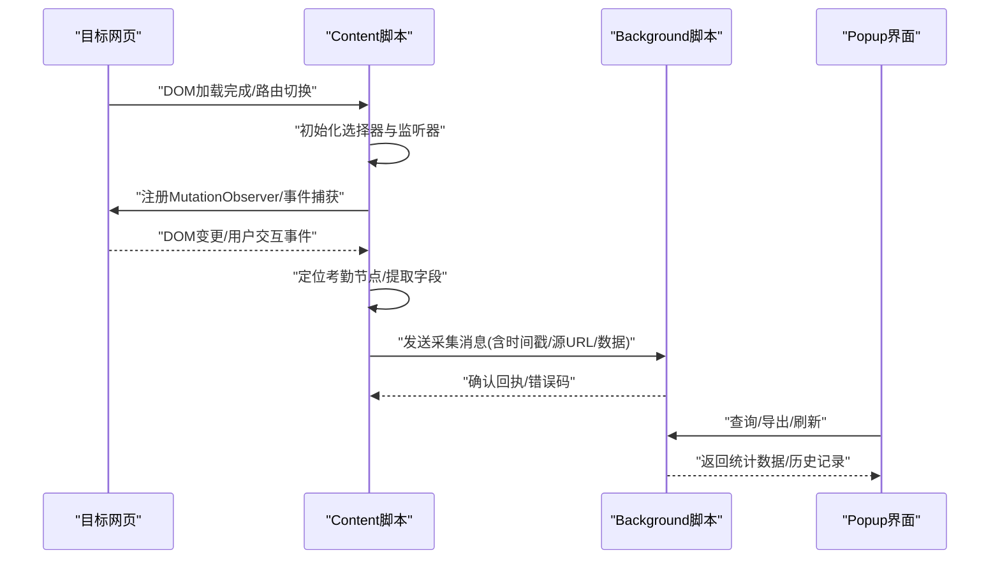
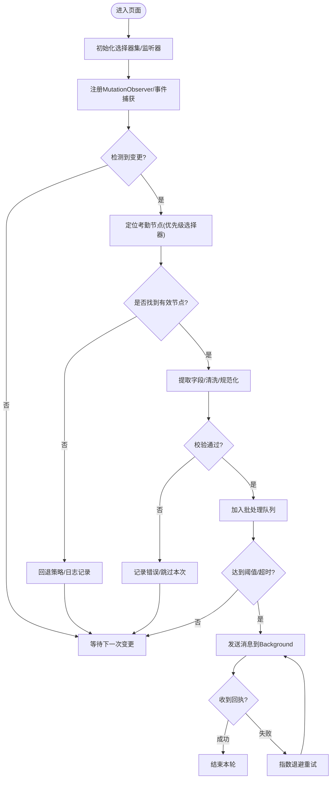
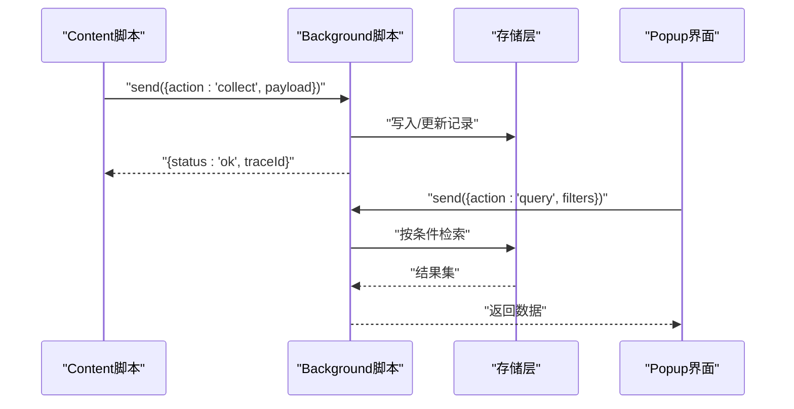
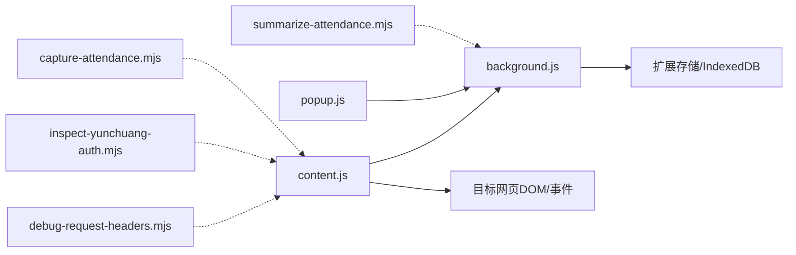

# Content脚本模块

<cite>
**本文引用的文件**   
- [extension/content.js](file://extension/content.js)
- [extension/background.js](file://extension/background.js)
- [extension/manifest.json](file://extension/manifest.json)
- [extension/popup.html](file://extension/popup.html)
- [extension/popup.js](file://extension/popup.js)
- [scripts/capture-attendance.mjs](file://scripts/capture-attendance.mjs)
- [scripts/debug-request-headers.mjs](file://scripts/debug-request-headers.mjs)
- [scripts/inspect-yunchuang-auth.mjs](file://scripts/inspect-yunchuang-auth.mjs)
- [scripts/summarize-attendance.mjs](file://scripts/summarize-attendance.mjs)
</cite>

## 目录
1. [简介](#简介)
2. [项目结构](#项目结构)
3. [核心组件](#核心组件)
4. [架构总览](#架构总览)
5. [详细组件分析](#详细组件分析)
6. [依赖关系分析](#依赖关系分析)
7. [性能考虑](#性能考虑)
8. [故障排查指南](#故障排查指南)
9. [结论](#结论)
10. [附录](#附录)

## 简介
本章节聚焦于Content脚本在浏览器扩展中的职责：在目标网页中执行页面操作与数据采集，识别考勤相关元素，监听DOM变化并捕获事件，提取结构化数据并通过消息机制与Background脚本通信。文档同时涵盖安全注入、性能优化策略以及面对目标网站结构变更时的兼容方案。

## 项目结构
本项目采用“扩展+辅助脚本”的布局：
- extension：浏览器扩展主体，包含Content脚本、Background脚本、清单与弹出界面资源。
- scripts：用于调试、抓包、认证流程检查与汇总分析的Node侧工具脚本。

```mermaid
graph TB
subgraph "扩展"
M["manifest.json"]
CJS["content.js"]
BJS["background.js"]
POP_HTML["popup.html"]
POP_JS["popup.js"]
end
subgraph "辅助脚本"
CAP["capture-attendance.mjs"]
DBG["debug-request-headers.mjs"]
AUTH["inspect-yunchuang-auth.mjs"]
SUM["summarize-attendance.mjs"]
end
M --> CJS
M --> BJS
M --> POP_HTML
POP_HTML --> POP_JS
CJS < --> BJS
CAP -.-> CJS
DBG -.-> CJS
AUTH -.-> CJS
SUM -.-> CJS
```

图表来源
- [extension/manifest.json](file://extension/manifest.json)
- [extension/content.js](file://extension/content.js)
- [extension/background.js](file://extension/background.js)
- [extension/popup.html](file://extension/popup.html)
- [extension/popup.js](file://extension/popup.js)
- [scripts/capture-attendance.mjs](file://scripts/capture-attendance.mjs)
- [scripts/debug-request-headers.mjs](file://scripts/debug-request-headers.mjs)
- [scripts/inspect-yunchuang-auth.mjs](file://scripts/inspect-yunchuang-auth.mjs)
- [scripts/summarize-attendance.mjs](file://scripts/summarize-attendance.mjs)

章节来源
- [extension/manifest.json](file://extension/manifest.json)
- [extension/content.js](file://extension/content.js)
- [extension/background.js](file://extension/background.js)
- [extension/popup.html](file://extension/popup.html)
- [extension/popup.js](file://extension/popup.js)
- [scripts/capture-attendance.mjs](file://scripts/capture-attendance.mjs)
- [scripts/debug-request-headers.mjs](file://scripts/debug-request-headers.mjs)
- [scripts/inspect-yunchuang-auth.mjs](file://scripts/inspect-yunchuang-auth.mjs)
- [scripts/summarize-attendance.mjs](file://scripts/summarize-attendance.mjs)

## 核心组件
- Content脚本（content.js）
  - 负责在目标页面注入逻辑，监听DOM变化与用户交互事件，定位考勤相关UI节点，提取数据并封装为统一消息体，通过runtime.sendMessage与Background脚本通信。
  - 提供重试与容错机制，适配不同站点结构与动态渲染场景。
- Background脚本（background.js）
  - 接收来自Content脚本的消息，进行持久化存储、聚合统计或转发给Popup界面。
  - 管理跨标签页状态与定时任务（如周期性拉取或清理）。
- Popup界面（popup.html + popup.js）
  - 展示采集结果、触发手动采集、查看历史与导出功能。
- 辅助脚本（scripts/*.mjs）
  - capture-attendance.mjs：用于离线抓取与分析考勤数据样例。
  - debug-request-headers.mjs：用于调试网络请求头，辅助定位认证与鉴权问题。
  - inspect-yunchuang-auth.mjs：针对特定系统（云创）的认证流程检查。
  - summarize-attendance.mjs：对采集数据进行汇总与报表生成。

章节来源
- [extension/content.js](file://extension/content.js)
- [extension/background.js](file://extension/background.js)
- [extension/popup.html](file://extension/popup.html)
- [extension/popup.js](file://extension/popup.js)
- [scripts/capture-attendance.mjs](file://scripts/capture-attendance.mjs)
- [scripts/debug-request-headers.mjs](file://scripts/debug-request-headers.mjs)
- [scripts/inspect-yunchuang-auth.mjs](file://scripts/inspect-yunchuang-auth.mjs)
- [scripts/summarize-attendance.mjs](file://scripts/summarize-attendance.mjs)

## 架构总览
Content脚本作为页面内执行者，承担“观察—解析—上报”的职责；Background脚本作为中枢，负责“接收—处理—持久化”。Popup作为前端控制台，提供可视化与交互入口。



图表来源
- [extension/content.js](file://extension/content.js)
- [extension/background.js](file://extension/background.js)
- [extension/popup.html](file://extension/popup.html)
- [extension/popup.js](file://extension/popup.js)

## 详细组件分析

### Content脚本：页面操作与数据采集
- DOM监听机制
  - 使用MutationObserver监听目标容器节点的子树变化，避免全量轮询带来的性能开销。
  - 结合事件捕获阶段（bubbles=false, capture=true）拦截关键交互（点击、输入、提交），确保在框架重绘前获取原始值。
- 考勤元素识别策略
  - 优先基于稳定语义标识（aria-*、data-*、role）与可访问性属性定位。
  - 回退到文本匹配与正则表达式，但限制匹配范围至最近父容器以减少误判。
  - 支持多套选择器集合，按优先级尝试，失败时记录诊断信息以便后续适配。
- 数据提取算法与解析逻辑
  - 将页面片段映射为中间模型（如日期、工时、任务描述、来源URL等），并进行类型校验与去噪。
  - 对富文本或HTML片段进行清洗，去除样式与不可见字符，保留必要元数据。
  - 对时间与时区进行规范化，保证跨站点一致性。
- 与Background脚本的消息传递
  - 使用统一的message schema，包含：action、timestamp、sourceUrl、payload、traceId。
  - 批量上报与节流：当短时间内多次变更时合并为批次消息，降低通信频率。
  - 错误码与重试：对网络异常或解析失败进行指数退避重试，并附带上下文快照。
- 页面注入的安全考虑
  - 仅读取必要节点，不修改第三方脚本变量或全局对象。
  - 避免eval与动态函数构造，所有字符串拼接严格转义。
  - 对上传到后台的数据进行最小化脱敏（如隐藏敏感ID或注释内容）。
- 性能优化建议
  - 使用requestIdleCallback或微任务批处理，避免阻塞主线程。
  - 对长列表使用IntersectionObserver懒加载检测，减少无关节点扫描。
  - 缓存已解析的选择器与DOM引用，失效条件明确（如路由切换或容器重建）。



图表来源
- [extension/content.js](file://extension/content.js)

章节来源
- [extension/content.js](file://extension/content.js)

### Background脚本：消息处理与持久化
- 消息路由
  - 根据action分发到对应处理器（采集、查询、导出、配置更新）。
  - 维护会话级上下文（当前标签页、上次更新时间、错误计数）。
- 数据存储与聚合
  - 使用storage API或IndexedDB进行持久化，支持分页与索引查询。
  - 提供聚合接口（按日/周/月汇总、按任务维度统计）。
- 与Popup的协作
  - 暴露查询与导出接口，Popup按需拉取最新数据。
  - 支持推送式更新（通过tabs.sendMessage或广播）以刷新UI。



图表来源
- [extension/background.js](file://extension/background.js)
- [extension/popup.js](file://extension/popup.js)

章节来源
- [extension/background.js](file://extension/background.js)
- [extension/popup.js](file://extension/popup.js)

### Popup界面：展示与交互
- 提供采集结果概览、筛选与导出按钮。
- 支持手动触发采集（向Content脚本发送指令）、查看历史与删除记录。
- 与Background保持双向通信，实现实时刷新。

章节来源
- [extension/popup.html](file://extension/popup.html)
- [extension/popup.js](file://extension/popup.js)

### 辅助脚本：调试与汇总
- capture-attendance.mjs：离线抓取样例数据，便于验证解析逻辑与回归测试。
- debug-request-headers.mjs：打印请求头与Cookie，辅助定位认证与跨域问题。
- inspect-yunchuang-auth.mjs：针对云创系统的登录态与令牌生命周期检查。
- summarize-attendance.mjs：对采集数据进行汇总，输出报表或CSV。

章节来源
- [scripts/capture-attendance.mjs](file://scripts/capture-attendance.mjs)
- [scripts/debug-request-headers.mjs](file://scripts/debug-request-headers.mjs)
- [scripts/inspect-yunchuang-auth.mjs](file://scripts/inspect-yunchuang-auth.mjs)
- [scripts/summarize-attendance.mjs](file://scripts/summarize-attendance.mjs)

## 依赖关系分析
- Content脚本依赖目标页面的DOM结构与事件流，需具备较强的选择器鲁棒性与降级能力。
- Background脚本依赖扩展的storage与消息通道，需保证幂等与事务性写入。
- Popup依赖Background提供的查询与导出接口，需处理异步与错误边界。
- 辅助脚本独立运行，主要用于开发与运维阶段的问题定位与数据分析。



图表来源
- [extension/content.js](file://extension/content.js)
- [extension/background.js](file://extension/background.js)
- [extension/popup.js](file://extension/popup.js)
- [scripts/capture-attendance.mjs](file://scripts/capture-attendance.mjs)
- [scripts/debug-request-headers.mjs](file://scripts/debug-request-headers.mjs)
- [scripts/inspect-yunchuang-auth.mjs](file://scripts/inspect-yunchuang-auth.mjs)
- [scripts/summarize-attendance.mjs](file://scripts/summarize-attendance.mjs)

章节来源
- [extension/content.js](file://extension/content.js)
- [extension/background.js](file://extension/background.js)
- [extension/popup.js](file://extension/popup.js)
- [scripts/capture-attendance.mjs](file://scripts/capture-attendance.mjs)
- [scripts/debug-request-headers.mjs](file://scripts/debug-request-headers.mjs)
- [scripts/inspect-yunchuang-auth.mjs](file://scripts/inspect-yunchuang-auth.mjs)
- [scripts/summarize-attendance.mjs](file://scripts/summarize-attendance.mjs)

## 性能考虑
- 监听粒度控制：仅监听必要的容器节点，避免全局MutationObserver导致的性能抖动。
- 事件捕获时机：在捕获阶段拦截，减少二次渲染与重排的影响。
- 批处理与节流：合并高频变更，设置合理的时间窗口与数量阈值。
- 选择器缓存：对稳定的选择器与DOM引用进行缓存，并在容器重建时失效。
- 内存管理：及时移除不再使用的监听器与闭包引用，防止泄漏。
- 主线程友好：使用Web Worker或requestIdleCallback处理耗时计算（如需）。

[本节为通用指导，无需具体文件来源]

## 故障排查指南
- 无法识别考勤元素
  - 检查选择器优先级与回退策略是否生效，查看日志中的traceId与上下文快照。
  - 使用inspect-yunchuang-auth.mjs与debug-request-headers.mjs定位认证与网络问题。
- 数据缺失或字段错位
  - 核对中间模型的字段映射与清洗规则，确认时间与时区规范化是否正确。
  - 对比capture-attendance.mjs生成的样例，验证解析逻辑。
- 消息未到达Background
  - 确认manifest中permissions与host匹配，检查Content与Background的端口连接状态。
  - 查看回执与错误码，必要时启用重试与降级路径。
- Popup无数据或刷新缓慢
  - 检查Background的查询接口与索引，确认存储层可用性与分页参数。
  - 增加增量更新与缓存策略，减少全量拉取。

章节来源
- [extension/content.js](file://extension/content.js)
- [extension/background.js](file://extension/background.js)
- [extension/popup.js](file://extension/popup.js)
- [scripts/debug-request-headers.mjs](file://scripts/debug-request-headers.mjs)
- [scripts/inspect-yunchuang-auth.mjs](file://scripts/inspect-yunchuang-auth.mjs)
- [scripts/capture-attendance.mjs](file://scripts/capture-attendance.mjs)

## 结论
Content脚本通过稳健的DOM监听与事件捕获策略，结合多层选择器与回退机制，实现对考勤相关元素的可靠识别与数据提取。通过统一的消息协议与批处理优化，Content与Background之间实现了高效、安全的通信。配合Popup与辅助脚本，形成从采集、处理到可视化的完整闭环。面对目标网站结构变化，建议持续维护选择器集与解析规则，并通过辅助脚本快速定位与回归验证。

[本节为总结性内容，无需具体文件来源]

## 附录
- 常见页面结构变化的兼容处理方案
  - 引入多套选择器集合，按稳定性排序，失败时自动降级。
  - 基于文本与正则的模糊匹配，限定作用域以减少误判。
  - 对动态渲染（SPA）场景，监听路由变化与容器重建事件，重置监听器与缓存。
  - 建立“灰度选择器”机制，逐步替换不稳定选择器，并提供开关与回滚。
  - 使用辅助脚本定期巡检关键节点是否存在，提前预警结构变更风险。

[本节为通用指导，无需具体文件来源]