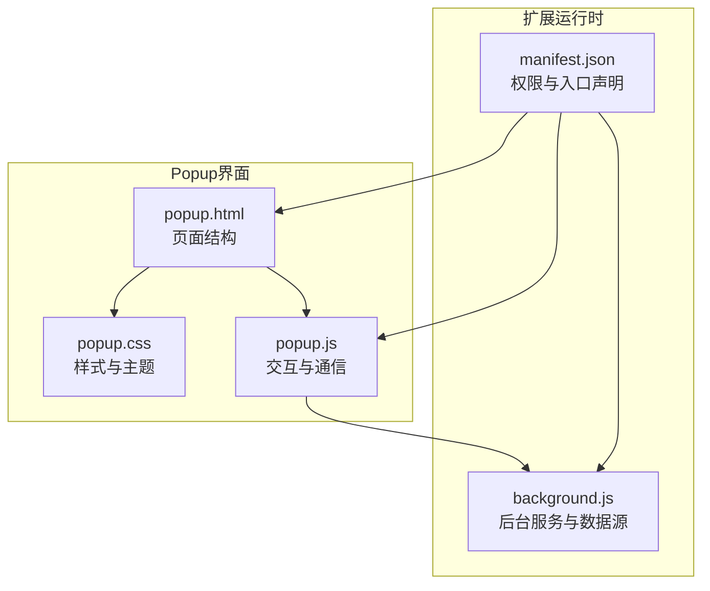
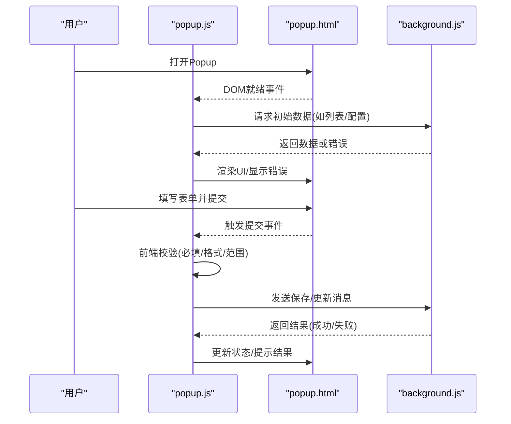
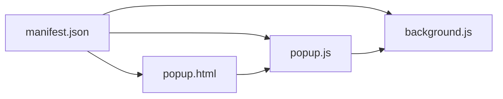

# Popup界面模块

<cite>
**本文引用的文件**   
- [popup.html](file://extension/popup.html)
- [popup.css](file://extension/popup.css)
- [popup.js](file://extension/popup.js)
- [background.js](file://extension/background.js)
- [manifest.json](file://extension/manifest.json)
</cite>

## 目录
1. [简介](#简介)
2. [项目结构](#项目结构)
3. [核心组件](#核心组件)
4. [架构总览](#架构总览)
5. [详细组件分析](#详细组件分析)
6. [依赖分析](#依赖分析)
7. [性能考虑](#性能考虑)
8. [故障排查指南](#故障排查指南)
9. [结论](#结论)
10. [附录](#附录)

## 简介
本章节聚焦于浏览器扩展的Popup界面模块，涵盖UI设计与交互逻辑、HTML结构与CSS样式组织（含响应式与主题适配）、JavaScript事件处理与用户交互（表单验证与状态更新）、与Background脚本的数据同步机制（实时刷新与缓存策略）、界面组件复用模式与自定义配置选项，以及用户体验优化建议与可访问性支持。目标是帮助开发者快速理解并高效维护该模块。

## 项目结构
Popup模块由三个核心文件组成：
- HTML页面：定义弹窗布局与DOM结构
- CSS样式：负责视觉呈现、响应式布局与主题适配
- JavaScript逻辑：处理用户交互、表单校验、状态管理与消息通信

图表来源
- [popup.html](file://extension/popup.html)
- [popup.css](file://extension/popup.css)
- [popup.js](file://extension/popup.js)
- [background.js](file://extension/background.js)
- [manifest.json](file://extension/manifest.json)

章节来源
- [popup.html](file://extension/popup.html)
- [popup.css](file://extension/popup.css)
- [popup.js](file://extension/popup.js)
- [background.js](file://extension/background.js)
- [manifest.json](file://extension/manifest.json)

## 核心组件
- 页面容器与区域划分
  - 头部信息区：展示标题、当前时间或状态提示
  - 主内容区：表单输入、列表展示、操作按钮等
  - 底部辅助区：帮助链接、版本信息、设置入口
- 表单控件
  - 文本输入、下拉选择、日期选择、开关等
  - 统一的错误提示与禁用态样式
- 列表与卡片
  - 条目渲染、分页或滚动加载、空态占位
- 通知与反馈
  - 成功/失败提示、加载指示器、确认对话框
- 主题与响应式
  - 基于CSS变量实现明暗主题切换
  - 使用媒体查询适配不同屏幕尺寸

章节来源
- [popup.html](file://extension/popup.html)
- [popup.css](file://extension/popup.css)
- [popup.js](file://extension/popup.js)

## 架构总览
Popup通过消息机制与Background进行双向通信，实现数据获取、提交与状态同步。

图表来源
- [popup.js](file://extension/popup.js)
- [background.js](file://extension/background.js)
- [popup.html](file://extension/popup.html)

## 详细组件分析

### HTML结构与语义化
- 使用语义化标签组织页面区块，提升可读性与可访问性
- 为关键交互元素提供明确的aria属性与键盘导航支持
- 将动态内容区域与静态模板分离，便于JS注入与复用

章节来源
- [popup.html](file://extension/popup.html)

### CSS样式组织与主题适配
- 采用CSS变量集中管理颜色、间距、圆角、阴影等设计令牌
- 通过媒体查询实现响应式布局，确保在窄屏下仍可良好使用
- 提供明/暗主题切换能力，依据系统偏好或用户选择自动应用

章节来源
- [popup.css](file://extension/popup.css)

### JavaScript交互与状态管理
- 事件绑定与委托：对动态生成的列表项使用事件委托，减少内存占用
- 表单验证：即时校验与提交前二次校验结合，统一错误提示
- 状态更新：以最小变更方式更新DOM，避免重排重绘
- 消息通信：封装与Background的消息收发，统一错误处理与重试策略

章节来源
- [popup.js](file://extension/popup.js)

### 与Background的数据同步机制
- 初始化阶段：从Background拉取基础数据并缓存到本地存储
- 实时更新：监听相关消息或定时轮询，增量更新UI
- 缓存策略：区分热数据与冷数据，设置过期时间与失效条件
- 冲突处理：当网络或后台异常时，优先回退至缓存并提示用户

章节来源
- [popup.js](file://extension/popup.js)
- [background.js](file://extension/background.js)

### 组件复用模式与自定义配置
- 组件抽象：将常用UI块（如表单行、列表项、提示条）抽象为可复用单元
- 配置对象：通过传入配置控制组件行为（如是否必填、默认值、格式化规则）
- 主题注入：组件读取全局CSS变量，自动适配当前主题

章节来源
- [popup.js](file://extension/popup.js)
- [popup.css](file://extension/popup.css)

### 用户体验优化建议
- 首屏加载：骨架屏与渐进式渲染，降低感知延迟
- 交互反馈：按钮点击态、加载动画、成功/失败提示
- 容错体验：断网提示、重试按钮、友好错误码说明
- 输入辅助：占位符、输入掩码、自动补全、撤销/重做

[本节为通用建议，不直接分析具体文件]

### 可访问性支持
- 键盘可达：所有交互可通过Tab键完成，焦点顺序合理
- 屏幕阅读器：为图标与图片提供替代文本，为状态变化提供ARIA通知
- 对比度与字号：满足WCAG对比度要求，支持系统字体缩放
- 错误定位：将错误信息与对应控件关联，便于读屏器播报

章节来源
- [popup.html](file://extension/popup.html)
- [popup.css](file://extension/popup.css)
- [popup.js](file://extension/popup.js)

## 依赖分析
Popup模块依赖Manifest声明的权限与入口点，并通过消息通道与Background协作。

图表来源
- [manifest.json](file://extension/manifest.json)
- [popup.js](file://extension/popup.js)
- [popup.html](file://extension/popup.html)
- [background.js](file://extension/background.js)

章节来源
- [manifest.json](file://extension/manifest.json)
- [popup.js](file://extension/popup.js)
- [popup.html](file://extension/popup.html)
- [background.js](file://extension/background.js)

## 性能考虑
- 减少DOM操作：批量更新节点，避免频繁插入删除
- 事件委托：对大量动态元素使用事件委托，降低内存占用
- 防抖与节流：对搜索、滚动、窗口resize等高频事件进行限流
- 懒加载：按需渲染长列表，仅展示可视区域
- 缓存命中：优先读取本地缓存，必要时再向Background请求

[本节为通用指导，不直接分析具体文件]

## 故障排查指南
- 无法打开Popup
  - 检查Manifest中Popup入口是否正确声明
  - 确认页面资源路径与权限
- 数据未更新
  - 查看消息发送与接收是否匹配
  - 检查Background是否抛出异常或返回错误
- 表单提交失败
  - 核对前端校验规则与后端约束
  - 观察网络请求与错误提示
- 主题不生效
  - 确认CSS变量是否被正确覆盖
  - 检查媒体查询与系统偏好检测逻辑

章节来源
- [popup.js](file://extension/popup.js)
- [background.js](file://extension/background.js)
- [popup.css](file://extension/popup.css)
- [popup.html](file://extension/popup.html)
- [manifest.json](file://extension/manifest.json)

## 结论
Popup模块通过清晰的HTML/CSS/JS分层与消息通信机制，实现了良好的可扩展性与可维护性。借助CSS变量与组件化思想，能够快速适配主题与复用功能；通过合理的缓存与实时更新策略，提升了用户体验。建议在后续迭代中持续完善可访问性与性能优化，确保在不同设备与场景下的稳定表现。

[本节为总结性内容，不直接分析具体文件]

## 附录
- 术语
  - Popup：浏览器扩展的弹出界面
  - Background：扩展后台脚本，负责持久化数据与跨页面通信
  - 消息通信：扩展内各脚本间通过API进行异步消息传递
- 参考
  - 浏览器扩展开发文档
  - WCAG可访问性标准

[本节为补充信息，不直接分析具体文件]