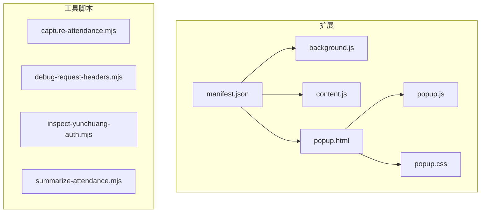
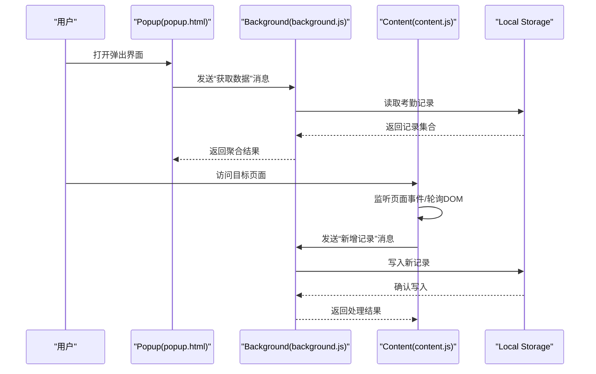
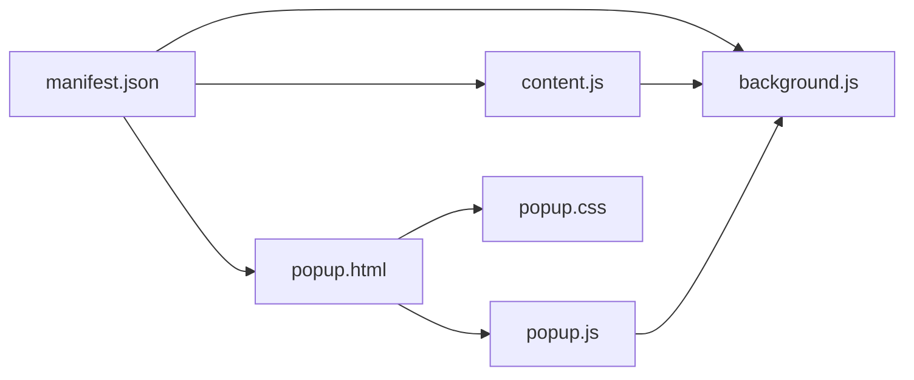
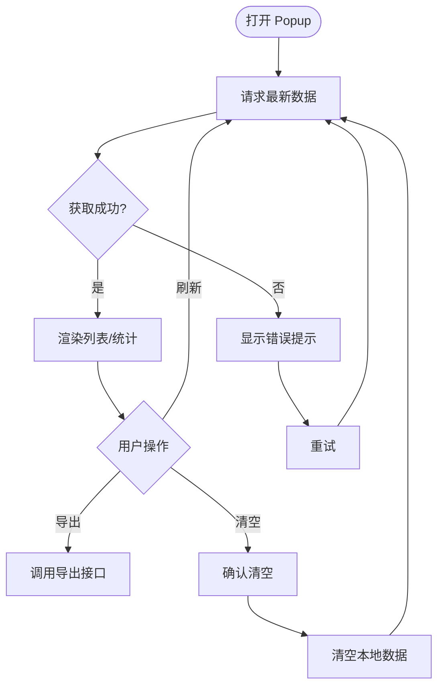

# 代码结构说明

<cite>
**本文引用的文件**   
- [extension/manifest.json](file://extension/manifest.json)
- [extension/background.js](file://extension/background.js)
- [extension/content.js](file://extension/content.js)
- [extension/popup.html](file://extension/popup.html)
- [extension/popup.js](file://extension/popup.js)
- [extension/popup.css](file://extension/popup.css)
- [scripts/capture-attendance.mjs](file://scripts/capture-attendance.mjs)
- [scripts/debug-request-headers.mjs](file://scripts/debug-request-headers.mjs)
- [scripts/inspect-yunchuang-auth.mjs](file://scripts/inspect-yunchuang-auth.mjs)
- [scripts/summarize-attendance.mjs](file://scripts/summarize-attendance.mjs)
</cite>

## 目录
1. [简介](#简介)
2. [项目结构](#项目结构)
3. [核心组件](#核心组件)
4. [架构总览](#架构总览)
5. [详细组件分析](#详细组件分析)
6. [依赖关系分析](#依赖关系分析)
7. [性能考虑](#性能考虑)
8. [故障排查指南](#故障排查指南)
9. [结论](#结论)
10. [附录](#附录) 

## 简介
本仓库是一个浏览器扩展，用于记录与考勤相关的工时数据。扩展采用标准的 Chrome Extension 架构，包含后台脚本（Background Script）、内容脚本（Content Script）和弹出界面（Popup）。此外，提供若干 Node.js 辅助脚本，用于在本地进行数据采集、调试与汇总。

整体目标：
- 通过 Content Script 捕获页面中的考勤相关数据
- 通过 Background Script 管理持久化存储与跨上下文通信
- 通过 Popup 提供用户交互与数据查看能力
- 通过 scripts 目录下的工具脚本完成离线数据处理与诊断

## 项目结构
扩展位于 extension 目录，遵循 Manifest V3 的约定；scripts 目录为独立于扩展运行环境的 Node.js 工具脚本。

图表来源
- [extension/manifest.json](file://extension/manifest.json)
- [extension/background.js](file://extension/background.js)
- [extension/content.js](file://extension/content.js)
- [extension/popup.html](file://extension/popup.html)
- [extension/popup.js](file://extension/popup.js)
- [extension/popup.css](file://extension/popup.css)

章节来源
- [extension/manifest.json](file://extension/manifest.json)
- [extension/background.js](file://extension/background.js)
- [extension/content.js](file://extension/content.js)
- [extension/popup.html](file://extension/popup.html)
- [extension/popup.js](file://extension/popup.js)
- [extension/popup.css](file://extension/popup.css)

## 核心组件
- 清单 manifest.json：声明权限、背景页、内容脚本注入策略、弹出界面入口等。
- background.js：作为扩展的长期运行进程，负责消息路由、状态管理与 Local Storage 读写。
- content.js：注入到目标网页中，采集考勤相关 DOM 或网络请求信息，并通过消息机制上报给 background。
- popup.html/js/css：用户交互界面，展示统计数据、触发采集动作、读取并呈现结果。
- scripts/*.mjs：Node.js 环境下的辅助脚本，用于离线抓取、调试与汇总考勤数据。

章节来源
- [extension/manifest.json](file://extension/manifest.json)
- [extension/background.js](file://extension/background.js)
- [extension/content.js](file://extension/content.js)
- [extension/popup.html](file://extension/popup.html)
- [extension/popup.js](file://extension/popup.js)
- [extension/popup.css](file://extension/popup.css)

## 架构总览
下图展示了扩展内各组件的职责边界与数据流转路径。

图表来源
- [extension/popup.html](file://extension/popup.html)
- [extension/popup.js](file://extension/popup.js)
- [extension/background.js](file://extension/background.js)
- [extension/content.js](file://extension/content.js)

## 详细组件分析

### 清单与权限（manifest.json）
- 作用：定义扩展元数据、权限范围、Background 与 Content Scripts 的加载方式、Popup 入口等。
- 关键点：
  - 指定 background 服务类型为模块或工作线程（取决于版本），确保消息通道可用。
  - 配置 content_scripts 的匹配规则与注入时机，保证在目标页面可执行采集逻辑。
  - 声明 popup 入口 HTML，以便从扩展图标打开 UI。
  - 申请必要的权限（如 storage、activeTab 等），以支持 Local Storage 读写与跨上下文通信。

章节来源
- [extension/manifest.json](file://extension/manifest.json)

### 后台脚本（background.js）
- 职责：
  - 维护全局状态与消息路由表
  - 统一读写 Local Storage，封装增删改查接口
  - 向 Content Script 广播状态更新或指令
  - 为 Popup 提供查询与统计接口
- 关键流程：
  - 初始化时注册消息监听器，按消息类型分发处理
  - 收到“新增记录”消息后校验数据格式，落盘至 Local Storage
  - 收到“获取数据”消息后聚合记录并返回
  - 可选：定时任务或事件驱动刷新缓存
- 错误处理：
  - 对非法输入进行校验并返回明确错误码
  - 对存储异常进行兜底处理，避免阻塞主流程

章节来源
- [extension/background.js](file://extension/background.js)

### 内容脚本（content.js）
- 职责：
  - 在目标页面中观察 DOM 变化或拦截网络请求，提取考勤相关字段
  - 将结构化数据打包为消息发送给 background
  - 接收来自 background 的指令（如刷新、清空、重试）
- 关键流程：
  - 页面加载完成后建立与 background 的消息通道
  - 根据业务规则识别有效条目，去重与时间戳规范化
  - 批量上报以减少消息风暴
- 错误处理：
  - 捕获解析异常与空值分支
  - 失败重试与退避策略

章节来源
- [extension/content.js](file://extension/content.js)

### 弹出界面（popup.html / popup.js / popup.css）
- 职责：
  - 提供可视化面板，展示已记录的工时/考勤数据
  - 提供操作按钮（如刷新、导出、清空）
  - 与 background 通信以拉取最新数据
- 关键流程：
  - 打开弹窗时主动请求最新数据
  - 渲染表格/列表，支持分页或筛选
  - 用户操作触发新的消息请求
- 样式与可访问性：
  - 使用 popup.css 控制布局与主题
  - 保持语义化标签与键盘可达性

章节来源
- [extension/popup.html](file://extension/popup.html)
- [extension/popup.js](file://extension/popup.js)
- [extension/popup.css](file://extension/popup.css)

### 工具脚本（scripts/*.mjs）
- capture-attendance.mjs：在 Node 环境下模拟或抓取考勤页面数据，便于离线测试。
- debug-request-headers.mjs：打印与分析请求头，辅助定位认证与鉴权问题。
- inspect-yunchuang-auth.mjs：检查特定平台（如云创）的认证流程与令牌有效性。
- summarize-attendance.mjs：汇总本地导出的考勤数据，生成报表或统计摘要。

章节来源
- [scripts/capture-attendance.mjs](file://scripts/capture-attendance.mjs)
- [scripts/debug-request-headers.mjs](file://scripts/debug-request-headers.mjs)
- [scripts/inspect-yunchuang-auth.mjs](file://scripts/inspect-yunchuang-auth.mjs)
- [scripts/summarize-attendance.mjs](file://scripts/summarize-attendance.mjs)

## 依赖关系分析
扩展内部依赖关系如下：

图表来源
- [extension/manifest.json](file://extension/manifest.json)
- [extension/background.js](file://extension/background.js)
- [extension/content.js](file://extension/content.js)
- [extension/popup.html](file://extension/popup.html)
- [extension/popup.js](file://extension/popup.js)
- [extension/popup.css](file://extension/popup.css)

章节来源
- [extension/manifest.json](file://extension/manifest.json)
- [extension/background.js](file://extension/background.js)
- [extension/content.js](file://extension/content.js)
- [extension/popup.html](file://extension/popup.html)
- [extension/popup.js](file://extension/popup.js)
- [extension/popup.css](file://extension/popup.css)

## 性能考虑
- 消息节流与批处理：Content Script 应合并多次采集结果，降低消息频率。
- 增量更新：Background 仅变更受影响的数据片段，避免全量重写。
- 懒加载与按需注入：仅在需要时注入 Content Script，减少开销。
- 存储优化：对频繁读写的热点数据进行内存缓存，定期持久化。
- 防抖与去重：基于时间窗口与唯一键去重，避免重复记录。

[本节为通用指导，不直接分析具体文件]

## 故障排查指南
- 无法建立消息通道：
  - 检查 manifest 中 background 与 content_scripts 的配置是否正确
  - 确认扩展已重新加载且未处于禁用状态
- 数据未持久化：
  - 检查 storage 权限是否授予
  - 验证 background 的写入逻辑与错误日志
- 页面无响应：
  - 确认 Content Script 的注入时机与选择器匹配
  - 增加控制台日志与断点，定位异常分支
- 认证相关问题：
  - 使用 scripts/debug-request-headers.mjs 与 scripts/inspect-yunchuang-auth.mjs 辅助定位

章节来源
- [extension/manifest.json](file://extension/manifest.json)
- [extension/background.js](file://extension/background.js)
- [extension/content.js](file://extension/content.js)
- [extension/popup.js](file://extension/popup.js)
- [scripts/debug-request-headers.mjs](file://scripts/debug-request-headers.mjs)
- [scripts/inspect-yunchuang-auth.mjs](file://scripts/inspect-yunchuang-auth.mjs)

## 结论
本扩展通过清晰的职责分离与稳定的消息通道，实现了从页面采集、后台持久化到前端展示的完整闭环。配合 Node.js 工具脚本，可在离线环境中进行数据采集、调试与汇总，提升开发与排障效率。建议在后续迭代中持续完善错误处理、性能优化与可观测性。

[本节为总结性内容，不直接分析具体文件]

## 附录

### 命名约定
- 文件命名：小写英文加连字符，如 background.js、popup.js
- 变量与函数：驼峰命名，动词开头表示行为，名词表示实体
- 常量：大写加下划线，如 MAX_RETRY_COUNT
- 消息类型：使用短横线分隔的字符串，如 "add-record"、"get-data"

### 注释规范
- 模块级注释：说明模块职责、外部依赖与注意事项
- 函数注释：参数、返回值、副作用与异常说明
- 复杂逻辑：分步解释决策依据与边界条件

### 代码风格指南
- 缩进与空格：统一使用两个空格
- 行长度：建议不超过 120 字符
- 错误处理：显式捕获并返回结构化错误对象
- 日志输出：分级输出，避免在生产环境泄露敏感信息

### 数据存储策略（Local Storage）
- 设计原则：
  - 单一事实来源：所有读写经 background 统一代理
  - 幂等写入：基于唯一键去重，避免重复记录
  - 版本兼容：数据结构变更需保留迁移逻辑
- 推荐结构：
  - records：数组，元素包含 id、timestamp、source、payload 等字段
  - meta：元数据，包含 lastSyncAt、version、schemaVersion 等
- 操作模式：
  - 新增：append + 去重
  - 查询：过滤 + 排序 + 分页
  - 清理：按时间窗口或阈值删除旧数据

[本节为概念性说明，不直接分析具体文件]

### 消息传递系统实现要点
- 通信模型：
  - Popup 与 Background：通过 runtime.sendMessage 发起请求-响应
  - Content 与 Background：通过 runtime.sendMessage 上报事件与数据
- 事件处理：
  - 消息类型枚举化管理，避免硬编码字符串
  - 超时与重试：为长耗时操作设置超时与重试上限
  - 广播机制：必要时使用 runtime.onMessage 的广播模式通知多个监听者
- 安全与健壮性：
  - 输入校验与白名单过滤
  - 错误码标准化，便于上层统一处理

[本节为概念性说明，不直接分析具体文件]

### 组件交互流程图（Popup 视角）

[此图为概念流程，不直接映射具体源码文件]