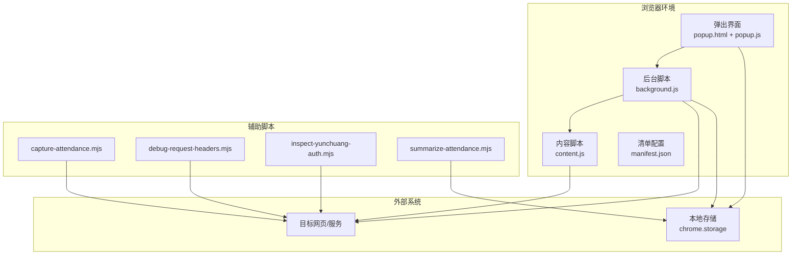
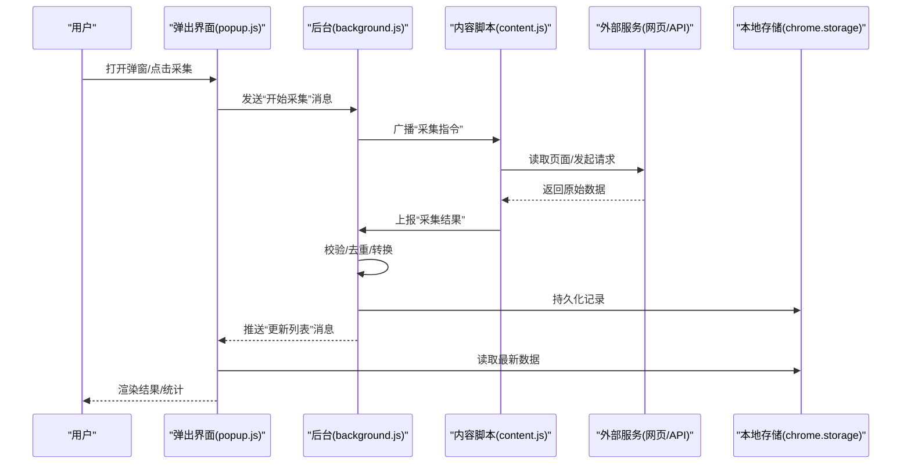
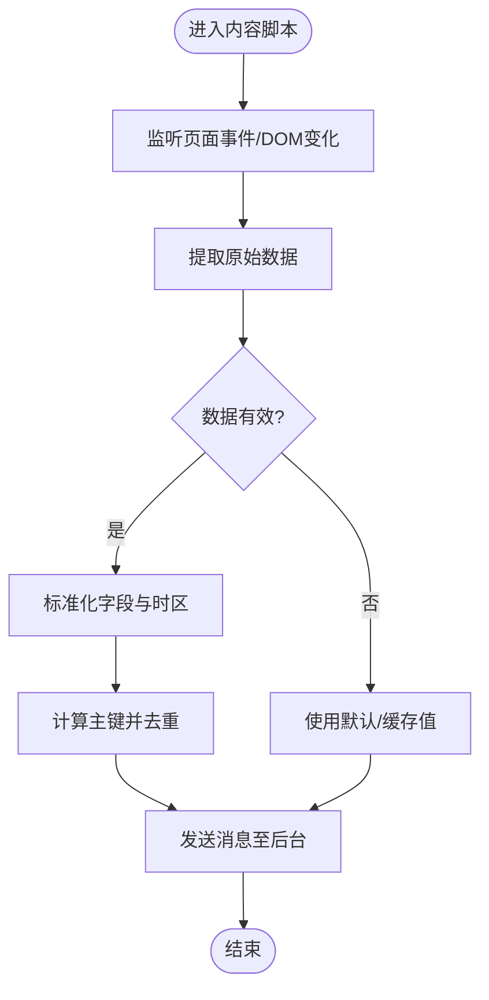
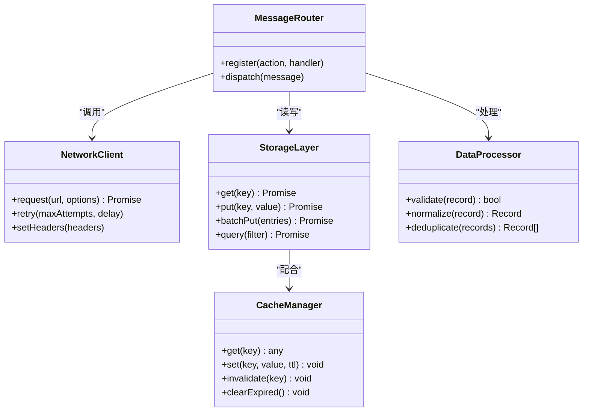
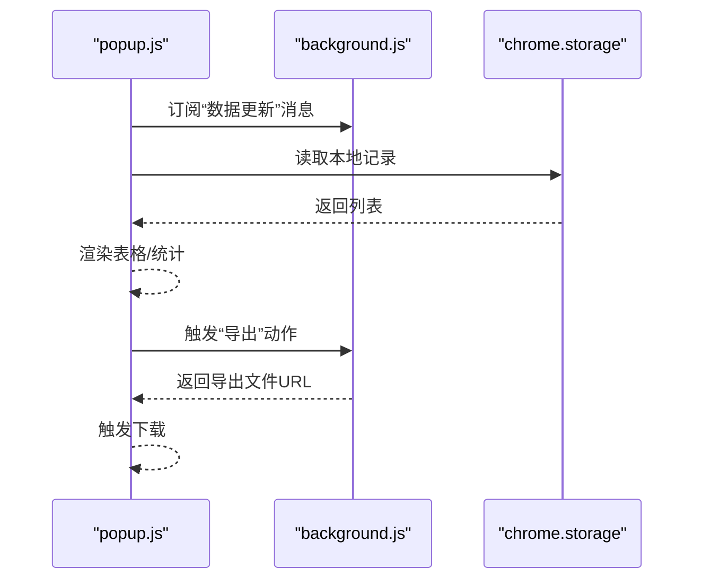
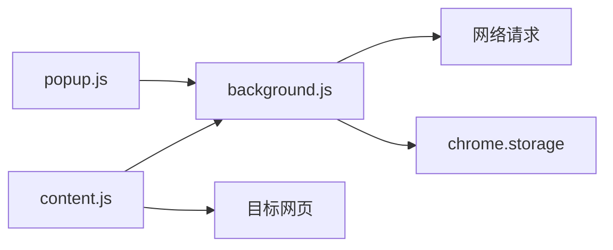

# 数据流设计

<cite>
**本文引用的文件**   
- [extension/README.md](file://extension/README.md)
- [extension/background.js](file://extension/background.js)
- [extension/content.js](file://extension/content.js)
- [extension/popup.html](file://extension/popup.html)
- [extension/popup.js](file://extension/popup.js)
- [extension/popup.css](file://extension/popup.css)
- [extension/manifest.json](file://extension/manifest.json)
- [scripts/capture-attendance.mjs](file://scripts/capture-attendance.mjs)
- [scripts/debug-request-headers.mjs](file://scripts/debug-request-headers.mjs)
- [scripts/inspect-yunchuang-auth.mjs](file://scripts/inspect-yunchuang-auth.mjs)
- [scripts/summarize-attendance.mjs](file://scripts/summarize-attendance.mjs)
</cite>

## 目录
1. [简介](#简介)
2. [项目结构](#项目结构)
3. [核心组件](#核心组件)
4. [架构总览](#架构总览)
5. [详细组件分析](#详细组件分析)
6. [依赖关系分析](#依赖关系分析)
7. [性能考虑](#性能考虑)
8. [故障排查指南](#故障排查指南)
9. [结论](#结论)
10. [附录](#附录)

## 简介
本文件面向“工时记录”浏览器扩展的数据流设计与实现，系统性说明从数据采集、传输、存储到展示的完整生命周期；定义模块间数据契约与接口规范（含数据结构与版本兼容策略）；阐述缓存策略与一致性保证；提供数据迁移与备份恢复方案；并给出性能监控与调试工具的使用建议。文档力求在保持技术深度的同时，对非专业读者友好。

## 项目结构
扩展采用典型的浏览器扩展三层架构：内容脚本负责页面内数据采集与注入；后台脚本负责消息路由、网络请求与持久化；弹出界面负责展示与交互。辅助脚本用于离线采集、调试与汇总。

图表来源
- [extension/background.js](file://extension/background.js)
- [extension/content.js](file://extension/content.js)
- [extension/popup.js](file://extension/popup.js)
- [extension/manifest.json](file://extension/manifest.json)
- [scripts/capture-attendance.mjs](file://scripts/capture-attendance.mjs)
- [scripts/debug-request-headers.mjs](file://scripts/debug-request-headers.mjs)
- [scripts/inspect-yunchuang-auth.mjs](file://scripts/inspect-yunchuang-auth.mjs)
- [scripts/summarize-attendance.mjs](file://scripts/summarize-attendance.mjs)

章节来源
- [extension/README.md](file://extension/README.md)
- [extension/manifest.json](file://extension/manifest.json)

## 核心组件
- 内容脚本 content.js
  - 职责：监听页面事件、抓取考勤/工时相关数据、向后台发送消息、必要时注入轻量UI提示。
  - 关键能力：DOM观察、事件拦截、数据清洗与校验、消息上报。
- 后台脚本 background.js
  - 职责：接收来自内容与弹出界面的消息；发起或转发网络请求；管理本地存储；维护缓存与去重；处理错误与重试。
  - 关键能力：消息路由、HTTP 客户端封装、存储抽象层、缓存策略、幂等写入。
- 弹出界面 popup.js + popup.html + popup.css
  - 职责：渲染用户界面、读取本地数据、触发采集任务、展示统计与导出结果。
  - 关键能力：状态同步、列表渲染、分页/筛选、导出功能。
- 清单 manifest.json
  - 职责：声明权限、脚本加载顺序、消息通道、跨域访问范围等。
- 辅助脚本 scripts/*
  - capture-attendance.mjs：离线或半离线采集考勤数据。
  - debug-request-headers.mjs：调试请求头与认证信息。
  - inspect-yunchuang-auth.mjs：检查特定服务的认证流程。
  - summarize-attendance.mjs：汇总本地数据并生成报告。

章节来源
- [extension/content.js](file://extension/content.js)
- [extension/background.js](file://extension/background.js)
- [extension/popup.js](file://extension/popup.js)
- [extension/popup.html](file://extension/popup.html)
- [extension/popup.css](file://extension/popup.css)
- [extension/manifest.json](file://extension/manifest.json)
- [scripts/capture-attendance.mjs](file://scripts/capture-attendance.mjs)
- [scripts/debug-request-headers.mjs](file://scripts/debug-request-headers.mjs)
- [scripts/inspect-yunchuang-auth.mjs](file://scripts/inspect-yunchuang-auth.mjs)
- [scripts/summarize-attendance.mjs](file://scripts/summarize-attendance.mjs)

## 架构总览
整体数据流遵循“采集—传输—存储—展示”的闭环，并通过消息总线解耦各模块。

图表来源
- [extension/background.js](file://extension/background.js)
- [extension/content.js](file://extension/content.js)
- [extension/popup.js](file://extension/popup.js)

## 详细组件分析

### 内容脚本 content.js
- 数据入口
  - 通过 DOM 观察者或事件监听捕获考勤/工时相关变更。
  - 解析页面元素或拦截网络响应，提取结构化字段（如时间、人员、项目、时长等）。
- 数据预处理
  - 类型校验、空值处理、时区归一化、单位换算。
  - 生成稳定主键（例如基于时间戳+会话ID），用于去重。
- 消息协议
  - 上行消息：包含动作类型、负载数据、时间戳、来源标识。
  - 下行消息：接收后台下发的采集指令、配置更新、刷新信号。
- 错误与重试
  - 捕获解析异常与网络失败，回退为最小可用数据集，并上报错误上下文。

图表来源
- [extension/content.js](file://extension/content.js)

章节来源
- [extension/content.js](file://extension/content.js)

### 后台脚本 background.js
- 消息路由
  - 统一注册消息处理器，按动作类型分发到对应逻辑（采集、查询、设置、导出等）。
- 网络层
  - 封装请求函数，统一添加鉴权头、超时与重试策略；支持并发控制与限流。
- 存储层
  - 以 chrome.storage 为后端，提供读写事务、批量写入、索引视图。
- 缓存策略
  - 分层缓存：内存级短期缓存（会话内）、本地存储长期缓存（跨会话）。
  - 失效策略：基于时间窗口与版本号；支持主动失效与被动淘汰。
- 一致性保障
  - 幂等写入：基于主键合并，避免重复记录。
  - 冲突解决：最后写入优先或业务规则合并；保留审计日志以便回溯。
- 错误处理
  - 分类错误码、降级策略、告警上报（可选）。

图表来源
- [extension/background.js](file://extension/background.js)

章节来源
- [extension/background.js](file://extension/background.js)

### 弹出界面 popup.js / popup.html / popup.css
- 交互流程
  - 初始化时订阅后台消息，拉取最新数据并渲染列表。
  - 用户操作触发后台动作（开始采集、刷新、导出、清空等）。
- 数据绑定
  - 将本地存储中的记录映射为表格/卡片视图，支持分页、排序、筛选。
- 导出与分享
  - 将当前视图数据序列化为 CSV/JSON，触发下载。
- 错误提示
  - 捕获网络与存储异常，显示友好提示并提供重试入口。

图表来源
- [extension/popup.js](file://extension/popup.js)
- [extension/popup.html](file://extension/popup.html)
- [extension/popup.css](file://extension/popup.css)

章节来源
- [extension/popup.js](file://extension/popup.js)
- [extension/popup.html](file://extension/popup.html)
- [extension/popup.css](file://extension/popup.css)

### 清单 manifest.json
- 权限与范围
  - 声明 storage、activeTab、host_permissions 等必要权限。
- 脚本加载
  - 指定 background、content_scripts 的匹配规则与执行时机。
- 消息通道
  - 确保 popup 与 background 的消息互通。

章节来源
- [extension/manifest.json](file://extension/manifest.json)

### 辅助脚本 scripts/*
- capture-attendance.mjs
  - 模拟或驱动浏览器自动化，抓取考勤页面数据并落盘。
- debug-request-headers.mjs
  - 打印请求头与认证信息，便于定位鉴权问题。
- inspect-yunchuang-auth.mjs
  - 针对特定服务的认证流程进行探测与验证。
- summarize-attendance.mjs
  - 聚合本地数据，生成汇总报表或可视化摘要。

章节来源
- [scripts/capture-attendance.mjs](file://scripts/capture-attendance.mjs)
- [scripts/debug-request-headers.mjs](file://scripts/debug-request-headers.mjs)
- [scripts/inspect-yunchuang-auth.mjs](file://scripts/inspect-yunchuang-auth.mjs)
- [scripts/summarize-attendance.mjs](file://scripts/summarize-attendance.mjs)

## 依赖关系分析
- 模块耦合
  - content.js 仅依赖浏览器 API 与页面 DOM，不直接访问存储。
  - background.js 作为中枢，耦合网络与存储，但通过消息接口与其余模块松耦合。
  - popup.js 仅依赖消息通道与存储，无业务强耦合。
- 外部依赖
  - 目标网页/服务：提供数据源与认证机制。
  - chrome.storage：本地持久化。
- 潜在循环依赖
  - 通过消息总线单向通信，避免循环引用。

图表来源
- [extension/background.js](file://extension/background.js)
- [extension/content.js](file://extension/content.js)
- [extension/popup.js](file://extension/popup.js)

章节来源
- [extension/manifest.json](file://extension/manifest.json)

## 性能考虑
- 采集侧
  - 节流与防抖：对高频事件（滚动、输入）进行节流，降低 CPU 占用。
  - 增量采集：仅监听变化区域，减少全量扫描。
- 传输侧
  - 批量化上传：合并多条记录后一次性提交，减少握手开销。
  - 压缩与去重：在发送前压缩与去重，降低带宽消耗。
- 存储侧
  - 分片存储：按日期/用户分桶，提升查询效率。
  - 索引优化：为常用查询字段建立索引视图。
- 展示侧
  - 虚拟列表：大数据量下按需渲染可见行。
  - 懒加载：分页加载与滚动触底加载结合。

[本节为通用性能建议，无需具体文件来源]

## 故障排查指南
- 常见问题定位
  - 采集不到数据：检查内容脚本是否注入成功、页面选择器是否变更、权限是否开启。
  - 无法登录/鉴权失败：使用 debug-request-headers.mjs 与 inspect-yunchuang-auth.mjs 对比期望头与签名。
  - 数据不一致：查看去重键与时间戳，确认幂等写入是否生效。
- 调试步骤
  - 打开开发者工具，查看控制台与网络面板。
  - 在后台脚本中增加日志输出，追踪消息流转。
  - 使用 summarize-attendance.mjs 快速验证数据完整性。
- 恢复与回滚
  - 导出最近一次快照，必要时回滚到历史版本。
  - 清理无效缓存后重试采集。

章节来源
- [scripts/debug-request-headers.mjs](file://scripts/debug-request-headers.mjs)
- [scripts/inspect-yunchuang-auth.mjs](file://scripts/inspect-yunchuang-auth.mjs)
- [extension/background.js](file://extension/background.js)

## 结论
本扩展通过清晰的分层与消息总线实现了稳定的数据流闭环：内容脚本专注采集与预处理，后台脚本承担路由、网络与存储，弹出界面负责展示与交互。借助缓存、去重与幂等写入，系统在一致性与性能之间取得平衡。辅助脚本提供了灵活的采集、调试与汇总能力，便于运维与排障。

[本节为总结性内容，无需具体文件来源]

## 附录

### 数据契约与接口规范
- 消息协议
  - 字段：action、payload、timestamp、source、traceId。
  - 行为：幂等 action、可重试 payload、溯源 traceId。
- 数据结构
  - 记录模型：id、userId、projectId、startTime、endTime、duration、tags、meta。
  - 版本字段：schemaVersion，用于向后兼容。
- 兼容性策略
  - 新增字段默认可选，旧客户端忽略未知字段。
  - 破坏性变更需升级 schemaVersion 并迁移数据。

章节来源
- [extension/background.js](file://extension/background.js)
- [extension/content.js](file://extension/content.js)
- [extension/popup.js](file://extension/popup.js)

### 缓存策略与一致性
- 缓存层级
  - 内存缓存：会话内快速读取，TTL 短。
  - 本地缓存：跨会话持久化，TTL 长。
- 失效与更新
  - 主动失效：用户操作触发。
  - 被动失效：过期时间与容量阈值触发。
- 一致性
  - 写路径：先写存储，再更新缓存；读路径：先查缓存，未命中再查存储。
  - 冲突：以主键为准，合并策略可配置。

章节来源
- [extension/background.js](file://extension/background.js)

### 数据迁移与备份恢复
- 迁移
  - 启动时检测 schemaVersion，若低于当前版本则执行迁移脚本。
  - 迁移过程幂等，支持断点续迁。
- 备份
  - 定期导出 JSON/CSV 快照，包含元数据与版本信息。
- 恢复
  - 导入快照，校验完整性与版本兼容性，应用增量补丁后重建索引。

章节来源
- [extension/background.js](file://extension/background.js)
- [extension/popup.js](file://extension/popup.js)

### 性能监控与调试工具
- 指标采集
  - 采集耗时、网络延迟、存储读写次数、缓存命中率。
- 监控上报
  - 可选上报至远程服务，或本地日志文件。
- 调试工具
  - debug-request-headers.mjs：抓包与鉴权诊断。
  - inspect-yunchuang-auth.mjs：认证流程验证。
  - summarize-attendance.mjs：数据质量与一致性校验。

章节来源
- [scripts/debug-request-headers.mjs](file://scripts/debug-request-headers.mjs)
- [scripts/inspect-yunchuang-auth.mjs](file://scripts/inspect-yunchuang-auth.mjs)
- [scripts/summarize-attendance.mjs](file://scripts/summarize-attendance.mjs)
- [extension/background.js](file://extension/background.js)