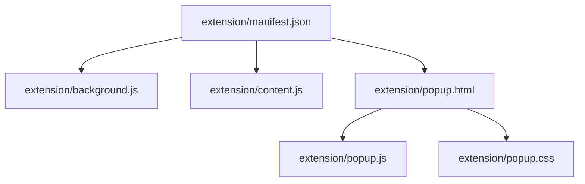
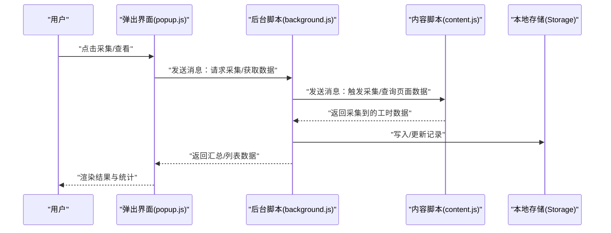
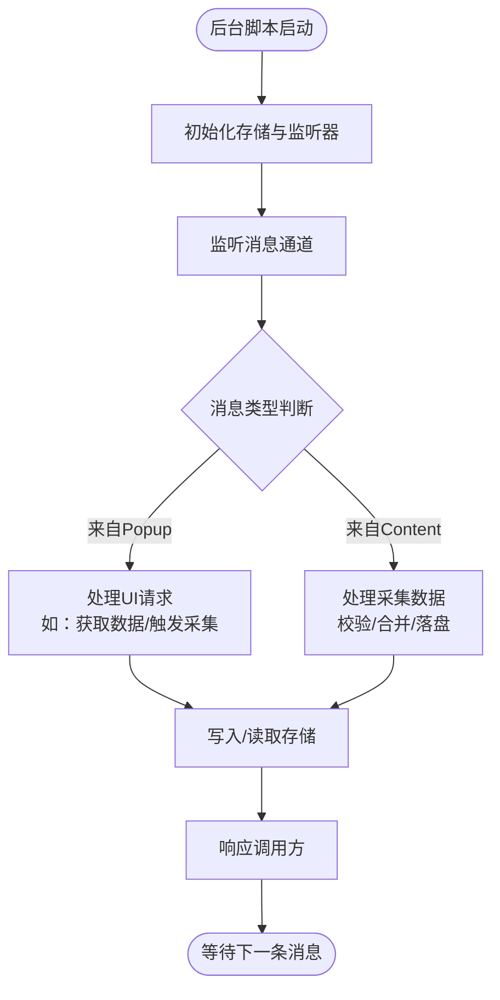
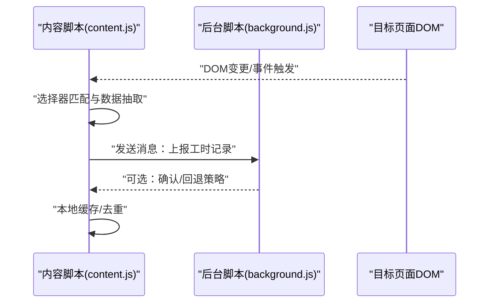
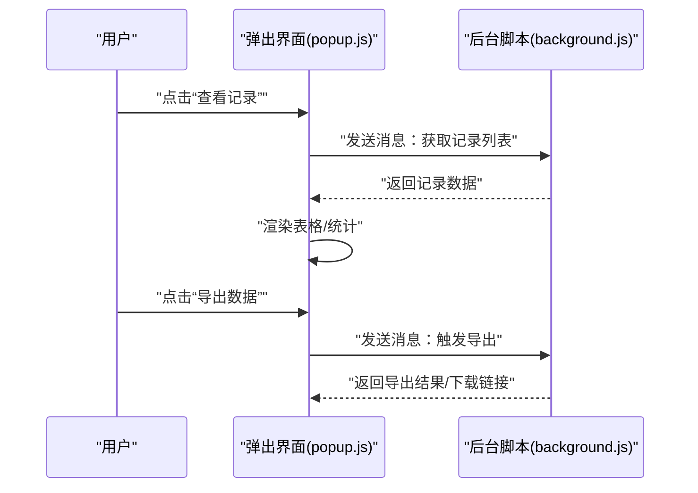
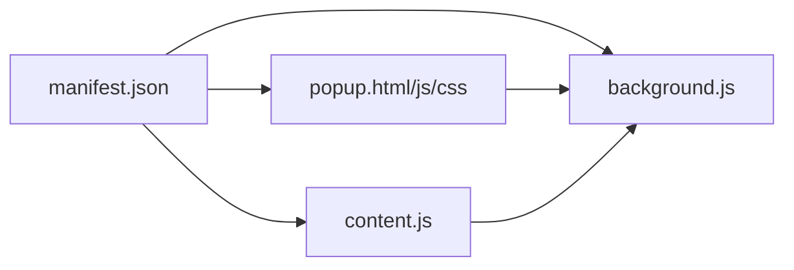

# 架构概览

<cite>
**本文引用的文件**   
- [extension/manifest.json](file://extension/manifest.json)
- [extension/background.js](file://extension/background.js)
- [extension/content.js](file://extension/content.js)
- [extension/popup.html](file://extension/popup.html)
- [extension/popup.js](file://extension/popup.js)
- [extension/popup.css](file://extension/popup.css)
- [extension/README.md](file://extension/README.md)
</cite>

## 目录
1. [简介](#简介)
2. [项目结构](#项目结构)
3. [核心组件](#核心组件)
4. [架构总览](#架构总览)
5. [详细组件分析](#详细组件分析)
6. [依赖关系分析](#依赖关系分析)
7. [性能考虑](#性能考虑)
8. [故障排查指南](#故障排查指南)
9. [结论](#结论)
10. [附录](#附录)

## 简介
本文件为“工时记录”Chrome扩展的整体架构文档，围绕三层架构模式展开：Background Script（后台脚本）作为核心控制器、Content Script（内容脚本）作为页面操作层、Popup界面作为用户交互层。文档重点说明各层职责边界与通信机制（消息传递API）、数据从采集到存储展示的完整流向、组件间的依赖关系与调用时序，以及扩展的生命周期管理与事件驱动设计原理。

## 项目结构
扩展位于 extension 目录下，包含清单、后台脚本、内容脚本与弹出界面相关文件；scripts 目录下的工具脚本用于辅助调试与分析，不在运行时加载。

图表来源
- [extension/manifest.json](file://extension/manifest.json)
- [extension/background.js](file://extension/background.js)
- [extension/content.js](file://extension/content.js)
- [extension/popup.html](file://extension/popup.html)
- [extension/popup.js](file://extension/popup.js)
- [extension/popup.css](file://extension/popup.css)

章节来源
- [extension/manifest.json](file://extension/manifest.json)
- [extension/background.js](file://extension/background.js)
- [extension/content.js](file://extension/content.js)
- [extension/popup.html](file://extension/popup.html)
- [extension/popup.js](file://extension/popup.js)
- [extension/popup.css](file://extension/popup.css)
- [extension/README.md](file://extension/README.md)

## 核心组件
- 后台脚本（background.js）
  - 角色：全局状态与生命周期管理、跨上下文协调、持久化存储、事件总线。
  - 职责：监听来自 Popup 和 Content Script 的消息；调度数据采集任务；维护本地存储；向 Content Script 注入指令或查询结果。
- 内容脚本（content.js）
  - 角色：页面内操作与数据采集。
  - 职责：监听 DOM 变化或页面事件；提取工时相关数据；通过消息 API 上报至后台；接收后台指令执行页面侧动作。
- 弹出界面（popup.html + popup.js + popup.css）
  - 角色：用户交互入口。
  - 职责：展示采集结果与统计；触发采集/导出等操作；与后台脚本进行双向通信。

章节来源
- [extension/background.js](file://extension/background.js)
- [extension/content.js](file://extension/content.js)
- [extension/popup.html](file://extension/popup.html)
- [extension/popup.js](file://extension/popup.js)
- [extension/popup.css](file://extension/popup.css)

## 架构总览
下图展示了三层之间的职责边界与通信路径，以及数据从采集到存储展示的端到端流程。

图表来源
- [extension/background.js](file://extension/background.js)
- [extension/content.js](file://extension/content.js)
- [extension/popup.js](file://extension/popup.js)

## 详细组件分析

### 后台脚本（background.js）
- 生命周期与初始化
  - 在扩展启动时注册消息监听器与必要的事件钩子。
  - 负责初始化本地存储结构与默认配置。
- 消息路由与协调
  - 统一处理来自 Popup 的 UI 操作消息与来自 Content Script 的数据上报消息。
  - 根据消息类型分发到相应处理器，确保幂等与错误恢复。
- 数据存储
  - 使用 Chrome Storage API 进行持久化，支持批量写入与增量更新。
  - 提供读取接口供 Popup 拉取最新数据。
- 事件驱动
  - 基于消息与可选的定时任务驱动工作流，避免阻塞主线程。

图表来源
- [extension/background.js](file://extension/background.js)

章节来源
- [extension/background.js](file://extension/background.js)

### 内容脚本（content.js）
- 页面观察与数据采集
  - 监听目标页面的关键事件或DOM变更，定位工时相关元素并提取结构化数据。
  - 对数据进行清洗与去重，生成标准记录对象。
- 与后台通信
  - 将采集结果通过消息 API 上报给后台脚本。
  - 接收后台下发的指令（如刷新、清空缓存、强制采集）。
- 容错与节流
  - 对高频事件进行节流/防抖，避免频繁上报造成性能问题。
  - 捕获解析异常并降级处理，保证页面稳定性。

图表来源
- [extension/content.js](file://extension/content.js)
- [extension/background.js](file://extension/background.js)

章节来源
- [extension/content.js](file://extension/content.js)

### 弹出界面（popup.html + popup.js + popup.css）
- 用户交互
  - 提供“采集”、“查看”、“导出”等按钮与列表视图。
  - 显示统计数据与最近记录。
- 与后台通信
  - 通过消息 API 向后台发起请求，并在回调中渲染结果。
  - 支持实时刷新与错误提示。
- 样式与可访问性
  - 使用 popup.css 控制布局与主题，保持简洁直观。

图表来源
- [extension/popup.js](file://extension/popup.js)
- [extension/background.js](file://extension/background.js)
- [extension/popup.html](file://extension/popup.html)
- [extension/popup.css](file://extension/popup.css)

章节来源
- [extension/popup.html](file://extension/popup.html)
- [extension/popup.js](file://extension/popup.js)
- [extension/popup.css](file://extension/popup.css)

## 依赖关系分析
- 清单文件声明了 background、content_scripts 与 action（popup）等模块，是扩展装配的根节点。
- Popup 仅与 Background 通信，不直接访问页面 DOM。
- Content Script 仅作用于目标页面，通过消息与 Background 协作。
- 所有持久化逻辑集中在 Background，避免多上下文重复实现。

图表来源
- [extension/manifest.json](file://extension/manifest.json)
- [extension/background.js](file://extension/background.js)
- [extension/content.js](file://extension/content.js)
- [extension/popup.html](file://extension/popup.html)
- [extension/popup.js](file://extension/popup.js)
- [extension/popup.css](file://extension/popup.css)

章节来源
- [extension/manifest.json](file://extension/manifest.json)

## 性能考虑
- 消息体积控制：尽量传输最小必要字段，避免大对象频繁序列化。
- 事件节流：在 Content Script 中对高频事件做节流/防抖，降低上报频率。
- 批量写入：后台对存储写入采用批处理策略，减少 I/O 次数。
- 懒加载：仅在需要时向目标页面注入或激活采集逻辑。
- 错误快速失败：对不可恢复的错误立即返回，避免长时间阻塞。

## 故障排查指南
- 无法收到消息
  - 检查 manifest 是否正确声明 background 与 content_scripts。
  - 确认 Popup 与 Background 的端口/消息名一致。
- 采集不到数据
  - 核对 Content Script 的选择器是否匹配目标页面结构。
  - 检查页面是否存在反爬或动态加载导致元素未就绪。
- 数据未持久化
  - 验证 Storage API 权限与配额。
  - 检查后台写入逻辑是否被异常中断。
- 界面不刷新
  - 确认 Popup 是否在收到后台响应后正确触发渲染。
  - 检查 CSS 是否覆盖或隐藏了关键元素。

章节来源
- [extension/manifest.json](file://extension/manifest.json)
- [extension/background.js](file://extension/background.js)
- [extension/content.js](file://extension/content.js)
- [extension/popup.js](file://extension/popup.js)
- [extension/popup.css](file://extension/popup.css)

## 结论
本扩展采用清晰的三层架构：Background 作为中枢协调与持久化中心，Content Script 专注页面数据采集，Popup 提供直观的用户交互。通过消息传递 API 实现跨上下文通信，形成“采集—上报—存储—展示”的闭环。结合事件驱动与生命周期管理，系统具备良好的可扩展性与可维护性。

## 附录
- 术语
  - 消息传递：Chrome Extension 提供的跨上下文通信机制。
  - 本地存储：Chrome Storage API，用于持久化键值数据。
- 参考
  - 扩展使用说明详见 README。

章节来源
- [extension/README.md](file://extension/README.md)