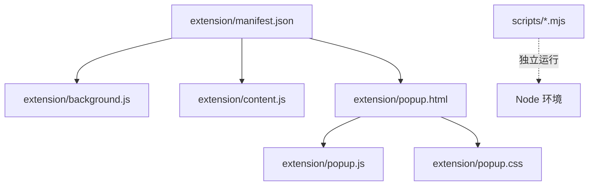
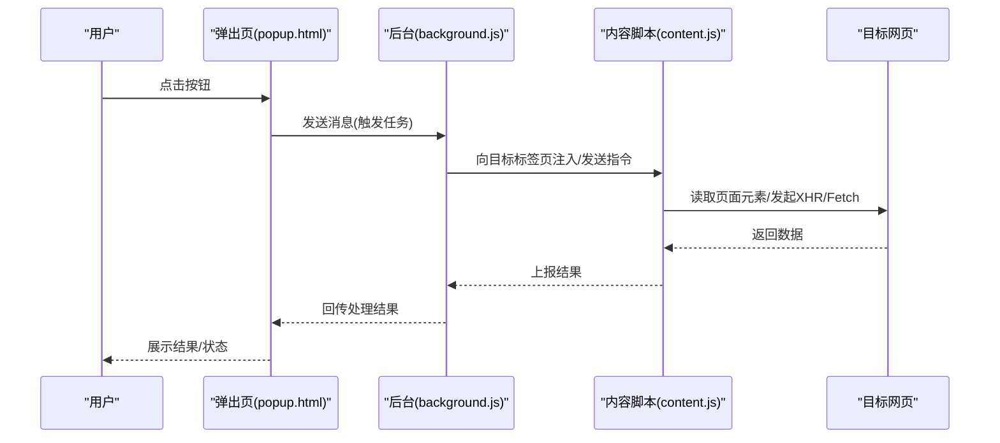

# 开发指南

<cite>
**本文引用的文件**   
- [extension/README.md](file://extension/README.md)
- [extension/background.js](file://extension/background.js)
- [extension/content.js](file://extension/content.js)
- [extension/manifest.json](file://extension/manifest.json)
- [extension/popup.css](file://extension/popup.css)
- [extension/popup.html](file://extension/popup.html)
- [extension/popup.js](file://extension/popup.js)
- [scripts/capture-attendance.mjs](file://scripts/capture-attendance.mjs)
- [scripts/debug-request-headers.mjs](file://scripts/debug-request-headers.mjs)
- [scripts/inspect-yunchuang-auth.mjs](file://scripts/inspect-yunchuang-auth.mjs)
- [scripts/summarize-attendance.mjs](file://scripts/summarize-attendance.mjs)
</cite>

## 目录
1. [简介](#简介)
2. [项目结构](#项目结构)
3. [核心组件](#核心组件)
4. [架构总览](#架构总览)
5. [详细组件分析](#详细组件分析)
6. [依赖分析](#依赖分析)
7. [性能考虑](#性能考虑)
8. [故障排查指南](#故障排查指南)
9. [结论](#结论)
10. [附录](#附录)

## 简介
本指南面向二次开发者，目标是帮助你快速搭建工时记录 Chrome 扩展的开发环境，理解代码结构与交互流程，掌握新增功能、修改模块与测试的完整流程。文档覆盖：
- 开发环境与调试配置
- 代码组织原则、命名约定与最佳实践
- 扩展开发步骤（添加功能、修改现有模块、测试）
- UI 组件开发与样式定制、响应式考虑
- 常见问题定位与排障方法

## 项目结构
仓库采用“扩展 + 脚本”的双层结构：
- extension：Chrome 扩展主体，包含清单、后台脚本、内容脚本、弹出页 HTML/CSS/JS
- scripts：Node 侧辅助脚本，用于抓包、调试请求头、认证检查与考勤汇总等



图表来源
- [extension/manifest.json](file://extension/manifest.json)
- [extension/background.js](file://extension/background.js)
- [extension/content.js](file://extension/content.js)
- [extension/popup.html](file://extension/popup.html)
- [extension/popup.js](file://extension/popup.js)
- [extension/popup.css](file://extension/popup.css)

章节来源
- [extension/README.md](file://extension/README.md)
- [extension/manifest.json](file://extension/manifest.json)

## 核心组件
- 清单 manifest.json：声明权限、背景页、内容脚本注入目标、弹出页入口等
- background.js：扩展后台逻辑，负责跨页面通信、持久化状态、事件监听
- content.js：在目标网页中注入，采集数据或执行页面内操作
- popup.html/js/css：用户交互界面，提供手动触发、查看状态、设置选项等能力
- scripts/*.mjs：本地 Node 工具脚本，辅助抓包、调试、认证检查与数据汇总

章节来源
- [extension/manifest.json](file://extension/manifest.json)
- [extension/background.js](file://extension/background.js)
- [extension/content.js](file://extension/content.js)
- [extension/popup.html](file://extension/popup.html)
- [extension/popup.js](file://extension/popup.js)
- [extension/popup.css](file://extension/popup.css)

## 架构总览
扩展采用典型的“后台 + 内容脚本 + 弹出页”三层架构。popup 通过消息机制与 background 通信；background 协调 content 脚本在目标页面执行数据采集或操作；必要时通过浏览器 API 访问网络或存储。



图表来源
- [extension/popup.html](file://extension/popup.html)
- [extension/popup.js](file://extension/popup.js)
- [extension/background.js](file://extension/background.js)
- [extension/content.js](file://extension/content.js)

## 详细组件分析

### 清单与权限(manifest.json)
- 作用：定义扩展名称、版本、图标、权限、background、content_scripts、action/popup 等
- 关键点：
  - permissions：按需申请最小权限集（如 storage、activeTab、host 匹配等）
  - host_permissions：仅对必要域名开放网络访问
  - content_scripts：精确匹配需要采集的目标页面 URL 模式
  - action/popup：指定弹出页入口
- 建议：
  - 使用最新 Manifest V3 规范
  - 将敏感信息从清单中移除，改用运行时配置
  - 为每个功能域划分独立的 content_scripts 规则，便于维护

章节来源
- [extension/manifest.json](file://extension/manifest.json)

### 后台脚本(background.js)
- 职责：
  - 接收来自 popup 的消息并路由到具体处理器
  - 管理 content 脚本生命周期（注入、卸载、重连）
  - 与 content 脚本双向通信，聚合结果并持久化
  - 可选：定时任务、通知、系统托盘交互
- 设计要点：
  - 消息协议统一：定义清晰的 message type、payload schema、错误码
  - 幂等与重试：对网络请求与写入操作增加重试与去抖
  - 资源清理：在标签页关闭时释放监听器与定时器
- 调试建议：
  - 使用 console 输出结构化日志（含时间戳、上下文、traceId）
  - 利用 browser.runtime.sendMessage/onMessage 的返回值进行同步校验

章节来源
- [extension/background.js](file://extension/background.js)

### 内容脚本(content.js)
- 职责：
  - 在目标页面中安全地读取 DOM、拦截 XHR/Fetch、注入 UI 控件
  - 将采集到的原始数据转换为标准模型后上报给 background
- 设计要点：
  - 沙箱隔离：避免污染全局变量，使用模块化封装
  - 选择器稳定：尽量使用语义化属性或稳定的 data-* 选择器
  - 容错与降级：当页面结构变化时优雅降级，不阻断主流程
- 性能优化：
  - 节流/防抖高频事件（滚动、输入）
  - 批量上报与合并重复数据
  - 仅在可见区域监听与计算

章节来源
- [extension/content.js](file://extension/content.js)

### 弹出页(popup.html / popup.js / popup.css)
- 职责：
  - 提供可视化控制面板：触发采集、查看历史、切换开关、导出结果
  - 与 background 交互，展示实时状态与错误提示
- 交互流程：
  - 初始化时加载配置与上次状态
  - 用户操作 -> 发送消息 -> 等待结果 -> 更新 UI
- 可访问性与体验：
  - 键盘可达、焦点顺序合理
  - 错误反馈清晰，支持一键复制错误信息
  - 小屏适配，避免横向滚动

章节来源
- [extension/popup.html](file://extension/popup.html)
- [extension/popup.js](file://extension/popup.js)
- [extension/popup.css](file://extension/popup.css)

### 本地脚本(scripts/*.mjs)
- capture-attendance.mjs：抓取考勤相关请求或页面数据，便于离线分析
- debug-request-headers.mjs：打印请求头，辅助定位鉴权与跨域问题
- inspect-yunchuang-auth.mjs：检查特定平台认证流程与令牌有效性
- summarize-attendance.mjs：汇总多源数据，生成报表或导入模板
- 使用方式：
  - 在 Node 环境中直接运行
  - 结合 curl/wget 或浏览器开发者工具的 Network 面板配合使用

章节来源
- [scripts/capture-attendance.mjs](file://scripts/capture-attendance.mjs)
- [scripts/debug-request-headers.mjs](file://scripts/debug-request-headers.mjs)
- [scripts/inspect-yunchuang-auth.mjs](file://scripts/inspect-yunchuang-auth.mjs)
- [scripts/summarize-attendance.mjs](file://scripts/summarize-attendance.mjs)

## 依赖分析
- 内部依赖
  - popup.js 依赖 popup.html 的结构与 popup.css 的样式
  - background.js 与 content.js 通过 runtime 消息协议耦合
  - manifest.json 决定哪些脚本被加载以及何时注入
- 外部依赖
  - 浏览器 WebExtensions API（storage、tabs、runtime、alarms 等）
  - 目标网站接口（需通过 host_permissions 授权）
- 潜在风险
  - 过度权限：仅申请必要权限，降低审核与安全风险
  - 强耦合：通过明确的消息协议与类型约束降低耦合度

```mermaid
graph LR
M["manifest.json"] --> BG["background.js"]
M --> CT["content.js"]
M --> PU["popup.html"]
PU --> PJ["popup.js"]
PU --> PC["popup.css"]
BG < --> CT
```

图表来源
- [extension/manifest.json](file://extension/manifest.json)
- [extension/background.js](file://extension/background.js)
- [extension/content.js](file://extension/content.js)
- [extension/popup.html](file://extension/popup.html)
- [extension/popup.js](file://extension/popup.js)
- [extension/popup.css](file://extension/popup.css)

章节来源
- [extension/manifest.json](file://extension/manifest.json)

## 性能考虑
- 消息体积控制：只传输必要字段，避免大对象频繁往返
- 批量与合并：content 端合并多次采集结果再上报
- 节流与去抖：对高频事件与轮询做节流/去抖
- 懒加载：仅在需要时注入 content 脚本或开启监听
- 缓存策略：对静态配置与字典类数据使用 storage.local 缓存
- 内存泄漏防护：及时移除事件监听器、取消定时器与 Promise 未决态

## 故障排查指南
- 无法加载扩展
  - 检查 manifest.json 语法与权限声明
  - 确认扩展已启用且无冲突插件
- 弹出页空白或报错
  - 打开开发者工具 Console 查看 JS 错误
  - 检查 network 面板是否有跨域或权限拒绝
- 采集不到数据
  - 核对 content_scripts 的 matches 是否命中目标页面
  - 使用 debug-request-headers.mjs 与 inspect-yunchuang-auth.mjs 验证请求与认证
- 后台无响应
  - 在 background 控制台查看消息收发日志
  - 确认 popup 与 background 的消息类型与字段一致

章节来源
- [extension/manifest.json](file://extension/manifest.json)
- [extension/popup.js](file://extension/popup.js)
- [extension/background.js](file://extension/background.js)
- [extension/content.js](file://extension/content.js)
- [scripts/debug-request-headers.mjs](file://scripts/debug-request-headers.mjs)
- [scripts/inspect-yunchuang-auth.mjs](file://scripts/inspect-yunchuang-auth.mjs)

## 结论
通过清晰的三层架构与统一的通信协议，本扩展具备良好的可扩展性与可维护性。遵循最小权限、模块化与健壮性原则，可在保证用户体验的同时高效完成二次开发与功能扩展。

## 附录

### 开发环境搭建与调试
- 安装 Chrome 与开发者工具
- 加载本地扩展：
  - 打开 chrome://extensions
  - 开启“开发者模式”，点击“加载已解压的扩展程序”，选择 extension 目录
- 调试：
  - 弹出页：右键“检查”打开 DevTools
  - 后台：在扩展列表点击“Service Worker”或“后台页面”
  - 内容脚本：在目标页面 DevTools 的 Sources 面板查找对应脚本
- 热重载：保存文件后刷新页面或重新加载扩展

章节来源
- [extension/README.md](file://extension/README.md)
- [extension/manifest.json](file://extension/manifest.json)

### 代码组织与命名约定
- 文件组织
  - 按职责分层：manifest、background、content、popup、样式
  - 新功能以独立模块形式接入，避免单文件膨胀
- 命名约定
  - 文件名：小写短横线分隔（如 attendance-capture.js）
  - 变量/函数：驼峰命名；常量：大写蛇形
  - 消息类型：前缀+动词+名词（如 ATTENDANCE_CAPTURE_REQ）
- 最佳实践
  - 单一职责：每个模块只做一件事
  - 显式依赖：通过参数或模块导入传递依赖
  - 错误优先：尽早失败，给出可诊断的错误信息

章节来源
- [extension/background.js](file://extension/background.js)
- [extension/content.js](file://extension/content.js)
- [extension/popup.js](file://extension/popup.js)

### 新增功能开发步骤
- 需求分析与影响评估
  - 确定是否需要新的 permissions/host_permissions
  - 评估是否新增 content 脚本或修改现有注入规则
- 实现
  - 在 background 中新增消息处理器
  - 在 content 中实现数据采集或页面交互逻辑
  - 在 popup 中添加入口与展示
- 联调与测试
  - 使用本地脚本辅助验证网络与认证
  - 覆盖正常路径与异常分支
- 提交与发布
  - 更新 README 与变更日志
  - 打包与签名（如需）

章节来源
- [extension/manifest.json](file://extension/manifest.json)
- [extension/background.js](file://extension/background.js)
- [extension/content.js](file://extension/content.js)
- [extension/popup.html](file://extension/popup.html)
- [extension/popup.js](file://extension/popup.js)
- [extension/popup.css](file://extension/popup.css)
- [scripts/capture-attendance.mjs](file://scripts/capture-attendance.mjs)
- [scripts/debug-request-headers.mjs](file://scripts/debug-request-headers.mjs)
- [scripts/inspect-yunchuang-auth.mjs](file://scripts/inspect-yunchuang-auth.mjs)
- [scripts/summarize-attendance.mjs](file://scripts/summarize-attendance.mjs)

### UI 组件与样式定制
- 组件拆分
  - 将复杂弹窗拆分为子组件（如表单、列表、详情）
  - 复用通用组件（按钮、输入框、提示条）
- 样式策略
  - 使用 CSS 变量管理主题色与间距
  - 采用 BEM 或类似命名空间避免冲突
- 响应式设计
  - 使用相对单位与媒体查询适配不同屏幕
  - 在小屏下隐藏次要信息，保留关键操作
- 可访问性
  - 为交互元素提供 aria-label 与键盘导航
  - 确保对比度与焦点可见性

章节来源
- [extension/popup.html](file://extension/popup.html)
- [extension/popup.js](file://extension/popup.js)
- [extension/popup.css](file://extension/popup.css)

### 测试方法与用例设计
- 单元测试
  - 对数据处理与格式化逻辑编写断言
- 集成测试
  - 模拟 background-content 消息往返
  - 使用 puppeteer 或 web-ext 自动化弹出页操作
- 回归与冒烟
  - 覆盖关键路径与边界条件
  - 在不同目标站点上进行兼容性验证

章节来源
- [extension/background.js](file://extension/background.js)
- [extension/content.js](file://extension/content.js)
- [extension/popup.js](file://extension/popup.js)