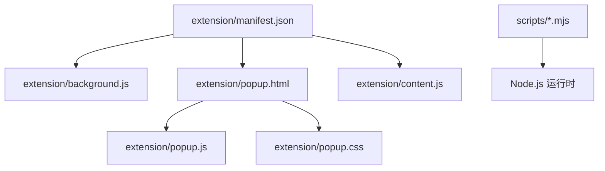
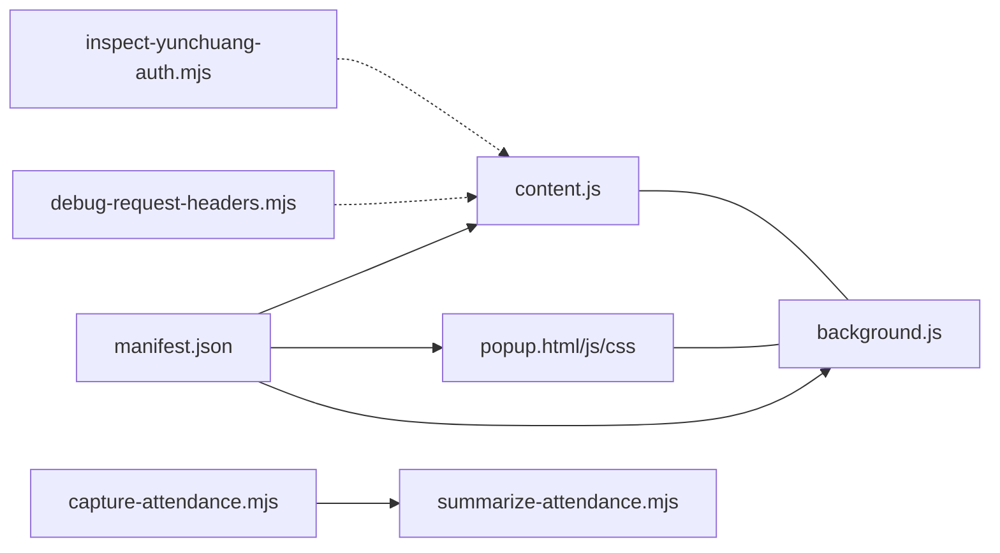

# 开发环境搭建

<cite>
**本文引用的文件**   
- [extension/manifest.json](file://extension/manifest.json)
- [extension/background.js](file://extension/background.js)
- [extension/content.js](file://extension/content.js)
- [extension/popup.html](file://extension/popup.html)
- [extension/popup.js](file://extension/popup.js)
- [extension/popup.css](file://extension/popup.css)
- [extension/README.md](file://extension/README.md)
- [scripts/capture-attendance.mjs](file://scripts/capture-attendance.mjs)
- [scripts/debug-request-headers.mjs](file://scripts/debug-request-headers.mjs)
- [scripts/inspect-yunchuang-auth.mjs](file://scripts/inspect-yunchuang-auth.mjs)
- [scripts/summarize-attendance.mjs](file://scripts/summarize-attendance.mjs)
</cite>

## 目录
1. [简介](#简介)
2. [项目结构](#项目结构)
3. [核心组件](#核心组件)
4. [架构总览](#架构总览)
5. [详细组件分析](#详细组件分析)
6. [依赖分析](#依赖分析)
7. [性能考虑](#性能考虑)
8. [故障排查指南](#故障排查指南)
9. [结论](#结论)
10. [附录](#附录)

## 简介
本指南面向Chrome扩展开发者，提供从安装到调试、从本地开发流程到Node.js脚本运行的完整环境搭建说明。内容覆盖：
- Chrome浏览器开发者工具与扩展加载模式配置
- 扩展调试器使用与性能分析工具
- 本地开发流程（文件组织、热重载策略、版本管理）
- Node.js环境配置，用于运行scripts目录下的数据处理脚本
- 常见问题排查方法与解决方案

## 项目结构
仓库采用“扩展代码 + 辅助脚本”的清晰分层：
- extension：Chrome扩展源码，包含清单、后台脚本、页面弹窗、内容与样式等
- scripts：基于ES模块的Node.js脚本，用于数据采集、请求头调试、认证检查与数据汇总



图表来源
- [extension/manifest.json](file://extension/manifest.json)
- [extension/background.js](file://extension/background.js)
- [extension/popup.html](file://extension/popup.html)
- [extension/popup.js](file://extension/popup.js)
- [extension/popup.css](file://extension/popup.css)
- [extension/content.js](file://extension/content.js)
- [scripts/capture-attendance.mjs](file://scripts/capture-attendance.mjs)
- [scripts/debug-request-headers.mjs](file://scripts/debug-request-headers.mjs)
- [scripts/inspect-yunchuang-auth.mjs](file://scripts/inspect-yunchuang-auth.mjs)
- [scripts/summarize-attendance.mjs](file://scripts/summarize-attendance.mjs)

章节来源
- [extension/manifest.json](file://extension/manifest.json)
- [extension/background.js](file://extension/background.js)
- [extension/content.js](file://extension/content.js)
- [extension/popup.html](file://extension/popup.html)
- [extension/popup.js](file://extension/popup.js)
- [extension/popup.css](file://extension/popup.css)
- [extension/README.md](file://extension/README.md)
- [scripts/capture-attendance.mjs](file://scripts/capture-attendance.mjs)
- [scripts/debug-request-headers.mjs](file://scripts/debug-request-headers.mjs)
- [scripts/inspect-yunchuang-auth.mjs](file://scripts/inspect-yunchuang-auth.mjs)
- [scripts/summarize-attendance.mjs](file://scripts/summarize-attendance.mjs)

## 核心组件
- 清单 manifest.json：声明扩展名称、版本、权限、入口脚本与UI资源，是扩展加载与权限控制的核心
- background.js：扩展后台逻辑，负责持久化任务、消息桥接与事件监听
- content.js：注入目标页面的脚本，用于与页面DOM或网络交互
- popup.html/js/css：扩展弹出界面，提供用户交互入口
- scripts/*.mjs：Node.js ES模块脚本，用于离线数据处理与调试

章节来源
- [extension/manifest.json](file://extension/manifest.json)
- [extension/background.js](file://extension/background.js)
- [extension/content.js](file://extension/content.js)
- [extension/popup.html](file://extension/popup.html)
- [extension/popup.js](file://extension/popup.js)
- [extension/popup.css](file://extension/popup.css)

## 架构总览
下图展示扩展在浏览器中的运行关系与脚本侧的数据处理路径。

```mermaid
graph TB
subgraph "Chrome 扩展"
M["manifest.json<br/>声明与权限"] --> BG["background.js<br/>后台服务"]
M --> POP["popup.html/js/css<br/>弹出界面"]
M --> CT["content.js<br/>页面注入"]
BG < --> CT : "消息通信"
POP < --> BG : "消息通信"
end
subgraph "Node.js 脚本"
S1["capture-attendance.mjs"]
S2["debug-request-headers.mjs"]
S3["inspect-yunchuang-auth.mjs"]
S4["summarize-attendance.mjs"]
end
CT -.->|"导出/采集数据"| S1
S1 --> S4
S2 --> |"调试请求头"| CT
S3 --> |"检查认证"| CT
```

图表来源
- [extension/manifest.json](file://extension/manifest.json)
- [extension/background.js](file://extension/background.js)
- [extension/content.js](file://extension/content.js)
- [extension/popup.html](file://extension/popup.html)
- [extension/popup.js](file://extension/popup.js)
- [extension/popup.css](file://extension/popup.css)
- [scripts/capture-attendance.mjs](file://scripts/capture-attendance.mjs)
- [scripts/debug-request-headers.mjs](file://scripts/debug-request-headers.mjs)
- [scripts/inspect-yunchuang-auth.mjs](file://scripts/inspect-yunchuang-auth.mjs)
- [scripts/summarize-attendance.mjs](file://scripts/summarize-attendance.mjs)

## 详细组件分析

### 清单与权限（manifest.json）
- 作用：定义扩展元信息、权限范围、入口脚本与资源路径
- 关键点：
  - 声明背景页脚本与弹出页资源
  - 按需申请跨域或页面访问权限
  - 指定内容脚本注入规则（如匹配URL模式）
- 建议：
  - 最小权限原则，仅声明必要权限
  - 将敏感配置外置至环境变量或配置文件

章节来源
- [extension/manifest.json](file://extension/manifest.json)

### 后台脚本（background.js）
- 职责：
  - 监听扩展生命周期事件
  - 维护状态与持久化存储
  - 与content/popup进行消息通信
- 调试要点：
  - 通过“扩展管理页面”打开后台页控制台
  - 使用console日志定位问题
  - 结合Network面板观察扩展发起的网络请求

章节来源
- [extension/background.js](file://extension/background.js)

### 内容脚本（content.js）
- 职责：
  - 注入目标页面，读取/修改DOM
  - 拦截或增强页面行为
  - 向background发送消息
- 调试要点：
  - 在目标页面打开开发者工具的Console执行调试
  - 使用断点与元素面板验证注入效果
  - 注意CSP与安全限制对注入的影响

章节来源
- [extension/content.js](file://extension/content.js)

### 弹出界面（popup.html / popup.js / popup.css）
- 职责：
  - 提供用户交互入口
  - 调用background能力或触发content动作
- 调试要点：
  - 在扩展管理页打开弹出页控制台
  - 使用Elements/Styles面板调整样式
  - 通过Network面板确认API调用

章节来源
- [extension/popup.html](file://extension/popup.html)
- [extension/popup.js](file://extension/popup.js)
- [extension/popup.css](file://extension/popup.css)

### Node.js 脚本（scripts/*.mjs）
- 功能概览：
  - capture-attendance.mjs：采集考勤相关数据
  - debug-request-headers.mjs：调试请求头，便于定位鉴权与跨域问题
  - inspect-yunchuang-auth.mjs：检查云创认证流程
  - summarize-attendance.mjs：汇总考勤数据并输出报告
- 运行方式：
  - 使用Node.js直接执行ES模块脚本
  - 可结合命令行参数与环境变量传入配置
- 集成建议：
  - 将脚本纳入版本管理，记录输入输出格式
  - 为常用操作编写npm脚本或Makefile别名

章节来源
- [scripts/capture-attendance.mjs](file://scripts/capture-attendance.mjs)
- [scripts/debug-request-headers.mjs](file://scripts/debug-request-headers.mjs)
- [scripts/inspect-yunchuang-auth.mjs](file://scripts/inspect-yunchuang-auth.mjs)
- [scripts/summarize-attendance.mjs](file://scripts/summarize-attendance.mjs)

## 依赖分析
- 扩展侧依赖：
  - manifest.json 驱动 background、popup、content 的加载与权限
  - popup 与 background 通过消息机制协作
  - content 与 background 通过消息机制协作
- 脚本侧依赖：
  - 所有脚本均为ES模块（.mjs），由Node.js运行时解析
  - 脚本之间可通过导入/导出形成简单流水线（如采集→汇总）



图表来源
- [extension/manifest.json](file://extension/manifest.json)
- [extension/background.js](file://extension/background.js)
- [extension/popup.html](file://extension/popup.html)
- [extension/popup.js](file://extension/popup.js)
- [extension/popup.css](file://extension/popup.css)
- [extension/content.js](file://extension/content.js)
- [scripts/capture-attendance.mjs](file://scripts/capture-attendance.mjs)
- [scripts/debug-request-headers.mjs](file://scripts/debug-request-headers.mjs)
- [scripts/inspect-yunchuang-auth.mjs](file://scripts/inspect-yunchuang-auth.mjs)
- [scripts/summarize-attendance.mjs](file://scripts/summarize-attendance.mjs)

章节来源
- [extension/manifest.json](file://extension/manifest.json)
- [extension/background.js](file://extension/background.js)
- [extension/content.js](file://extension/content.js)
- [extension/popup.html](file://extension/popup.html)
- [extension/popup.js](file://extension/popup.js)
- [extension/popup.css](file://extension/popup.css)
- [scripts/capture-attendance.mjs](file://scripts/capture-attendance.mjs)
- [scripts/debug-request-headers.mjs](file://scripts/debug-request-headers.mjs)
- [scripts/inspect-yunchuang-auth.mjs](file://scripts/inspect-yunchuang-auth.mjs)
- [scripts/summarize-attendance.mjs](file://scripts/summarize-attendance.mjs)

## 性能考虑
- 扩展侧
  - 避免在content脚本中执行高开销计算，必要时委托给background
  - 合理使用消息队列与节流，减少频繁通信
  - 按需注入页面，缩小匹配范围
- 脚本侧
  - 大数据量处理时启用流式读写与分页
  - 合理设置并发度，避免I/O阻塞
  - 对重复计算结果进行缓存

[本节为通用指导，不直接分析具体文件]

## 故障排查指南

### Chrome 扩展无法加载或白屏
- 可能原因：
  - 未启用“开发者模式”或未选择正确的扩展目录
  - manifest.json 语法错误或权限缺失
  - 资源路径不正确导致HTML/CSS/JS加载失败
- 排查步骤：
  - 打开扩展管理页，查看错误提示
  - 在弹出页与控制台查看报错堆栈
  - 校验manifest字段与资源路径

章节来源
- [extension/manifest.json](file://extension/manifest.json)
- [extension/popup.html](file://extension/popup.html)
- [extension/popup.js](file://extension/popup.js)
- [extension/popup.css](file://extension/popup.css)

### 内容脚本未注入或无效果
- 可能原因：
  - URL匹配规则不生效
  - CSP阻止注入
  - 页面动态加载导致时机不对
- 排查步骤：
  - 在目标页面控制台确认脚本是否加载
  - 调整匹配规则与注入时机
  - 检查CSP策略与扩展权限

章节来源
- [extension/content.js](file://extension/content.js)
- [extension/manifest.json](file://extension/manifest.json)

### 消息通信失败
- 可能原因：
  - 端口未正确建立或已断开
  - 消息类型不匹配
  - 权限不足导致跨上下文通信受限
- 排查步骤：
  - 在background与popup/content两端打印日志
  - 统一消息协议与版本号
  - 检查manifest权限声明

章节来源
- [extension/background.js](file://extension/background.js)
- [extension/popup.js](file://extension/popup.js)
- [extension/content.js](file://extension/content.js)

### Node.js 脚本运行报错
- 常见错误：
  - 模块解析失败（ESM与CommonJS混用）
  - 缺少依赖或环境变量未设置
  - 文件路径与编码问题
- 解决思路：
  - 确保使用支持ESM的Node.js版本
  - 明确脚本入口与相对路径
  - 使用.env或命令行参数传递配置

章节来源
- [scripts/capture-attendance.mjs](file://scripts/capture-attendance.mjs)
- [scripts/debug-request-headers.mjs](file://scripts/debug-request-headers.mjs)
- [scripts/inspect-yunchuang-auth.mjs](file://scripts/inspect-yunchuang-auth.mjs)
- [scripts/summarize-attendance.mjs](file://scripts/summarize-attendance.mjs)

## 结论
通过合理的文件组织、清晰的权限声明与完善的调试手段，可以高效搭建Chrome扩展开发环境。配合Node.js脚本完成数据采集与汇总，能显著提升开发与运维效率。建议在团队内统一开发规范与排障流程，持续优化性能与稳定性。

## 附录

### 环境准备清单
- 安装Chrome浏览器并启用开发者模式
- 安装Node.js（支持ESM）
- 文本编辑器或IDE（推荐具备ESLint/格式化插件）

### 本地开发流程建议
- 文件组织
  - 按功能划分目录，保持manifest集中管理
  - 将静态资源与脚本分离，便于缓存与更新
- 热重载策略
  - 使用Chrome内置自动刷新（保存即生效）
  - 对于复杂构建，可引入本地HTTP服务器实现HMR
- 版本管理
  - 在manifest中维护版本号与变更日志
  - 使用Git标签标记发布版本

### 调试与性能分析
- 调试器
  - 扩展管理页分别打开background、popup、content控制台
  - 使用断点与条件断点快速定位问题
- 性能分析
  - 使用Performance面板录制关键路径
  - 使用Memory面板检测内存泄漏
  - 使用Network面板分析请求耗时与大小

章节来源
- [extension/README.md](file://extension/README.md)
- [extension/manifest.json](file://extension/manifest.json)