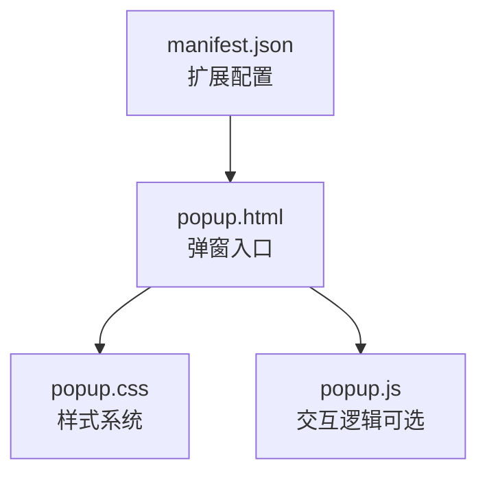
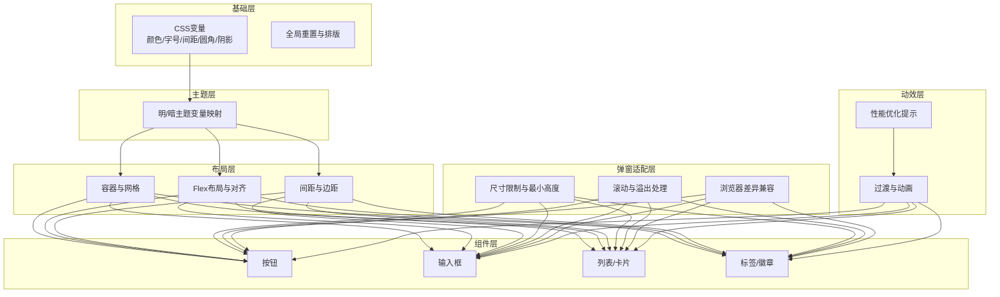
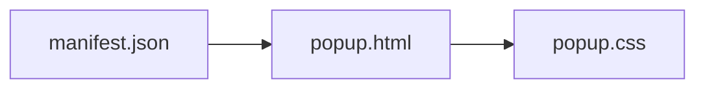

# CSS样式系统

<cite>
**本文引用的文件**   
- [popup.css](file://extension/popup.css)
- [popup.html](file://extension/popup.html)
- [manifest.json](file://extension/manifest.json)
</cite>

## 目录
1. [简介](#简介)
2. [项目结构](#项目结构)
3. [核心组件](#核心组件)
4. [架构总览](#架构总览)
5. [详细组件分析](#详细组件分析)
6. [依赖分析](#依赖分析)
7. [性能考虑](#性能考虑)
8. [故障排查指南](#故障排查指南)
9. [结论](#结论)
10. [附录](#附录)

## 简介
本指南面向Chrome扩展弹窗的CSS样式系统，围绕popup.css的样式组织结构、变量与主题设计、模块化样式管理、响应式布局、动画与交互反馈、调试技巧与性能优化展开。文档同时给出针对Chrome扩展弹窗的特殊约束与最佳实践，帮助你在有限空间内构建现代化、可维护且高性能的用户界面。

## 项目结构
本项目为Chrome扩展，弹窗相关的前端资源位于extension目录：
- popup.html：弹窗页面入口，负责引入脚本与样式
- popup.css：弹窗主样式表，承载变量、主题、布局与组件样式
- manifest.json：扩展清单，定义弹窗尺寸等关键行为

图示来源
- [popup.html](file://extension/popup.html)
- [popup.css](file://extension/popup.css)
- [manifest.json](file://extension/manifest.json)

章节来源
- [popup.html](file://extension/popup.html)
- [popup.css](file://extension/popup.css)
- [manifest.json](file://extension/manifest.json)

## 核心组件
本节聚焦popup.css中的样式组织方式与关键能力：
- CSS变量与主题系统：通过根级变量集中管理颜色、字号、间距、圆角、阴影等，支持明暗主题切换
- 模块化样式管理：按功能域划分样式块（如布局、按钮、表单、列表、卡片），使用命名约定避免冲突
- 弹窗适配层：针对Chrome扩展弹窗的尺寸限制与渲染差异提供专用规则
- 响应式与弹性布局：以Flexbox为主，结合媒体查询实现不同屏幕密度下的自适应
- 动画与过渡：统一使用transition与@keyframes，配合will-change提升性能
- 交互反馈：焦点态、悬停态、激活态、禁用态的视觉一致性

章节来源
- [popup.css](file://extension/popup.css)

## 架构总览
下图展示弹窗样式系统的分层与职责：
- 基础层：CSS变量、重置与全局排版
- 主题层：明/暗主题变量映射
- 布局层：容器、栅格、对齐、间距
- 组件层：按钮、输入框、列表、卡片、标签等
- 弹窗适配层：尺寸、滚动、溢出处理
- 动效层：过渡、动画、性能提示

图示来源
- [popup.css](file://extension/popup.css)

## 详细组件分析

### 样式组织结构与变量体系
- 变量命名规范：采用语义化前缀与层级，例如“颜色-背景”、“颜色-文本”、“尺寸-字号”、“尺寸-间距”、“形状-圆角”、“效果-阴影”等
- 主题切换：在根节点上定义默认主题变量，通过数据属性或类名切换至暗色主题变量集合
- 复用策略：组件样式仅引用变量，不硬编码具体值，确保一致性与可维护性

章节来源
- [popup.css](file://extension/popup.css)

### 模块化样式管理
- 模块划分建议：布局、通用组件、业务组件、弹窗适配、动效
- 命名约定：BEM或类似方案，保证选择器唯一性与可读性
- 作用域隔离：弹窗样式尽量限定在body或特定容器下，避免污染全局

章节来源
- [popup.css](file://extension/popup.css)

### Chrome扩展弹窗特殊样式考虑
- 尺寸限制：弹窗宽度通常受限于内容，但应避免过宽；高度需考虑最小可视区域与滚动体验
- 滚动与溢出：合理设置overflow与max-height，防止内容被截断
- 兼容性：注意不同Chrome版本对某些属性的支持差异，必要时提供降级方案

章节来源
- [popup.css](file://extension/popup.css)
- [manifest.json](file://extension/manifest.json)

### 响应式设计实现方法
- 媒体查询：基于弹窗可用宽度进行断点判断，调整列数、字号与间距
- 弹性布局：优先使用Flexbox进行行内与纵向排列，减少嵌套层级
- 自适应字体与图标：使用相对单位与缩放策略，保持可读性与一致性

章节来源
- [popup.css](file://extension/popup.css)

### 动画效果、过渡与交互反馈
- 过渡：对hover、focus、active状态使用transition，避免过度动画影响性能
- 动画：复杂动效使用@keyframes，并配合will-change提升合成效率
- 交互反馈：明确焦点轮廓、悬停高亮、点击缩放、禁用灰度等状态

章节来源
- [popup.css](file://extension/popup.css)

### 代码示例路径（无代码内容）
- 变量与主题定义位置：[popup.css](file://extension/popup.css)
- 布局与组件样式位置：[popup.css](file://extension/popup.css)
- 弹窗适配与兼容性处理位置：[popup.css](file://extension/popup.css)
- 动画与过渡定义位置：[popup.css](file://extension/popup.css)

## 依赖分析
弹窗样式系统与HTML和扩展清单存在直接依赖关系：
- popup.html引入popup.css与可能的脚本
- manifest.json可能声明弹窗尺寸或行为，间接影响样式策略

图示来源
- [popup.html](file://extension/popup.html)
- [popup.css](file://extension/popup.css)
- [manifest.json](file://extension/manifest.json)

章节来源
- [popup.html](file://extension/popup.html)
- [popup.css](file://extension/popup.css)
- [manifest.json](file://extension/manifest.json)

## 性能考虑
- 减少重排与重绘：避免频繁修改布局属性，优先使用transform与opacity
- 合理使用will-change：仅在必要元素上启用，避免滥用导致内存占用
- 控制动画复杂度：简化关键帧路径与数量，降低GPU压力
- 图片与图标：使用矢量图标与内联SVG，减少请求与缩放失真
- 样式体积：按需加载与压缩，移除未使用规则

## 故障排查指南
- 样式未生效：检查选择器优先级与作用域，确认是否被其他规则覆盖
- 弹窗尺寸异常：核对manifest中弹窗配置与CSS中的min/max尺寸
- 滚动问题：检查overflow与容器高度设置，确保内容完整可见
- 动画卡顿：定位触发重排的样式变更，替换为合成属性
- 主题切换无效：确认变量作用域与切换类名是否正确应用

章节来源
- [popup.css](file://extension/popup.css)
- [manifest.json](file://extension/manifest.json)

## 结论
通过统一的变量体系、清晰的模块化结构与针对性的弹窗适配，popup.css能够在有限的弹窗空间内提供一致的视觉体验与良好的交互反馈。结合响应式布局与性能优化策略，可在多设备与多版本环境下保持稳定表现。

## 附录
- 现代UI风格建议：
  - 使用中性背景与强调色搭配，突出关键操作
  - 合理的留白与层级，提升信息密度与可读性
  - 微交互与即时反馈，增强用户掌控感
- 参考路径：
  - 变量与主题：[popup.css](file://extension/popup.css)
  - 布局与组件：[popup.css](file://extension/popup.css)
  - 弹窗适配：[popup.css](file://extension/popup.css)
  - 动画与过渡：[popup.css](file://extension/popup.css)