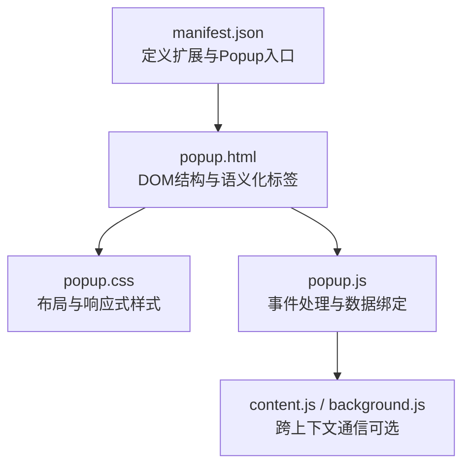
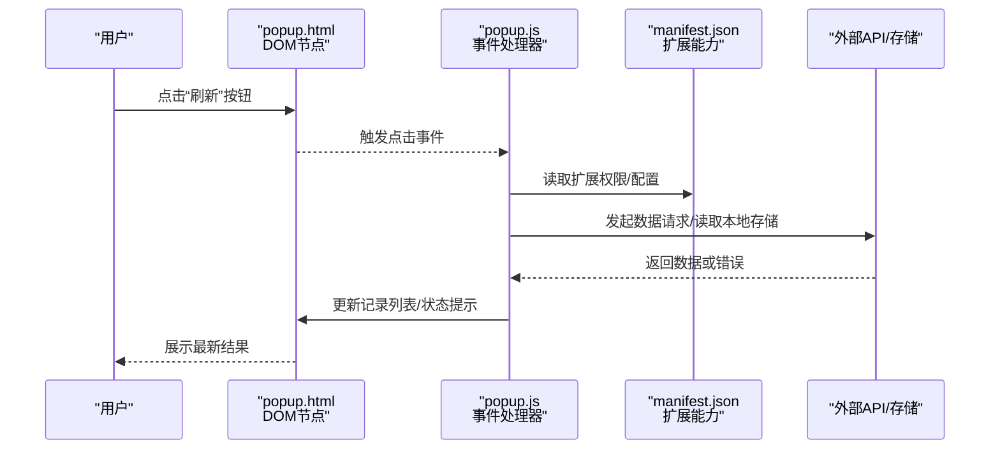
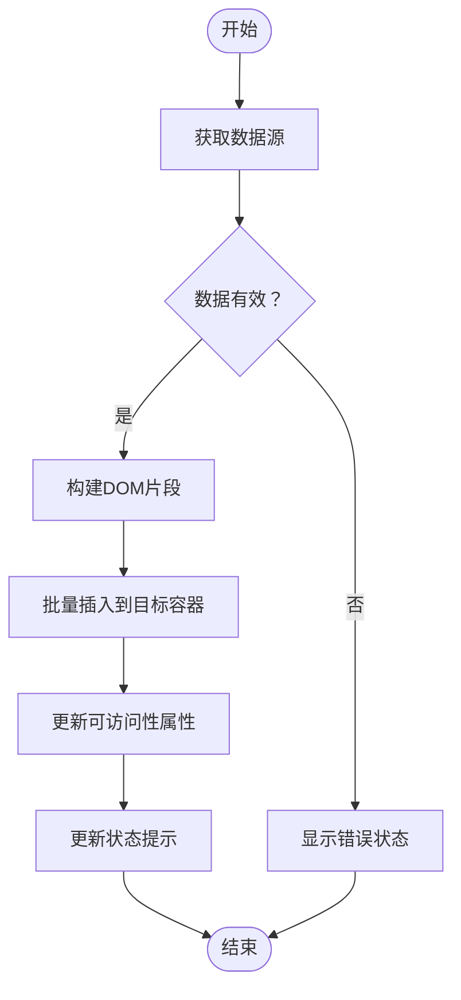
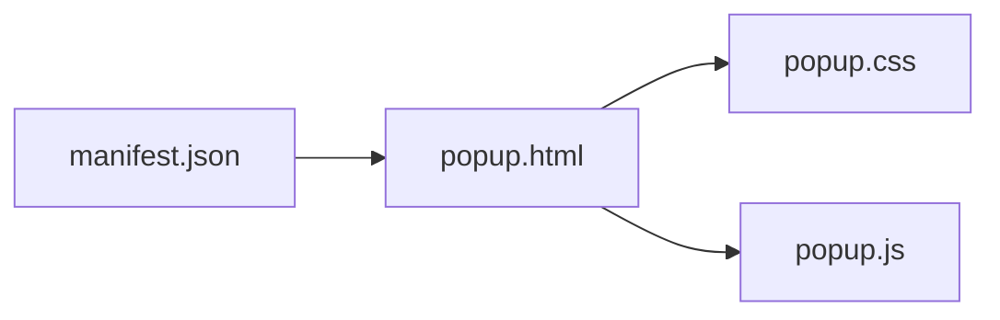

# HTML结构设计

<cite>
**本文引用的文件**   
- [popup.html](file://extension/popup.html)
- [popup.css](file://extension/popup.css)
- [popup.js](file://extension/popup.js)
- [manifest.json](file://extension/manifest.json)
</cite>

## 目录
1. [简介](#简介)
2. [项目结构](#项目结构)
3. [核心组件](#核心组件)
4. [架构总览](#架构总览)
5. [详细组件分析](#详细组件分析)
6. [依赖分析](#依赖分析)
7. [性能考虑](#性能考虑)
8. [故障排查指南](#故障排查指南)
9. [结论](#结论)
10. [附录](#附录)

## 简介
本文件聚焦于浏览器扩展的弹出界面（Popup）HTML结构设计，围绕 popup.html 的整体架构与 DOM 设计原则展开。文档将说明考勤记录展示区域、操作按钮、状态显示等核心元素的结构组织方式，提供语义化 HTML 的最佳实践建议，确保可访问性与 SEO 友好性；同时给出表单元素的设计模式、数据绑定结构与事件处理框架的组织思路，并包含构建响应式弹窗界面与动态内容渲染的具体示例路径与参考位置。

## 项目结构
本项目为浏览器扩展，弹出界面由以下关键文件组成：
- extension/popup.html：弹出界面的 HTML 骨架与布局
- extension/popup.css：弹出界面的样式与响应式规则
- extension/popup.js：弹出界面的交互逻辑、数据绑定与事件处理
- extension/manifest.json：扩展清单，声明 Popup 入口与权限

图表来源
- [manifest.json](file://extension/manifest.json)
- [popup.html](file://extension/popup.html)
- [popup.css](file://extension/popup.css)
- [popup.js](file://extension/popup.js)

章节来源
- [manifest.json](file://extension/manifest.json)
- [popup.html](file://extension/popup.html)
- [popup.css](file://extension/popup.css)
- [popup.js](file://extension/popup.js)

## 核心组件
本节从“功能域”角度梳理弹出界面的核心 UI 组件及其在 DOM 中的职责划分，便于后续深入分析与实现。

- 页面容器与导航区
  - 作用：承载整个弹窗内容，提供标题、副标题或导航入口
  - 典型结构：使用语义化区块组织头部与主内容
  - 参考位置：[popup.html](file://extension/popup.html)

- 考勤记录展示区域
  - 作用：以列表或表格形式呈现考勤条目，支持分页或滚动加载
  - 典型结构：使用有序/无序列表或表格，配合 aria-* 属性增强可访问性
  - 参考位置：[popup.html](file://extension/popup.html)

- 操作按钮组
  - 作用：执行刷新、导出、筛选、新增等操作
  - 典型结构：按钮集合，按主次层级分组，提供键盘可达性与焦点管理
  - 参考位置：[popup.html](file://extension/popup.html)

- 状态显示区
  - 作用：反馈加载中、成功、失败、空状态等
  - 典型结构：提示条、占位图、错误消息等，结合 role 与 aria-live 提升可访问性
  - 参考位置：[popup.html](file://extension/popup.html)

- 表单输入区（如需要）
  - 作用：用于搜索、筛选、新增考勤等
  - 典型结构：表单字段、校验提示、提交按钮
  - 参考位置：[popup.html](file://extension/popup.html)

章节来源
- [popup.html](file://extension/popup.html)

## 架构总览
弹出界面采用“HTML 结构 + CSS 样式 + JS 行为”的分层架构，遵循关注点分离原则：
- HTML 负责结构与语义
- CSS 负责视觉与响应式适配
- JS 负责事件处理、数据绑定与异步交互

图表来源
- [popup.html](file://extension/popup.html)
- [popup.js](file://extension/popup.js)
- [manifest.json](file://extension/manifest.json)

## 详细组件分析

### 页面容器与头部
- 目标：提供清晰的页面层次与导航信息
- 结构要点：
  - 使用语义化区块组织头部与主内容
  - 标题层级合理，避免跳过级别
  - 为关键区域添加适当的 role 与 aria-label
- 参考位置：[popup.html](file://extension/popup.html)

章节来源
- [popup.html](file://extension/popup.html)

### 考勤记录展示区域
- 目标：清晰、可访问地展示多条考勤记录
- 结构要点：
  - 列表项使用合适的列表标签，并为每个条目设置唯一标识
  - 表格场景下，表头与数据单元格对应明确，必要时使用 scope 属性
  - 对长列表提供虚拟滚动或分页策略，减少重排重绘
- 可访问性：
  - 为动态更新的区域使用 aria-live 告知屏幕阅读器
  - 为图标按钮提供文本替代
- 参考位置：[popup.html](file://extension/popup.html)

章节来源
- [popup.html](file://extension/popup.html)

### 操作按钮组
- 目标：提供直观的操作入口，保证键盘可达与焦点顺序合理
- 结构要点：
  - 使用 button 元素表达动作意图
  - 通过分组与间距区分主要与次要操作
  - 为禁用态提供 aria-disabled 或 disabled 属性
- 参考位置：[popup.html](file://extension/popup.html)

章节来源
- [popup.html](file://extension/popup.html)

### 状态显示区
- 目标：及时反馈系统状态，包括加载中、成功、失败、空数据等
- 结构要点：
  - 使用独立的提示区域，配合 role 与 aria-live 进行播报
  - 错误信息应包含明确的错误原因与恢复建议
- 参考位置：[popup.html](file://extension/popup.html)

章节来源
- [popup.html](file://extension/popup.html)

### 表单输入区（可选）
- 目标：支持搜索、筛选、新增等输入场景
- 结构要点：
  - 每个输入字段关联 label，必要时提供辅助文本
  - 使用合适的 input 类型与约束，减少无效输入
  - 提交前进行前端校验，并提供即时反馈
- 参考位置：[popup.html](file://extension/popup.html)

章节来源
- [popup.html](file://extension/popup.html)

### 响应式设计与布局
- 目标：在不同窗口尺寸下保持良好的可读性与可用性
- 结构要点：
  - 使用流式布局与弹性布局组合，避免固定宽度
  - 在小屏上折叠次要信息，优先展示关键内容
  - 控制字号、行高与间距，确保触控友好
- 参考位置：[popup.css](file://extension/popup.css)

章节来源
- [popup.css](file://extension/popup.css)

### 数据绑定与事件处理框架
- 目标：建立稳定的数据到视图的映射关系与事件分发机制
- 结构要点：
  - 为关键 DOM 节点赋予稳定 ID 或 data-* 属性，便于选择器定位
  - 事件委托集中于父容器，降低监听器数量
  - 数据变更统一通过更新函数驱动视图刷新，避免直接操作 DOM
- 参考位置：[popup.js](file://extension/popup.js)

章节来源
- [popup.js](file://extension/popup.js)

### 动态内容渲染流程
- 目标：安全、高效地渲染来自后端或本地存储的数据
- 流程要点：
  - 接收数据后先做基础校验与清洗
  - 生成最小化的 DOM 片段，批量插入以减少重排
  - 渲染完成后更新状态提示与可访问性属性
- 参考位置：[popup.js](file://extension/popup.js)

章节来源
- [popup.js](file://extension/popup.js)

#### 动态渲染流程图

图表来源
- [popup.js](file://extension/popup.js)

## 依赖分析
弹出界面与扩展清单存在强依赖关系，manifest.json 定义了 Popup 入口与必要权限，popup.html 作为入口页面引入样式与脚本。

图表来源
- [manifest.json](file://extension/manifest.json)
- [popup.html](file://extension/popup.html)
- [popup.css](file://extension/popup.css)
- [popup.js](file://extension/popup.js)

章节来源
- [manifest.json](file://extension/manifest.json)
- [popup.html](file://extension/popup.html)
- [popup.css](file://extension/popup.css)
- [popup.js](file://extension/popup.js)

## 性能考虑
- 减少重排重绘：批量更新 DOM，避免频繁读写布局属性
- 事件优化：使用事件委托，合并高频事件处理
- 渲染优化：按需渲染可见区域，避免一次性渲染大量节点
- 资源加载：延迟加载非关键脚本与图片，减小首屏体积
- 可访问性：合理使用 aria-live，避免过度播报造成性能损耗

## 故障排查指南
- 常见问题
  - 按钮无响应：检查事件绑定是否生效，确认目标节点是否存在
  - 列表不更新：核对数据绑定函数是否正确调用，确认目标容器 ID 匹配
  - 状态提示未显示：确认 aria-live 区域是否被正确更新
- 调试建议
  - 在关键步骤输出日志，定位数据流与 DOM 更新时机
  - 使用浏览器开发者工具检查网络请求与本地存储
  - 验证可访问性属性是否符合预期

章节来源
- [popup.js](file://extension/popup.js)

## 结论
通过合理的 HTML 语义化结构、清晰的组件划分与稳健的事件与数据绑定框架，可以构建出可维护、可访问且高性能的弹出界面。建议在开发过程中持续遵循语义化与可访问性最佳实践，并结合响应式布局与性能优化策略，确保在不同设备与场景下的用户体验。

## 附录
- 语义化 HTML 要点
  - 使用 header、main、section、article、footer 等语义标签组织内容
  - 为交互控件提供明确的 label 与 role
  - 保持标题层级连贯，避免跳级
- 可访问性要点
  - 为动态区域设置 aria-live
  - 为图标按钮提供文本替代
  - 确保键盘可达与焦点顺序合理
- 响应式要点
  - 使用弹性布局与流式单位
  - 在小屏上优先展示关键信息
  - 控制触控目标大小与间距