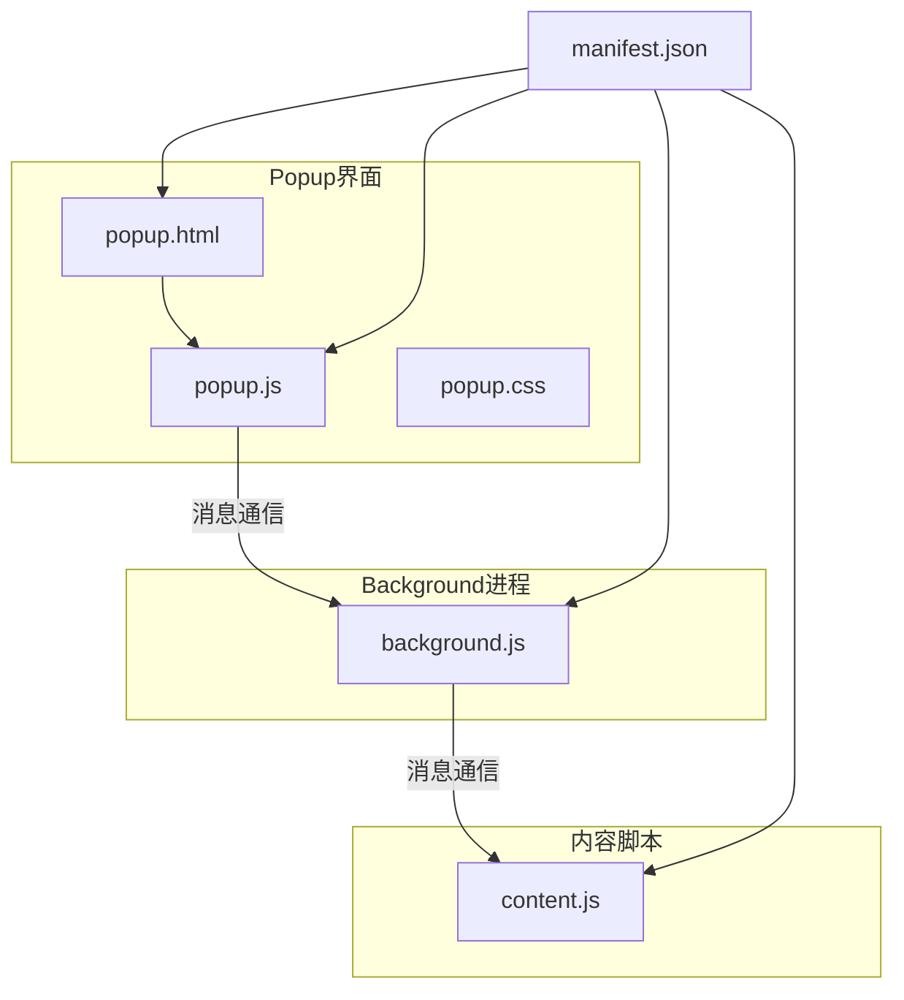
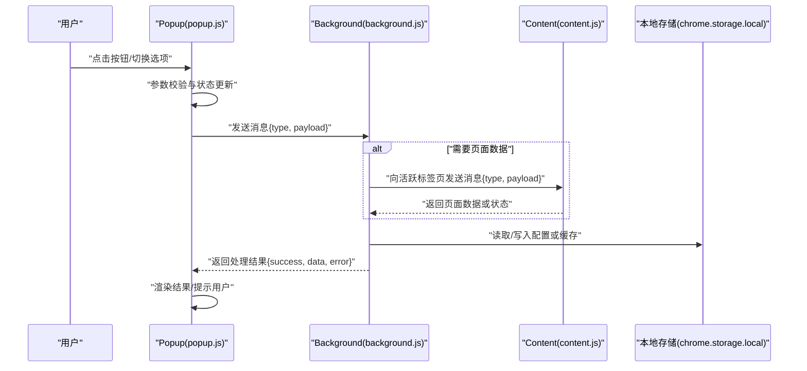
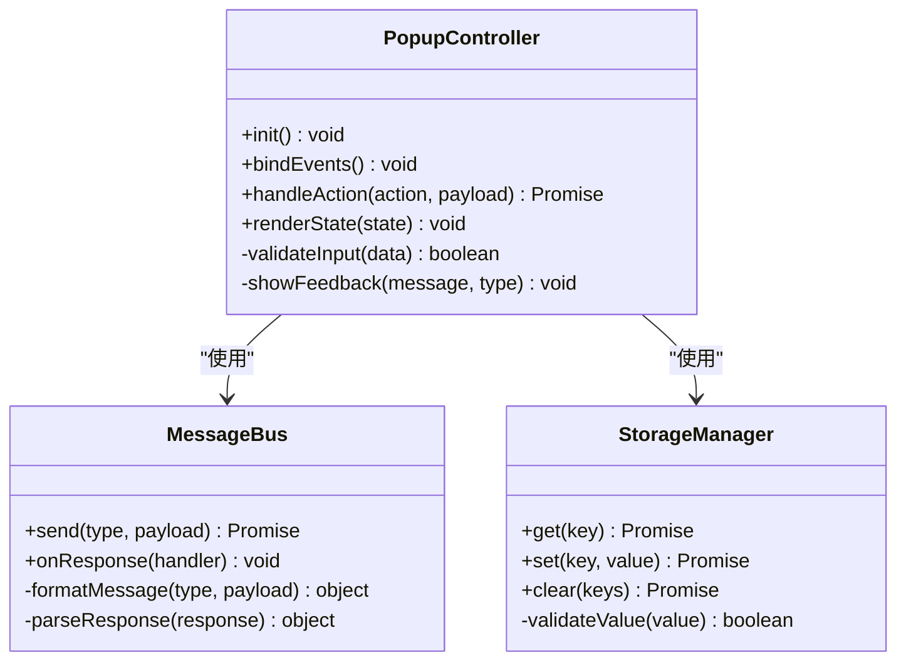
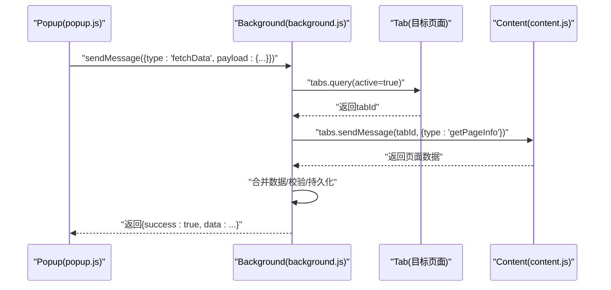
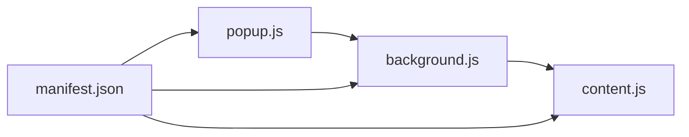

# JavaScript交互逻辑

<cite>
**本文引用的文件**   
- [popup.js](file://extension/popup.js)
- [background.js](file://extension/background.js)
- [content.js](file://extension/content.js)
- [manifest.json](file://extension/manifest.json)
- [popup.html](file://extension/popup.html)
</cite>

## 目录
1. [简介](#简介)
2. [项目结构](#项目结构)
3. [核心组件](#核心组件)
4. [架构总览](#架构总览)
5. [详细组件分析](#详细组件分析)
6. [依赖关系分析](#依赖关系分析)
7. [性能考虑](#性能考虑)
8. [故障排查指南](#故障排查指南)
9. [结论](#结论)
10. [附录](#附录)

## 简介
本文件聚焦于Chrome扩展中的JavaScript交互逻辑，重点围绕popup页面与background脚本之间的消息通信、事件处理机制、用户交互流程与状态管理，以及DOM操作优化策略。文档同时涵盖本地存储的读写与校验、错误处理与用户反馈、重构建议与最佳实践，并提供调试技巧与示例路径，帮助开发者构建可维护、高性能的交互逻辑。

## 项目结构
该扩展采用分层组织：
- popup层：负责UI渲染、用户交互、事件绑定与状态展示
- background层：负责后台任务、持久化数据、跨页面通信与权限控制
- content层：注入到目标网页，采集或注入所需信息
- manifest：声明权限、脚本入口与资源清单

图表来源
- [manifest.json](file://extension/manifest.json)
- [popup.html](file://extension/popup.html)
- [popup.js](file://extension/popup.js)
- [background.js](file://extension/background.js)
- [content.js](file://extension/content.js)

章节来源
- [manifest.json](file://extension/manifest.json)
- [popup.html](file://extension/popup.html)
- [popup.js](file://extension/popup.js)
- [background.js](file://extension/background.js)
- [content.js](file://extension/content.js)

## 核心组件
- Popup交互层（popup.js）
  - 负责DOM初始化、事件监听、用户输入校验、状态同步与结果渲染
  - 通过chrome.runtime.sendMessage与background进行异步消息通信
  - 使用chrome.storage.local进行本地数据的读取与写入
- Background服务层（background.js）
  - 接收来自popup与content的消息，执行业务逻辑（如数据聚合、网络请求、权限检查）
  - 作为持久化与跨上下文通信的中枢
- Content脚本（content.js）
  - 在目标网页上下文中运行，提供页面信息或触发页面行为
  - 与background双向通信，完成数据采集与指令下发

章节来源
- [popup.js](file://extension/popup.js)
- [background.js](file://extension/background.js)
- [content.js](file://extension/content.js)

## 架构总览
下图展示了从用户点击到最终反馈的完整调用链，包括消息传递格式与异步处理模式。

图表来源
- [popup.js](file://extension/popup.js)
- [background.js](file://extension/background.js)
- [content.js](file://extension/content.js)

## 详细组件分析

### Popup交互层（popup.js）
- 事件处理机制
  - 使用事件委托将多个按钮或列表项的统一事件处理器绑定到容器节点，减少重复监听器数量
  - 对高频事件（如滚动、输入）采用防抖/节流策略，避免频繁触发重排重绘
- 用户交互流程
  - 输入校验：对用户输入进行非空、格式与范围校验，失败时即时给出友好提示
  - 状态管理：维护当前视图状态（如加载、成功、错误），并在UI中反映
  - 批量更新：收集多次变更，统一提交并一次性刷新UI，降低DOM操作次数
- DOM操作优化
  - 使用DocumentFragment或innerHTML批量插入，减少回流
  - 优先使用classList而非直接修改style属性
  - 复用已存在的节点，避免重复创建
- 与background的消息通信
  - 发送消息：使用chrome.runtime.sendMessage，携带type与payload字段
  - 接收响应：在回调中处理success/error分支，更新UI状态
  - 长耗时任务：background返回“进行中”状态，popup轮询或等待通知
- 本地存储读写与验证
  - 读取：在初始化阶段加载配置与上次状态，若缺失则设置默认值
  - 写入：在用户确认或操作成功后写入，失败时回滚并提示
  - 校验：对写入数据进行类型与边界检查，防止脏数据污染
- 错误处理与用户反馈
  - 网络异常、权限不足、超时等错误分类处理
  - 使用toast或内联提示告知用户，必要时提供重试入口
- 代码重构建议与最佳实践
  - 将消息协议集中定义，避免硬编码字符串
  - 将UI渲染逻辑与业务逻辑解耦，便于测试与维护
  - 引入常量与枚举替代魔法数字与字符串
  - 为关键函数添加JSDoc注释，明确入参与返回值

章节来源
- [popup.js](file://extension/popup.js)

#### 事件处理与状态管理类图

图表来源
- [popup.js](file://extension/popup.js)

### Background服务层（background.js）
- 消息路由与分发
  - 根据消息type分派到对应处理器，确保单一职责
  - 对未知type返回明确的错误码，便于前端降级处理
- 与content脚本协作
  - 通过chrome.tabs.sendMessage向指定标签页发送消息
  - 处理无响应或权限拒绝的情况，返回友好的错误信息
- 本地存储与持久化
  - 在后台统一读写配置与缓存，保证数据一致性
  - 对敏感信息进行加密或最小化暴露
- 异步处理模式
  - 使用Promise封装消息处理，避免回调地狱
  - 对耗时任务采用队列或限流，避免阻塞主线程
- 错误处理与日志
  - 捕获异常并记录必要上下文（如tabId、action）
  - 对外暴露标准化错误对象，包含code、message与retryable标志

章节来源
- [background.js](file://extension/background.js)

#### 消息处理序列图

图表来源
- [background.js](file://extension/background.js)
- [content.js](file://extension/content.js)

### Content脚本（content.js）
- 页面信息采集
  - 安全地读取DOM与页面元信息，避免访问受限属性
  - 对动态变化的内容进行增量采集，减少开销
- 与background通信
  - 监听来自background的消息，执行相应动作并返回结果
  - 处理跨域限制与权限问题，向上层报告错误
- 健壮性保障
  - 检测页面环境变化（如SPA路由切换），重新注入或清理监听器
  - 对可能失败的API调用增加重试与超时控制

章节来源
- [content.js](file://extension/content.js)

## 依赖关系分析
- 模块耦合
  - popup.js依赖background.js进行业务处理与数据持久化
  - background.js依赖content.js获取页面上下文信息
  - 三者均通过manifest.json声明权限与脚本入口
- 外部依赖
  - chrome.runtime、chrome.tabs、chrome.storage等API
- 潜在循环依赖
  - 通过消息协议解耦，避免直接引用导致的循环依赖

图表来源
- [manifest.json](file://extension/manifest.json)
- [popup.js](file://extension/popup.js)
- [background.js](file://extension/background.js)
- [content.js](file://extension/content.js)

章节来源
- [manifest.json](file://extension/manifest.json)
- [popup.js](file://extension/popup.js)
- [background.js](file://extension/background.js)
- [content.js](file://extension/content.js)

## 性能考虑
- 事件层面
  - 使用事件委托减少监听器数量
  - 对输入与滚动事件实施防抖/节流
- DOM层面
  - 批量更新与片段插入，减少回流与重绘
  - 避免在高频回调中直接操作样式，改用类名切换
- 通信层面
  - 合并小消息，减少往返次数
  - 对大对象进行压缩或分页传输
- 存储层面
  - 批量读写，避免频繁I/O
  - 合理设计键空间，避免热点键竞争

[本节为通用指导，无需列出具体文件来源]

## 故障排查指南
- 常见问题定位
  - 消息未到达：检查manifest权限与消息type是否匹配
  - 页面数据为空：确认content脚本是否正确注入且具备访问权限
  - 本地存储失败：检查存储空间配额与数据类型校验
- 调试技巧
  - 在popup控制台查看消息发送与响应
  - 在background控制台打印关键变量与错误堆栈
  - 使用chrome.debugger附加到目标页面，观察content脚本执行
- 恢复策略
  - 提供重试按钮与降级显示
  - 对不可恢复错误引导用户重置配置或清除缓存

章节来源
- [popup.js](file://extension/popup.js)
- [background.js](file://extension/background.js)
- [content.js](file://extension/content.js)

## 结论
通过将事件处理、消息通信、状态管理与DOM操作进行清晰分层与优化，可以显著提升扩展的可维护性与用户体验。建议在后续迭代中持续完善消息协议、错误模型与测试覆盖，确保交互逻辑稳定可靠。

[本节为总结性内容，无需列出具体文件来源]

## 附录
- 功能实现示例路径
  - 事件委托与批量更新：参考[popup.js](file://extension/popup.js)
  - 消息协议与异步处理：参考[popup.js](file://extension/popup.js)、[background.js](file://extension/background.js)
  - 本地存储读写与校验：参考[popup.js](file://extension/popup.js)、[background.js](file://extension/background.js)
  - 错误处理与用户反馈：参考[popup.js](file://extension/popup.js)、[background.js](file://extension/background.js)
- 调试清单
  - 打开扩展弹出面板，确认事件绑定正常
  - 在background控制台查看消息路由与处理结果
  - 在目标页面控制台验证content脚本注入与数据返回
  - 检查chrome.storage.local中的数据是否符合预期

[本节为补充信息，无需列出具体文件来源]