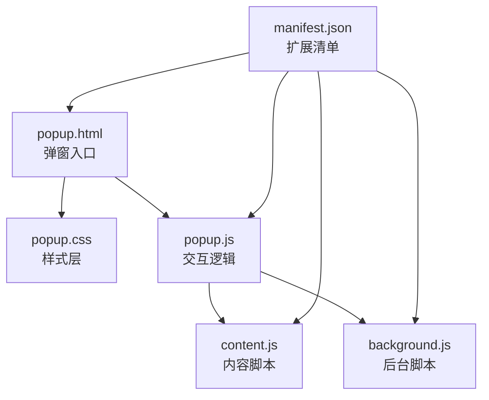
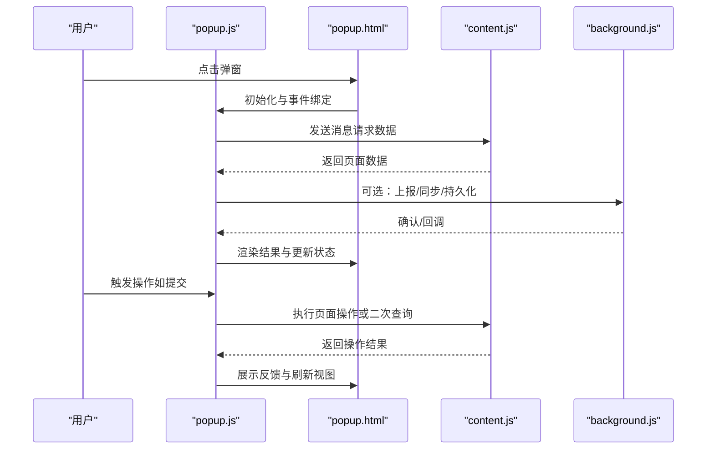
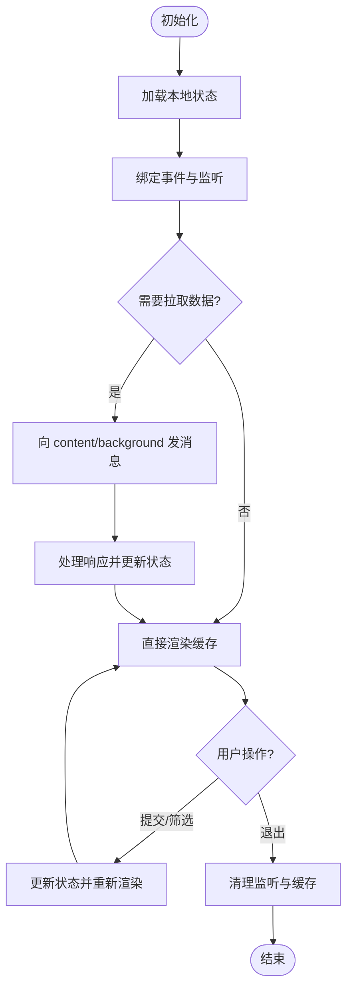
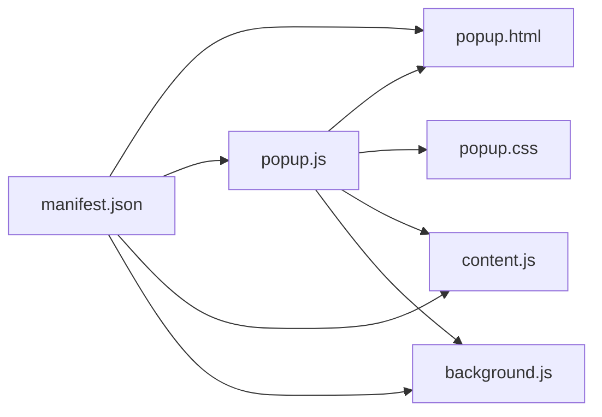

# 用户界面开发

<cite>
**本文引用的文件**   
- [popup.html](file://extension/popup.html)
- [popup.css](file://extension/popup.css)
- [popup.js](file://extension/popup.js)
- [content.js](file://extension/content.js)
- [background.js](file://extension/background.js)
- [manifest.json](file://extension/manifest.json)
</cite>

## 目录
1. [简介](#简介)
2. [项目结构](#项目结构)
3. [核心组件](#核心组件)
4. [架构总览](#架构总览)
5. [详细组件分析](#详细组件分析)
6. [依赖分析](#依赖分析)
7. [性能考虑](#性能考虑)
8. [故障排查指南](#故障排查指南)
9. [结论](#结论)
10. [附录](#附录)

## 简介
本指南面向浏览器扩展的用户界面开发者，围绕 popup 界面的 HTML 结构设计、CSS 样式组织与 JavaScript 交互逻辑展开，提供响应式适配、组件复用、状态管理、主题定制、图标资源管理与国际化支持的最佳实践。同时给出 UI 测试方法与用户体验优化建议，帮助快速构建美观实用的界面。

## 项目结构
本项目采用“功能分层 + 资源集中”的组织方式：
- extension/popup.html：popup 入口页面，定义弹窗的 DOM 骨架与语义化结构
- extension/popup.css：弹窗样式表，按模块划分样式，遵循 BEM 命名规范
- extension/popup.js：弹窗脚本，负责事件绑定、数据渲染、与 content/background 通信
- extension/content.js：内容脚本，注入目标页面，采集或操作页面数据
- extension/background.js：后台脚本，处理持久化任务、消息转发与权限控制
- extension/manifest.json：扩展清单，声明权限、脚本加载与入口文件

图表来源
- [popup.html](file://extension/popup.html)
- [popup.css](file://extension/popup.css)
- [popup.js](file://extension/popup.js)
- [content.js](file://extension/content.js)
- [background.js](file://extension/background.js)
- [manifest.json](file://extension/manifest.json)

章节来源
- [popup.html](file://extension/popup.html)
- [popup.css](file://extension/popup.css)
- [popup.js](file://extension/popup.js)
- [content.js](file://extension/content.js)
- [background.js](file://extension/background.js)
- [manifest.json](file://extension/manifest.json)

## 核心组件
- 弹窗容器与布局
  - 使用语义化标签组织头部、主体、底部区域，便于无障碍访问与样式定位
  - 通过 CSS Grid/Flexbox 实现自适应布局，确保在不同屏幕尺寸下保持可读性与可用性
- 列表与卡片
  - 以可复用的卡片组件展示条目信息，包含标题、摘要、操作按钮等
  - 使用模板字符串或轻量模板引擎进行数据渲染，避免频繁重排
- 表单与输入控件
  - 统一输入校验规则，提供即时反馈与错误提示
  - 对敏感输入进行脱敏显示与最小权限收集
- 通知与反馈
  - 使用轻量 Toast 或内联提示，避免阻塞主线程
  - 区分成功、警告、错误等状态，提供可关闭与自动消失策略
- 主题与图标
  - 基于 CSS 变量实现主题切换（浅色/深色）
  - 使用 SVG 图标，按需加载，减少体积并提升清晰度

章节来源
- [popup.html](file://extension/popup.html)
- [popup.css](file://extension/popup.css)
- [popup.js](file://extension/popup.js)

## 架构总览
popup 作为用户交互入口，通过消息机制与 content/background 协作完成数据采集、处理与结果展示。

图表来源
- [popup.js](file://extension/popup.js)
- [content.js](file://extension/content.js)
- [background.js](file://extension/background.js)
- [popup.html](file://extension/popup.html)

## 详细组件分析

### 弹窗入口与结构（popup.html）
- 结构要点
  - 使用 header/main/footer 三段式布局，明确职责边界
  - 为关键交互元素添加 aria-* 属性，提升可访问性
  - 预留占位容器用于动态渲染列表与详情
- 最佳实践
  - 将静态文案抽离到 i18n 字典，避免硬编码
  - 使用 data-* 标记业务节点，便于选择器稳定与测试定位
  - 避免在 HTML 中嵌入复杂逻辑，保持结构与行为分离

章节来源
- [popup.html](file://extension/popup.html)

### 样式组织与响应式（popup.css）
- 组织策略
  - 按模块拆分样式文件（基础、布局、组件、主题），通过构建工具合并
  - 使用 BEM 命名规范，降低类名冲突与维护成本
- 响应式适配
  - 使用媒体查询针对小屏设备调整字号、间距与布局方向
  - 优先使用相对单位（rem/em/vw/vh）与弹性布局，减少固定像素
- 主题定制
  - 通过 CSS 变量集中管理颜色、阴影、圆角等设计令牌
  - 提供默认与深色两套主题，支持系统偏好检测与手动切换

章节来源
- [popup.css](file://extension/popup.css)

### 交互逻辑与状态管理（popup.js）
- 事件与生命周期
  - 在 DOMContentLoaded 后初始化，绑定全局事件委托，减少监听器数量
  - 对弹窗打开/关闭时机做节流与去抖，避免重复请求
- 数据流与状态
  - 维护单一状态源（Store），所有视图变更由状态驱动
  - 使用发布订阅模式解耦组件间通信，避免强耦合
- 与 content/background 通信
  - 使用 browser.runtime.sendMessage 进行跨上下文通信
  - 对长耗时任务使用 background 代理，popup 仅负责 UI 与轻量计算
- 错误处理与重试
  - 网络异常时降级展示缓存数据，并提供重试入口
  - 记录关键错误日志，便于问题追踪

图表来源
- [popup.js](file://extension/popup.js)
- [content.js](file://extension/content.js)
- [background.js](file://extension/background.js)

章节来源
- [popup.js](file://extension/popup.js)
- [content.js](file://extension/content.js)
- [background.js](file://extension/background.js)

### 内容脚本与页面集成（content.js）
- 职责边界
  - 仅读取必要信息，避免侵入页面样式与脚本
  - 使用 MutationObserver 监听 DOM 变化，增量更新
- 安全与兼容
  - 对选择器增加容错与回退策略，防止页面改版导致失效
  - 避免修改全局变量，必要时使用沙箱隔离

章节来源
- [content.js](file://extension/content.js)

### 后台脚本与持久化（background.js）
- 职责边界
  - 处理耗时任务、定时任务与跨页面共享状态
  - 统一管理消息路由与权限校验
- 存储策略
  - 使用 storage.local 保存配置与历史，注意容量限制与版本迁移
  - 对敏感数据进行加密或最小化暴露

章节来源
- [background.js](file://extension/background.js)

### 扩展清单与权限（manifest.json）
- 入口与脚本
  - 声明 popup、content、background 脚本路径与运行时机
- 权限与能力
  - 按需申请 host_permissions、storage、alarms 等能力
  - 明确 CSP 与 sandbox 策略，保障安全

章节来源
- [manifest.json](file://extension/manifest.json)

## 依赖分析
- 模块耦合
  - popup.js 依赖 popup.html 的结构与 popup.css 的样式约定
  - popup.js 通过 runtime API 与 content.js、background.js 通信
- 外部依赖
  - 浏览器原生 API（runtime、storage、tabs 等）
  - 可选第三方库（如轻量模板引擎、i18n 库），应评估体积与兼容性

图表来源
- [manifest.json](file://extension/manifest.json)
- [popup.html](file://extension/popup.html)
- [popup.js](file://extension/popup.js)
- [popup.css](file://extension/popup.css)
- [content.js](file://extension/content.js)
- [background.js](file://extension/background.js)

章节来源
- [manifest.json](file://extension/manifest.json)
- [popup.html](file://extension/popup.html)
- [popup.js](file://extension/popup.js)
- [popup.css](file://extension/popup.css)
- [content.js](file://extension/content.js)
- [background.js](file://extension/background.js)

## 性能考虑
- 渲染优化
  - 批量更新 DOM，避免频繁重排；使用 DocumentFragment 或虚拟 DOM 思路
  - 列表虚拟化，仅渲染可视区域项
- 通信优化
  - 合并多次请求，减少消息往返
  - 对 content 的监听进行防抖与节流
- 资源优化
  - 压缩与懒加载图片/SVG，启用缓存
  - 按需引入第三方库，避免全量打包

[本节为通用指导，不直接分析具体文件]

## 故障排查指南
- 常见问题
  - 弹窗无法打开：检查 manifest 中 popup 字段与权限声明
  - 消息无响应：核对 runtime.sendMessage 的端口与消息类型
  - 样式错乱：确认 BEM 命名与媒体查询优先级
- 调试技巧
  - 使用浏览器开发者工具的 Extension 面板查看各脚本控制台
  - 在关键路径打印结构化日志，附带时间戳与上下文标识
- 恢复策略
  - 提供“重置配置”入口，清除异常状态
  - 对失败操作提供重试与回滚

章节来源
- [manifest.json](file://extension/manifest.json)
- [popup.js](file://extension/popup.js)
- [content.js](file://extension/content.js)
- [background.js](file://extension/background.js)

## 结论
通过清晰的 HTML 结构、模块化的 CSS 与可复用的 JS 组件，结合消息驱动的架构与完善的错误处理，可以构建出高性能、易维护且体验友好的浏览器扩展界面。配合主题定制、国际化与自动化测试，能够进一步提升可访问性与交付质量。

[本节为总结性内容，不直接分析具体文件]

## 附录

### 响应式设计最佳实践
- 使用 rem/em 与视口单位，保证缩放一致性
- 在小屏设备上隐藏次要信息，保留核心操作
- 触控友好：增大点击区域，提供明确的视觉反馈

### 组件复用与状态管理
- 组件抽象：将列表、卡片、表单封装为独立单元，提供 props 与事件回调
- 状态集中：单一 Store 驱动，避免分散状态导致不一致
- 不可变更新：使用浅比较与增量更新，减少不必要的重渲染

### 主题定制方法
- 设计令牌：颜色、字体、间距、阴影等通过 CSS 变量集中管理
- 主题切换：监听系统偏好与用户选择，动态切换根节点 class 或变量值

### 图标资源管理
- 使用 SVG 矢量图标，按需裁剪与内联
- 建立图标索引与命名规范，避免重复与歧义

### 国际化支持
- 文案外置：将所有可见文本放入语言包
- 运行时切换：根据用户设置或系统语言加载对应语言包
- 数字与日期格式化：使用本地化工具库统一处理

### UI 测试方法
- 单元测试：对纯函数与状态更新逻辑进行测试
- 集成测试：模拟消息通信与 DOM 渲染，验证端到端流程
- 可视化回归：截图对比关键页面在不同主题与尺寸下的表现

### 用户体验优化建议
- 首屏快速：预加载必要数据与样式，骨架屏过渡
- 渐进增强：在网络不佳时降级展示缓存与离线提示
- 可访问性：键盘导航、焦点管理、ARIA 标签完善

[本节为通用指导，不直接分析具体文件]