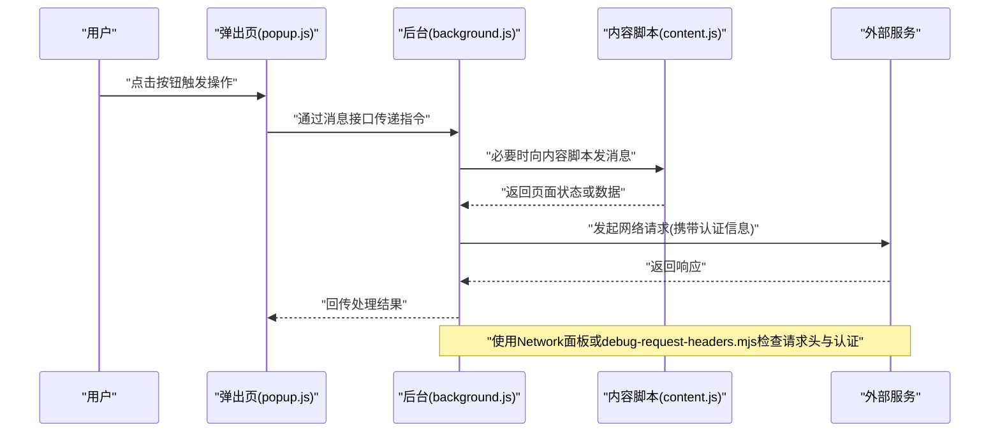
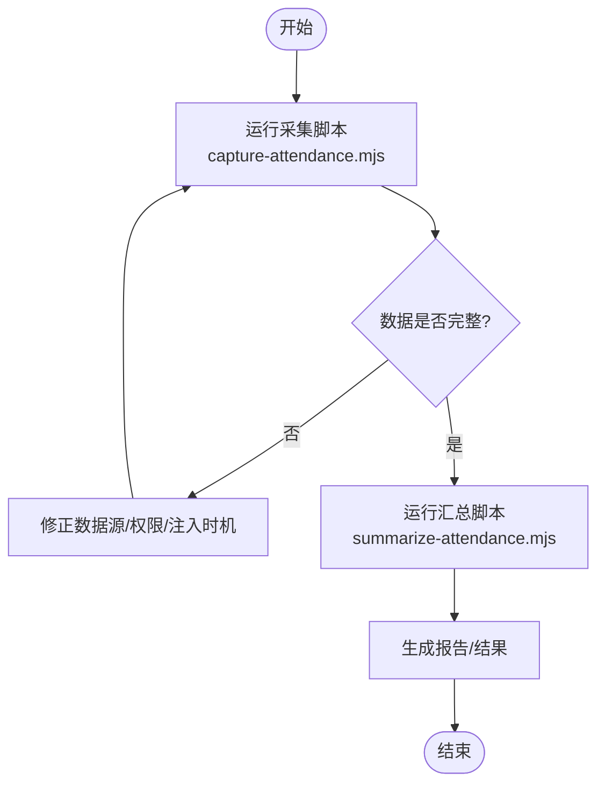
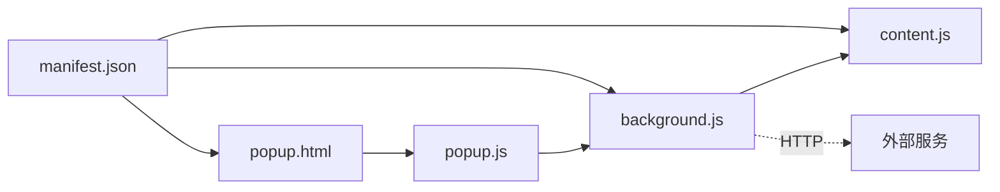

# 调试与测试

<cite>
**本文引用的文件**   
- [extension/manifest.json](file://extension/manifest.json)
- [extension/background.js](file://extension/background.js)
- [extension/content.js](file://extension/content.js)
- [extension/popup.html](file://extension/popup.html)
- [extension/popup.js](file://extension/popup.js)
- [scripts/capture-attendance.mjs](file://scripts/capture-attendance.mjs)
- [scripts/debug-request-headers.mjs](file://scripts/debug-request-headers.mjs)
- [scripts/inspect-yunchuang-auth.mjs](file://scripts/inspect-yunchuang-auth.mjs)
- [scripts/summarize-attendance.mjs](file://scripts/summarize-attendance.mjs)
</cite>

## 目录
1. [简介](#简介)
2. [项目结构](#项目结构)
3. [核心组件](#核心组件)
4. [架构总览](#架构总览)
5. [详细组件分析](#详细组件分析)
6. [依赖关系分析](#依赖关系分析)
7. [性能考虑](#性能考虑)
8. [故障排查指南](#故障排查指南)
9. [结论](#结论)
10. [附录](#附录)

## 简介
本指南面向Chrome扩展开发者，聚焦于“调试与测试”主题。内容覆盖：
- Chrome扩展的通用调试技巧（控制台日志、断点、性能分析）
- 网络请求调试（请求头检查、认证流程验证）
- Content Script与Background Script的独立调试策略
- 单元测试与集成测试编写方法
- 常见问题诊断流程与解决方案
- 利用本项目提供的调试脚本提升效率与质量

## 项目结构
仓库包含一个Chrome扩展与一组Node侧调试脚本：
- extension：Chrome扩展源码，含清单、后台脚本、内容脚本、弹出页等
- scripts：用于抓包、鉴权检查、考勤数据汇总等辅助脚本

```mermaid
graph TB
subgraph "Chrome扩展"
M["manifest.json"]
BG["background.js"]
CT["content.js"]
POP_H["popup.html"]
POP_J["popup.js"]
end
subgraph "调试脚本(Node)"
CAP["capture-attendance.mjs"]
HDR["debug-request-headers.mjs"]
AUTH["inspect-yunchuang-auth.mjs"]
SUM["summarize-attendance.mjs"]
end
M --> BG
M --> CT
M --> POP_H
POP_H --> POP_J
BG < --> CT
BG -. 外部API .-> EXT_API["外部服务(考勤/认证)"]
HDR -. 浏览器Network面板 .-> EXT_API
AUTH -. Node侧模拟/校验 .-> EXT_API
CAP -. 导出/采集 .-> DATA["本地数据"]
SUM -. 汇总/统计 .-> REPORT["报告/结果"]
```

图表来源
- [extension/manifest.json](file://extension/manifest.json)
- [extension/background.js](file://extension/background.js)
- [extension/content.js](file://extension/content.js)
- [extension/popup.html](file://extension/popup.html)
- [extension/popup.js](file://extension/popup.js)
- [scripts/debug-request-headers.mjs](file://scripts/debug-request-headers.mjs)
- [scripts/inspect-yunchuang-auth.mjs](file://scripts/inspect-yunchuang-auth.mjs)
- [scripts/capture-attendance.mjs](file://scripts/capture-attendance.mjs)
- [scripts/summarize-attendance.mjs](file://scripts/summarize-attendance.mjs)

章节来源
- [extension/manifest.json](file://extension/manifest.json)
- [extension/background.js](file://extension/background.js)
- [extension/content.js](file://extension/content.js)
- [extension/popup.html](file://extension/popup.html)
- [extension/popup.js](file://extension/popup.js)
- [scripts/debug-request-headers.mjs](file://scripts/debug-request-headers.mjs)
- [scripts/inspect-yunchuang-auth.mjs](file://scripts/inspect-yunchuang-auth.mjs)
- [scripts/capture-attendance.mjs](file://scripts/capture-attendance.mjs)
- [scripts/summarize-attendance.mjs](file://scripts/summarize-attendance.mjs)

## 核心组件
- 清单 manifest.json：声明权限、背景脚本、内容脚本、弹出页入口等，是调试时权限与加载行为的关键依据
- background.js：后台常驻逻辑，负责跨页面通信、持久化状态、发起网络请求等
- content.js：注入目标页面的脚本，负责DOM交互、事件监听、向后台发送消息
- popup.html/popup.js：用户界面与交互入口，便于触发操作与查看状态
- 调试脚本：提供网络请求头捕获、认证流程检查、考勤数据采集与汇总等能力

章节来源
- [extension/manifest.json](file://extension/manifest.json)
- [extension/background.js](file://extension/background.js)
- [extension/content.js](file://extension/content.js)
- [extension/popup.html](file://extension/popup.html)
- [extension/popup.js](file://extension/popup.js)

## 架构总览
下图展示扩展内部模块与外部服务的交互，以及调试脚本如何介入问题定位。



图表来源
- [extension/popup.js](file://extension/popup.js)
- [extension/background.js](file://extension/background.js)
- [extension/content.js](file://extension/content.js)
- [scripts/debug-request-headers.mjs](file://scripts/debug-request-headers.mjs)

## 详细组件分析

### Background Script 调试要点
- 打开方式：在扩展管理页中点击“Service Worker/后台页面”对应的开发者工具
- 关键能力：
  - 全局断点与条件断点：针对消息收发、网络请求前后设置断点
  - 控制台日志：结合时间戳与上下文对象输出，便于关联不同阶段
  - 性能分析：使用Performance面板录制关键路径，识别耗时调用
- 常见陷阱：
  - 权限不足导致无法访问某些API或页面
  - 消息路由错误导致Content Script与Background失联
  - 异步时序问题导致状态不一致

章节来源
- [extension/background.js](file://extension/background.js)

### Content Script 调试要点
- 打开方式：在目标网页上右键“检查”，切换到“内容脚本”标签页
- 关键能力：
  - DOM断点：在元素变更、属性变化、子树修改处打断点
  - 事件断点：对特定事件（如点击、输入）设置断点
  - 控制台隔离：注意作用域隔离，必要时通过postMessage与Background通信
- 常见陷阱：
  - CSP限制导致部分API不可用
  - 页面动态加载导致脚本未注入或重复注入
  - 选择器失效导致无法命中目标节点

章节来源
- [extension/content.js](file://extension/content.js)

### Popup 界面调试要点
- 打开方式：点击扩展图标打开弹出页，再对该页面执行“检查”
- 关键能力：
  - UI交互断点：在按钮点击、表单提交等事件处设置断点
  - 消息链路追踪：从UI到Background再到Content的全链路断点
- 常见陷阱：
  - 样式加载失败导致布局异常
  - 跨域资源加载被拦截

章节来源
- [extension/popup.html](file://extension/popup.html)
- [extension/popup.js](file://extension/popup.js)

### 网络请求调试与认证流程验证
- 浏览器侧：
  - Network面板：过滤XHR/Fetch，查看请求头、响应体、时序
  - 断点：在Fetch/XHR处设置断点，检查构造的请求对象
- 脚本侧：
  - debug-request-headers.mjs：用于抓取并打印请求头，辅助核对鉴权参数
  - inspect-yunchuang-auth.mjs：用于模拟或校验云创认证流程，快速定位鉴权失败原因
- 建议流程：
  - 先确认基础连通性（域名可达、端口正确）
  - 再核对认证头（Token、签名、时间戳等）
  - 最后比对服务端期望格式与扩展实际发送格式

章节来源
- [scripts/debug-request-headers.mjs](file://scripts/debug-request-headers.mjs)
- [scripts/inspect-yunchuang-auth.mjs](file://scripts/inspect-yunchuang-auth.mjs)

### 考勤数据采集与汇总（示例工作流）
- capture-attendance.mjs：采集考勤相关数据，便于离线分析与复现
- summarize-attendance.mjs：对采集数据进行汇总统计，生成报告或可视化结果



图表来源
- [scripts/capture-attendance.mjs](file://scripts/capture-attendance.mjs)
- [scripts/summarize-attendance.mjs](file://scripts/summarize-attendance.mjs)

章节来源
- [scripts/capture-attendance.mjs](file://scripts/capture-attendance.mjs)
- [scripts/summarize-attendance.mjs](file://scripts/summarize-attendance.mjs)

## 依赖关系分析
- 扩展内依赖：
  - manifest.json 声明 background.js、content.js、popup.html 的加载与权限
  - popup.js 通过消息机制与 background.js 通信
  - background.js 可主动与 content.js 通信以获取页面上下文
- 外部依赖：
  - 网络请求依赖的目标服务（如考勤/认证服务）
  - 调试脚本依赖Node环境及必要的第三方库（如有）



图表来源
- [extension/manifest.json](file://extension/manifest.json)
- [extension/background.js](file://extension/background.js)
- [extension/content.js](file://extension/content.js)
- [extension/popup.html](file://extension/popup.html)
- [extension/popup.js](file://extension/popup.js)

章节来源
- [extension/manifest.json](file://extension/manifest.json)
- [extension/background.js](file://extension/background.js)
- [extension/content.js](file://extension/content.js)
- [extension/popup.html](file://extension/popup.html)
- [extension/popup.js](file://extension/popup.js)

## 性能考虑
- 减少不必要的重绘与回流：避免在高频事件中直接操作DOM
- 批量处理与节流：对频繁触发的回调进行合并或限流
- 缓存热点数据：在Background中维护必要缓存，降低重复计算与网络开销
- 监控与度量：使用Performance面板记录关键路径，关注长任务与主线程阻塞

[本节为通用指导，不直接分析具体文件]

## 故障排查指南
- 扩展未加载或功能无效
  - 检查manifest权限与脚本路径是否正确
  - 重新加载扩展并清空缓存后重试
- 消息无法互通
  - 在Background与Content两端分别打日志与断点，确认消息名称与路由
  - 检查页面类型是否允许注入内容脚本
- 网络请求失败
  - 使用Network面板核对URL、方法、头部、载荷
  - 使用debug-request-headers.mjs对比期望与实际请求头
  - 使用inspect-yunchuang-auth.mjs验证认证流程与签名
- 数据不准确或不完整
  - 使用capture-attendance.mjs采集原始数据，定位差异
  - 使用summarize-attendance.mjs生成汇总报告，辅助比对

章节来源
- [extension/manifest.json](file://extension/manifest.json)
- [extension/background.js](file://extension/background.js)
- [extension/content.js](file://extension/content.js)
- [scripts/debug-request-headers.mjs](file://scripts/debug-request-headers.mjs)
- [scripts/inspect-yunchuang-auth.mjs](file://scripts/inspect-yunchuang-auth.mjs)
- [scripts/capture-attendance.mjs](file://scripts/capture-attendance.mjs)
- [scripts/summarize-attendance.mjs](file://scripts/summarize-attendance.mjs)

## 结论
通过系统化的调试方法与测试策略，可以显著提升Chrome扩展的开发效率与稳定性。建议将以下实践纳入日常开发：
- 建立标准化的日志与断点规范
- 在网络与认证环节引入自动化检查脚本
- 对关键路径进行性能基线测量与回归
- 将常见问题沉淀为排障清单与自动化用例

[本节为总结性内容，不直接分析具体文件]

## 附录

### 常用调试入口与快捷键
- 打开扩展管理页：chrome://extensions
- 打开后台页面调试：在扩展管理页点击“Service Worker/后台页面”
- 打开内容脚本调试：在目标页面右键“检查”→“内容脚本”
- 打开弹出页调试：点击扩展图标打开弹出页，再对该页面执行“检查”
- 打开Network面板：F12 → Network，勾选Preserve log以便跨跳转保留日志

[本节为通用指导，不直接分析具体文件]

### 测试编写建议
- 单元测试
  - 针对纯函数与工具方法进行断言，确保边界条件与异常分支覆盖
  - 使用Mock替代外部依赖（如网络请求、存储API），保证可重复性
- 集成测试
  - 模拟真实用户流程：从Popup触发→Background处理→Content交互→网络请求
  - 使用脚本驱动端到端场景，例如先采集数据再汇总，验证最终一致性
- 持续集成
  - 将测试与脚本纳入CI流水线，自动执行并产出报告

[本节为通用指导，不直接分析具体文件]