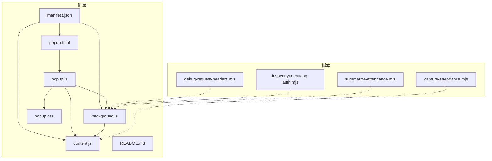
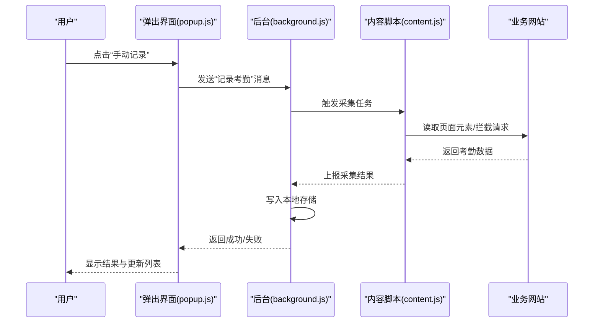
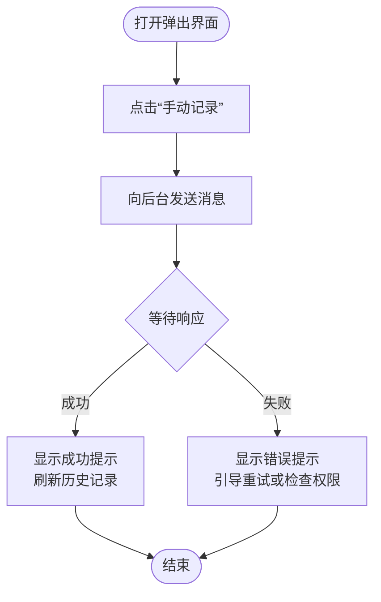
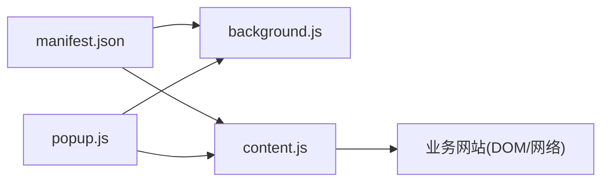

# 快速开始

<cite>
**本文引用的文件**   
- [extension/README.md](file://extension/README.md)
- [extension/background.js](file://extension/background.js)
- [extension/content.js](file://extension/content.js)
- [extension/manifest.json](file://extension/manifest.json)
- [extension/popup.css](file://extension/popup.css)
- [extension/popup.html](file://extension/popup.html)
- [extension/popup.js](file://extension/popup.js)
- [scripts/capture-attendance.mjs](file://scripts/capture-attendance.mjs)
- [scripts/debug-request-headers.mjs](file://scripts/debug-request-headers.mjs)
- [scripts/inspect-yunchuang-auth.mjs](file://scripts/inspect-yunchuang-auth.mjs)
- [scripts/summarize-attendance.mjs](file://scripts/summarize-attendance.mjs)
</cite>

## 目录
1. [简介](#简介)
2. [项目结构](#项目结构)
3. [核心组件](#核心组件)
4. [架构总览](#架构总览)
5. [详细组件分析](#详细组件分析)
6. [依赖关系分析](#依赖关系分析)
7. [性能与稳定性建议](#性能与稳定性建议)
8. [故障排除指南](#故障排除指南)
9. [结论](#结论)
10. [附录：安装与配置步骤](#附录安装与配置步骤)

## 简介
本指南面向初次接触“工时记录”Chrome 扩展的用户，目标是帮助你在最短时间内完成安装、启用与基本使用。你将学会：
- 在 Chrome 中加载开发模式扩展
- 进行基础设置与初始配置
- 使用核心功能（手动记录考勤、查看历史记录）
- 排查常见问题并获取进一步调试信息

## 项目结构
仓库包含两部分：
- extension：Chrome 扩展源码，含清单、后台脚本、内容脚本、弹出界面与样式
- scripts：辅助脚本，用于抓取考勤数据、调试请求头、检查云创认证以及汇总考勤结果

图表来源
- [extension/manifest.json](file://extension/manifest.json)
- [extension/background.js](file://extension/background.js)
- [extension/content.js](file://extension/content.js)
- [extension/popup.html](file://extension/popup.html)
- [extension/popup.css](file://extension/popup.css)
- [extension/popup.js](file://extension/popup.js)
- [scripts/capture-attendance.mjs](file://scripts/capture-attendance.mjs)
- [scripts/debug-request-headers.mjs](file://scripts/debug-request-headers.mjs)
- [scripts/inspect-yunchuang-auth.mjs](file://scripts/inspect-yunchuang-auth.mjs)
- [scripts/summarize-attendance.mjs](file://scripts/summarize-attendance.mjs)

章节来源
- [extension/README.md](file://extension/README.md)

## 核心组件
- 清单 manifest.json：声明扩展权限、背景页、内容脚本注入目标、弹出页面等
- background.js：扩展后台逻辑，负责持久化存储、消息路由、与内容脚本通信
- content.js：注入到业务页面，采集考勤相关 DOM/事件或拦截网络请求
- popup.html/css/js：用户交互入口，提供手动打卡、查看历史、导出等功能
- 辅助脚本：用于抓包、调试认证与汇总统计

章节来源
- [extension/manifest.json](file://extension/manifest.json)
- [extension/background.js](file://extension/background.js)
- [extension/content.js](file://extension/content.js)
- [extension/popup.html](file://extension/popup.html)
- [extension/popup.css](file://extension/popup.css)
- [extension/popup.js](file://extension/popup.js)

## 架构总览
扩展采用典型的“弹出界面 + 后台 + 内容脚本”三层架构。弹出界面负责用户操作；后台负责状态与存储；内容脚本负责在业务页面采集数据并与后台通信。

图表来源
- [extension/popup.js](file://extension/popup.js)
- [extension/background.js](file://extension/background.js)
- [extension/content.js](file://extension/content.js)

## 详细组件分析

### 弹出界面（popup.html / popup.css / popup.js）
- 职责：提供 UI 按钮与表单，发起记录动作，展示历史记录，支持导出
- 交互流程：用户点击 → 调用后台 API → 渲染结果与列表
- 样式：通过 popup.css 控制布局与主题

图表来源
- [extension/popup.js](file://extension/popup.js)
- [extension/popup.html](file://extension/popup.html)
- [extension/popup.css](file://extension/popup.css)

章节来源
- [extension/popup.html](file://extension/popup.html)
- [extension/popup.css](file://extension/popup.css)
- [extension/popup.js](file://extension/popup.js)

### 后台服务（background.js）
- 职责：维护本地存储、处理来自弹出界面的消息、调度内容脚本执行、聚合结果
- 关键点：消息路由、异步处理、错误回传

章节来源
- [extension/background.js](file://extension/background.js)

### 内容脚本（content.js）
- 职责：注入到业务站点，读取考勤相关 DOM 或监听网络请求，将原始数据上报后台
- 关键点：选择器策略、防抖/节流、异常捕获与重试

章节来源
- [extension/content.js](file://extension/content.js)

### 清单与权限（manifest.json）
- 职责：声明扩展元信息、权限、注入规则、背景页与弹出页
- 关键点：host 匹配、permissions、content_scripts 配置

章节来源
- [extension/manifest.json](file://extension/manifest.json)

### 辅助脚本（scripts/*.mjs）
- capture-attendance.mjs：抓取考勤数据快照，便于定位问题
- debug-request-headers.mjs：调试请求头，验证鉴权与参数
- inspect-yunchuang-auth.mjs：检查云创认证流程
- summarize-attendance.mjs：汇总与统计考勤结果

章节来源
- [scripts/capture-attendance.mjs](file://scripts/capture-attendance.mjs)
- [scripts/debug-request-headers.mjs](file://scripts/debug-request-headers.mjs)
- [scripts/inspect-yunchuang-auth.mjs](file://scripts/inspect-yunchuang-auth.mjs)
- [scripts/summarize-attendance.mjs](file://scripts/summarize-attendance.mjs)

## 依赖关系分析
- 内部依赖
  - popup.js 依赖 background.js 的消息通道
  - background.js 依赖 content.js 的数据采集能力
  - manifest.json 驱动 background.js 与 content.js 的加载与注入
- 外部依赖
  - 浏览器 WebExtensions API（storage、tabs、runtime 等）
  - 目标业务网站的 DOM 结构与网络协议（需根据实际站点调整选择器或拦截规则）

图表来源
- [extension/manifest.json](file://extension/manifest.json)
- [extension/background.js](file://extension/background.js)
- [extension/content.js](file://extension/content.js)
- [extension/popup.js](file://extension/popup.js)

章节来源
- [extension/manifest.json](file://extension/manifest.json)
- [extension/background.js](file://extension/background.js)
- [extension/content.js](file://extension/content.js)
- [extension/popup.js](file://extension/popup.js)

## 性能与稳定性建议
- 减少不必要的 DOM 查询与重绘，必要时对采集逻辑做防抖/节流
- 批量写入本地存储，避免频繁 I/O
- 为网络请求增加超时与重试机制，提升弱网环境下的成功率
- 对选择器与正则表达式进行最小化匹配，降低误判率

[本节为通用建议，无需代码引用]

## 故障排除指南
- 无法加载扩展
  - 确认已在开发者模式下以“加载已解压的扩展程序”方式导入 extension 目录
  - 检查 manifest.json 是否完整且无语法错误
- 弹出界面无响应
  - 打开扩展管理页，确认 background.js 未报错
  - 在弹出界面控制台查看是否有跨域或权限错误
- 无法采集考勤数据
  - 核对 content.js 的注入 URL 是否与当前业务站点一致
  - 使用 capture-attendance.mjs 抓取快照，对比预期字段是否存在
  - 使用 debug-request-headers.mjs 与 inspect-yunchuang-auth.mjs 验证鉴权与请求头
- 历史记录不更新
  - 检查 background.js 的本地存储写入是否成功
  - 刷新弹出界面或重新打开以触发列表渲染

章节来源
- [extension/README.md](file://extension/README.md)
- [extension/manifest.json](file://extension/manifest.json)
- [extension/background.js](file://extension/background.js)
- [extension/content.js](file://extension/content.js)
- [extension/popup.js](file://extension/popup.js)
- [scripts/capture-attendance.mjs](file://scripts/capture-attendance.mjs)
- [scripts/debug-request-headers.mjs](file://scripts/debug-request-headers.mjs)
- [scripts/inspect-yunchuang-auth.mjs](file://scripts/inspect-yunchuang-auth.mjs)

## 结论
通过本指南，你应已完成扩展的安装与基础配置，并能使用手动记录与历史记录查看等核心功能。若遇到问题，可参考故障排除部分并结合辅助脚本进行定位。后续可根据业务站点变化调整内容脚本的选择器与网络拦截策略。

[本节为总结性内容，无需代码引用]

## 附录：安装与配置步骤
- 准备
  - 确保使用 Chrome 浏览器
  - 准备好 extension 目录路径
- 加载扩展（开发模式）
  - 打开 chrome://extensions/
  - 开启右上角“开发者模式”
  - 点击“加载已解压的扩展程序”，选择 extension 目录
- 初始配置
  - 打开任意业务站点页面，确认扩展图标可用
  - 点击扩展图标进入弹出界面，按提示完成首次设置（如选择站点、授权等）
- 使用核心功能
  - 手动记录考勤：在弹出界面点击“手动记录”，等待成功提示
  - 查看历史记录：在弹出界面滚动或分页查看最近记录
  - 导出数据：如有导出按钮，点击后保存为 CSV/JSON（取决于实现）
- 验证与调试
  - 打开弹出界面控制台，观察日志输出
  - 使用 capture-attendance.mjs 抓取快照，确认关键字段存在
  - 使用 debug-request-headers.mjs 与 inspect-yunchuang-auth.mjs 校验鉴权与请求头

章节来源
- [extension/README.md](file://extension/README.md)
- [extension/manifest.json](file://extension/manifest.json)
- [extension/popup.html](file://extension/popup.html)
- [extension/popup.js](file://extension/popup.js)
- [extension/content.js](file://extension/content.js)
- [extension/background.js](file://extension/background.js)
- [scripts/capture-attendance.mjs](file://scripts/capture-attendance.mjs)
- [scripts/debug-request-headers.mjs](file://scripts/debug-request-headers.mjs)
- [scripts/inspect-yunchuang-auth.mjs](file://scripts/inspect-yunchuang-auth.mjs)