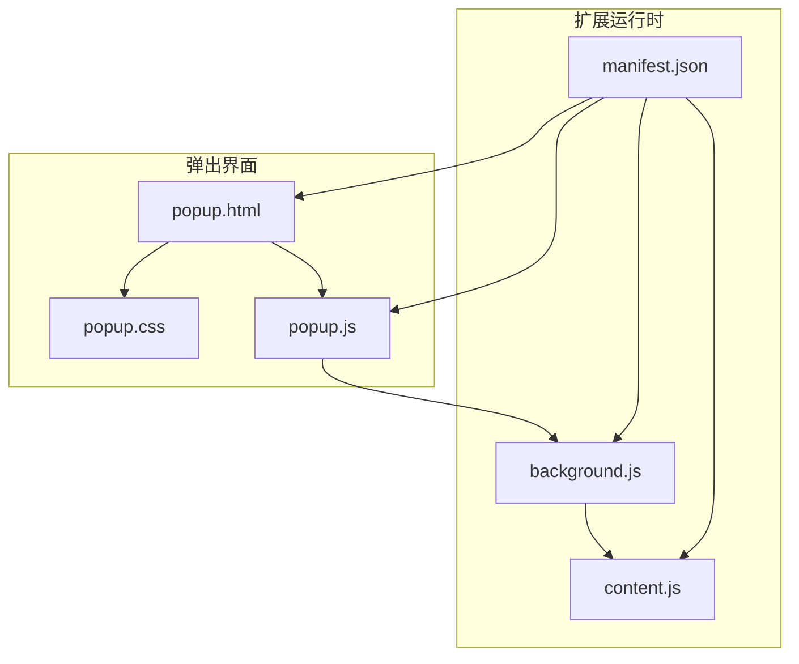
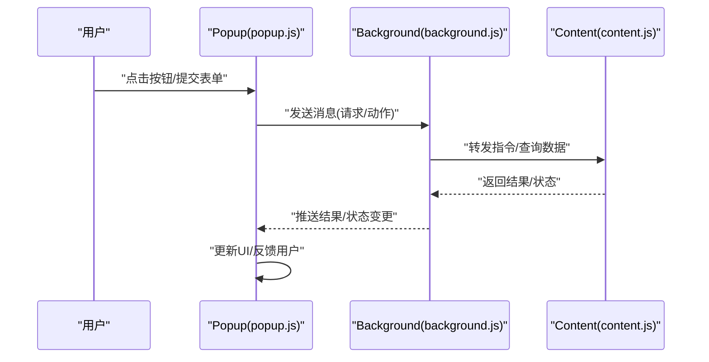
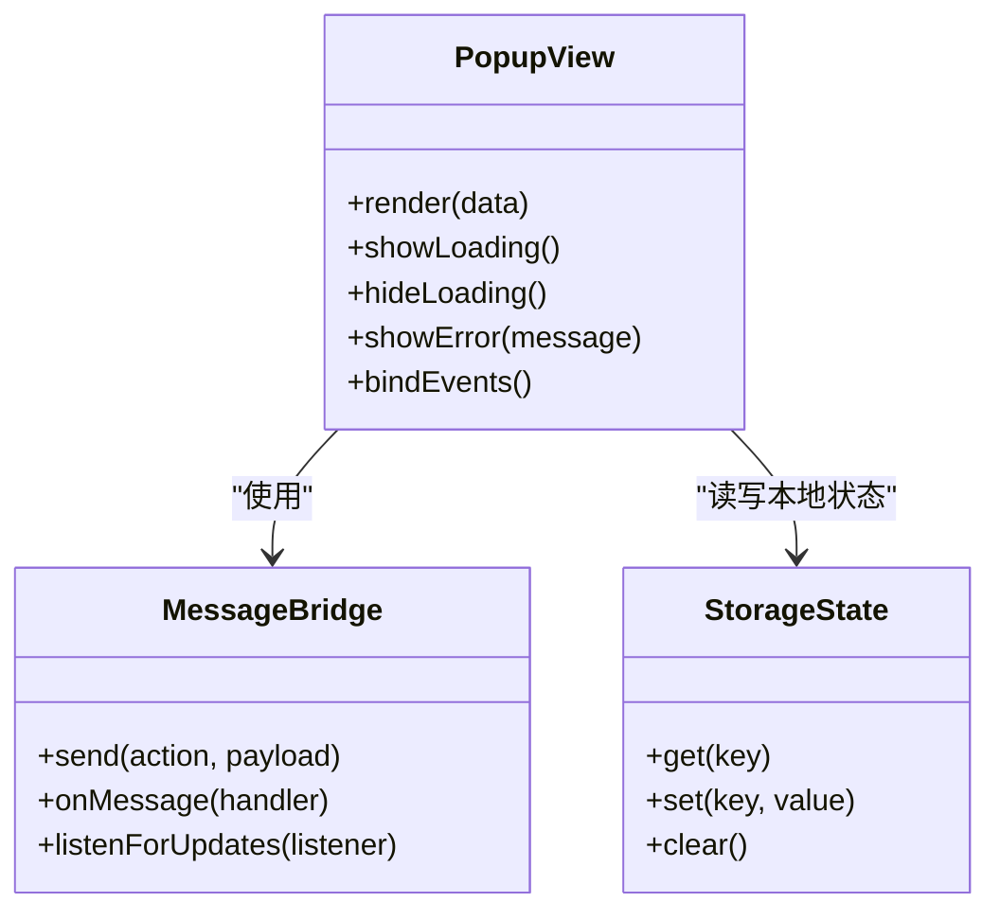
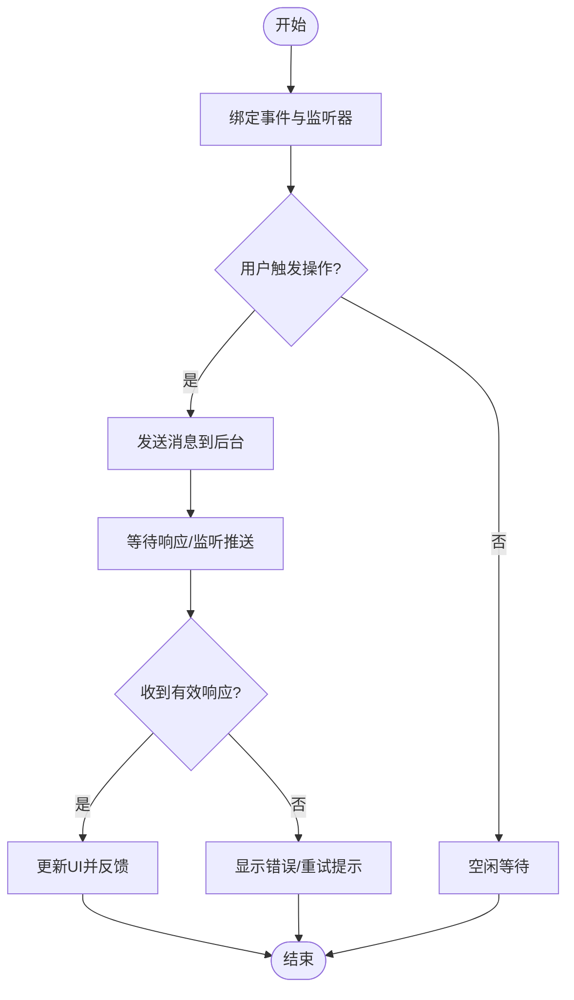
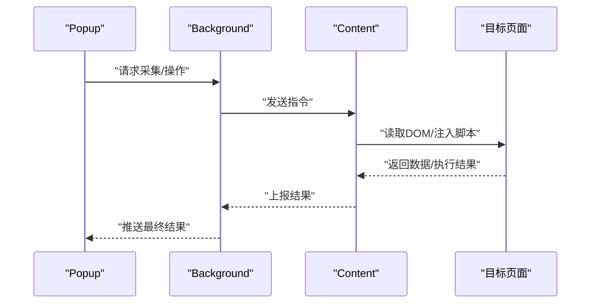
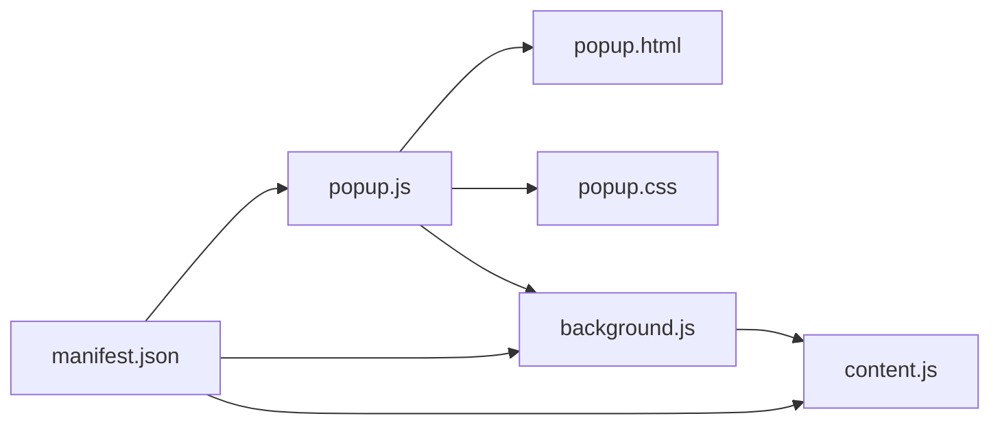

# 弹出界面交互

<cite>
**本文引用的文件**   
- [extension/popup.html](file://extension/popup.html)
- [extension/popup.css](file://extension/popup.css)
- [extension/popup.js](file://extension/popup.js)
- [extension/background.js](file://extension/background.js)
- [extension/content.js](file://extension/content.js)
- [extension/manifest.json](file://extension/manifest.json)
</cite>

## 目录
1. [简介](#简介)
2. [项目结构](#项目结构)
3. [核心组件](#核心组件)
4. [架构总览](#架构总览)
5. [详细组件分析](#详细组件分析)
6. [依赖分析](#依赖分析)
7. [性能考虑](#性能考虑)
8. [故障排查指南](#故障排查指南)
9. [结论](#结论)
10. [附录](#附录)

## 简介
本技术文档聚焦于浏览器扩展的“弹出界面”（Popup）交互能力，围绕以下目标展开：
- 解析 Popup 的 HTML 结构设计、CSS 样式布局与响应式适配策略
- 梳理 JavaScript 交互逻辑与事件处理机制（按钮点击、表单输入、数据展示等）
- 说明 Popup 与 Background Script 的消息传递机制（异步通信、状态同步、错误处理）
- 提供 UI 组件实现要点、用户体验优化建议与可操作的示例路径
- 给出动态内容加载、实时数据更新和用户反馈的实现思路与参考位置

## 项目结构
本项目采用按功能域组织的方式，Popup 相关的前端资源集中在 extension 目录下：
- popup.html：弹出界面的结构与模板
- popup.css：弹出界面的样式与布局
- popup.js：弹出界面的交互逻辑与消息通信
- background.js：后台脚本，负责持久化状态、跨页面通信与任务调度
- content.js：注入到网页的内容脚本，用于采集或注入信息
- manifest.json：扩展清单，声明权限、入口与资源

图表来源
- [extension/popup.html](file://extension/popup.html)
- [extension/popup.css](file://extension/popup.css)
- [extension/popup.js](file://extension/popup.js)
- [extension/background.js](file://extension/background.js)
- [extension/content.js](file://extension/content.js)
- [extension/manifest.json](file://extension/manifest.json)

章节来源
- [extension/popup.html](file://extension/popup.html)
- [extension/popup.css](file://extension/popup.css)
- [extension/popup.js](file://extension/popup.js)
- [extension/background.js](file://extension/background.js)
- [extension/content.js](file://extension/content.js)
- [extension/manifest.json](file://extension/manifest.json)

## 核心组件
- 弹出界面（Popup）
  - 职责：承载用户操作入口、展示关键信息与结果、发起后台任务、接收并渲染数据
  - 组成：HTML 结构、CSS 样式、JS 交互逻辑
- 后台脚本（Background）
  - 职责：维护全局状态、执行耗时任务、协调 Content Script、向 Popup 推送状态
- 内容脚本（Content）
  - 职责：在目标页面中读取/注入 DOM、监听页面事件、与 Background 双向通信

章节来源
- [extension/popup.js](file://extension/popup.js)
- [extension/background.js](file://extension/background.js)
- [extension/content.js](file://extension/content.js)

## 架构总览
Popup 通过消息通道与 Background 进行异步通信；Background 根据需要与 Content Script 协作完成数据采集或页面操作。整体遵循“UI 层（Popup）— 控制层（Background）— 数据层（Content/Storage）”的分层模式。

图表来源
- [extension/popup.js](file://extension/popup.js)
- [extension/background.js](file://extension/background.js)
- [extension/content.js](file://extension/content.js)

## 详细组件分析

### 弹出界面（HTML/CSS/JS）
- HTML 结构
  - 典型区块：标题区、操作区（按钮/表单）、结果展示区、提示/反馈区
  - 语义化标签与可访问性：使用合适的标签、aria-* 属性提升可用性
- CSS 布局
  - 采用弹性布局或网格布局，保证在不同屏幕尺寸下的可读性与可操作性
  - 响应式断点：针对小屏设备调整字号、间距与控件尺寸
  - 主题与对比度：确保文本与背景对比度满足无障碍要求
- JS 交互
  - 事件绑定：为按钮、表单元素注册点击/输入/提交事件
  - 状态管理：维护本地状态（如加载中、成功、失败），驱动 UI 更新
  - 数据渲染：将后台返回的数据映射到模板节点，避免直接拼接字符串
  - 防抖节流：对高频输入或重复点击做保护，减少无效请求

章节来源
- [extension/popup.html](file://extension/popup.html)
- [extension/popup.css](file://extension/popup.css)
- [extension/popup.js](file://extension/popup.js)

#### 类图（概念性）

[此图为概念示意，不直接对应具体源码文件]

### 消息通信机制（Popup ↔ Background）
- 通信模型
  - 单向请求-响应：Popup 发送消息，Background 处理后返回结果
  - 长连接/事件推送：Background 主动推送状态变更，Popup 订阅并更新
- 异步与错误处理
  - 超时与重试：对网络或后台任务设置超时，必要时重试
  - 错误分类：区分网络错误、业务错误与系统错误，分别提示
  - 幂等设计：对重复提交进行去重或合并
- 状态同步
  - 基于存储的状态快照：Popup 启动时从持久化存储恢复状态
  - 增量更新：仅渲染差异字段，降低重绘开销

图表来源
- [extension/popup.js](file://extension/popup.js)
- [extension/background.js](file://extension/background.js)

章节来源
- [extension/popup.js](file://extension/popup.js)
- [extension/background.js](file://extension/background.js)

### 与内容脚本（Content）协作
- 职责划分
  - Content 负责读取目标页面的结构化数据或注入必要脚本
  - Background 作为中转，聚合数据并回传给 Popup
- 安全与兼容性
  - 最小权限原则：仅在需要时访问特定页面
  - 兼容不同站点结构：对选择器与数据结构做容错与降级

图表来源
- [extension/background.js](file://extension/background.js)
- [extension/content.js](file://extension/content.js)

章节来源
- [extension/background.js](file://extension/background.js)
- [extension/content.js](file://extension/content.js)

### 用户反馈与体验优化
- 即时反馈
  - 加载中状态：禁用交互、显示进度指示
  - 成功/失败提示：使用轻量 Toast 或内联提示，避免阻塞
- 可访问性
  - 键盘可达：Tab 顺序合理，Enter/Space 行为一致
  - 屏幕阅读器友好：为图标和动态区域添加 aria-label/role
- 响应式与触控
  - 大触控目标：按钮与输入框尺寸适合手指操作
  - 自适应排版：在小屏下自动换行与滚动

章节来源
- [extension/popup.css](file://extension/popup.css)
- [extension/popup.html](file://extension/popup.html)

## 依赖分析
- 内部依赖
  - popup.js 依赖 popup.html 的结构与 popup.css 的样式
  - background.js 与 content.js 通过消息通道协作
- 外部依赖
  - 浏览器 API：消息通信、存储、定时器、网络请求等
  - 可选第三方库：若存在，应在清单中声明权限与 CSP

图表来源
- [extension/popup.js](file://extension/popup.js)
- [extension/popup.html](file://extension/popup.html)
- [extension/popup.css](file://extension/popup.css)
- [extension/background.js](file://extension/background.js)
- [extension/content.js](file://extension/content.js)
- [extension/manifest.json](file://extension/manifest.json)

章节来源
- [extension/manifest.json](file://extension/manifest.json)
- [extension/popup.js](file://extension/popup.js)
- [extension/background.js](file://extension/background.js)
- [extension/content.js](file://extension/content.js)

## 性能考虑
- 渲染优化
  - 批量更新：合并多次状态变更，减少重排重绘
  - 虚拟列表：大数据量展示时使用分页或虚拟化
- 通信优化
  - 消息去重：相同请求在短时间内合并
  - 按需拉取：仅在可见区域或用户操作后加载数据
- 内存与生命周期
  - 及时解绑事件与清理定时器
  - 避免在 Popup 中持有大量引用，防止泄漏

[本节为通用指导，无需代码来源]

## 故障排查指南
- 常见问题定位
  - 消息未送达：检查权限与端口监听是否正确
  - 状态不同步：确认是否同时读写同一键值，是否存在竞态
  - 页面结构变化：Content 的选择器失效需增加容错
- 调试技巧
  - 在 Popup 控制台打印消息收发日志
  - 在 Background 与 Content 中输出关键路径日志
  - 使用断点与条件断点缩小问题范围
- 错误处理建议
  - 统一错误码与错误消息格式
  - 对用户可见的错误进行友好提示，并提供重试入口

章节来源
- [extension/popup.js](file://extension/popup.js)
- [extension/background.js](file://extension/background.js)
- [extension/content.js](file://extension/content.js)

## 结论
通过清晰的分层与消息通信机制，Popup 能够以低耦合的方式与 Background 和 Content 协同工作，为用户提供流畅的交互体验。建议在后续迭代中持续完善错误处理、可访问性与性能优化，确保在不同环境与设备上保持一致的用户体验。

[本节为总结性内容，无需代码来源]

## 附录
- 实现清单（建议）
  - 定义消息协议：动作类型、载荷结构、返回值规范
  - 建立状态机：明确各状态转换与边界条件
  - 编写单元测试：覆盖关键交互流程与异常分支
- 参考路径
  - 事件绑定与消息发送：参见 [extension/popup.js](file://extension/popup.js)
  - 后台任务与状态同步：参见 [extension/background.js](file://extension/background.js)
  - 页面数据获取与注入：参见 [extension/content.js](file://extension/content.js)
  - 权限与资源声明：参见 [extension/manifest.json](file://extension/manifest.json)