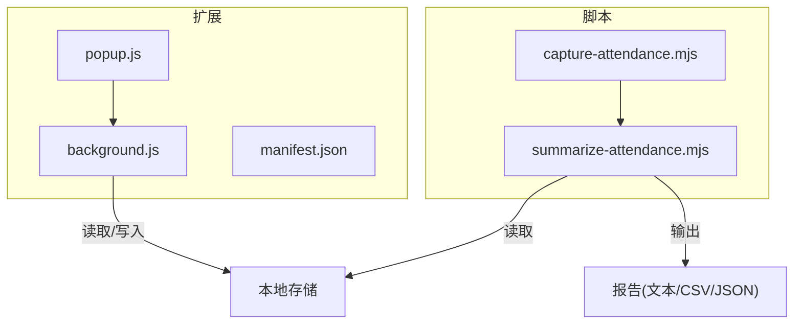
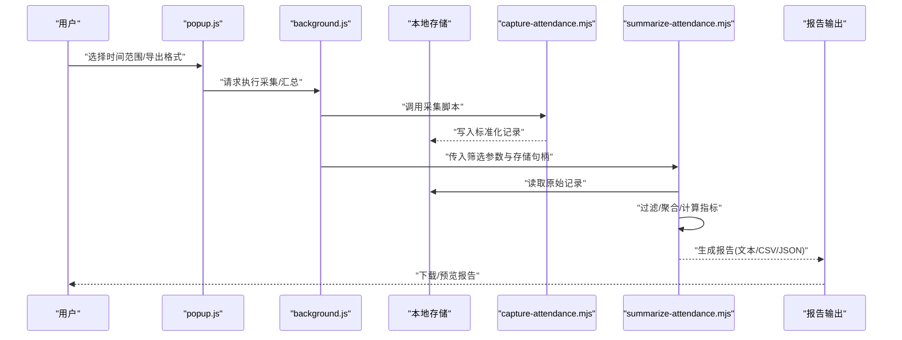
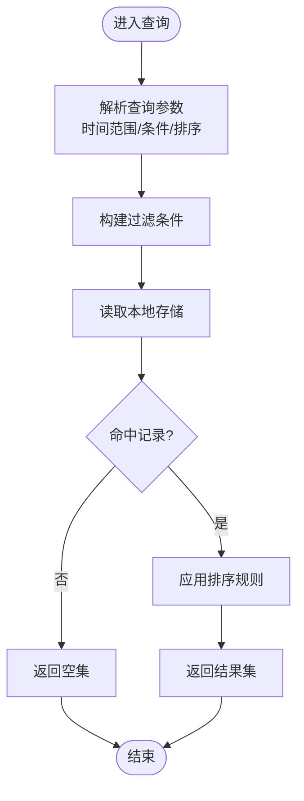
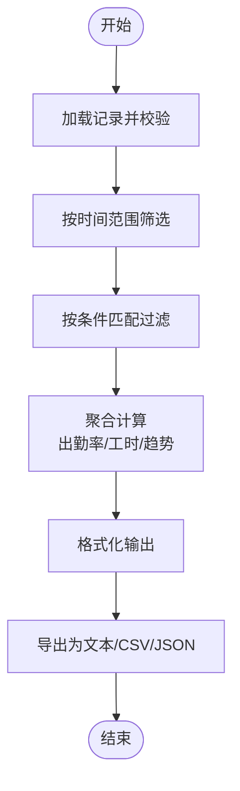
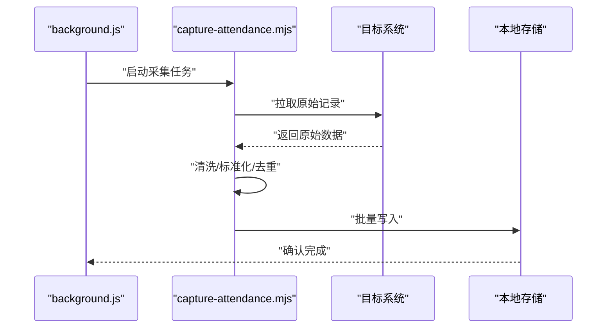
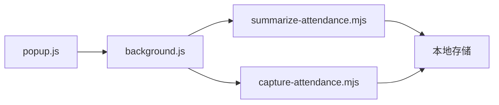

# 数据分析与统计

<cite>
**本文引用的文件**   
- [background.js](file://extension/background.js)
- [summarize-attendance.mjs](file://scripts/summarize-attendance.mjs)
- [capture-attendance.mjs](file://scripts/capture-attendance.mjs)
- [popup.js](file://extension/popup.js)
- [manifest.json](file://extension/manifest.json)
</cite>

## 目录
1. [简介](#简介)
2. [项目结构](#项目结构)
3. [核心组件](#核心组件)
4. [架构总览](#架构总览)
5. [详细组件分析](#详细组件分析)
6. [依赖关系分析](#依赖关系分析)
7. [性能考虑](#性能考虑)
8. [故障排查指南](#故障排查指南)
9. [结论](#结论)
10. [附录](#附录)

## 简介
本技术文档聚焦于“数据分析与统计”能力，围绕考勤数据的统计分析算法与数据处理流程展开。内容涵盖：
- 出勤率计算、工时统计、趋势分析等核心指标与方法
- summarize-attendance.mjs 的数据聚合、格式化输出与报告生成逻辑
- Background Script 中的数据查询与过滤实现（时间范围筛选、条件匹配、结果排序）
- 统计指标计算方法、数据可视化准备与导出格式支持
- 通过代码片段路径展示复杂查询、统计计算与报表生成的实现要点

## 项目结构
本项目由浏览器扩展与脚本两部分组成：
- extension：包含背景脚本、弹出页脚本与清单配置，负责数据采集入口、后台任务调度与本地存储交互
- scripts：包含考勤数据抓取与汇总脚本，提供离线分析与报告生成能力

图表来源
- [background.js](file://extension/background.js)
- [popup.js](file://extension/popup.js)
- [manifest.json](file://extension/manifest.json)
- [capture-attendance.mjs](file://scripts/capture-attendance.mjs)
- [summarize-attendance.mjs](file://scripts/summarize-attendance.mjs)

章节来源
- [background.js](file://extension/background.js)
- [summarize-attendance.mjs](file://scripts/summarize-attendance.mjs)
- [capture-attendance.mjs](file://scripts/capture-attendance.mjs)
- [popup.js](file://extension/popup.js)
- [manifest.json](file://extension/manifest.json)

## 核心组件
- 数据源与采集
  - capture-attendance.mjs：从目标系统抓取原始考勤记录，进行初步清洗与标准化，便于后续分析
  - background.js：在扩展环境中执行定时或事件触发的采集任务，并将结果持久化到本地存储
- 分析与汇总
  - summarize-attendance.mjs：对已采集的考勤数据进行聚合、统计与格式化，输出多维度的分析报告
- 前端交互
  - popup.js：提供用户界面以触发采集、查看摘要、选择时间范围与导出格式

章节来源
- [capture-attendance.mjs](file://scripts/capture-attendance.mjs)
- [background.js](file://extension/background.js)
- [summarize-attendance.mjs](file://scripts/summarize-attendance.mjs)
- [popup.js](file://extension/popup.js)

## 架构总览
整体数据流从采集到分析再到报告输出的关键路径如下：

图表来源
- [popup.js](file://extension/popup.js)
- [background.js](file://extension/background.js)
- [capture-attendance.mjs](file://scripts/capture-attendance.mjs)
- [summarize-attendance.mjs](file://scripts/summarize-attendance.mjs)

## 详细组件分析

### 组件A：Background Script 数据查询与过滤
background.js 作为扩展的后台服务，承担以下职责：
- 接收来自 popup.js 的请求，解析查询参数（如开始/结束时间、状态、部门等）
- 根据参数构建过滤条件，调用本地存储接口获取候选记录
- 对结果进行排序（按日期、时长、状态等），并返回给调用方
- 可选地触发 capture-attendance.mjs 执行增量采集，确保数据时效性

图表来源
- [background.js](file://extension/background.js)
- [popup.js](file://extension/popup.js)

章节来源
- [background.js](file://extension/background.js)
- [popup.js](file://extension/popup.js)

### 组件B：summarize-attendance.mjs 数据处理与报告生成
该脚本负责将原始考勤记录转化为可消费的分析结果，主要步骤包括：
- 数据加载与校验：从本地存储读取记录，校验字段完整性与类型
- 时间范围筛选：基于起止时间过滤记录，支持边界包含/排除策略
- 条件匹配：按状态、部门、项目等维度进行二次筛选
- 聚合与统计：
  - 出勤率：按期/月/年维度计算应出勤与实际出勤的比例
  - 工时统计：按日/周/月累计有效工时，剔除异常值与缺卡
  - 趋势分析：滑动窗口或同比环比计算，识别增长/下降趋势
- 格式化输出：生成结构化报告，支持文本、CSV、JSON 等格式
- 导出与保存：将报告写入文件或回传给调用方

图表来源
- [summarize-attendance.mjs](file://scripts/summarize-attendance.mjs)

章节来源
- [summarize-attendance.mjs](file://scripts/summarize-attendance.mjs)

### 组件C：capture-attendance.mjs 数据采集与标准化
- 访问目标系统接口或页面，提取原始考勤数据
- 清洗与标准化：统一字段命名、单位换算、时区处理、去重
- 写入本地存储：以批次方式追加或覆盖更新，保证幂等性
- 错误重试与断点续传：在网络异常或中断场景下保障采集稳定性

图表来源
- [background.js](file://extension/background.js)
- [capture-attendance.mjs](file://scripts/capture-attendance.mjs)

章节来源
- [capture-attendance.mjs](file://scripts/capture-attendance.mjs)
- [background.js](file://extension/background.js)

### 组件D：popup.js 用户交互与参数传递
- 提供时间范围选择器、条件筛选控件与导出格式选项
- 将用户选择封装为查询对象，传递给 background.js 或 summarize-attendance.mjs
- 显示进度与结果预览，支持一键导出

章节来源
- [popup.js](file://extension/popup.js)

## 依赖关系分析
- 模块耦合
  - popup.js 依赖 background.js 进行任务调度与数据访问
  - background.js 依赖 capture-attendance.mjs 与 summarize-attendance.mjs 完成采集与分析
  - summarize-attendance.mjs 依赖本地存储接口进行读写
- 外部依赖
  - 文件系统与网络请求用于采集与导出
  - 本地存储用于持久化记录与中间结果

图表来源
- [popup.js](file://extension/popup.js)
- [background.js](file://extension/background.js)
- [capture-attendance.mjs](file://scripts/capture-attendance.mjs)
- [summarize-attendance.mjs](file://scripts/summarize-attendance.mjs)

章节来源
- [manifest.json](file://extension/manifest.json)
- [background.js](file://extension/background.js)
- [popup.js](file://extension/popup.js)
- [capture-attendance.mjs](file://scripts/capture-attendance.mjs)
- [summarize-attendance.mjs](file://scripts/summarize-attendance.mjs)

## 性能考虑
- 批量操作：采集与写入采用批处理减少 I/O 次数
- 索引优化：对常用筛选字段建立索引以提升查询效率
- 惰性加载：仅加载必要字段，按需聚合避免全量扫描
- 缓存策略：对热点聚合结果进行短期缓存，降低重复计算
- 异步处理：使用异步队列避免阻塞主线程，提升响应性

[本节为通用指导，不直接分析具体文件]

## 故障排查指南
- 常见问题
  - 时间范围无效：检查起止时间格式与时区设置
  - 条件匹配无结果：确认筛选键名与取值是否与存储一致
  - 导出失败：检查目标路径权限与文件格式兼容性
- 定位方法
  - 在 background.js 中增加日志输出，记录请求参数与返回结果
  - 在 summarize-attendance.mjs 中打印中间聚合结果，验证计算链路
  - 在 capture-attendance.mjs 中捕获网络异常并重试

章节来源
- [background.js](file://extension/background.js)
- [summarize-attendance.mjs](file://scripts/summarize-attendance.mjs)
- [capture-attendance.mjs](file://scripts/capture-attendance.mjs)

## 结论
本方案通过采集、存储、分析、导出四层解耦，实现了考勤数据的端到端统计分析。Background Script 提供灵活的查询与过滤能力，summarize-attendance.mjs 完成核心指标计算与报告生成，配合 popup.js 的用户交互，形成完整的数据分析闭环。建议在生产环境引入索引与缓存机制，进一步提升大规模数据的处理性能与用户体验。

[本节为总结性内容，不直接分析具体文件]

## 附录

### 统计指标计算方法
- 出勤率
  - 定义：实际出勤天数 / 应出勤天数
  - 周期：可按日、周、月、年聚合
  - 边界：含首不含尾或含首含尾需明确约定
- 工时统计
  - 有效工时：剔除缺卡、异常打卡与午休时段
  - 累计：按日/周/月累加，支持跨日班次合并
- 趋势分析
  - 移动平均：N 日/周/月平滑波动
  - 同比/环比：与上一周期对比增长率
  - 阈值告警：超过上下限触发提示

[本节为概念说明，不直接分析具体文件]

### 数据可视化准备
- 数据结构：扁平化时间序列与分组维度（部门、项目、岗位）
- 指标列：出勤率、总工时、迟到次数、早退次数、加班时长
- 图表类型：折线图（趋势）、柱状图（对比）、热力图（分布）

[本节为概念说明，不直接分析具体文件]

### 导出格式支持
- 文本：人类可读的摘要报告
- CSV：表格型数据，便于导入 Excel 或 BI 工具
- JSON：结构化数据，便于程序化处理与二次分析

[本节为概念说明，不直接分析具体文件]

### 示例：复杂查询、统计计算与报表生成
- 复杂查询
  - 参考路径：[background.js](file://extension/background.js)
  - 要点：解析时间范围、组合多条件、应用排序规则
- 统计计算
  - 参考路径：[summarize-attendance.mjs](file://scripts/summarize-attendance.mjs)
  - 要点：聚合函数、异常值处理、趋势平滑
- 报表生成
  - 参考路径：[summarize-attendance.mjs](file://scripts/summarize-attendance.mjs)
  - 要点：模板渲染、多格式输出、文件落盘

章节来源
- [background.js](file://extension/background.js)
- [summarize-attendance.mjs](file://scripts/summarize-attendance.mjs)