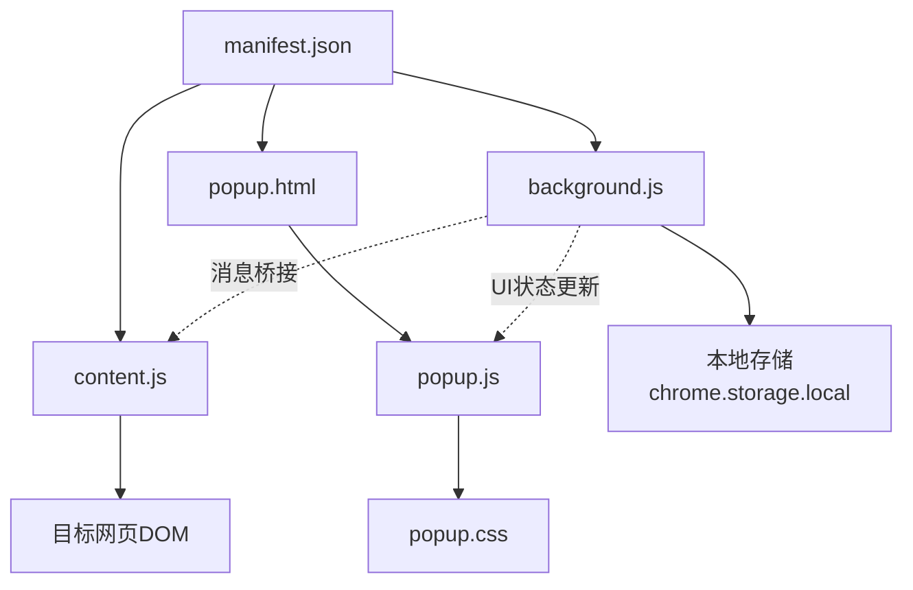
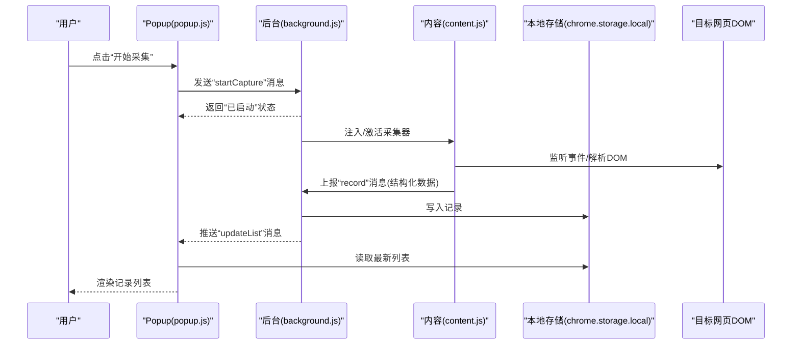
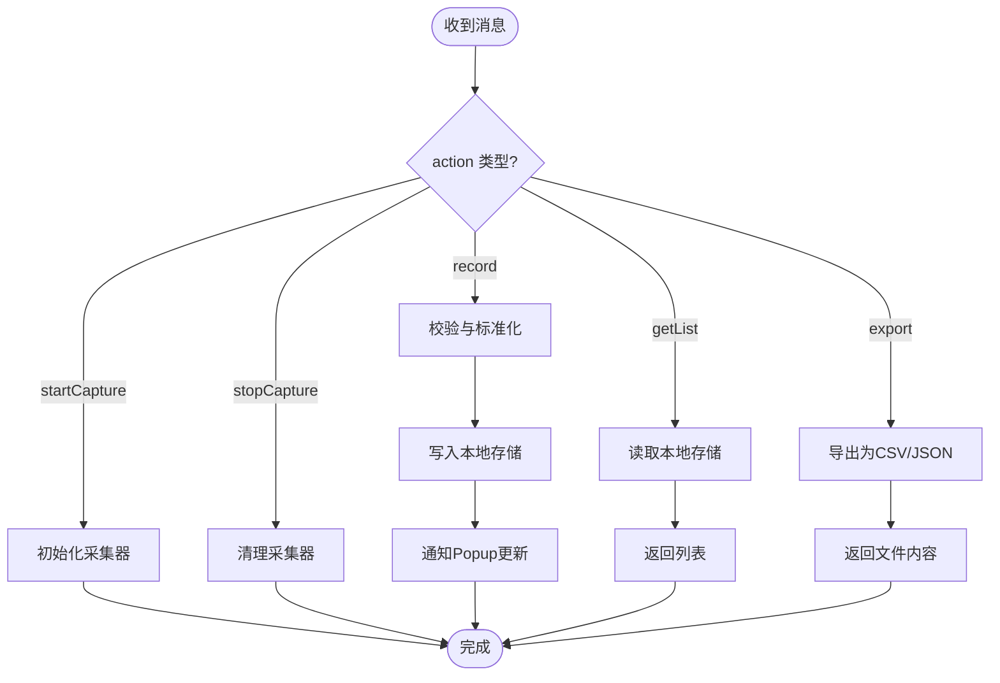
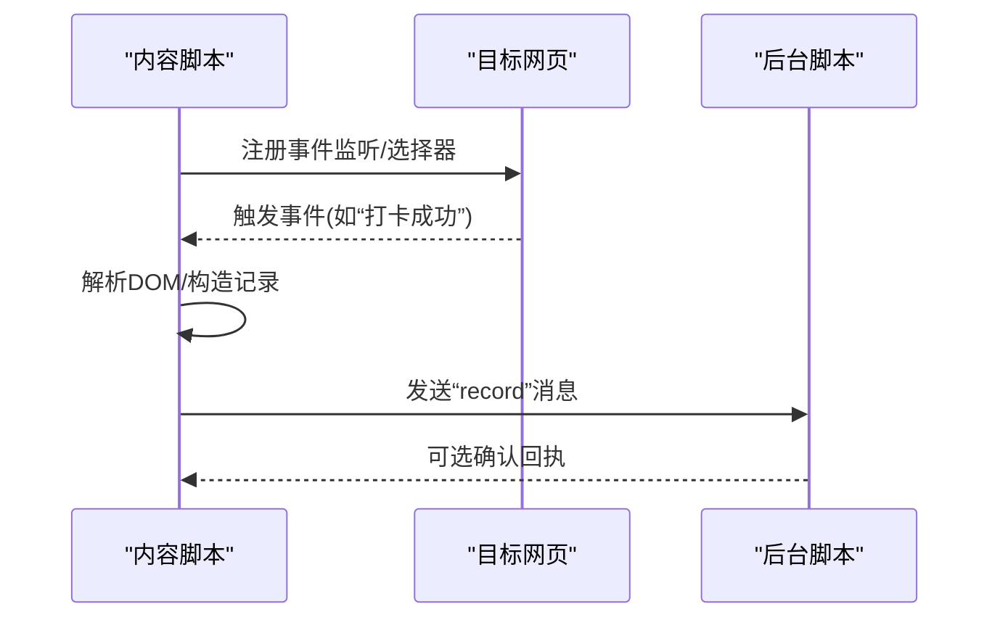
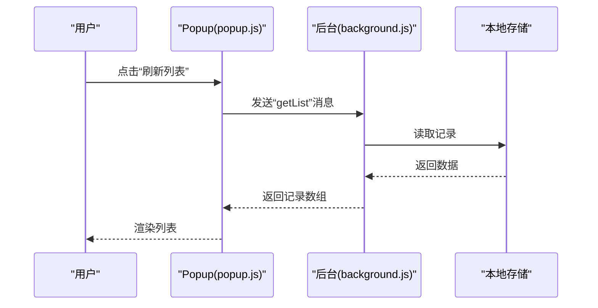
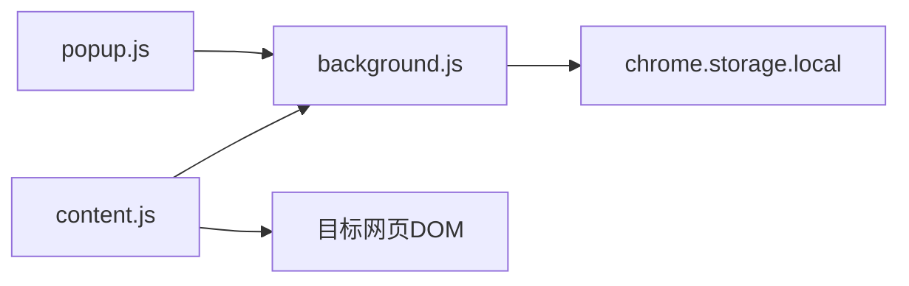

# 核心功能详解

<cite>
**本文引用的文件**   
- [extension/README.md](file://extension/README.md)
- [extension/background.js](file://extension/background.js)
- [extension/content.js](file://extension/content.js)
- [extension/popup.html](file://extension/popup.html)
- [extension/popup.js](file://extension/popup.js)
- [extension/popup.css](file://extension/popup.css)
- [extension/manifest.json](file://extension/manifest.json)
- [scripts/capture-attendance.mjs](file://scripts/capture-attendance.mjs)
- [scripts/debug-request-headers.mjs](file://scripts/debug-request-headers.mjs)
- [scripts/inspect-yunchuang-auth.mjs](file://scripts/inspect-yunchuang-auth.mjs)
- [scripts/summarize-attendance.mjs](file://scripts/summarize-attendance.mjs)
</cite>

## 目录
1. [简介](#简介)
2. [项目结构](#项目结构)
3. [核心组件](#核心组件)
4. [架构总览](#架构总览)
5. [详细组件分析](#详细组件分析)
6. [依赖关系分析](#依赖关系分析)
7. [性能考虑](#性能考虑)
8. [故障排查指南](#故障排查指南)
9. [结论](#结论)
10. [附录](#附录)

## 简介
本技术文档围绕“工时记录扩展”的核心能力展开，重点说明考勤数据自动捕获机制、数据处理流程、本地存储策略与用户界面交互逻辑。文档将深入解释 Background Script 如何协调 Content Script 进行页面操作，Popup 界面如何与后台脚本通信，以及数据从采集到存储的完整链路。同时提供代码级图示、API 调用方式与错误处理机制，帮助开发者快速理解并扩展该扩展的功能。

## 项目结构
扩展采用浏览器扩展的标准分层：
- manifest.json：声明权限、脚本注入点、消息通道与图标等元信息
- background.js：后台常驻脚本，负责调度、持久化与跨上下文通信
- content.js：注入目标页面的内容脚本，负责 DOM 抓取与事件监听
- popup.html/js/css：弹出式 UI，用于触发采集、查看与导出结果
- scripts/*.mjs：辅助脚本（数据采集、请求头调试、认证检查、汇总统计）

图表来源
- [extension/manifest.json](file://extension/manifest.json)
- [extension/background.js](file://extension/background.js)
- [extension/content.js](file://extension/content.js)
- [extension/popup.html](file://extension/popup.html)
- [extension/popup.js](file://extension/popup.js)
- [extension/popup.css](file://extension/popup.css)

章节来源
- [extension/README.md](file://extension/README.md)
- [extension/manifest.json](file://extension/manifest.json)

## 核心组件
- 后台脚本（Background Script）
  - 职责：接收来自 Popup 或 Content Script 的消息；调度采集任务；聚合与校验数据；写入 chrome.storage.local；向 Popup 推送状态与结果。
  - 关键接口：消息监听、存储读写、定时器/事件驱动的任务编排。
- 内容脚本（Content Script）
  - 职责：在目标页面中监听与考勤相关的事件（如按钮点击、路由变化、XHR/Fetch 拦截），解析页面元素或网络响应，提取结构化考勤数据，回传给后台。
  - 关键接口：DOM 查询、事件监听、网络钩子、消息发送。
- 弹出界面（Popup）
  - 职责：提供“开始采集/停止采集/刷新列表/导出”等操作；展示最近采集记录；显示错误提示；与后台通过消息通信。
  - 关键接口：UI 渲染、消息发送、结果展示。
- 辅助脚本（scripts/*.mjs）
  - 职责：离线或调试场景下的数据采集、请求头分析、认证检查与汇总统计。
  - 典型用途：验证采集规则、定位鉴权问题、生成报表。

章节来源
- [extension/background.js](file://extension/background.js)
- [extension/content.js](file://extension/content.js)
- [extension/popup.js](file://extension/popup.js)
- [extension/popup.html](file://extension/popup.html)
- [extension/popup.css](file://extension/popup.css)
- [scripts/capture-attendance.mjs](file://scripts/capture-attendance.mjs)
- [scripts/debug-request-headers.mjs](file://scripts/debug-request-headers.mjs)
- [scripts/inspect-yunchuang-auth.mjs](file://scripts/inspect-yunchuang-auth.mjs)
- [scripts/summarize-attendance.mjs](file://scripts/summarize-attendance.mjs)

## 架构总览
整体数据流遵循“采集—传输—处理—存储—展示”的闭环：
- 采集层：Content Script 在目标页面上捕获考勤事件与数据
- 传输层：通过 chrome.runtime.sendMessage 在 Content/Background/Popup 之间传递消息
- 处理层：Background 对数据进行清洗、去重、时间归一化与格式校验
- 存储层：使用 chrome.storage.local 持久化记录
- 展示层：Popup 读取存储并渲染列表，支持导出与筛选

图表来源
- [extension/background.js](file://extension/background.js)
- [extension/content.js](file://extension/content.js)
- [extension/popup.js](file://extension/popup.js)
- [extension/popup.html](file://extension/popup.html)

## 详细组件分析

### 后台脚本（Background Script）
- 角色与职责
  - 作为中枢协调者，统一处理来自 Popup 和 Content Script 的消息
  - 维护采集生命周期（启动/停止/暂停）
  - 执行数据校验、去重、时间格式化与字段映射
  - 管理本地存储读写与批量导出
- 关键流程
  - 消息路由：根据 action 分发到对应处理器
  - 采集控制：设置/清除定时器或事件监听，避免重复注入
  - 数据落盘：按日期或批次写入 chrome.storage.local，保证幂等
  - 状态广播：向 Popup 推送实时状态与增量记录
- 错误处理
  - 捕获异常并转换为标准错误对象，包含错误码与可诊断信息
  - 对存储失败进行重试与降级（内存缓冲+延迟写入）
  - 对无效输入进行白名单校验与字段补全

图表来源
- [extension/background.js](file://extension/background.js)

章节来源
- [extension/background.js](file://extension/background.js)

### 内容脚本（Content Script）
- 角色与职责
  - 在目标页面中监听与考勤相关的交互与网络行为
  - 解析页面元素或拦截请求，抽取结构化考勤数据
  - 将数据封装为标准消息体，发送至后台
- 关键实现要点
  - 事件监听：按钮点击、表单提交、路由切换等
  - 网络钩子：可选地拦截 XHR/Fetch，获取服务端返回的考勤快照
  - DOM 解析：基于选择器或语义化标签定位关键字段
  - 消息协议：定义统一的 record 消息结构（时间、类型、备注、来源URL等）
- 健壮性
  - 防抖与节流：避免高频事件导致消息风暴
  - 容错：当页面结构变更时，回退到备用解析策略
  - 隔离：仅访问必要的数据域，避免污染全局

图表来源
- [extension/content.js](file://extension/content.js)
- [extension/background.js](file://extension/background.js)

章节来源
- [extension/content.js](file://extension/content.js)

### 弹出界面（Popup）
- 角色与职责
  - 提供可视化控制面板：开始/停止采集、刷新列表、导出记录
  - 与后台保持双向通信，实时展示状态与错误信息
  - 渲染最近 N 条记录，支持分页与搜索
- 交互流程
  - 用户操作 → 发送消息给后台 → 等待回执 → 更新 UI
  - 定时轮询或监听后台推送，拉取最新列表
- 样式与可访问性
  - 简洁布局，适配不同屏幕尺寸
  - 错误提示与加载态清晰可见

图表来源
- [extension/popup.js](file://extension/popup.js)
- [extension/popup.html](file://extension/popup.html)
- [extension/popup.css](file://extension/popup.css)
- [extension/background.js](file://extension/background.js)

章节来源
- [extension/popup.js](file://extension/popup.js)
- [extension/popup.html](file://extension/popup.html)
- [extension/popup.css](file://extension/popup.css)

### 辅助脚本（scripts/*.mjs）
- capture-attendance.mjs：模拟或自动化采集流程，便于测试与回归
- debug-request-headers.mjs：打印请求头与载荷，辅助定位鉴权与跨域问题
- inspect-yunchuang-auth.mjs：检查特定平台（如云创）的认证状态与令牌有效性
- summarize-attendance.mjs：对本地存储中的记录进行汇总统计与导出

章节来源
- [scripts/capture-attendance.mjs](file://scripts/capture-attendance.mjs)
- [scripts/debug-request-headers.mjs](file://scripts/debug-request-headers.mjs)
- [scripts/inspect-yunchuang-auth.mjs](file://scripts/inspect-yunchuang-auth.mjs)
- [scripts/summarize-attendance.mjs](file://scripts/summarize-attendance.mjs)

## 依赖关系分析
- 模块耦合
  - Popup 依赖 Background 的消息服务与本地存储
  - Content 依赖目标页面 DOM 与网络环境，并通过消息与 Background 解耦
  - Background 是中心节点，集中处理业务逻辑与持久化
- 外部依赖
  - chrome.runtime：消息通信
  - chrome.storage.local：持久化
  - 可选：chrome.tabs、chrome.webRequest 等（视 manifest 声明而定）
- 潜在循环依赖
  - 通过明确的消息协议与单向数据流避免循环调用

图表来源
- [extension/popup.js](file://extension/popup.js)
- [extension/background.js](file://extension/background.js)
- [extension/content.js](file://extension/content.js)
- [extension/manifest.json](file://extension/manifest.json)

章节来源
- [extension/manifest.json](file://extension/manifest.json)
- [extension/background.js](file://extension/background.js)
- [extension/content.js](file://extension/content.js)
- [extension/popup.js](file://extension/popup.js)

## 性能考虑
- 采集频率控制
  - 使用防抖/节流减少高频事件带来的消息风暴
  - 按需注入与卸载 Content Script，降低内存占用
- 数据存储优化
  - 批量写入与合并策略，减少 I/O 次数
  - 分片存储（按日期/周/月）提升查询效率
- 网络与解析
  - 优先使用轻量 DOM 选择器，避免复杂遍历
  - 对大响应体进行流式处理或采样
- UI 渲染
  - 虚拟列表或分页渲染，避免一次性渲染大量记录
  - 增量更新而非全量替换

[本节为通用指导，不直接分析具体文件]

## 故障排查指南
- 常见问题
  - 无法注入 Content Script：检查 manifest 的匹配规则与权限
  - 消息未送达：确认端口是否关闭或超时；检查 action 名称一致性
  - 存储写入失败：检查配额与磁盘空间；启用降级与重试
  - 页面结构变更导致解析失败：增加备用解析策略与日志埋点
- 诊断工具
  - 使用 debug-request-headers.mjs 分析请求头与载荷
  - 使用 inspect-yunchuang-auth.mjs 检查认证状态
  - 在 Popup 中开启详细日志，结合后台日志定位断点
- 错误码规范
  - 建议统一错误码前缀与层级，便于前端与后端协同排障

章节来源
- [extension/background.js](file://extension/background.js)
- [extension/content.js](file://extension/content.js)
- [extension/popup.js](file://extension/popup.js)
- [scripts/debug-request-headers.mjs](file://scripts/debug-request-headers.mjs)
- [scripts/inspect-yunchuang-auth.mjs](file://scripts/inspect-yunchuang-auth.mjs)

## 结论
本扩展以 Background 为核心，结合 Content 的页面感知与 Popup 的交互能力，构建了完整的考勤数据采集与存储链路。通过明确的消息协议、稳健的错误处理与可扩展的辅助脚本，系统具备良好的可维护性与可观测性。后续可在多站点适配、增量同步与云端备份等方面继续演进。

[本节为总结性内容，不直接分析具体文件]

## 附录
- 消息协议建议
  - startCapture / stopCapture：控制采集生命周期
  - record：上报单条考勤记录
  - getList：拉取记录列表
  - export：导出 CSV/JSON
  - updateList：后台主动推送列表更新
- 数据结构建议
  - id：唯一标识
  - timestamp：时间戳（ISO 8601）
  - type：打卡类型（上班/下班/外出等）
  - source：数据来源（页面/DOM/网络）
  - url：来源页面 URL
  - payload：原始数据快照（可选）
- 安全与隐私
  - 最小权限原则：仅在 manifest 中声明必要权限
  - 敏感信息脱敏：避免记录密码、Token 等
  - 用户授权：首次使用前提示数据收集范围

[本节为概念性补充，不直接分析具体文件]