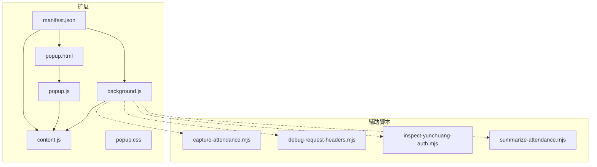
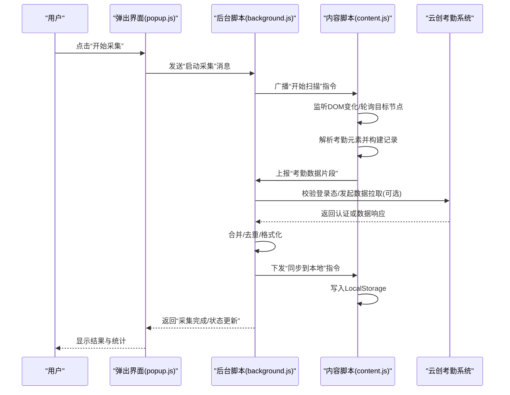
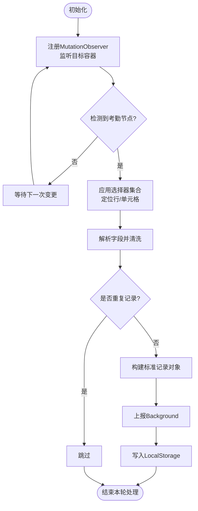
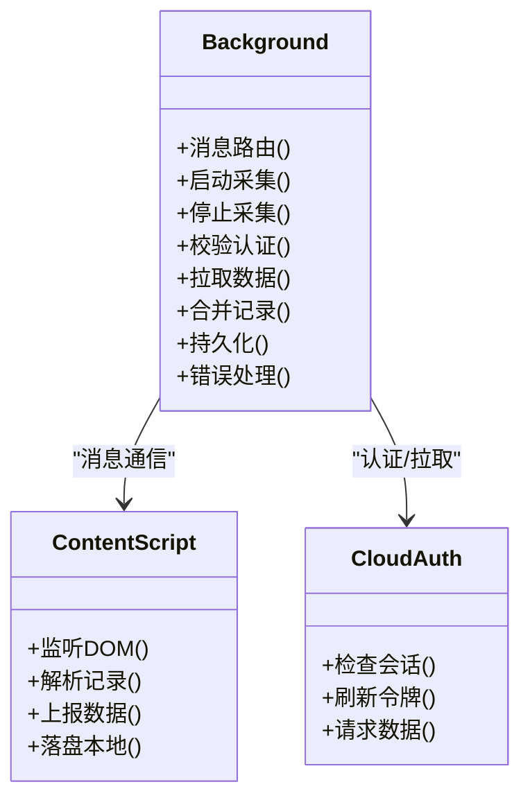
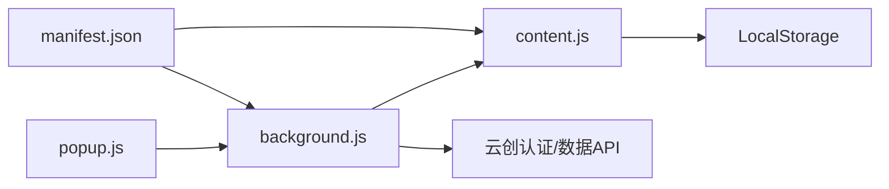

# 考勤数据自动捕获

<cite>
**本文引用的文件**   
- [extension/manifest.json](file://extension/manifest.json)
- [extension/background.js](file://extension/background.js)
- [extension/content.js](file://extension/content.js)
- [extension/popup.html](file://extension/popup.html)
- [extension/popup.js](file://extension/popup.js)
- [extension/popup.css](file://extension/popup.css)
- [scripts/capture-attendance.mjs](file://scripts/capture-attendance.mjs)
- [scripts/debug-request-headers.mjs](file://scripts/debug-request-headers.mjs)
- [scripts/inspect-yunchuang-auth.mjs](file://scripts/inspect-yunchuang-auth.mjs)
- [scripts/summarize-attendance.mjs](file://scripts/summarize-attendance.mjs)
</cite>

## 目录
1. [简介](#简介)
2. [项目结构](#项目结构)
3. [核心组件](#核心组件)
4. [架构总览](#架构总览)
5. [详细组件分析](#详细组件分析)
6. [依赖关系分析](#依赖关系分析)
7. [性能考虑](#性能考虑)
8. [故障排查指南](#故障排查指南)
9. [结论](#结论)
10. [附录](#附录)

## 简介
本技术文档围绕“考勤数据自动捕获”扩展功能，系统性阐述以下内容：
- Content Script 如何监听目标网站的 DOM 变化并提取考勤相关元素与数据
- Background Script 如何协调数据采集流程（页面监听、数据提取算法、错误处理）
- 与云创考勤系统的集成方式、认证流程验证逻辑以及数据格式转换过程
- DOM 选择器策略、事件监听实现、异步数据处理与 LocalStorage 存储逻辑
- 提供代码示例路径，展示如何实现页面元素监控、数据提取和状态同步

## 项目结构
本项目采用浏览器扩展（Manifest V3）形态，包含以下关键部分：
- extension：扩展主体，含清单、后台脚本、内容脚本、弹出界面等
- scripts：辅助脚本，用于调试请求头、检查云创认证、汇总考勤数据等

图表来源
- [extension/manifest.json](file://extension/manifest.json)
- [extension/background.js](file://extension/background.js)
- [extension/content.js](file://extension/content.js)
- [extension/popup.html](file://extension/popup.html)
- [extension/popup.js](file://extension/popup.js)
- [extension/popup.css](file://extension/popup.css)
- [scripts/capture-attendance.mjs](file://scripts/capture-attendance.mjs)
- [scripts/debug-request-headers.mjs](file://scripts/debug-request-headers.mjs)
- [scripts/inspect-yunchuang-auth.mjs](file://scripts/inspect-yunchuang-auth.mjs)
- [scripts/summarize-attendance.mjs](file://scripts/summarize-attendance.mjs)

章节来源
- [extension/manifest.json](file://extension/manifest.json)
- [extension/background.js](file://extension/background.js)
- [extension/content.js](file://extension/content.js)
- [extension/popup.html](file://extension/popup.html)
- [extension/popup.js](file://extension/popup.js)
- [extension/popup.css](file://extension/popup.css)
- [scripts/capture-attendance.mjs](file://scripts/capture-attendance.mjs)
- [scripts/debug-request-headers.mjs](file://scripts/debug-request-headers.mjs)
- [scripts/inspect-yunchuang-auth.mjs](file://scripts/inspect-yunchuang-auth.mjs)
- [scripts/summarize-attendance.mjs](file://scripts/summarize-attendance.mjs)

## 核心组件
- manifest.json：声明权限、背景页、内容脚本注入范围、消息通信通道等
- background.js：负责全局生命周期管理、跨上下文消息路由、与云创系统交互的编排、错误处理与重试
- content.js：在目标页面中运行，监听 DOM 变化、解析考勤表格/列表、提取字段、写入 LocalStorage 并通过消息上报
- popup.*：用户界面与交互入口，触发采集、查看状态、导出结果
- scripts/*：独立 Node 脚本，用于离线调试、抓包分析、认证检查与数据汇总

章节来源
- [extension/manifest.json](file://extension/manifest.json)
- [extension/background.js](file://extension/background.js)
- [extension/content.js](file://extension/content.js)
- [extension/popup.html](file://extension/popup.html)
- [extension/popup.js](file://extension/popup.js)
- [extension/popup.css](file://extension/popup.css)

## 架构总览
整体采用“后台协调 + 内容脚本执行 + 弹出界面控制”的分层架构。Content Script 专注页面内 DOM 监听与数据抽取；Background Script 负责跨上下文消息转发、外部系统集成与持久化；Popup 提供可视化操作入口。

图表来源
- [extension/background.js](file://extension/background.js)
- [extension/content.js](file://extension/content.js)
- [extension/popup.js](file://extension/popup.js)

## 详细组件分析

### Content Script（content.js）
职责
- 在目标站点注入后，建立对考勤页面的 DOM 监听
- 使用稳定的选择器策略定位考勤表格/列表/卡片
- 将原始文本与属性转换为结构化记录
- 通过消息通道向 Background 上报，并落盘至 LocalStorage

关键实现要点
- DOM 监听策略
  - MutationObserver 监听新增/移除/属性变更节点，避免全量轮询
  - 针对懒加载场景，结合滚动事件与 IntersectionObserver 触发增量抓取
- 选择器策略
  - 优先基于语义化类名/数据属性定位，其次回退到层级与文本匹配
  - 为不同页面布局维护多套选择器集合，按优先级尝试
- 数据提取与清洗
  - 统一时间、姓名、部门、工时等字段的正则与格式化规则
  - 去重键由“日期+人员标识+班次类型”组合生成
- 异步与容错
  - 批量提取时采用 Promise.allSettled 保证局部失败不影响整体
  - 异常捕获后降级为仅提取可见区域数据
- 本地存储
  - 以“考勤记录数组”形式写入 LocalStorage，支持分页读取与增量合并
- 消息协议
  - 接收来自 Background 的“开始扫描/停止扫描/同步到本地”指令
  - 主动上报“数据片段/进度/错误”消息

图表来源
- [extension/content.js](file://extension/content.js)

章节来源
- [extension/content.js](file://extension/content.js)

### Background Script（background.js）
职责
- 管理扩展生命周期与消息路由
- 协调 Content Script 的采集任务（启动、停止、重试）
- 与云创考勤系统进行认证校验与数据拉取（如需要）
- 聚合多条数据片段、去重、格式化，并持久化

关键实现要点
- 消息路由
  - 监听来自 Popup 与 Content Script 的消息，分发到对应处理器
  - 为每条任务分配唯一 ID，便于追踪与重试
- 认证流程
  - 若需访问云创系统，先检查会话有效性，必要时刷新令牌
  - 对认证失败进行指数退避重试，记录错误日志
- 数据整合
  - 合并来自多个标签页的数据片段，按主键去重
  - 输出标准化 JSON 结构，供导出或上传
- 错误处理
  - 统一错误分类（网络、解析、超时、权限），提供可恢复策略
  - 对不可恢复错误上报给 Popup 提示用户

图表来源
- [extension/background.js](file://extension/background.js)

章节来源
- [extension/background.js](file://extension/background.js)

### 弹出界面（popup.html / popup.js / popup.css）
职责
- 提供“开始/停止采集”、“查看状态”、“导出结果”等操作
- 与 Background 通信，展示实时进度与错误信息

关键实现要点
- 按钮事件绑定与状态机切换
- 订阅 Background 的状态消息，渲染进度条与日志
- 调用导出接口，将本地缓存的考勤数据序列化为 CSV/JSON

章节来源
- [extension/popup.html](file://extension/popup.html)
- [extension/popup.js](file://extension/popup.js)
- [extension/popup.css](file://extension/popup.css)

### 辅助脚本（scripts/*）
- capture-attendance.mjs：在 Node 环境下模拟或回放采集流程，便于单元测试
- debug-request-headers.mjs：打印请求头与 Cookie，辅助诊断认证问题
- inspect-yunchuang-auth.mjs：检查云创登录态、令牌有效期与刷新策略
- summarize-attendance.mjs：对已采集数据进行汇总统计与报表生成

章节来源
- [scripts/capture-attendance.mjs](file://scripts/capture-attendance.mjs)
- [scripts/debug-request-headers.mjs](file://scripts/debug-request-headers.mjs)
- [scripts/inspect-yunchuang-auth.mjs](file://scripts/inspect-yunchuang-auth.mjs)
- [scripts/summarize-attendance.mjs](file://scripts/summarize-attendance.mjs)

## 依赖关系分析
- 扩展内部依赖
  - manifest.json 声明 background 与 content_scripts 的注入范围
  - popup.js 通过 chrome.runtime 与 background.js 通信
  - background.js 通过 sendMessage 与 content.js 协作
- 外部依赖
  - 云创考勤系统 API（认证、数据接口）
  - 浏览器 Web Storage（LocalStorage）

图表来源
- [extension/manifest.json](file://extension/manifest.json)
- [extension/background.js](file://extension/background.js)
- [extension/content.js](file://extension/content.js)
- [extension/popup.js](file://extension/popup.js)

章节来源
- [extension/manifest.json](file://extension/manifest.json)
- [extension/background.js](file://extension/background.js)
- [extension/content.js](file://extension/content.js)
- [extension/popup.js](file://extension/popup.js)

## 性能考虑
- 减少不必要的 DOM 遍历：使用 MutationObserver 精准监听目标容器
- 选择器优化：将高频选择器缓存，避免重复编译
- 批量处理：对大量行采用分片处理，避免阻塞 UI
- 防抖与节流：对滚动、输入等高频事件做节流，降低回调频率
- 本地存储：采用增量写入与压缩序列化，降低 I/O 压力
- 并发控制：限制并行请求数，避免触发服务端限流

[本节为通用指导，不直接分析具体文件]

## 故障排查指南
常见问题与定位步骤
- 无法识别考勤元素
  - 检查选择器集合是否覆盖当前页面布局
  - 使用辅助脚本 inspect-yunchuang-auth.mjs 与 debug-request-headers.mjs 确认页面结构与请求头
- 认证失败或令牌过期
  - 通过 inspect-yunchuang-auth.mjs 检查会话状态与刷新策略
  - 在 background.js 的错误处理分支中查看重试次数与退避间隔
- 数据缺失或不一致
  - 核对 content.js 的解析规则与去重键生成逻辑
  - 对比 LocalStorage 中的原始片段与最终合并结果
- 采集卡顿或内存占用高
  - 调整分片大小与并发度
  - 检查是否存在未释放的事件监听或未清理的定时器

章节来源
- [extension/background.js](file://extension/background.js)
- [extension/content.js](file://extension/content.js)
- [scripts/debug-request-headers.mjs](file://scripts/debug-request-headers.mjs)
- [scripts/inspect-yunchuang-auth.mjs](file://scripts/inspect-yunchuang-auth.mjs)

## 结论
本方案通过 Content Script 的 DOM 监听与稳健的选择器策略，配合 Background Script 的消息编排与错误恢复机制，实现了考勤数据的自动化采集与本地持久化。借助辅助脚本，可在离线环境快速验证与排障。建议在生产环境中持续完善选择器适配与异常监控，确保在不同页面版本下的稳定性。

[本节为总结性内容，不直接分析具体文件]

## 附录

### 数据模型（概念）
- 考勤记录
  - 字段：日期、人员标识、部门、班次类型、签到时间、签退时间、备注
  - 主键：日期 + 人员标识 + 班次类型
- 采集任务
  - 字段：任务ID、状态、开始时间、结束时间、错误信息、重试次数

[本节为概念说明，不直接分析具体文件]

### 代码示例路径
- 页面元素监控
  - [extension/content.js](file://extension/content.js)
- 数据提取与清洗
  - [extension/content.js](file://extension/content.js)
- 状态同步与本地存储
  - [extension/content.js](file://extension/content.js)
- 后台协调与错误处理
  - [extension/background.js](file://extension/background.js)
- 认证检查与调试
  - [scripts/inspect-yunchuang-auth.mjs](file://scripts/inspect-yunchuang-auth.mjs)
  - [scripts/debug-request-headers.mjs](file://scripts/debug-request-headers.mjs)
- 数据汇总与导出
  - [scripts/summarize-attendance.mjs](file://scripts/summarize-attendance.mjs)