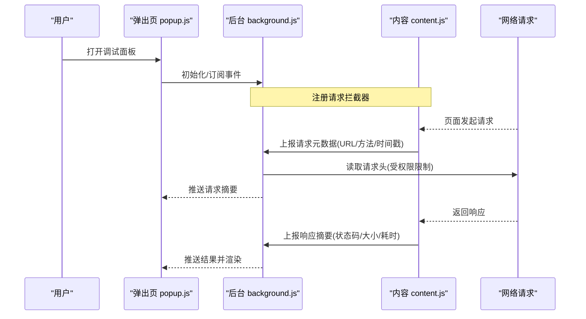
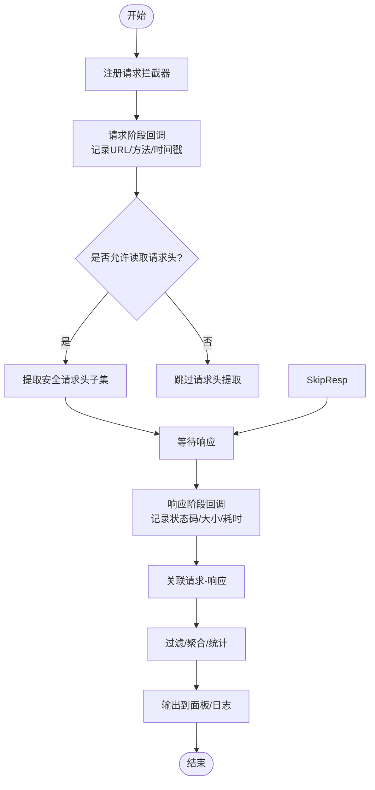
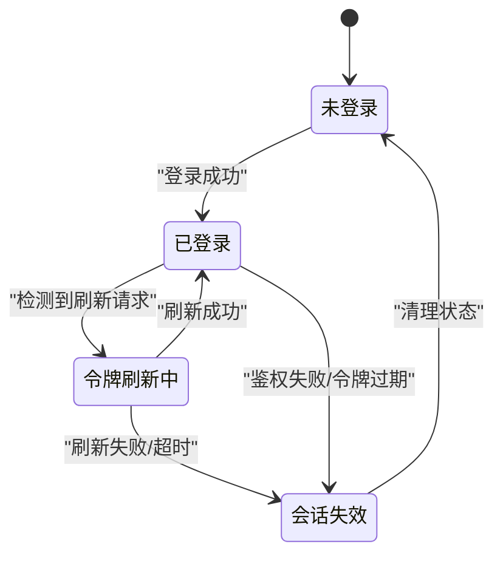
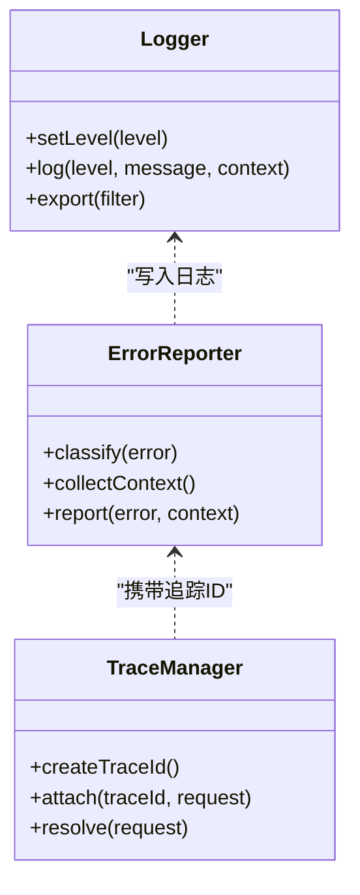

# 调试诊断工具

<cite>
**本文引用的文件**   
- [extension/manifest.json](file://extension/manifest.json)
- [extension/background.js](file://extension/background.js)
- [extension/content.js](file://extension/content.js)
- [extension/popup.html](file://extension/popup.html)
- [extension/popup.js](file://extension/popup.js)
- [scripts/debug-request-headers.mjs](file://scripts/debug-request-headers.mjs)
- [scripts/inspect-yunchuang-auth.mjs](file://scripts/inspect-yunchuang-auth.mjs)
</cite>

## 目录
1. [简介](#简介)
2. [项目结构](#项目结构)
3. [核心组件](#核心组件)
4. [架构总览](#架构总览)
5. [详细组件分析](#详细组件分析)
6. [依赖关系分析](#依赖关系分析)
7. [性能考虑](#性能考虑)
8. [故障排查指南](#故障排查指南)
9. [结论](#结论)
10. [附录](#附录)

## 简介
本技术文档面向调试与诊断能力，聚焦以下目标：
- 网络请求头检查工具的请求拦截机制、头部信息提取与分析逻辑
- 云创认证检查工具的身份验证流程检测、令牌验证与会话状态监控
- 调试工具的错误诊断方法、日志记录机制与问题定位策略
- 提供可落地的实现思路与示例路径，涵盖HTTP请求拦截、响应数据分析与自定义调试输出

## 项目结构
仓库包含浏览器扩展与脚本两类代码：
- extension：浏览器扩展，含清单、后台脚本、内容脚本、弹出页及样式
- scripts：Node 侧或独立运行脚本，用于请求头捕获与云创认证检查

```mermaid
graph TB
subgraph "浏览器扩展"
M["manifest.json"]
BG["background.js"]
CT["content.js"]
POP_HTML["popup.html"]
POP_JS["popup.js"]
end
subgraph "脚本"
DRH["debug-request-headers.mjs"]
IYA["inspect-yunchuang-auth.mjs]
end
M --> BG
M --> CT
M --> POP_HTML
POP_HTML --> POP_JS
BG < --> CT
BG < --> POP_JS
DRH -.->|"可选：本地抓包/代理"| BG
IYA -.->|"可选：本地抓包/代理"| BG
```

图表来源
- [extension/manifest.json](file://extension/manifest.json)
- [extension/background.js](file://extension/background.js)
- [extension/content.js](file://extension/content.js)
- [extension/popup.html](file://extension/popup.html)
- [extension/popup.js](file://extension/popup.js)

章节来源
- [extension/manifest.json](file://extension/manifest.json)
- [extension/background.js](file://extension/background.js)
- [extension/content.js](file://extension/content.js)
- [extension/popup.html](file://extension/popup.html)
- [extension/popup.js](file://extension/popup.js)

## 核心组件
- 请求头检查工具（基于扩展）
  - 通过浏览器API在请求发出前进行拦截，提取并记录关键请求头字段
  - 将采集到的数据以结构化形式暴露给弹出页或后台面板
- 云创认证检查工具（基于扩展）
  - 识别认证相关请求，解析令牌与Cookie等凭据
  - 跟踪会话生命周期，检测令牌刷新与失效场景
- 错误诊断与日志
  - 统一错误分类与堆栈收集
  - 分级日志输出，支持按模块过滤与导出

章节来源
- [extension/background.js](file://extension/background.js)
- [extension/content.js](file://extension/content.js)
- [extension/popup.js](file://extension/popup.js)
- [scripts/debug-request-headers.mjs](file://scripts/debug-request-headers.mjs)
- [scripts/inspect-yunchuang-auth.mjs](file://scripts/inspect-yunchuang-auth.mjs)

## 架构总览
整体采用“后台脚本+内容脚本+弹出页”的扩展架构。后台脚本负责全局监听与聚合，内容脚本注入页面上下文执行轻量级采集，弹出页提供交互界面与可视化展示。



图表来源
- [extension/background.js](file://extension/background.js)
- [extension/content.js](file://extension/content.js)
- [extension/popup.js](file://extension/popup.js)

## 详细组件分析

### 网络请求头检查工具
- 拦截机制
  - 使用浏览器提供的网络层API在请求阶段进行拦截，获取请求URL、方法与时间戳
  - 对响应阶段进行回调，汇总状态码、大小与耗时
- 头部信息提取
  - 仅提取必要且安全的头部字段，避免泄露敏感信息
  - 对跨域与受限资源做兼容处理，必要时降级为最小可用信息
- 分析与输出
  - 将请求与响应关联成一次完整的调用链
  - 提供筛选、排序与导出功能，便于快速定位异常



图表来源
- [extension/background.js](file://extension/background.js)
- [extension/content.js](file://extension/content.js)

章节来源
- [extension/background.js](file://extension/background.js)
- [extension/content.js](file://extension/content.js)

### 云创认证检查工具
- 身份验证流程检测
  - 识别登录、令牌刷新、鉴权校验等典型请求模式
  - 根据URL、请求体关键字段与响应特征判定认证阶段
- 令牌验证
  - 从请求头或Cookie中抽取令牌片段，进行格式校验与过期时间解析
  - 对签名或加密字段进行基础一致性检查（不执行解密）
- 会话状态监控
  - 维护会话状态机：未登录/已登录/令牌刷新中/会话失效
  - 当检测到令牌失效或刷新失败时，触发告警并记录上下文



图表来源
- [extension/background.js](file://extension/background.js)
- [extension/content.js](file://extension/content.js)

章节来源
- [extension/background.js](file://extension/background.js)
- [extension/content.js](file://extension/content.js)

### 错误诊断与日志记录
- 错误分类
  - 网络错误、认证错误、UI交互错误、配置错误
- 日志级别与采样
  - 支持DEBUG/INFO/WARN/ERROR四级，默认INFO
  - 高频日志采样降载，避免影响性能
- 上下文与追踪
  - 为每次请求分配唯一ID，贯穿请求-响应链路
  - 记录关键上下文：域名、UA、语言、时区、扩展版本
- 导出与检索
  - 支持按时间范围、模块、级别筛选
  - 一键导出JSON或CSV，便于离线分析



图表来源
- [extension/background.js](file://extension/background.js)
- [extension/popup.js](file://extension/popup.js)

章节来源
- [extension/background.js](file://extension/background.js)
- [extension/popup.js](file://extension/popup.js)

### 脚本辅助工具（可选）
- 请求头抓取脚本
  - 适用于本地环境或代理场景，配合扩展进行对比验证
  - 输出标准化JSON，便于自动化比对
- 云创认证检查脚本
  - 独立于浏览器运行，解析抓包数据中的认证流
  - 生成认证时序图与异常点提示

章节来源
- [scripts/debug-request-headers.mjs](file://scripts/debug-request-headers.mjs)
- [scripts/inspect-yunchuang-auth.mjs](file://scripts/inspect-yunchuang-auth.mjs)

## 依赖关系分析
- 扩展内部依赖
  - manifest.json声明权限与入口脚本
  - background.js作为中枢，协调content.js与popup.js
  - content.js在页面上下文中执行轻量采集
  - popup.js提供交互与可视化
- 外部依赖
  - 浏览器网络API（请求拦截、响应回调）
  - 消息通道（扩展内各组件通信）
  - 存储接口（持久化配置与历史日志）

```mermaid
graph LR
MAN["manifest.json"] --> BG["background.js"]
MAN --> CT["content.js"]
MAN --> POP["popup.js"]
BG <- --> CT
BG <- --> POP
```

图表来源
- [extension/manifest.json](file://extension/manifest.json)
- [extension/background.js](file://extension/background.js)
- [extension/content.js](file://extension/content.js)
- [extension/popup.js](file://extension/popup.js)

章节来源
- [extension/manifest.json](file://extension/manifest.json)
- [extension/background.js](file://extension/background.js)
- [extension/content.js](file://extension/content.js)
- [extension/popup.js](file://extension/popup.js)

## 性能考虑
- 拦截开销控制
  - 仅在需要时启用拦截；对静态资源与白名单域名跳过
  - 批量上报与节流合并，降低消息通道压力
- 内存与存储
  - 限制历史记录条数与单条记录体积
  - 定期清理过期数据，避免无限增长
- 用户体验
  - 非阻塞式采集，避免主线程卡顿
  - 提供开关与阈值调节，按需开启高级诊断

[本节为通用指导，无需源码引用]

## 故障排查指南
- 常见问题
  - 无法读取请求头：检查扩展权限与目标域名是否在白名单
  - 认证状态不一致：确认令牌刷新时机与并发请求竞争
  - 日志缺失：核对日志级别与过滤器设置
- 定位步骤
  - 使用唯一追踪ID串联请求-响应
  - 对比不同浏览器/设备/网络环境的差异
  - 导出最近一次失败会话的完整上下文进行离线分析
- 恢复建议
  - 重置会话与缓存
  - 回退到稳定版本的扩展
  - 关闭第三方插件以减少干扰

章节来源
- [extension/background.js](file://extension/background.js)
- [extension/popup.js](file://extension/popup.js)

## 结论
本调试诊断工具通过浏览器扩展的拦截能力与脚本辅助手段，实现了网络请求头检查、云创认证流程追踪与系统化错误诊断。借助统一的日志与追踪体系，能够快速定位问题根因，提升排障效率与系统稳定性。

[本节为总结性内容，无需源码引用]

## 附录
- 实现要点与参考路径
  - HTTP请求拦截与响应分析：参见后台与内容脚本的拦截与上报逻辑
  - 认证流程检测与令牌验证：参见认证检查相关实现
  - 自定义调试输出与面板展示：参见弹出页的数据绑定与渲染逻辑
  - 本地抓包与脚本分析：参见脚本目录下的两个mjs文件

章节来源
- [extension/background.js](file://extension/background.js)
- [extension/content.js](file://extension/content.js)
- [extension/popup.js](file://extension/popup.js)
- [scripts/debug-request-headers.mjs](file://scripts/debug-request-headers.mjs)
- [scripts/inspect-yunchuang-auth.mjs](file://scripts/inspect-yunchuang-auth.mjs)