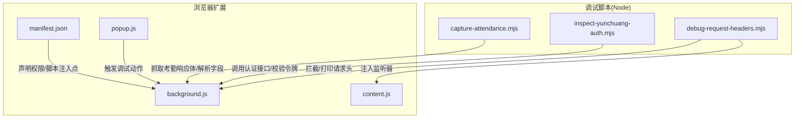
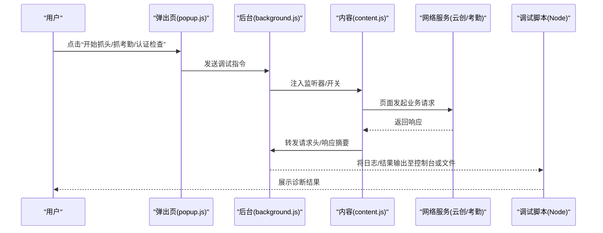
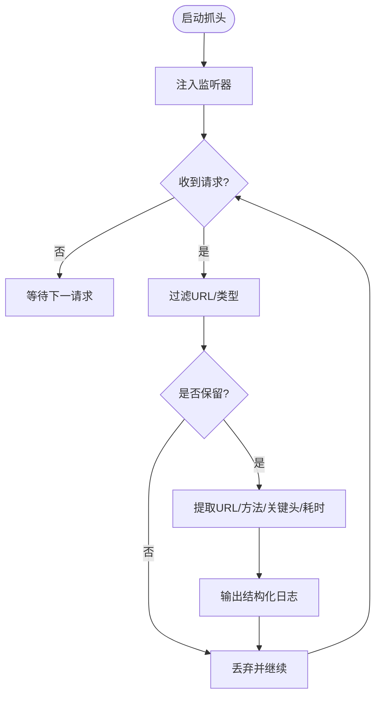
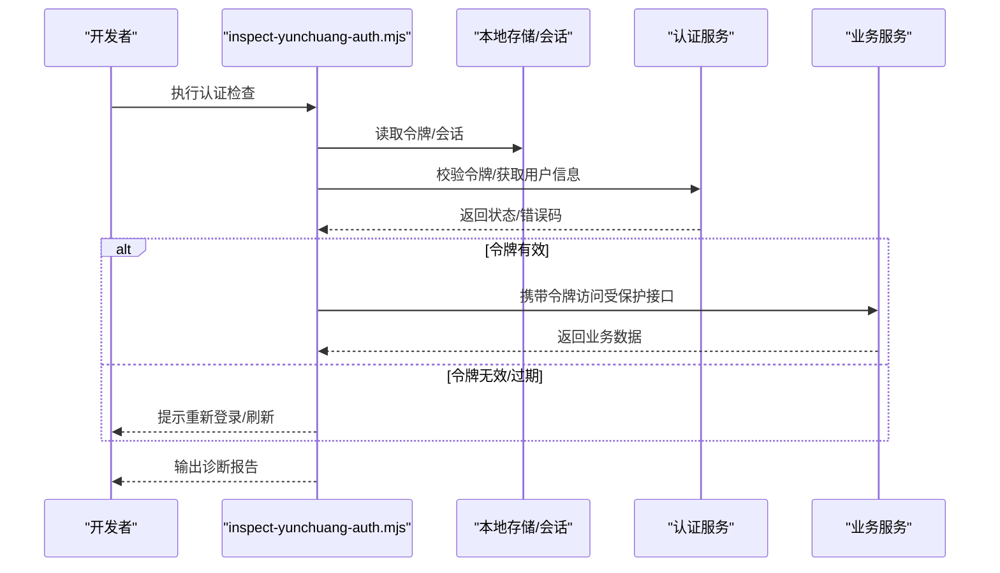
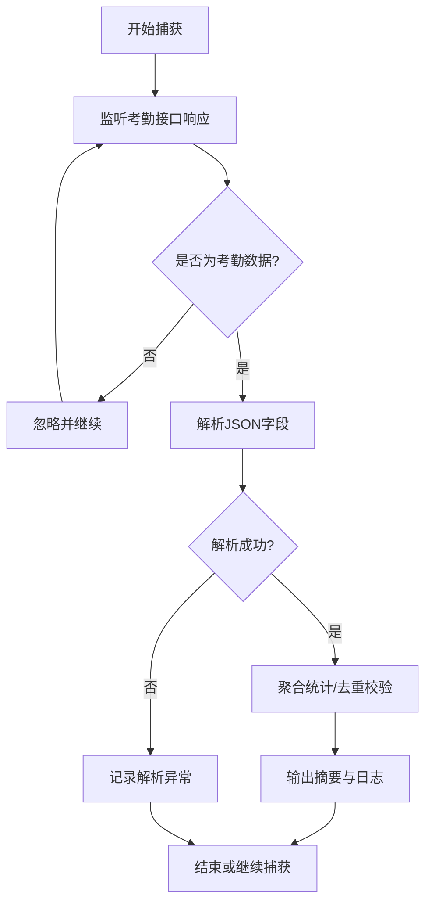
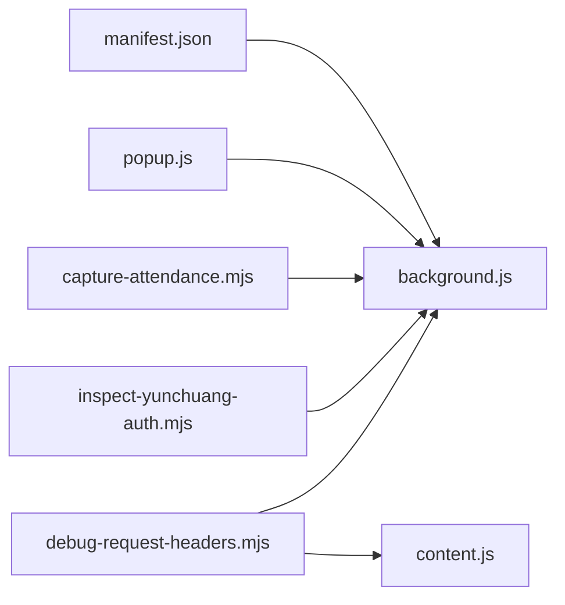

# 调试工具使用

<cite>
**本文引用的文件**   
- [scripts/debug-request-headers.mjs](file://scripts/debug-request-headers.mjs)
- [scripts/inspect-yunchuang-auth.mjs](file://scripts/inspect-yunchuang-auth.mjs)
- [scripts/capture-attendance.mjs](file://scripts/capture-attendance.mjs)
- [extension/background.js](file://extension/background.js)
- [extension/content.js](file://extension/content.js)
- [extension/popup.js](file://extension/popup.js)
- [extension/manifest.json](file://extension/manifest.json)
</cite>

## 目录
1. [简介](#简介)
2. [项目结构](#项目结构)
3. [核心组件](#核心组件)
4. [架构总览](#架构总览)
5. [详细组件分析](#详细组件分析)
6. [依赖关系分析](#依赖关系分析)
7. [性能考虑](#性能考虑)
8. [故障排查指南](#故障排查指南)
9. [结论](#结论)
10. [附录](#附录)

## 简介
本文件为“工时记录扩展”的调试工具提供系统化使用文档，重点覆盖以下能力：
- 网络请求头检查工具：如何捕获与分析HTTP请求、识别认证问题与网络连接异常。
- 云创认证检查脚本：验证认证流程、令牌状态与权限校验。
- 考勤数据捕获脚本：采集并解析考勤数据、处理异常与输出日志。
- 实际调试案例与常见问题解决方案，帮助快速定位问题。

## 项目结构
仓库包含浏览器扩展与独立调试脚本两类内容：
- extension：Chrome/Edge等浏览器扩展，含后台脚本、内容脚本、弹出页与清单配置。
- scripts：Node.js可执行的调试脚本，用于抓包、认证检查与考勤数据汇总。

图表来源
- [extension/background.js](file://extension/background.js)
- [extension/content.js](file://extension/content.js)
- [extension/popup.js](file://extension/popup.js)
- [extension/manifest.json](file://extension/manifest.json)
- [scripts/debug-request-headers.mjs](file://scripts/debug-request-headers.mjs)
- [scripts/inspect-yunchuang-auth.mjs](file://scripts/inspect-yunchuang-auth.mjs)
- [scripts/capture-attendance.mjs](file://scripts/capture-attendance.mjs)

章节来源
- [extension/background.js](file://extension/background.js)
- [extension/content.js](file://extension/content.js)
- [extension/popup.js](file://extension/popup.js)
- [extension/manifest.json](file://extension/manifest.json)
- [scripts/debug-request-headers.mjs](file://scripts/debug-request-headers.mjs)
- [scripts/inspect-yunchuang-auth.mjs](file://scripts/inspect-yunchuang-auth.mjs)
- [scripts/capture-attendance.mjs](file://scripts/capture-attendance.mjs)

## 核心组件
- 网络请求头检查工具（debug-request-headers.mjs）
  - 作用：在页面或扩展环境中拦截HTTP请求，提取关键请求头与URL信息，辅助定位认证失败与跨域问题。
  - 关键点：过滤目标域名、保留必要头部（如授权、Cookie、Referer）、忽略静态资源以减少噪音。
- 云创认证检查脚本（inspect-yunchuang-auth.mjs）
  - 作用：模拟或复用现有会话，访问认证相关接口，校验令牌有效性、过期时间与权限范围。
  - 关键点：读取本地存储的令牌、构造鉴权请求、解析返回码与错误信息。
- 考勤数据捕获脚本（capture-attendance.mjs）
  - 作用：捕获考勤相关API响应，解析结构化数据，输出摘要与异常统计。
  - 关键点：匹配考勤接口路径、解析JSON字段、聚合时间/人员维度数据、输出日志。

章节来源
- [scripts/debug-request-headers.mjs](file://scripts/debug-request-headers.mjs)
- [scripts/inspect-yunchuang-auth.mjs](file://scripts/inspect-yunchuang-auth.mjs)
- [scripts/capture-attendance.mjs](file://scripts/capture-attendance.mjs)

## 架构总览
调试工具与扩展协作方式如下：
- 通过扩展的后台脚本与内容脚本建立全局监听，捕获网络事件。
- Node侧脚本可注入到页面上下文或直接发起请求进行认证与数据校验。
- 弹出页作为操作入口，触发不同调试模式（仅抓头、仅抓考勤、认证检查）。

图表来源
- [extension/popup.js](file://extension/popup.js)
- [extension/background.js](file://extension/background.js)
- [extension/content.js](file://extension/content.js)
- [scripts/debug-request-headers.mjs](file://scripts/debug-request-headers.mjs)
- [scripts/inspect-yunchuang-auth.mjs](file://scripts/inspect-yunchuang-auth.mjs)
- [scripts/capture-attendance.mjs](file://scripts/capture-attendance.mjs)

## 详细组件分析

### 网络请求头检查工具（debug-request-headers.mjs）
- 工作原理
  - 在页面加载时注入监听器，捕获fetch/XMLHttpRequest事件。
  - 对请求URL进行白名单/黑名单过滤，仅保留业务相关请求。
  - 抽取关键请求头（如Authorization、Cookie、Origin、Referer），并记录方法、URL、耗时与状态码。
  - 将结果以结构化形式输出，便于后续分析。
- 使用方法
  - 在浏览器中打开目标站点，启用扩展后选择“抓请求头”模式。
  - 复现登录或提交考勤等操作，观察控制台输出。
  - 若需导出，可将日志保存到文件或粘贴到文本编辑器进行分析。
- 常见问题
  - 未捕获到请求：确认是否命中过滤规则；检查跨域限制；确保扩展已注入到目标页面。
  - 缺少关键头：检查服务端是否要求特定头（如自定义鉴权头）；确认客户端是否正确设置。
  - 大量噪声：调整过滤条件，排除静态资源与第三方统计请求。

图表来源
- [scripts/debug-request-headers.mjs](file://scripts/debug-request-headers.mjs)
- [extension/content.js](file://extension/content.js)
- [extension/background.js](file://extension/background.js)

章节来源
- [scripts/debug-request-headers.mjs](file://scripts/debug-request-headers.mjs)
- [extension/content.js](file://extension/content.js)
- [extension/background.js](file://extension/background.js)

### 云创认证检查脚本（inspect-yunchuang-auth.mjs）
- 功能说明
  - 从本地存储或会话中读取令牌，构造认证相关请求。
  - 校验令牌格式、有效期与作用域，判断是否存在权限不足。
  - 输出认证链路的关键节点与错误码，辅助定位单点登录或令牌刷新问题。
- 使用步骤
  - 准备有效会话：先完成登录，确保本地存在令牌。
  - 运行脚本并指定目标环境（开发/测试/生产）。
  - 查看输出中的令牌状态、接口返回码与错误描述。
- 典型问题
  - 令牌缺失或过期：重新登录或刷新令牌后重试。
  - 权限不足：检查角色与资源权限映射。
  - 跨域受限：确认后端CORS策略允许前端来源。

图表来源
- [scripts/inspect-yunchuang-auth.mjs](file://scripts/inspect-yunchuang-auth.mjs)

章节来源
- [scripts/inspect-yunchuang-auth.mjs](file://scripts/inspect-yunchuang-auth.mjs)

### 考勤数据捕获脚本（capture-attendance.mjs）
- 功能说明
  - 捕获考勤相关接口的响应体，解析关键字段（如日期、人员、打卡时间、状态）。
  - 聚合统计（按日/按人/按部门），输出摘要与异常计数。
  - 支持将结果写入文件或控制台，便于离线分析。
- 使用步骤
  - 在浏览器中进入考勤页面并完成一次打卡或查询操作。
  - 运行脚本，选择“捕获考勤数据”模式。
  - 查看输出的数据结构与统计结果，必要时导出为CSV/JSON。
- 数据格式与解析
  - 期望响应为JSON，包含考勤记录数组与分页信息。
  - 关键字段包括：时间戳、人员标识、打卡类型、位置/设备信息、状态码。
  - 若字段缺失或类型不符，脚本会记录异常并跳过该条记录。
- 异常处理与日志
  - 网络错误：记录超时、DNS失败、SSL错误等。
  - 解析错误：记录字段缺失、类型不匹配、重复记录等。
  - 输出分级日志（信息/警告/错误），便于快速定位。

图表来源
- [scripts/capture-attendance.mjs](file://scripts/capture-attendance.mjs)
- [extension/background.js](file://extension/background.js)
- [extension/content.js](file://extension/content.js)

章节来源
- [scripts/capture-attendance.mjs](file://scripts/capture-attendance.mjs)
- [extension/background.js](file://extension/background.js)
- [extension/content.js](file://extension/content.js)

### 扩展集成要点（background.js / content.js / popup.js / manifest.json）
- background.js
  - 负责全局监听与消息路由，协调抓头/抓考勤/认证检查三种模式。
  - 管理扩展生命周期与权限，确保在不同页面上下文中正确注入监听器。
- content.js
  - 在目标页面注入轻量监听器，捕获网络事件并回传后台。
  - 避免直接修改页面逻辑，保持最小侵入。
- popup.js
  - 提供可视化入口，切换调试模式、控制开始/停止、导出日志。
- manifest.json
  - 声明必要的权限（如网络访问、跨域、脚本注入点）。
  - 配置内容脚本注入时机与匹配规则。

章节来源
- [extension/background.js](file://extension/background.js)
- [extension/content.js](file://extension/content.js)
- [extension/popup.js](file://extension/popup.js)
- [extension/manifest.json](file://extension/manifest.json)

## 依赖关系分析
- 模块耦合
  - 调试脚本与扩展通过消息机制交互，降低直接耦合度。
  - 内容脚本仅承担事件转发职责，保持高内聚低耦合。
- 外部依赖
  - 浏览器API（网络事件、存储、消息通道）。
  - 目标站点接口契约（认证与考勤数据结构）。
- 潜在循环依赖
  - 当前设计无循环依赖；如需扩展新能力，建议新增独立脚本并通过统一入口调度。

图表来源
- [scripts/debug-request-headers.mjs](file://scripts/debug-request-headers.mjs)
- [scripts/inspect-yunchuang-auth.mjs](file://scripts/inspect-yunchuang-auth.mjs)
- [scripts/capture-attendance.mjs](file://scripts/capture-attendance.mjs)
- [extension/background.js](file://extension/background.js)
- [extension/content.js](file://extension/content.js)
- [extension/popup.js](file://extension/popup.js)
- [extension/manifest.json](file://extension/manifest.json)

章节来源
- [extension/background.js](file://extension/background.js)
- [extension/content.js](file://extension/content.js)
- [extension/popup.js](file://extension/popup.js)
- [extension/manifest.json](file://extension/manifest.json)
- [scripts/debug-request-headers.mjs](file://scripts/debug-request-headers.mjs)
- [scripts/inspect-yunchuang-auth.mjs](file://scripts/inspect-yunchuang-auth.mjs)
- [scripts/capture-attendance.mjs](file://scripts/capture-attendance.mjs)

## 性能考虑
- 减少噪声
  - 合理设置URL过滤规则，避免捕获静态资源与第三方统计请求。
- 节流与采样
  - 高频请求场景下采用采样策略，避免控制台过载。
- 内存占用
  - 及时清理历史日志，限制缓存大小，防止长时间运行导致内存增长。
- 异步处理
  - 使用非阻塞方式处理网络事件，避免影响主线程渲染。

[本节为通用指导，无需代码来源]

## 故障排查指南
- 认证相关问题
  - 现象：登录后仍提示未授权或频繁跳转登录页。
  - 排查：使用认证检查脚本验证令牌有效期与作用域；检查请求头是否携带正确的鉴权头；核对CORS配置。
  - 参考：[scripts/inspect-yunchuang-auth.mjs](file://scripts/inspect-yunchuang-auth.mjs)
- 网络连接问题
  - 现象：请求超时、DNS失败、SSL握手失败。
  - 排查：检查代理与防火墙设置；确认目标域名可达；验证证书链完整性。
  - 参考：[scripts/debug-request-headers.mjs](file://scripts/debug-request-headers.mjs)
- 考勤数据异常
  - 现象：打卡成功但数据未入库或字段缺失。
  - 排查：使用考勤捕获脚本对比前后端字段；检查时间戳与时区；关注状态码与错误描述。
  - 参考：[scripts/capture-attendance.mjs](file://scripts/capture-attendance.mjs)
- 扩展未生效
  - 现象：抓头/抓考勤无输出。
  - 排查：确认manifest权限与注入规则；检查内容脚本是否注入到目标页面；查看后台日志。
  - 参考：[extension/manifest.json](file://extension/manifest.json), [extension/background.js](file://extension/background.js), [extension/content.js](file://extension/content.js)

章节来源
- [scripts/inspect-yunchuang-auth.mjs](file://scripts/inspect-yunchuang-auth.mjs)
- [scripts/debug-request-headers.mjs](file://scripts/debug-request-headers.mjs)
- [scripts/capture-attendance.mjs](file://scripts/capture-attendance.mjs)
- [extension/manifest.json](file://extension/manifest.json)
- [extension/background.js](file://extension/background.js)
- [extension/content.js](file://extension/content.js)

## 结论
本调试工具集围绕“抓头—认证—考勤数据”三大主线，形成从网络层到业务层的完整诊断闭环。通过合理的过滤与日志输出，能够快速定位认证失败、网络异常与数据不一致等问题。建议在日常开发与联调中常态化使用，以提升问题定位效率与系统稳定性。

[本节为总结性内容，无需代码来源]

## 附录
- 最佳实践
  - 在开发环境开启全量抓头，在生产环境仅开启采样与关键接口监控。
  - 将认证检查纳入自动化测试，持续验证令牌流转与权限边界。
  - 对考勤数据捕获增加断言，确保前后端字段契约稳定。
- 术语表
  - 抓头：捕获HTTP请求与响应头信息。
  - 令牌：用于身份认证的短期凭证（如JWT）。
  - CORS：跨源资源共享策略。

[本节为补充信息，无需代码来源]