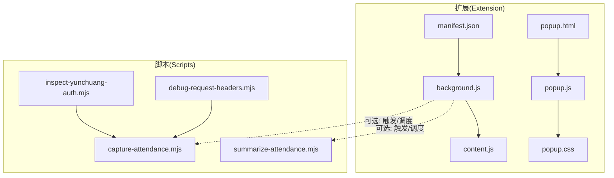
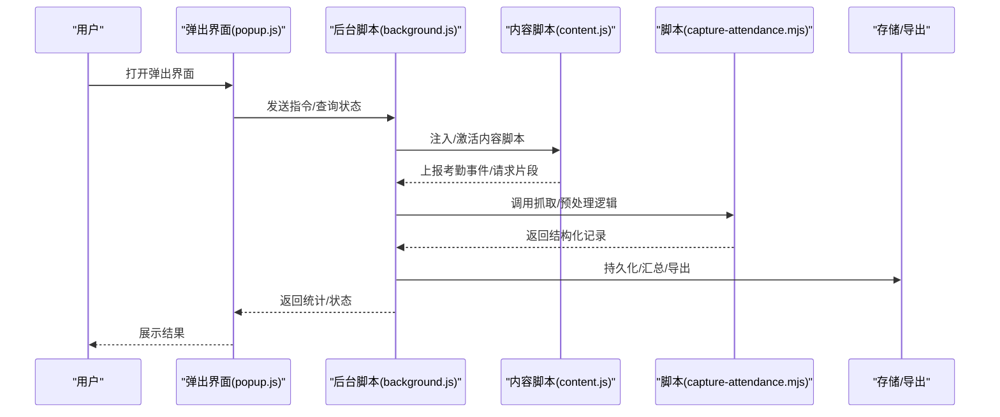
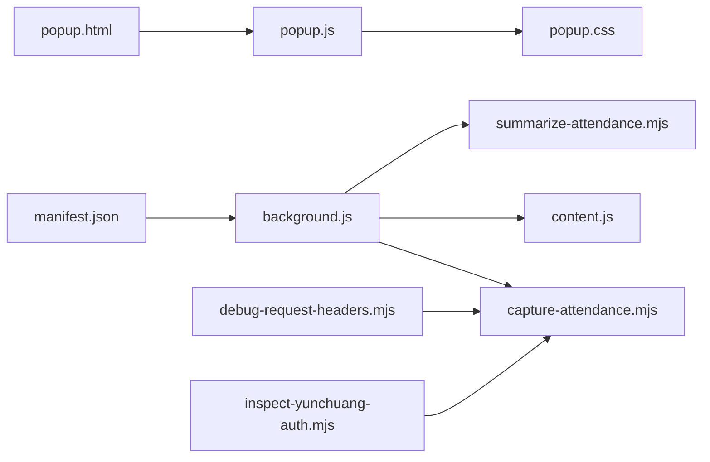

# 项目概述

<cite>
**本文引用的文件**   
- [extension/manifest.json](file://extension/manifest.json)
- [extension/background.js](file://extension/background.js)
- [extension/content.js](file://extension/content.js)
- [extension/popup.html](file://extension/popup.html)
- [extension/popup.js](file://extension/popup.js)
- [extension/popup.css](file://extension/popup.css)
- [scripts/capture-attendance.mjs](file://scripts/capture-attendance.mjs)
- [scripts/debug-request-headers.mjs](file://scripts/debug-request-headers.mjs)
- [scripts/inspect-yunchuang-auth.mjs](file://scripts/inspect-yunchuang-auth.mjs)
- [scripts/summarize-attendance.mjs](file://scripts/summarize-attendance.mjs)
</cite>

## 目录
1. [简介](#简介)
2. [项目结构](#项目结构)
3. [核心组件](#核心组件)
4. [架构总览](#架构总览)
5. [详细组件分析](#详细组件分析)
6. [依赖关系分析](#依赖关系分析)
7. [性能与可用性考虑](#性能与可用性考虑)
8. [故障排查指南](#故障排查指南)
9. [结论](#结论)
10. [附录：使用场景示例](#附录使用场景示例)

## 简介
本项目是一个面向考勤与工时记录的 Chrome 扩展，旨在通过浏览器侧的自动化能力采集、汇总与分析用户的出勤数据。扩展提供以下关键能力：
- 自动化考勤捕获：在目标页面注入内容脚本，监听并提取登录/打卡等关键事件与请求，形成原始记录。
- 数据分析与汇总：将原始记录进行清洗、去重、聚合，输出可消费的统计结果或导出格式。
- 调试工具：提供网络请求头检查、认证流程探查等辅助脚本，帮助定位问题与验证集成效果。

技术栈以 Chrome Extension API、JavaScript、HTML/CSS 为主，采用“后台脚本 + 内容脚本 + 弹出界面”的经典扩展架构，并通过 Node.js 脚本完成离线分析与调试任务。

## 项目结构
仓库包含两部分：
- extension：Chrome 扩展主体，含清单、后台脚本、内容脚本与弹出界面资源。
- scripts：Node.js 脚本集合，用于抓取、调试与汇总考勤数据。

图表来源
- [extension/manifest.json](file://extension/manifest.json)
- [extension/background.js](file://extension/background.js)
- [extension/content.js](file://extension/content.js)
- [extension/popup.html](file://extension/popup.html)
- [extension/popup.js](file://extension/popup.js)
- [extension/popup.css](file://extension/popup.css)
- [scripts/capture-attendance.mjs](file://scripts/capture-attendance.mjs)
- [scripts/debug-request-headers.mjs](file://scripts/debug-request-headers.mjs)
- [scripts/inspect-yunchuang-auth.mjs](file://scripts/inspect-yunchuang-auth.mjs)
- [scripts/summarize-attendance.mjs](file://scripts/summarize-attendance.mjs)

章节来源
- [extension/manifest.json](file://extension/manifest.json)
- [extension/background.js](file://extension/background.js)
- [extension/content.js](file://extension/content.js)
- [extension/popup.html](file://extension/popup.html)
- [extension/popup.js](file://extension/popup.js)
- [extension/popup.css](file://extension/popup.css)
- [scripts/capture-attendance.mjs](file://scripts/capture-attendance.mjs)
- [scripts/debug-request-headers.mjs](file://scripts/debug-request-headers.mjs)
- [scripts/inspect-yunchuang-auth.mjs](file://scripts/inspect-yunchuang-auth.mjs)
- [scripts/summarize-attendance.mjs](file://scripts/summarize-attendance.mjs)

## 核心组件
- 清单 manifest.json：声明扩展权限、背景页、内容脚本注入范围、弹出界面入口等。
- 后台脚本 background.js：负责扩展生命周期管理、消息路由、与内容脚本通信、调用外部脚本或持久化数据。
- 内容脚本 content.js：注入到目标站点页面，监听用户操作与网络请求，抽取考勤相关数据并上报给后台。
- 弹出界面 popup.html/js/css：提供可视化面板，展示状态、统计数据与操作按钮，供用户交互。
- 脚本 capture-attendance.mjs：集中实现考勤数据的抓取与预处理逻辑（可在扩展内被调度或在 Node 环境运行）。
- 脚本 debug-request-headers.mjs：调试网络请求头，便于确认鉴权参数与接口行为。
- 脚本 inspect-yunchuang-auth.mjs：专门探查“云创”认证流程，辅助定位登录/授权相关问题。
- 脚本 summarize-attendance.mjs：对已采集数据进行汇总、聚合与导出。

章节来源
- [extension/manifest.json](file://extension/manifest.json)
- [extension/background.js](file://extension/background.js)
- [extension/content.js](file://extension/content.js)
- [extension/popup.html](file://extension/popup.html)
- [extension/popup.js](file://extension/popup.js)
- [extension/popup.css](file://extension/popup.css)
- [scripts/capture-attendance.mjs](file://scripts/capture-attendance.mjs)
- [scripts/debug-request-headers.mjs](file://scripts/debug-request-headers.mjs)
- [scripts/inspect-yunchuang-auth.mjs](file://scripts/inspect-yunchuang-auth.mjs)
- [scripts/summarize-attendance.mjs](file://scripts/summarize-attendance.mjs)

## 架构总览
整体采用“后台脚本协调 + 内容脚本采集 + 弹出界面交互 + Node 脚本离线处理”的分层设计。后台脚本作为中枢，负责消息分发、策略控制与数据落盘；内容脚本专注页面侧的数据抽取；弹出界面提供人机交互；Node 脚本承担批量处理与调试任务。

图表来源
- [extension/background.js](file://extension/background.js)
- [extension/content.js](file://extension/content.js)
- [extension/popup.js](file://extension/popup.js)
- [scripts/capture-attendance.mjs](file://scripts/capture-attendance.mjs)

## 详细组件分析

### 清单与权限(manifest.json)
- 作用：定义扩展元信息、权限范围、背景页与内容脚本注入规则、弹出界面入口等。
- 关键点：
  - 声明 background 服务类型与入口文件。
  - 配置 content_scripts 的匹配模式，确保在目标站点自动注入。
  - 暴露 popup 入口，允许用户从工具栏快速访问。
  - 按需申请跨域或网络请求权限，以便读取必要响应头或拦截请求。

章节来源
- [extension/manifest.json](file://extension/manifest.json)

### 后台脚本(background.js)
- 职责：
  - 初始化扩展、注册消息处理器。
  - 管理内容脚本的生命周期（注入、卸载、重连）。
  - 转发来自弹出界面的指令至内容脚本或脚本模块。
  - 协调数据采集、汇总与持久化流程。
- 交互：
  - 与 popup.js 双向通信，同步状态与结果。
  - 与 content.js 交换事件与数据片段。
  - 可选地调用 Node 脚本进行离线处理。

章节来源
- [extension/background.js](file://extension/background.js)

### 内容脚本(content.js)
- 职责：
  - 在目标页面中监听用户操作（如点击打卡）与关键网络请求。
  - 解析页面 DOM 或拦截请求，提取时间、人员、地点等字段。
  - 将原始记录打包后发送给后台脚本。
- 注意事项：
  - 避免阻塞页面主线程，尽量异步处理。
  - 对目标站点变更保持健壮性，具备降级与重试机制。

章节来源
- [extension/content.js](file://extension/content.js)

### 弹出界面(popup.html / popup.js / popup.css)
- 职责：
  - 提供可视化面板，显示当前状态、最近记录与汇总结果。
  - 提供手动触发采集、刷新统计、导出结果等操作。
  - 与后台脚本通信，获取实时数据。
- 设计要点：
  - UI 简洁直观，反馈明确。
  - 错误提示友好，支持一键复制日志或导出报告。

章节来源
- [extension/popup.html](file://extension/popup.html)
- [extension/popup.js](file://extension/popup.js)
- [extension/popup.css](file://extension/popup.css)

### 抓取与预处理脚本(capture-attendance.mjs)
- 职责：
  - 封装考勤数据抓取的核心算法，包括选择器匹配、请求过滤、字段映射与去重。
  - 提供统一的数据模型，供后台脚本与汇总脚本复用。
- 适用场景：
  - 在扩展内由后台脚本按需调用。
  - 在 Node 环境下独立运行，用于离线批处理。

章节来源
- [scripts/capture-attendance.mjs](file://scripts/capture-attendance.mjs)

### 调试脚本(debug-request-headers.mjs)
- 职责：
  - 打印或保存网络请求头，辅助确认鉴权参数、Cookie、Referer 等是否满足目标系统要求。
- 使用方式：
  - 结合内容脚本或后台脚本触发，捕获特定接口的请求上下文。

章节来源
- [scripts/debug-request-headers.mjs](file://scripts/debug-request-headers.mjs)

### 认证探查脚本(inspect-yunchuang-auth.mjs)
- 职责：
  - 针对“云创”系统的认证流程进行专项探查，识别登录态建立、令牌刷新等关键步骤。
- 价值：
  - 快速定位授权失败、会话过期等问题，指导扩展适配不同站点差异。

章节来源
- [scripts/inspect-yunchuang-auth.mjs](file://scripts/inspect-yunchuang-auth.mjs)

### 汇总脚本(summarize-attendance.mjs)
- 职责：
  - 对已采集的记录进行清洗、合并、聚合，生成日/周/月维度统计。
  - 支持导出为常见格式，便于归档与汇报。
- 输入/输出：
  - 输入：标准化后的考勤记录集合。
  - 输出：汇总报表或结构化数据文件。

章节来源
- [scripts/summarize-attendance.mjs](file://scripts/summarize-attendance.mjs)

## 依赖关系分析
- 内部依赖：
  - popup.js 依赖 popup.html 与 popup.css 构建界面。
  - background.js 依赖 manifest.json 的配置，并与 content.js 双向通信。
  - 抓取与汇总脚本可被后台脚本调用，也可独立运行。
- 外部依赖：
  - Chrome Extension API（消息、存储、标签页、网络等）。
  - 目标站点的页面结构与网络协议（需通过调试脚本持续适配）。

图表来源
- [extension/manifest.json](file://extension/manifest.json)
- [extension/background.js](file://extension/background.js)
- [extension/content.js](file://extension/content.js)
- [extension/popup.html](file://extension/popup.html)
- [extension/popup.js](file://extension/popup.js)
- [extension/popup.css](file://extension/popup.css)
- [scripts/capture-attendance.mjs](file://scripts/capture-attendance.mjs)
- [scripts/debug-request-headers.mjs](file://scripts/debug-request-headers.mjs)
- [scripts/inspect-yunchuang-auth.mjs](file://scripts/inspect-yunchuang-auth.mjs)
- [scripts/summarize-attendance.mjs](file://scripts/summarize-attendance.mjs)

章节来源
- [extension/manifest.json](file://extension/manifest.json)
- [extension/background.js](file://extension/background.js)
- [extension/content.js](file://extension/content.js)
- [extension/popup.html](file://extension/popup.html)
- [extension/popup.js](file://extension/popup.js)
- [extension/popup.css](file://extension/popup.css)
- [scripts/capture-attendance.mjs](file://scripts/capture-attendance.mjs)
- [scripts/debug-request-headers.mjs](file://scripts/debug-request-headers.mjs)
- [scripts/inspect-yunchuang-auth.mjs](file://scripts/inspect-yunchuang-auth.mjs)
- [scripts/summarize-attendance.mjs](file://scripts/summarize-attendance.mjs)

## 性能与可用性考虑
- 内容脚本应最小化 DOM 遍历与事件绑定，避免影响页面性能。
- 网络请求拦截需限定域名与路径，减少不必要的开销。
- 后台脚本的消息队列应具备背压与重试机制，防止堆积导致卡顿。
- 数据持久化建议分批写入，降低 I/O 压力。
- 弹出界面渲染大量数据时应分页或虚拟列表，提升交互流畅度。

## 故障排查指南
- 无法注入内容脚本：
  - 检查 manifest.json 中的匹配模式是否正确覆盖目标站点。
  - 确认扩展权限是否包含必要的网络与页面访问权限。
- 抓不到考勤数据：
  - 使用 debug-request-headers.mjs 核对请求头与鉴权参数。
  - 使用 inspect-yunchuang-auth.mjs 验证认证流程是否按预期执行。
- 汇总结果异常：
  - 检查 capture-attendance.mjs 的字段映射与去重逻辑。
  - 使用 summarize-attendance.mjs 逐步查看中间结果，定位脏数据。
- 弹出界面无响应：
  - 检查 popup.js 与 background.js 的消息通道是否正常。
  - 查看控制台是否有跨域或权限相关的报错。

章节来源
- [extension/manifest.json](file://extension/manifest.json)
- [extension/background.js](file://extension/background.js)
- [extension/content.js](file://extension/content.js)
- [extension/popup.js](file://extension/popup.js)
- [scripts/debug-request-headers.mjs](file://scripts/debug-request-headers.mjs)
- [scripts/inspect-yunchuang-auth.mjs](file://scripts/inspect-yunchuang-auth.mjs)
- [scripts/capture-attendance.mjs](file://scripts/capture-attendance.mjs)
- [scripts/summarize-attendance.mjs](file://scripts/summarize-attendance.mjs)

## 结论
本扩展以轻量、可插拔的方式实现了考勤数据的自动化采集、汇总与可视化，既满足日常办公需求，又为后续扩展功能（如多站点适配、定时任务、云端同步）预留了良好空间。通过清晰的模块化设计与完善的调试脚本，开发者可以快速定位问题并持续优化体验。

## 附录：使用场景示例
- 每日自动打卡记录：
  - 用户在目标站点完成打卡后，内容脚本自动捕获事件并上报后台，弹出界面即时显示当日记录。
- 月度工时汇总：
  - 通过汇总脚本对历史数据进行聚合，生成月度报表，支持导出与分享。
- 认证问题诊断：
  - 当出现登录态失效时，使用认证探查脚本定位令牌刷新逻辑，调整扩展的鉴权策略。